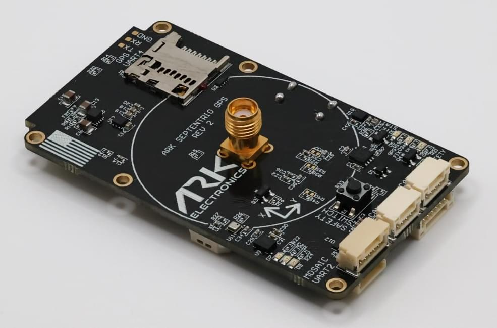

# ARK MOSAIC-X5 RTK GPS

[ARK MOSAIC-X5 RTK GPS](https://arkelectron.gitbook.io/ark-documentation/sensors/ark-mosaic-x5-rtk-gps) is a made in the USA [DroneCAN](index.md) module featuring the Septentrio Mosaic-X5 RTK GPS, magnetometer, barometer, IMU, buzzer, and safety switch.

## 购买渠道

Order this module from:

- [ARK Electronics](https://arkelectron.com/product/ark-mosaic-x5-gps/) (US)

## Hardware Specifications

- [Open Source Schematic and BOM](https://github.com/ARK-Electronics/ARK_MosaicX5_GPS)
- 传感器
  - [Septentrio Mosaic-X5 GPS](https://www.septentrio.com/en/products/gnss-receivers/gnss-receiver-modules/mosaic-x5)
    - Triple Band L1/L2/L5
    - [AIM+ jamming protection](https://www.septentrio.com/en/learn-more/advanced-positioning-technology/aim-anti-jamming-protection)
    - Update rate of 100 Hz
  - ST IIS2MDC Magnetometer
  - [Bosch BMP390 Barometer](https://www.bosch-sensortec.com/products/environmental-sensors/pressure-sensors/pressure-sensors-bmp390.html)
  - [Invensense ICM-42688-P 6-Axis IMU](https://invensense.tdk.com/products/motion-tracking/6-axis/icm-42688-p/)
- STM32F412VGH6 MCU
- Connections
  - Two Pixhawk Standard CAN Connectors (4 Pin JST-GH, 5V Input)
  - Pixhawk Standard "Basic GPS Port" (6 pin JST-GH, supports `USART3` and I2C2 for external sensors like airspeed or distance)
  - Pixhawk Standard Debug Connector (6 Pin JST-SH)
  - USB-C Port (5V Input, USB 2.0 to Mosaic-X5)
  - Micro-SD Slot for Mosaic-X5 Logging
  - Mosaic "UART 2" Connector (5 Pin JST-GH with TX, RX, TIMEPULSE, GP1, GND)
- Power Requirements
  - 5V
  - 260mA Average
  - 340mA Peak
- LED Indicators
  - Safety LED
  - GPS Fix
  - RTK Status
  - RGB System Status LED
- 附加信息
  - Includes 4 Pin Pixhawk Standard CAN Cable
  - Triple Band (L1/L2/L5) Helical GPS Antenna
  - USA Built
  - Supports DroneCAN Firmware Updating

## See Also

- [ARK MOSAIC-X5 RTK GPS Documentation](https://arkelectron.gitbook.io/ark-documentation/sensors/ark-mosaic-x5-rtk-gps) (ARK Docs)
