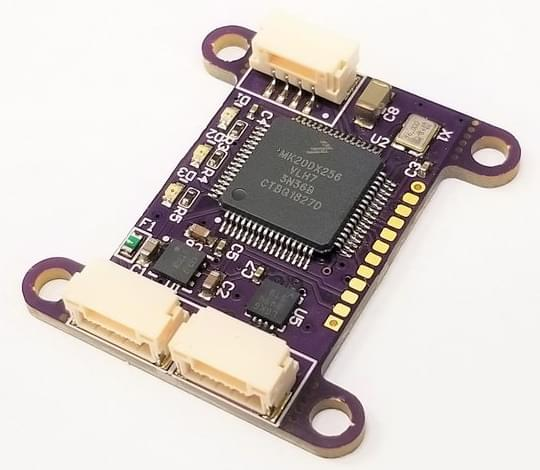

# Avionics Anonymous Laser Altimeter DroneCan Interface

:::info
In 2022, UAVCAN (v0) was forked and is maintained as `DroneCAN`.
While this product still mentions "UAVCAN", it is fully compatible with PX4's DroneCAN support.
:::

The [Avionics Anonymous Laser Altimeter Interface](https://www.tindie.com/products/avionicsanonymous/uavcan-laser-altimeter-interface/) allows a [number of common rangefinders](#supported_rangefinders) to be connected via the CAN bus (this is a more robust interface than I2C).

## 购买渠道

- [AvAnon Laser Interface](https://www.tindie.com/products/avionicsanonymous/uavcan-laser-altimeter-interface/)

## 支持的测距仪

A full list of supported rangefinders can be found on the link above.

At time of writing the following rangefinders are supported:

- Lightware SF30/D
- Lightware SF10/a
- Lightware SF10/b
- Lightware SF10/c
- Lightware SF11/c
- Lightware SF/LW20/b
- Lightware SF/LW20/c

## 硬件安装

### 布线

The rangefinder (laser) is connected to the AvAnon interface board, which is connected to one of the CAN ports on your autopilot.
The wiring is as per the pinout above, or the necessary cables can be purchased to connect to your system right out of the box.
These are available at the links [here](https://www.tindie.com/products/avionicsanonymous/uavcan-laser-altimeter-interface/).

The interface board provides a filtered power output for the laser, but does not provide its own regulation.
Therefore the laser must be compatible with whatever voltage is supplied to the board.

### 针脚定义

### CAN Connector

| 针脚 | 参数名                           | 描述                                                                                                                                                  |
| -- | ----------------------------- | --------------------------------------------------------------------------------------------------------------------------------------------------- |
| 1  | POWER_IN | Power Supply. 4.0-5.5V supported, but must also be compatible with connected laser. |
| 2  | TX/SCL                        | TX for serial mode, Clock for I2C mode.                                                                                             |
| 3  | RX/SDA                        | RX for serial mode, Data for I2C mode.                                                                                              |
| 4  | GND                           | Signal/power ground.                                                                                                                |

### Laser Connector

| 针脚 | 参数名                            | 描述                                                      |
| -- | ------------------------------ | ------------------------------------------------------- |
| 1  | POWER_OUT | Filtered power at the supply voltage.   |
| 2  | CAN+                           | TX for serial mode, Clock for I2C mode. |
| 3  | RX/SDA                         | RX for serial mode, Data for I2C mode.  |
| 4  | GND                            | Signal/power ground.                    |

## PX4 配置

To enable the laser altimeter you will need to [set the following parameters](../advanced_config/parameters.md) (in QGroundControl):

- Enable DroneCAN by setting [UAVCAN_ENABLE](../advanced_config/parameter_reference.md#UAVCAN_ENABLE) non zero.
- Enable DroneCAN rangefinder subscription by setting [UAVCAN_SUB_RNG](../advanced_config/parameter_reference.md#UAVCAN_SUB_RNG)
- Set the minimum and maximum range of the rangefinder using [UAVCAN_RNG_MIN](../advanced_config/parameter_reference.md#UAVCAN_RNG_MIN) and [UAVCAN_RNG_MAX](../advanced_config/parameter_reference.md#UAVCAN_RNG_MAX).
