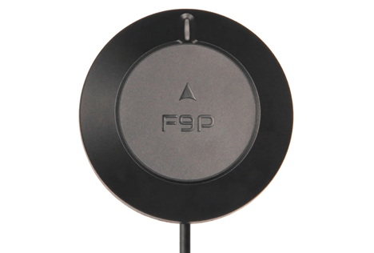
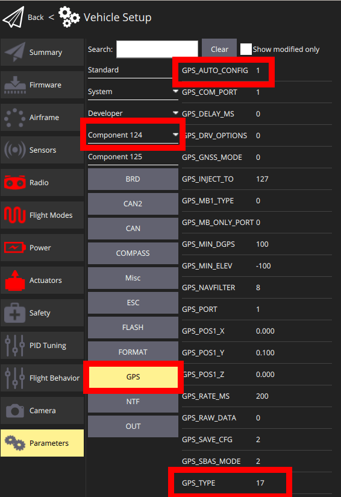

# Holybro H-RTK ZED-F9P RTK Rover (DroneCAN variant)

The [H-RTK ZED-F9P Rover](https://holybro.com/collections/h-rtk-gps/products/h-rtk-zed-f9p-rover) RTK GNSS is an upgraded version of the original [H-RTK F9P Rover](../gps_compass/rtk_gps_holybro_h-rtk-f9p.md).

:::tip
This topic covers the [DroneCAN](../dronecan/#enabling-dronecan) variant of the module.

Variants of this module also exist with connectors for the `GPS1` and `GPS2 UART` ports.
Setup for these is covered in [RTK GNSS](../gps_compass/rtk_gps.md#positioning-setup-configuration).
:::

This RTK GNSS features the U-Blox ZED-F9P GNSS receiver, RM3100 Compass, and a tri-coloured LED indicator, providing precise positioning and orientation data.
The DroneCAN variant includes additional MCU, IMU, and barometer sensors.
It also has an IP66 rating, which makes it suitable for challenging environments that require robust protection against dust and water.

This RTK GNSS offers multi-band RTK capabilities with rapid convergence times and consistent performance.
It supports concurrent reception of GPS (L1 & L2), GLONASS, Galileo, and BeiDou signals, ensuring reliable and precise positioning.
It delivers centimetre-level accuracy with the use of a base station or NTRIP service.

The high-precision PNI RM3100 compass ensures accurate orientation and stability, offering exceptional reliability, making it ideal for demanding UAV applications. It provides high resolution, low power consumption, large signal noise immunity, a large dynamic range, and high sampling rates. Its measurements are stable over temperature and inherently free from offset drift.

## 购买渠道

- [Holybro](https://holybro.com/collections/h-rtk-gps/products/h-rtk-zed-f9p-rover)

## Hardware Specifications

- 传感器
  - Ublox ZED-F9P GPS
    - Centimetre-level accuracy RTK positioning
    - IP66 Dust and Water Resistant
    - EMI Shielding for more accurate GNSS performance
    - Out of the box moving baseline support
  - RM3100: High-precision low-noise compass
- DroneCAN sensors (additional sensors in DroneCAN variant)
  - MCU: STM32G4
  - IMU: Invensense ICM-42688
  - Barometer: ICP20100
- Two JST GH CAN connectors (via pigtail)
- LED Indicators
  - Tri-coloured LED indicator
- Key Specifications
  - Working Temperature: -40C to 85C
  - Input power: 4.75-5.25V
  - Current Consumption: 250 mA
  - Weight: 117 grams

## 硬件安装

### 布线

The Holybro ZED-F9P GPS is connected to the CAN bus using a Pixhawk standard 4 pin JST GH cable.
For more information, refer to the [CAN Wiring](../can/index.md#wiring) instructions.

For dual F9P setups leveraging GPS yaw, connect both F9P CAN connectors to the same bus via a CAN or I2C expansion splitter or hub.

## Firmware Setup

Holybro ZED-F9P GPS boards ship with "AP Periph" (Ardupilot DroneCAN firmware) already installed.

To update the "AP Periph" firmware to the latest version:

1. [Download the latest binary](https://firmware.ardupilot.org/AP_Periph/latest/HolybroG4_GPS/).
2. Update the firmware using either of the following approaches:
  - Using ArduPilot:
    1. Install _Ardupilot_ firmware on your flight controller and the Mission Planner GCS on your computer.
    2. Update the binary by following the instructions in the [DroneCAN FW Upgrade](https://docs.holybro.com/gps-and-rtk-system/zed-f9p-h-rtk-series/dronecan-fw-upgrade) guide.
  - Use a serial-to-can converter (such as the [Zubax Babel](https://github.com/Zubax/canface_cf1?tab=readme-ov-file)) and the [DroneCAN GUI Tool](https://dronecan.github.io/Implementations/Libuavcan/Tutorials/11._Firmware_update/).

Remember to change the firmware on the flight controller back to PX4 afterwards.

### Enable DroneCAN

In order to use the Holybro ZED-F9P GPS board, connect it to the Pixhawk CAN bus and enable the DroneCAN driver by setting parameter [UAVCAN_ENABLE](../advanced_config/parameter_reference.md#UAVCAN_ENABLE) to `2` for dynamic node allocation (or `3` if using [DroneCAN ESCs](../dronecan/escs.md)).

步骤如下：

1. In _QGroundControl_ set the parameter [UAVCAN_ENABLE](../advanced_config/parameter_reference.md#UAVCAN_ENABLE) to `2` or `3` and reboot (see [Finding/Updating Parameters](../advanced_config/parameters.md)).
2. Connect Holybro ZED-F9P GPS CAN to the Pixhawk CAN.

Once enabled, the module will be detected on boot and assigned a dynamic node ID via PX4.

DroneCAN configuration in PX4 is explained in more detail in [DroneCAN > Enabling DroneCAN](../dronecan/index.md#enabling-dronecan).

### Sensor Position Configuration

- For the the single Rover the module should be mounted with the included mast.
- For the Dual ZED-F9P setup (moving baseline), the DroneCAN modules should be placed at least 30cm apart on the airframe and elevated on a mast also.
  See the following mast.
- F9P module arrow(s) should be pointing forward with respect to the autopilot orientation.

## Dual ZED-F9P DroneCAN Modules For Heading

In order to use dual ZED-F9P GPS heading in PX4, follow these steps:

1. Open the QGroundControl parameters page.
2. On the left side next to the parameters list, double-click on the _System_ section (this hides the section).
3. Components should be visible on the left panel.
  Click on the first `_Component_<ID#>` that maps to the ZED-F9P DroneCAN node (below shown as _Component 124_).
4. Click on the _GPS_ subsection and configure the parameters listed below:

  - `GPS_TYPE`: Either set to `17` for moving baseline _base_, or set to `18` to be the moving baseline _rover_.
    One F9P MUST be _rover_, and the other MUST be _base_.
  - `GPS_AUTO_CONFIG`: set to 1 for both the rover and base
  - `GPS_POS_X`, `GPS_POS_Y`, `GPS_POS_Z`: This is the antenna placement, which for the F9P is internal to the module.
    This is the local offset (FRD) with respect to the autopilot.

Then in order to enable the subscription in DroneCAN, enable the following PX4 autopilot params:

- [UAVCAN_ENABLE](../advanced_config/parameter_reference.md#UAVCAN_ENABLE): Set to `1` to enable DroneCAN in PX4
- [EKF2_GPS_CTRL](../advanced_config/parameter_reference.md#EKF2_GPS_CTRL): Set to `15` to enable Dual antenna heading.
- [UAVCAN_SUB_GPS_R](../advanced_config/parameter_reference.md#UAVCAN_SUB_GPS_R): Set to `1` to enable subscription to GNSS relative.
- [EKF2_GPS_YAW_OFF](../advanced_config/parameter_reference.md#GPS_YAW_OFFSET): Set to the clockwise angle (degrees) corresponding to base and rover orientation (e.g. 90 degrees when moving base to the left and rover to the right)

Once these params are enabled and the F9Ps are mounted to the airframe (assuming valid RTK fix) the LED's on both F9Ps should turn green.

Note that the Dual F9P heading is only accurate/valid if at least one F9P's are reporting a status of `RTK Fixed (6)`.
This means that dual heading will not work indoors or in areas with GPS interference/lack of coverage.
