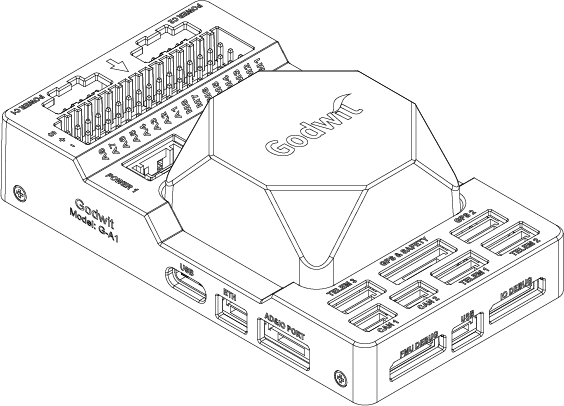
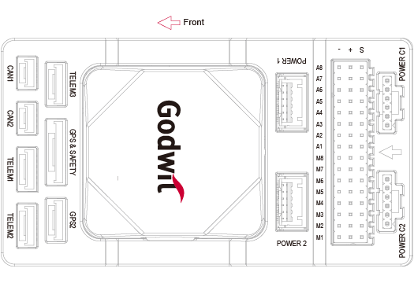
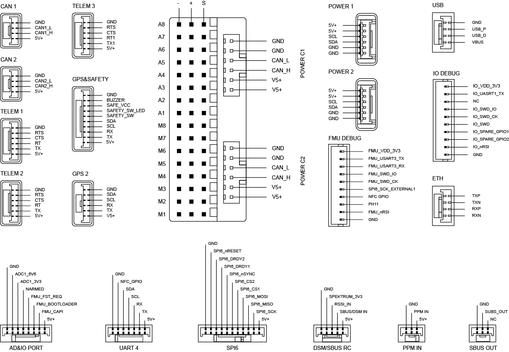
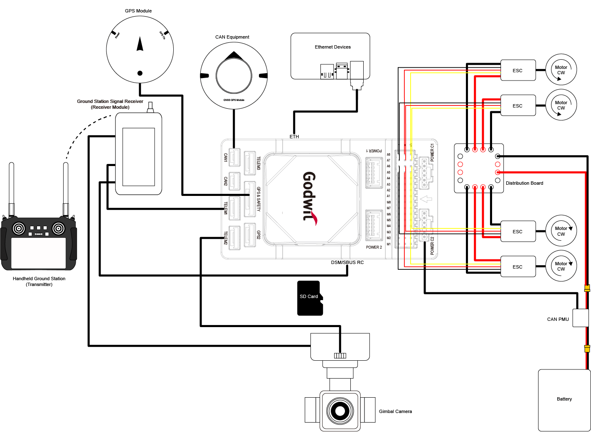
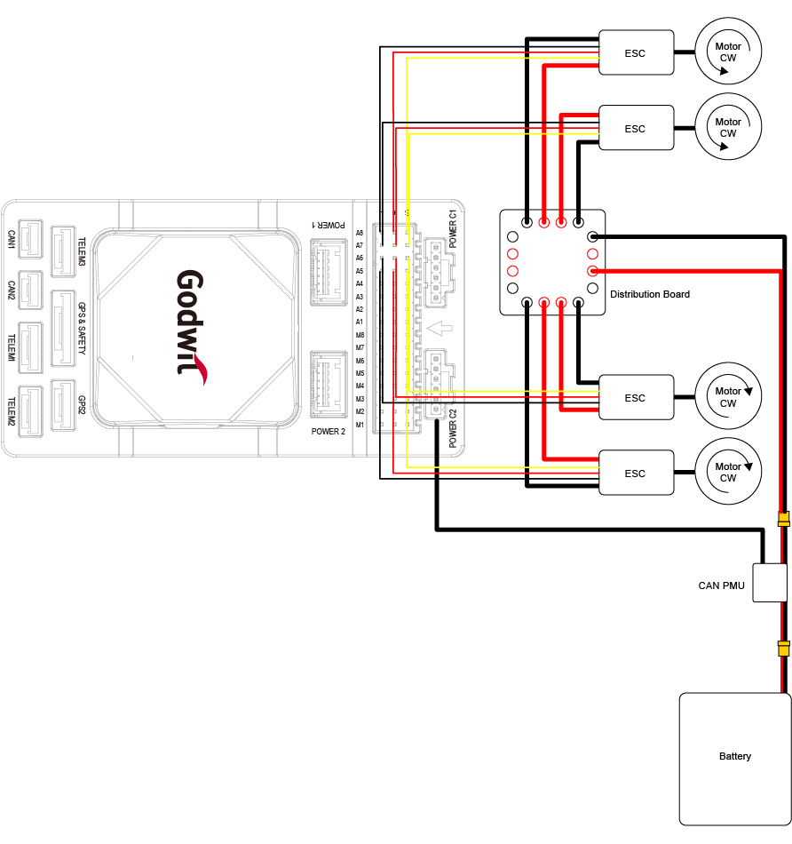
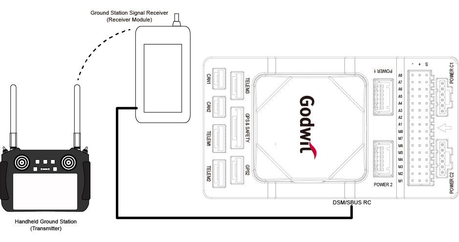
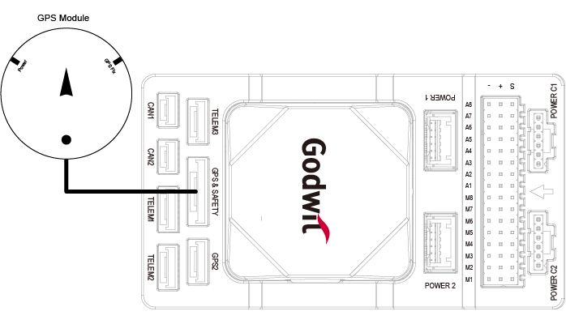
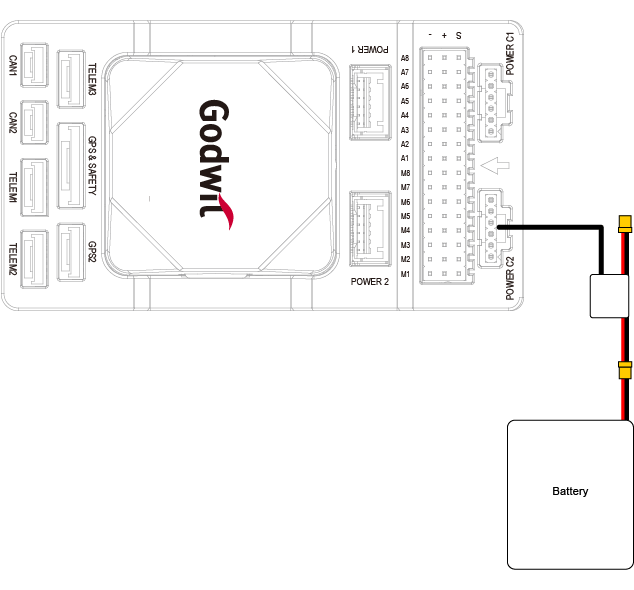
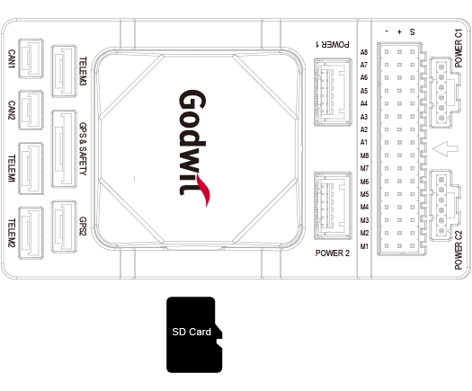

# Accton Godwit G-A1

:::warning
PX4 does not manufacture this (or any) autopilot.
Contact the [manufacturer](https://cubepilot.org/#/home) for hardware support or compliance issues.
:::

The G-A1 is a state-of-the-art flight controller developed derived from the [Pixhawk Autopilot v6X Standard](https://github.com/pixhawk/Pixhawk-Standards/blob/master/DS-012%20Pixhawk%20Autopilot%20v6X%20Standard.pdf).

It includes an STM32H753 double-precision floating-point FMU processor and an STM32F103 IO coprocessor, multiple IMUs with 6-axis inertial sensors, two pressure/temperature sensors, and a geomagnetic sensor.
It also has independent buses and power supplies, and is designed for safety and rich expansion capabilities.

With an integrated 10/100M Ethernet Physical Layer (PHY), the G-A1 can also communicate with a mission computer (airborne computer), high-end surveying and mapping cameras, and other UxV-mounted equipment for high-speed communications, meeting the needs of advanced UxV systems.

:::tip
Visit [Accton-IoT Godwit](https://www.accton-iot.com/godwit/) for more information.
:::





:::info
This flight controller is [manufacturer supported](../flight_controller/autopilot_manufacturer_supported.md).
:::

## 产品规格

### 处理器

- STM32H753IIK (Arm® Cortex®-M7 480MHz)
- STM32F103 (Arm® Cortex®-M3, 72MHz)

### 传感器

- Bosch BMI088 (vibration isolated)
- TDK InvenSense ICM-42688-P x 2 (one vibration isolated)
- TDK Barometric Pressure and Temperature Sensor CP-20100 x 2 (one vibration isolated)
- PNI RM3100 Geomagnetic Sensor (vibration isolated)

### 电源

- 4.6V to 5.7V

### External ports

- 2 CAN Buses (CAN1 and CAN2)
- 3 TELEM Ports (TELEM1, TELEM2 and TELEM3)
- 2 GPS Ports (GPS1 with safety switch, LED, buzzer, and GPS2)
- 1 PPM IN
- 1 SBUS OUT
- 2 USB Ports (1 TYPE-C and 1 JST GH1.25)
- 1 10/100Base-T Ethernet Port
- 1 DSM/SBUS RC
- 1 UART 4
- 1 AD&IO Port
- 2 Debug Ports (1 IO Debug and 1 FMU Debug)
- 1 SPI6 Bus
- 4 Power Inputs (Power 1, Power 2, Power C1 and Power C2)
- 16 PWM Servo Outputs (A1-A8 from FMU and M1-M8 from IO)
- Micro SD Socket (supports SD 4.1 & SDIO 4.0 in two databus modes: 1 bit (default) and 4 bits)

### Size and Dimensions

- 92.2 (L) x 51.2 (W) x 28.3 (H) mm
- 77.6g (carrier board with IMU)

## 购买渠道

- [Accton-IoT Godwit](https://www.accton-iot.com/godwit/)
- [sales@accton-iot.com](sales@accton-iot.com)

## 针脚定义



## UART Mapping

| Serial# | Protocol  | Port   | 备注         |
| ------- | --------- | ------ | ---------- |
| SERIAL1 | Telem1    | UART7  | /dev/ttyS6 |
| SERIAL2 | Telem2    | UART5  | /dev/ttyS4 |
| SERIAL3 | GPS1      | USART1 | /dev/ttyS0 |
| SERIAL4 | GPS2      | UART8  | /dev/ttyS7 |
| SERIAL5 | Telem3    | USART2 | /dev/ttyS1 |
| SERIAL6 | UART4     | UART4  | /dev/ttyS3 |
| SERIAL7 | FMU Debug | USART3 |            |
| SERIAL8 | OTG2      | USB    |            |

## Wiring Diagram



## PWM Output

PWM M1-M8 (IO Main PWM), A1-A8(FMU PWM).
All these 16 support normal PWM output formats.
FMU PWM A1-A6 can support DShot and B-Directional DShot.
A1-A8(FMU PWM) are grouped as:

- Group 1: A1, A2, A3, A4
- Group 2: A5, A6
- Group 3: A7, A8

The motor and servo system should be connected to these ports according to the order outlined in the fuselage reference for your carrier.



## RC Input

For DSM/SBUS receivers, connect them to the DSM/SBUS interface which provides dedicated 3.3V and 5V power pins respectively, and check above "Pinout" for detailed pin definition.
PPM receivers should be connected to the PPM interface. And other RC systems can be connected via other spare telemetry ports.



## GPS/Compass

The Godwit G-A1 has a built-in compass
Due to potential interference, the autopilot is usually used with an external I2C compass as part of a GPS/Compass combination.



## Power Connection and Battery Monitor

This universal controller features a CAN PMU module that supports 3 to 14s lithium batteries.
To ensure proper connection, attach the module's 6-pin connector to the flight control Power C1 and/or Power C2 interface.

This universal controller does not provide power to the servos.
To power them, an external BEC must be connected to the positive and negative terminals of any A1–A8 or M1–M8 port.



## SD Card

The SD card is NOT included in the package, you need to prepare the SD card and insert it into the slot.



## 固件

The autopilot is compatible with PX4 firmware. And G-A1 can be detected by QGroundControl automatically. Users can also build it with target "accton-godwit_ga1"

To [build PX4](../dev_setup/building_px4.md) for this target, open up the terminal and enter:

```sh
make accton-godwit_ga1
```

## More Information and Support

- [Accton-IoT Godwit](https://www.accton-iot.com/godwit/)
- [sales@accton-iot.com](sales@accton-iot.com)
- [support@accton-iot.com](mailto:support@accton-iot.com)
