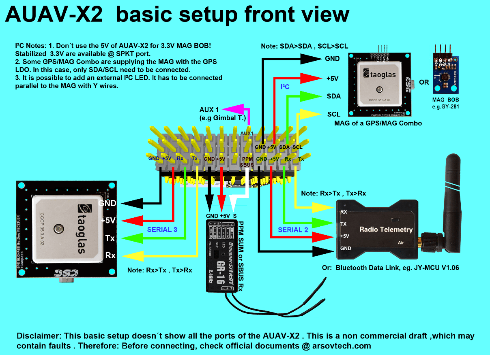

# AUAV-X2 自动驾驶仪 (停产)

<Badge type="info" text="Discontinued" />

:::warning
This flight controller has been [discontinued](../flight_controller/autopilot_experimental.md) and is no longer commercially available.
:::

:::warning
PX4 does not manufacture this (or any) autopilot.
Contact the [manufacturer](https://store.mrobotics.io/) for hardware support or compliance issues.
:::

The [AUAV&reg;](http://www.auav.com/) _AUAV-X2 autopilot_ is based on the [Pixhawk&reg;-project](https://pixhawk.org/) **FMUv2** open hardware design. It runs PX4 on the [NuttX](https://nuttx.apache.org/) OS.

## 总览

- Main System-on-Chip: [STM32F427](http://www.st.com/web/en/catalog/mmc/FM141/SC1169/SS1577/LN1789)
  - CPU：STM32F427VIT6 ARM 微控制器-版本 3
  - IO：STM32F100C8T6 ARM 微控制器
- 传感器：
  - Invensense MPU9250 9DOF
  - Invensense ICM-20608 6DOF
  - MEAS MS5611 气压计
- 尺寸/重量
  - 尺寸：36mm x 50mm
  - 安装点：30.5mm x 30.5mm 直径 3.2mm
  - 重量: 10.9g
- 具有反向电压保护的电源 OR-ing 原理图。 需要 5V 电源模块！

## 连接

- 2.54 毫米头：
- GPS (USART4)
- I2C
- 遥控输入
- PPM 输入
- Spektrum 输入
- RSSI 输入
- sBus 输入
- sBus 输出
- 电源输入
- 蜂鸣器输出
- LED 输出
- 8路伺服输出
- 6路辅助输出
- USART7（控制台）
- USART8（OSD）

## 访问链接

No longer in production.
This has been superseded by the [mRo X2.1](mro_x2.1.md).
mRobotics is the distributor for the AUAV Products from August 2017.

## 主链接

- [User Manual](http://arsovtech.com/wp-content/uploads/2015/08/AUAV-X2-user-manual-EN.pdf)
- [DIY Drones Post](http://diydrones.com/profiles/blogs/introducing-the-auav-x2-1-flight-controller)

## 接线指南

## 原理图

The board is based on the [Pixhawk project](https://pixhawk.org/) **FMUv2** open hardware design.

- [FMUv2 + IOv2 schematic](https://raw.githubusercontent.com/PX4/Hardware/master/FMUv2/PX4FMUv2.4.5.pdf) -- Schematic and layout

:::info
As a CC-BY-SA 3.0 licensed Open Hardware design, all schematics and design files are [available](https://github.com/PX4/Hardware).
:::

## 串口映射

| UART   | 设备         | Port                                     |
| ------ | ---------- | ---------------------------------------- |
| UART1  | /dev/ttyS0 | IO debug                                 |
| USART2 | /dev/ttyS1 | TELEM1 (flow control) |
| USART3 | /dev/ttyS2 | TELEM2 (flow control) |
| UART4  |            |                                          |
| UART7  | CONSOLE    |                                          |
| UART8  | SERIAL4    |                                          |
