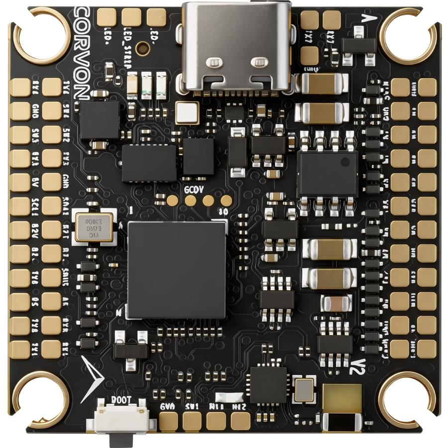
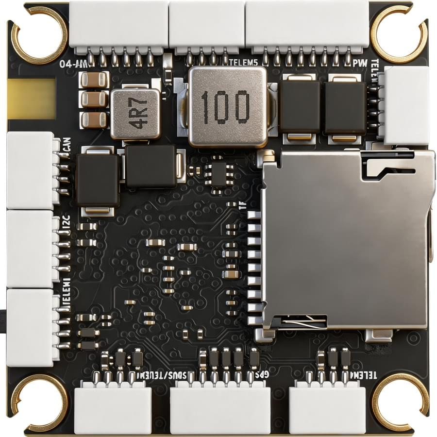
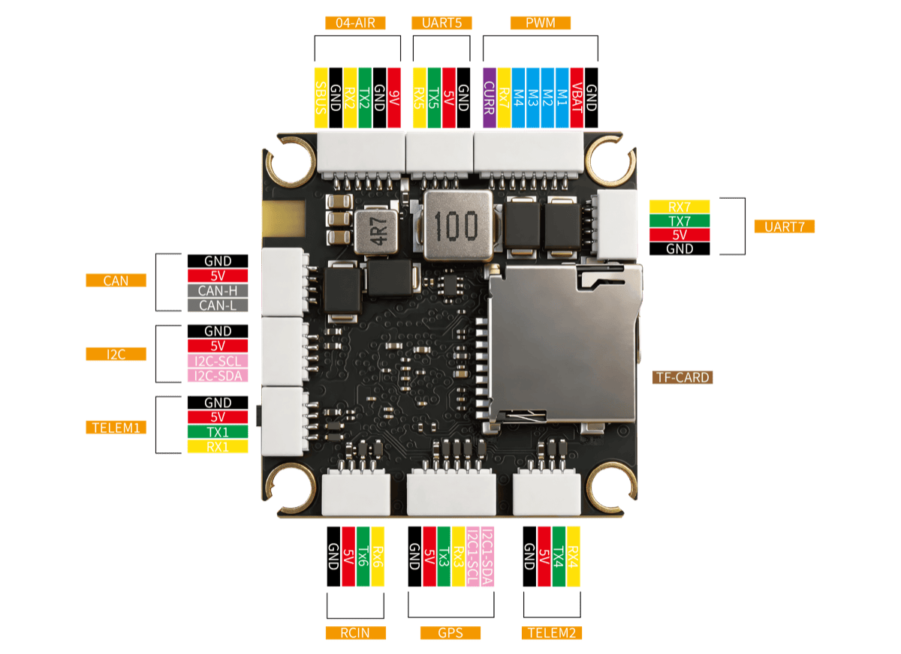
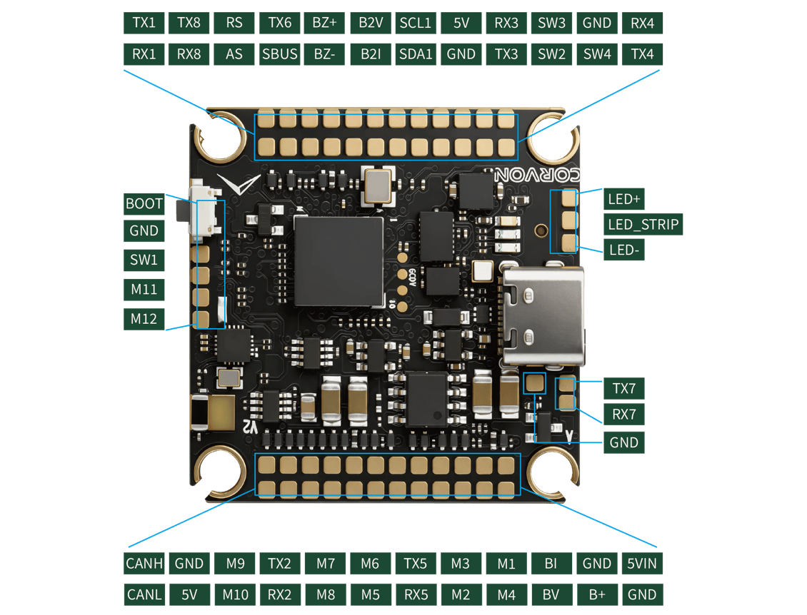

# CORVON 743v2

<Badge type="tip" text="PX4 v1.18" />

:::warning
PX4 does not manufacture this (or any) autopilot.
Contact the [manufacturer](https://corvon.tech) for hardware support or compliance issues.
:::

The _CORVON 743v2_ is a flight controller designed by Feikong Technology Co., Ltd under the CORVON brand.
It builds on the [CORVON 743v1](corvon_743v1.md) platform with significantly upgraded sensor and connectivity options: dual high-grade IMUs (ICM-42688P + BMI088), a high-precision BMP581 barometer, a dedicated DJI O4 Air Unit connector, an onboard Bluetooth module with a ceramic antenna, and dual analog battery monitoring channels.

The board uses [Pixhawk Autopilot Standard Connections](../flight_controller/autopilot_pixhawk_standard.md).

 

:::info
This flight controller is [manufacturer supported](../flight_controller/autopilot_manufacturer_supported.md).
:::

## 主要特性

- **MCU:** STM32H743VIH6 (32 Bit Arm® Cortex®-M7, 480 MHz, 2MB Flash, 1MB RAM, TFBGA100 package)
- **IMU (Dual):** TDK InvenSense ICM-42688P (primary) + Bosch BMI088 accel/gyro (secondary)
- **Barometer:** Bosch BMP581 (high-precision)
- **Magnetometer:** iSentek IST8310
- **Interfaces:**
  - 8x UARTs (including dedicated DJI O4 and Bluetooth ports)
  - 1x CAN (DroneCAN / UAVCAN)
  - 1x external I²C (with isolated 5V supply)
  - 1x dedicated RC Input (SBUS / CRSF / ELRS)
  - 12x PWM outputs (M1–M10 DShot-capable, M11 / M12 standard PWM for servos)
  - SDMMC1 4-bit Micro-SD slot (high-speed logging)
  - Dedicated DJI O4 Air Unit connector
  - Onboard Bluetooth module with ceramic antenna (UART8, MAVLink pre-configured)
- **Power:**
  - Dual analog battery voltage/current channels (BAT1 via the `PWM` 4-in-1 ESC connector, BAT2 via `B2V`/`B2I` pads)
  - Voltage sensing up to 10S LiPo by default
  - On-board BECs for peripheral power (consult manufacturer for exact rail specifications)

## 购买渠道

Order from [CORVON](https://corvon.tech).

## Physical / Mechanical

Refer to the manufacturer's datasheet for the latest mechanical drawing, mounting pattern, and weight specifications.

## 产品规格

### Processors & Sensors

- **FMU Processor:** STM32H743VIH6
  - 32 Bit Arm® Cortex®-M7, 480 MHz
  - 2MB Flash, 1MB RAM
  - TFBGA100 (8 × 8 mm) package
- **On-board Sensors:**
  - Accel/Gyro 1: TDK InvenSense ICM-42688P (SPI3)
  - Accel/Gyro 2: Bosch BMI088 (SPI3)
  - Barometer: Bosch BMP581 (I²C2, address `0x46`)
  - Compass: iSentek IST8310 (I²C2, address `0x0E`)

### Power Configuration

The board provides **two independent analog battery monitoring channels**:

- **BAT1** - Battery voltage and current sensed from the `PWM` 4-in-1 ESC connector, on `ADC1_INP10` (voltage) and `ADC1_INP11` (current).
- **BAT2** - Auxiliary `B2V` / `B2I` solder pads for a second / redundant battery pack, sensed on `ADC1_INP4` (voltage) and `ADC1_INP8` (current).

Both channels feed PX4's standard analog battery driver with a default 21.2 voltage divider and 40 A/V current ratio, supporting up to 10S LiPo batteries out of the box.

:::info
The board does not expose the 5V rail / `system_power` sensing pins that PX4's commander power checks expect, so `CBRK_SUPPLY_CHK` (894281) is set by default to bypass the power supply and battery health checks used for arming and failsafe decisions. BAT1/BAT2 voltage and current monitoring is unaffected.
:::

## Connectors & Pinouts

The following image shows the physical connector and solder-pad layout, with the labels used in this document and in the firmware's `default.px4board`:



The board exposes the following connectors and solder pads:

- `TELEM1` (4-pin) - primary MAVLink radio link
- `04-AIR` (6-pin) - DJI O4 Air Unit (Digital VTX with MSP DisplayPort)
- `GPS` (6-pin JST-GH) - UBX / NMEA GPS, with the external compass I²C bus broken out on the same connector
- `TELEM2` (4-pin) - companion computer / secondary MAVLink
- `UART5` (4-pin) - generic auxiliary UART breakout
- `RCIN` (4-pin) - SBUS / CRSF / ELRS receiver input
- `UART7` pads (TX7 / RX7) - ESC Telemetry
- `CAN` (4-pin) - FDCAN1 (DroneCAN / UAVCAN)
- `I2C` (4-pin) - external I²C, isolated 5V supply for short-circuit protection
- `PWM` (8-pin) - 4-in-1 ESC connector (M1–M4 + power + ESC Telemetry)
- Onboard Bluetooth module (UART8) with ceramic antenna - MAVLink pre-configured
- `SWD` (4-pin) - hardware debug (SWCLK / SWDIO / 3V3 / GND)

The next image shows the individual solder-pad signal assignments on both the top and bottom of the board for advanced wiring (GPIO breakouts, ADC pads, etc.):



### Standard Serial Port Mapping

| Physical UART | PCB Silk Label                  | PX4 Slot (QGC) | Default Usage                                                               |
| ------------- | ------------------------------- | --------------------------------- | --------------------------------------------------------------------------- |
| USART1        | `TELEM1`                        | TELEM 1                           | MAVLink                                                                     |
| USART2        | `04-AIR`                        | -                                 | DJI O4 Air Unit (MSP DisplayPort)                        |
| USART3        | `GPS`                           | GPS 1                             | GPS (plus external compass on shared I²C)                |
| UART4         | `TELEM2`                        | TELEM 2                           | MAVLink (Companion Link)                                 |
| UART5         | `UART5`                         | **TELEM 3**                       | User Auxiliary                                                              |
| USART6        | `RCIN`                          | RC                                | RC Input (SBUS / CRSF / ELRS)                            |
| UART7         | `UART7`                         | **UART 6**                        | ESC Telemetry                                                               |
| UART8         | (onboard BT) | TELEM 4                           | Bluetooth MAVLink @ 115200 (pre-configured) |

:::tip
The silk labels `UART5` and `UART7` on the PCB refer to the STM32H743's physical UART numbers.
In QGroundControl these ports appear as `TELEM 3` and `UART 6` respectively, because of PX4's internal serial-slot abstraction.
When assigning a service in QGroundControl, look up the silk label in the **PCB Silk Label** column to find the corresponding **PX4 Slot** name.
:::

### 调试接口

The board features a **4-pin SWD Debug** interface (SWCLK / SWDIO / 3V3 / GND) for hardware debugging.
There is no dedicated NSH console UART; the NSH console is exposed over USB CDC out of the box and is available via QGroundControl's MAVLink Console.

### RC Input

RC Input is mapped to **USART6** through the dedicated `RCIN` connector.

Both the receive line (`RX6`, internally invert-capable for SBUS) and the transmit line (`TX6`) are broken out, so the port supports:

- Single-wire SBUS (inverted)
- TBS Crossfire (CRSF)
- ExpressLRS (ELRS)
- FPort, Spektrum DSM, Graupner SUMD, and others

Configure the receiver protocol with the relevant `RC_*_PRT_CFG` parameter from QGroundControl, pointing it at the `RC` slot.

### PWM Output Groups

The 12 PWM outputs are organized into four timer groups. Channels in the same group must use the same output rate and DShot mode:

| Group | Timer | Channels | Default Protocol                             |
| ----- | ----- | -------- | -------------------------------------------- |
| 1     | TIM1  | M1–M4    | DShot600                                     |
| 2     | TIM3  | M5–M6    | DShot600                                     |
| 3     | TIM4  | M7–M10   | DShot600                                     |
| 4     | TIM12 | M11–M12  | PWM only (servo / gimbal) |

M1–M9 support BDShot telemetry readback; M10 is DShot-only because `TIM4_CH4` has no input-capture DMA channel on STM32H7. Bidirectional DShot can be enabled by setting `PWM_MAIN_TIM0..2` to a BDShot value (`-6` BDShot600, `-7` BDShot300, `-8` BDShot150) in QGroundControl.

Channels within the same group need to use the same output rate.
If any channel in a group uses DShot then all channels in the group need to use DShot.

### Bluetooth Telemetry (Pre-configured)

The board has an onboard Bluetooth module with a ceramic antenna, wired internally to `UART8`.
The factory firmware pre-binds MAVLink instance 2 to this port at **115200 baud with no flow control**, so the link works out of the box: just pair the board from a phone or tablet GCS - no QGroundControl parameter changes required.

## Building / Loading Firmware

:::tip
Most users will not need to build this firmware (from PX4 v1.18).
It is pre-built and automatically installed by _QGroundControl_ when appropriate hardware is connected.
:::

To [build PX4](../dev_setup/building_px4.md) for this target from source:

```sh
make corvon_743v2_default
```

Initial firmware flashing can be done over USB via QGroundControl.
The bootloader status follows the standard generic PX4 LED indications (Red = Bootloader / Error, Blue = Active / Activity, Green = Powered).
