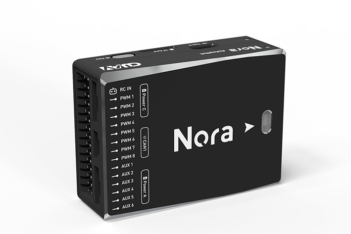
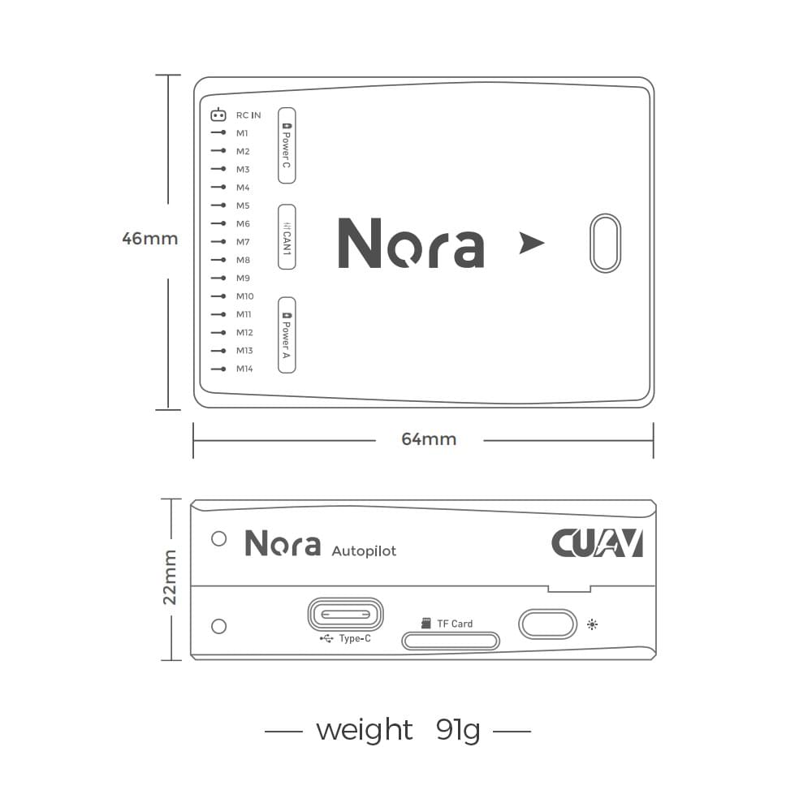
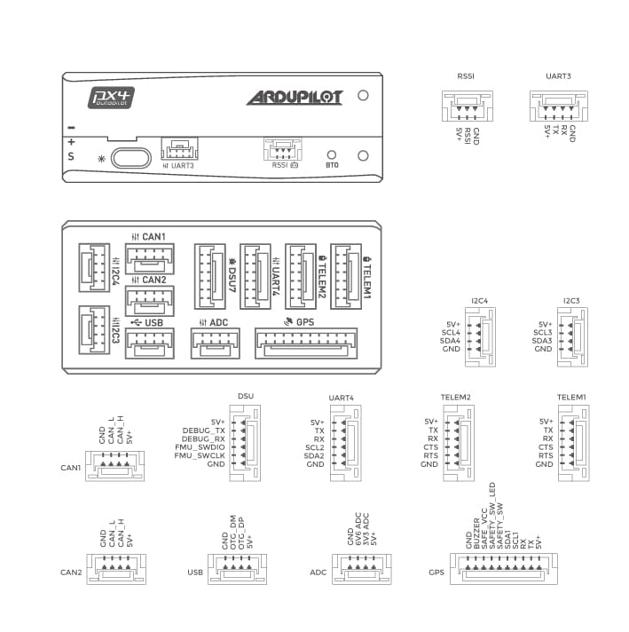
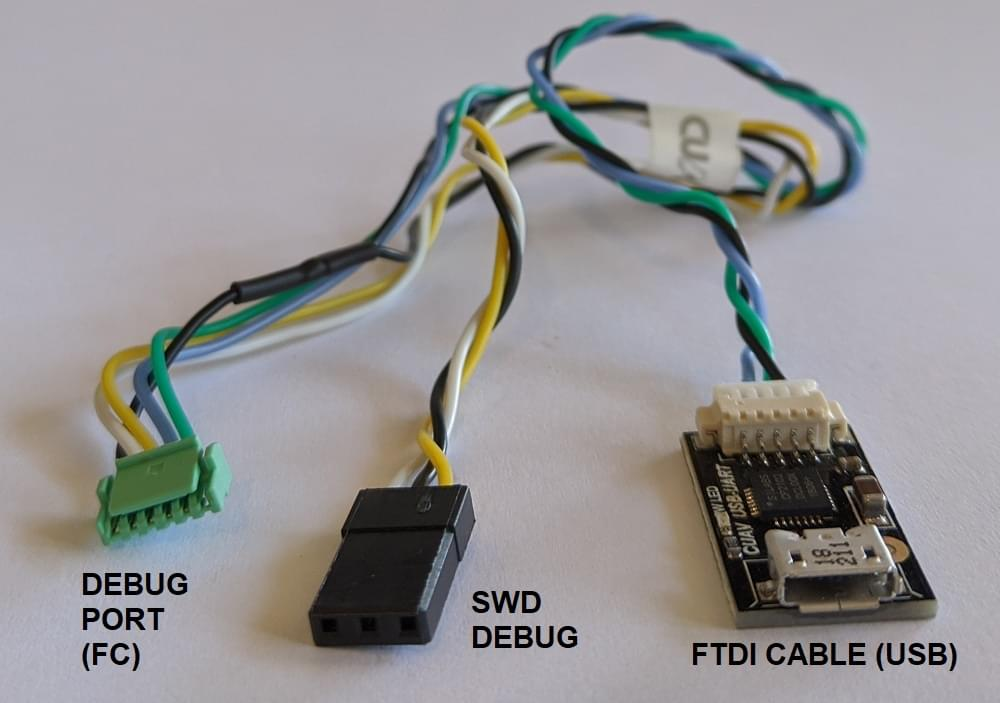

# CUAV Nora Flight Controller

:::warning
PX4 does not manufacture this (or any) autopilot.
Contact the [manufacturer](https://www.cuav.net) for hardware support or compliance issues.
:::

The [Nora](https://doc.cuav.net/flight-controller/x7/en/nora.html)<sup>&reg;</sup> flight controller is a high-performance autopilot.
It is an ideal choice for industrial drones and large-scale heavy-duty drones.
It is mainly supplied to commercial manufacturers.



Nora is a variant of the CUAV X7.
It adopts an integrated motherboard (soft and hard board), which reduces flight controller's internal connectors, improves reliability, and places all the interfaces on the side (making the wiring more concise).

:::info
This flight controller is [manufacturer supported](../flight_controller/autopilot_manufacturer_supported.md).
:::

## 特性

- Internal shock absorption
- The integrated process reduces the failure caused by interface damage.
- Support USB_HS, download logs faster (PX4 not yet supported)
- Support more dshot output
- Support IMU heating, make the sensor work better
- Dedicated CAN battery port
- 3 sets of IMU sensors
- Car-grade RM3100 compass
- High performance processor

:::tip
The manufacturer [CUAV Docs](https://doc.cuav.net/flight-controller/x7/en/nora.html) are the canonical reference for Nora.
They should be used by preference as they contain the most complete and up to date information.
:::

## 总览

- Main FMU Processor: STM32H743

- 内置传感器：

  - 加速度计/陀螺仪：ICM-20689
  - 加速度计/陀螺仪：ICM-20649
  - Accelerometer/Gyroscope: BMI088
  - Magnetometer: RM3100
  - Barometer: MS5611\*2

- 接口：
  - 14 PWM outputs （12 supports Dshot）
  - Support multiple RC inputs (SBUs / CPPM / DSM)
  - Analogue / PWM RSSI input
  - 2 GPS ports(GPS and UART4 ports)
  - 4 i2c buses(Two i2c dedicated ports)
  - 2 CAN bus ports
  - 2 Power ports(Power A is common adc interface, Power C is DroneCAN battery interface)
  - 2 ADC input
  - 1 USB ports

- 电源系统
  - 输入电压：4.3~5.4V
  - USB输入电压: 4.75~5.25V
  - 伺服导轨输入电压：0~36V

- 重量和尺寸:
  - Weight: 101 g

- 其它特性:
  - Operating temperature: -20 ~ 80°c（Measured value）
  - Three imus
  - Supports temperature compensation
  - Internal shock absorption

:::info
When it runs PX4 firmware, only 8 PWM outputs work.
The remaining 6 PWM ports are still being adapted (so it is not compatible with VOLT at time of writing).
:::

## 购买渠道

- [CUAV Store](https://store.cuav.net)<\br>
- [CUAV Aliexpress](https://www.aliexpress.com/item/4001042501927.html?gps-id=8041884&scm=1007.14677.110221.0&scm_id=1007.14677.110221.0&scm-url=1007.14677.110221.0&pvid=3dc0a3ba-fa82-43d2-b0b3-6280e4329cef&spm=a2g0o.store_home.promoteRecommendProducts_7913969.58)

## Connections (Wiring)

[CUAV nora Wiring Quickstart](https://doc.cuav.net/flight-controller/x7/en/quick-start/quick-start-nora.html)

## Size and Pinouts





:::warning
The `RCIN` port is limited to powering the rc receiver and cannot be connected to any power/load.
:::

## 额定电压

Nora AutoPilot\* can be triple-redundant on the power supply if three power sources are supplied. The two power rails are: **POWERA**, **POWERC** and **USB**.

:::info
The output power rails **PWM OUT** (0V to 36V) do not power the flight controller board (and are not powered by it).
You must supply power to one of **POWERA**, **POWERC** or **USB** or the board will be unpowered.
:::

**Normal Operation Maximum Ratings**

Under these conditions all power sources will be used in this order to power the system:

1. **POWERA** and **POWERC** inputs (4.3V to 5.4V)
2. **USB** input (4.75V to 5.25V)

## 编译固件

:::tip
Most users will not need to build this firmware!
It is pre-built and automatically installed by _QGroundControl_ when appropriate hardware is connected.
:::

To [build PX4](../dev_setup/building_px4.md) for this target:

```
make cuav_nora_default
```

## Over Current Protection

The _Nora_ has over-current protection on the 5 Volt Peripheral and 5 Volt high power, which limits the current to 2.5A.
The _Nora_ has short circuit protection.

:::warning
Up to 2.5 A can be delivered to the connectors listed as pin 1 (although these are only rated at 1 A).
:::

## 调试接口

The system's serial console and SWD interface operate on the **DSU7** port.
Simply connect the FTDI cable to the DSU7 connector (the product list contains the CUAV FTDI cable).

The [PX4 System Console](../debug/system_console.md) and [SWD interface](../debug/swd_debug.md) operate on the **FMU Debug** port (`DSU7`).

The debug port (`DSU7`) uses a [JST BM06B](https://www.digikey.com.au/product-detail/en/jst-sales-america-inc/BM06B-GHS-TBT-LF-SN-N/455-1582-1-ND/807850) connector and has the following pinout:

| 针脚   | 信号                                | 电压                    |
| ---- | --------------------------------- | --------------------- |
| 1（红） | 5V+                               | +5V                   |
| 2    | DEBUG TX (OUT) | +3.3V |
| 3    | DEBUG RX (IN)  | +3.3V |
| 4（黑） | FMU_SWDIO    | +3.3V |
| 6    | FMU_SWCLK    | +3.3V |
| 6    | GND                               | GND                   |

CUAV provides a dedicated debugging cable, which can be connected to the `DSU7` port.
This splits out an FTDI cable for connecting the [PX4 System Console](../debug/system_console.md) to a computer USB port, and SWD pins used for SWD/JTAG debugging.
The provided debug cable does not connect to the SWD port `Vref` pin (1).



:::warning
The SWD Vref pin (1) uses 5V as Vref but the CPU is run at 3.3V!

Some JTAG adapters (SEGGER J-Link) will use the Vref voltage to set the voltage on the SWD lines.
For direct connection to _Segger Jlink_ we recommended you use the 3.3 Volts from pin 4 of the connector marked `DSM`/`SBUS`/`RSSI` to provide `Vtref` to the JTAG (i.e. providing 3.3V and _NOT_ 5V).
:::

## 支持的平台/机身

Any multicopter / airplane / rover or boat that can be controlled with normal RC servos or Futaba S-Bus servos.
The complete set of supported configurations can be seen in the [Airframes Reference](../airframes/airframe_reference.md).

## 更多信息

- [Quick start](https://doc.cuav.net/flight-controller/x7/en/quick-start/quick-start-nora.html)
- [CUAV docs](http://doc.cuav.net)
- [nora schematic](https://github.com/cuav/hardware/tree/master/X7_Autopilot)
