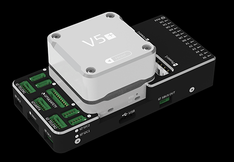

# CUAV V5+ Autopilot

:::warning
PX4 does not manufacture this (or any) autopilot.
Contact the [manufacturer](https://store.cuav.net/) for hardware support or compliance issues.
:::

_V5+_<sup>&reg;</sup> is an advanced autopilot manufactured by CUAV<sup>&reg;</sup>.
It was designed by CUAV<sup>&reg;</sup> in collaboration with the PX4 team.

The autopilot is recommended for commercial systems integration, but is also suitable for academic research and any other use.



Some of its main features include:

- Full compatibility with the [Pixhawk project](https://pixhawk.org/) **FMUv5** design standard and uses the [Pixhawk Connector Standard](https://pixhawk.org/pixhawk-connector-standard/) for all external interfaces.
- More advanced processor, RAM and flash memory than FMU v3, along with more stable and reliable sensors.
- Firmware-compatible with PX4.
- Modular design allows users to customize their own carrier board.
- Built-in vibration dampening system with high performance shock absorption system.
- Multiple-redundant sensor and power systems for improved flight safety and stability.

:::info
This flight controller is [manufacturer supported](../flight_controller/autopilot_manufacturer_supported.md).
:::

## 总览

- 主处理器：STM32F765
  - 32 位 Arm® Cortex®-M7，216MHz，2MB 储存，512KB RAM

- IO 处理器：STM32F100
  - 32 位 Arm® Cortex®-M3，24MHz，8KB SRAM

- 内置传感器：

  - 加速度计/陀螺仪：ICM-20689
  - 加速度计/陀螺仪：BMI055
  - 磁力计：IST8310
  - 气压计：MS5611

- 接口：
  - 14路PWM输出 (6路来自FMU, 8路来自 IO)
  - FMU上有3个专用PWM/Capture输入
  - CPPM专用的RC输入
  - 用于 Spektrum / DSM 与 有模拟 / PWM RSSI 的 S.Bus 的专用遥控输入
  - 电平/PWM RSSI输入
  - S.BUS伺服输出
  - 5个通用串行口
  - 4路I2C总线
  - 4路SPI总线
  - 2 CANBuses with serial ESC
  - 2个电池电流/电压模拟输入口

- 电源系统
  - 输入电压：4.3~5.4V
  - USB输入电压: 4.75~5.25V

- 重量和尺寸:
  - 重量：99g
  - Dimensions: 85.5\*42\*33mm

- 其它特性:

  - Operating temperature: -20 ~ 80°c（Measured value）

## 购买渠道

<!-- [CUAV Store](https://store.cuav.net/index.php?id_product=95&id_product_attribute=0&rewrite=cuav-new-pixhack-v5-autopilot-m8n-gps-for-fpv-rc-drone-quadcopter-helicopter-flight-simulator-free-shipping-whole-sale&controller=product&id_lang=1) -->

[CUAV Aliexpress](https://www.aliexpress.com/item/32890380056.html?spm=a2g0o.detail.1000060.1.7a7233e7mLTlVl&gps-id=pcDetailBottomMoreThisSeller&scm=1007.13339.90158.0&scm_id=1007.13339.90158.0&scm-url=1007.13339.90158.0&pvid=d899bfab-a7ca-46e1-adf2-72ad1d649822) (International users)

CUAV Taobao (China Mainland users)

:::info
Autopilot may be purchased with included Neo GPS module
:::

<a id="connection"></a>

## Connections (Wiring)

[CUAV V5+ Wiring Quickstart](../assembly/quick_start_cuav_v5_plus.md)

## 针脚定义

Download **V5+** pinouts from [here](http://manual.cuav.net/V5-Plus.pdf).

## 额定电压

_V5+ AutoPilot_ supports redundant power supplies - up to three sources may be used: `Power1`, `Power2` and `USB`.
You must supply power to at least one of these sources, or the flight controller will be unpowered.

:::info
On FMUv5 based FMUs with PX4IO module (as is the case for the _V5+_), the Servo Power Rail is only monitored by the FMU.
It is neither powered by, nor provides power to the FMU.
However, the pins marked **+** are all common, and a BEC may be connected to any of the servo pin sets to power the servo power rail.
:::

**Normal Operation Maximum Ratings**

Under these conditions all power sources will be used in this order to power the system:

1. `Power1` and `Power2` inputs (4.3V to 5.4V)
2. `USB` input (4.75V to 5.25V)

## Over Current Protection

The _V5+_ has over current protection on the 5 Volt Peripheral and 5 Volt high power, which limits the current to 2.5A.
The _V5+_ has short circuit protection.

:::warning
Up to 2.5 A can be delivered to the connectors listed as pin 1 (although these are only rated at 1 A).
:::

## 编译固件

:::tip
Most users will not need to build this firmware!
It is pre-built and automatically installed by _QGroundControl_ when appropriate hardware is connected.
:::

To [build PX4](../dev_setup/building_px4.md) for this target:

```
make px4_fmu-v5_default
```

## 调试接口

The [PX4 System Console](../debug/system_console.md) and [SWD interface](../debug/swd_debug.md) operate on the **FMU Debug** port (`DSU7`).
The board does not have an I/O debug interface.


The debug port (`DSU7`) uses a [JST BM06B](https://www.digikey.com.au/product-detail/en/jst-sales-america-inc/BM06B-GHS-TBT-LF-SN-N/455-1582-1-ND/807850) connector and has the following pinout:

| 针脚   | 信号                                | 电压                    |
| ---- | --------------------------------- | --------------------- |
| 1（红） | 5V+                               | +5V                   |
| 2    | DEBUG TX (OUT) | +3.3V |
| 3    | DEBUG RX (IN)  | +3.3V |
| 4（黑） | FMU_SWDIO    | +3.3V |
| 6    | FMU_SWCLK    | +3.3V |
| 6    | GND                               | GND                   |

The product package includes a convenient debug cable that can be connected to the `DSU7` port.
This splits out an FTDI cable for connecting the [PX4 System Console](../debug/system_console.md) to a computer USB port, and SWD pins used for SWD/JTAG debugging.
The provided debug cable does not connect to the SWD port `Vref` pin (1).


:::warning
The SWD Vref pin (1) uses 5V as Vref but the CPU is run at 3.3V!

Some JTAG adapters (SEGGER J-Link) will use the Vref voltage to set the voltage on the SWD lines.
For direct connection to _Segger Jlink_ we recommended you use the 3.3 Volts from pin 4 of the connector marked `DSM`/`SBUS`/`RSSI` to provide `Vtref` to the JTAG (i.e. providing 3.3V and _NOT_ 5V).

For more information see [Using JTAG for hardware debugging](#using-jtag-for-hardware-debugging).
:::

## 串口映射

| UART   | 设备         | Port                                                       |
| ------ | ---------- | ---------------------------------------------------------- |
| UART1  | /dev/ttyS0 | GPS                                                        |
| USART2 | /dev/ttyS1 | TELEM1 (flow control)                   |
| USART3 | /dev/ttyS2 | TELEM2 (flow control)                   |
| UART4  | /dev/ttyS3 | TELEM4                                                     |
| USART6 | /dev/ttyS4 | TX is RC input from SBUS_RC connector |
| UART7  | /dev/ttyS5 | Debug Console                                              |
| UART8  | /dev/ttyS6 | PX4IO                                                      |

<!-- Note: Got ports using https://github.com/PX4/PX4-user_guide/pull/672#issuecomment-598198434 -->

<a id="optional-hardware"></a>

## 外部设备

- [Digital Airspeed Sensor](https://item.taobao.com/item.htm?spm=a1z10.3-c-s.w4002-16371268452.37.6d9f48afsFgGZI&id=9512463037)
- [Telemetry Radio Modules](https://cuav.taobao.com/category-158480951.htm?spm=2013.1.w5002-16371268426.4.410b7a821qYbBq&search=y&catName=%CA%FD%B4%AB%B5%E7%CC%A8)
- [Rangefinders/Distance sensors](../sensor/rangefinders.md)

## 支持的平台/机身

Any multicopter / airplane / rover or boat that can be controlled with normal RC servos or Futaba S-Bus servos.
The complete set of supported configurations can be seen in the [Airframes Reference](../airframes/airframe_reference.md).

## 备注

#### Do not plug Digital or Analog PM onto connectors configured for other type of PM

If you plug an Analog PM into a digital PM connector it will stop all the I2C devices on that bus.
Specifically this will stop the GPS's compass due to contention, and may also damage the FMU (longer term).

Similarly, a digital PM plugged into a analog connector will not work, and may also damage/destroy the power module (longer term).

## Compatibility

CUAV adopts some differentiated designs and is incompatible with some hardware, which will be described below.

<a id="compatibility_gps"></a>

#### GPS not compatible with other devices

The _Neo v2.0 GPS_ recommended for use with _CUAV V5+_ and _CUAV V5 nano_ is not fully compatible with other Pixhawk flight controllers (specifically, the buzzer part is not compatible and there may be issues with the safety switch).

The UAVCAN [NEO V2 PRO GNSS receiver](http://doc.cuav.net/gps/neo-series-gnss/en/neo-v2-pro.html) can also be used, and is compatible with other flight controllers.

<a id="compatibility_jtag"></a>

#### Using JTAG for hardware debugging

`DSU7` FMU Debug Pin 1 is 5 volts - not the 3.3 volts of the CPU.

Some JTAG use this voltage to set the IO levels when communicating to the target.

For direct connection to _Segger Jlink_ we recommended you use the 3.3 Volts of DSM/SBUS/RSSI pin 4 as Pin 1 on the debug connector (`Vtref`).

## 已知的问题

The issues below refer to the _batch number_ in which they first appear.
The batch number is the four-digit production date behind V01 and is displayed on a sticker on the side of the flight controller.
For example, the serial number Batch V011904((V01 is the number of V5, 1904 is the production date, that is, the batch number).

<a id="pin1_unfused"></a>

#### SBUS / DSM / RSSI interface Pin1 unfused

:::warning
This is a safety issue.
:::

Please do not connect other equipment (except RC receiver) on SBUS / DSM / RSSI interface - this may lead to equipment damage.

- _Found:_ Batches V01190904xxxx
- _Fixed:_ Batches later than V01190904xxxx

## 更多信息

- [CUAV V5+ Manual](http://manual.cuav.net/V5-Plus.pdf)
- [CUAV V5+ docs](http://doc.cuav.net/flight-controller/v5-autopilot/en/v5+.html)
- [FMUv5 reference design pinout](https://docs.google.com/spreadsheets/d/1-n0__BYDedQrc_2NHqBenG1DNepAgnHpSGglke-QQwY/edit#gid=912976165)
- [CUAV Github](https://github.com/cuav)
- [Base board design reference](https://github.com/cuav/hardware/tree/master/V5_Autopilot/V5%2B/V5%2BBASE)
- [CUAV V5+ Wiring Quickstart](../assembly/quick_start_cuav_v5_plus.md)
- [Airframe build-log using CUAV v5+ on a DJI FlameWheel450](../frames_multicopter/dji_f450_cuav_5plus.md)
