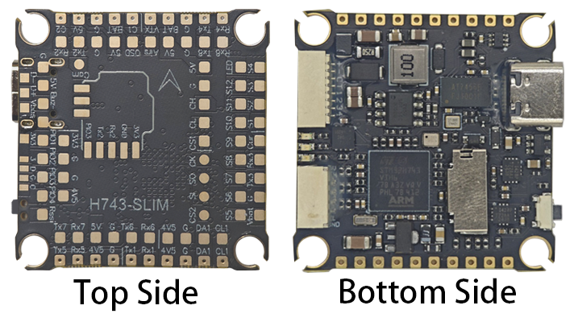
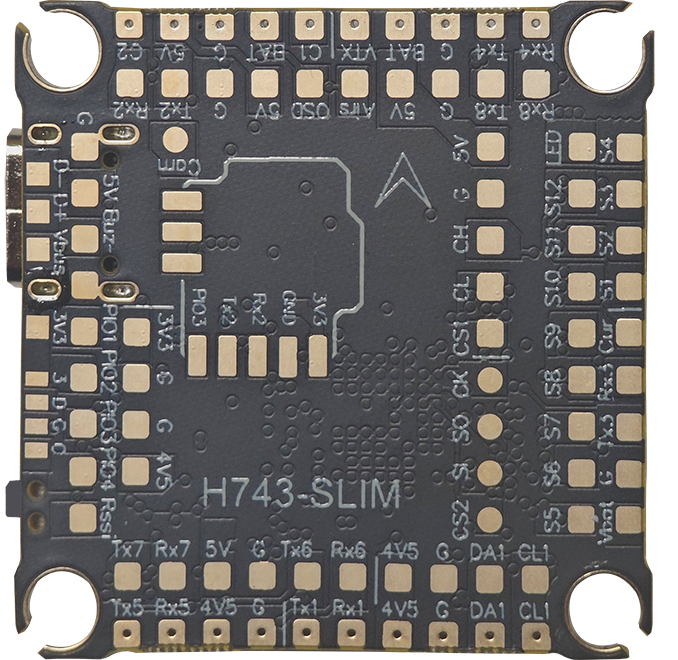
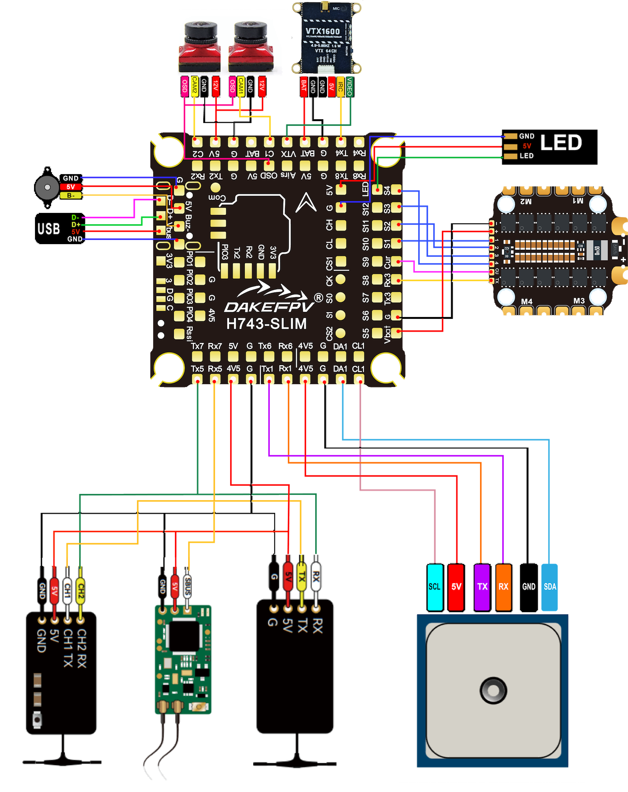
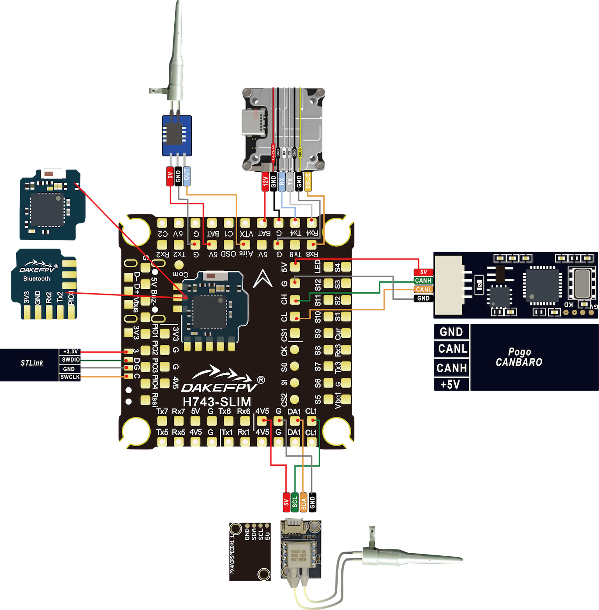
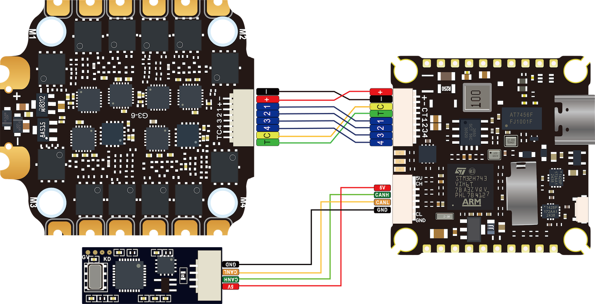
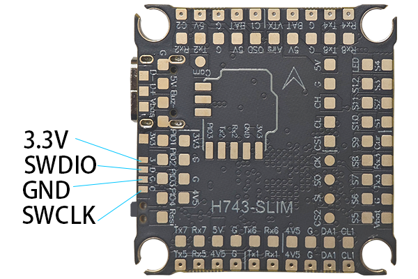

# DAKEFPV H743-SLIM

<Badge type="tip" text="PX4 v1.13" />

::: 警告
PX4公司不生产此类（或任何此类）自动驾驶系统。如需获取硬件支持或解决合规性问题，请与[制造商](http://dakefpv.com/)联系。
:::

[DAKEFPV H743-SLIM](http://dakefpv.com/pd.jsp？id=89) 集众多功能于一身，包括即插即用 4 合 1 ESC 接口、气压计、OSD 功能、8 个 UART 接口、黑盒 MicroSD 卡插槽、5V BEC、便捷的焊接布局、LED 与蜂鸣器焊盘以及 I2C 焊盘(SDA 与 SCL)，用于连接外部 GPS/磁力计，以及更多其他特性。



::: 这款飞行控制器是由[制造商支持的](../flight_controller/autopilot_manufacturer_supported.md)。
:::

## 主要特性

- 主控芯片: STM32H743 32 位处理器，运行频率为 480 MHz
- 陀螺仪: MPU6000
- 气压计: BMP280
- OSD: AT7456E
- 板载蓝牙模块：与 PX4 配合使用时处于禁用状态
- 1x JST-SH1.0_8pin 接口（适用于单体电调或四合一电调）
- 1x GH1.25-4Pin 接口 （CAN 总线）
- 电池输入电压: 2S - 12S
- BEC 5V 2A 持续供电.
- 安装孔距: 30.5 毫米×30.5 毫米/直径 4 毫米的孔
- 大小: 35x35mm
- 重量: 8g

## 购买渠道

该板可从以下所列商店之一购买（例如）:

- [DAKEFPV 官网](http://dakefpv.com/pd.jsp?id=89)

::: 提示
_DAKEFPV H743-SLIM_ 专为与 _BX 6S 55A_ 4合1 ESC 配合使用而设计，且两者可以成套购买。
:::

## 接口与焊盘

这是DAKEFPVH743_SLIM 的顶视图，展示了电路板的顶部焊盘：



# 引脚定义表
| 引脚            | 功能说明                                                         | PX4 默认配置         |
| --------------- | ---------------------------------------------------------------- | -------------------- |
| Vbat            | 电池正极电压（2S-12S）                                           |                      |
| BAT             | 电池电压（与Vbat引脚连通）|                      |
| SA1, CL1        | I2C外设接口                                                      |                      |
| 5V              | 5V 输出（最大2A），BEC供电（TypeC接口不供电）|                      |
| 4V5             | 4.5V 输出（最大2A），BEC供电或TypeC接口供电                      |                      |
| 3V3             | 3.3V 输出（最大0.25A）                                            |                      |
| VTX             | 图传模块视频输出端                                               |                      |
| Airs            | 模拟空速计ADC焊盘                                                |                      |
| Cur             | 电流表ADC输入焊盘（亦置于插孔中，适配四合一电调）|                      |
| OSD             | 相机控制引脚                                                     |                      |
| C1, C2 或 Cam   | FPV相机视频输入端                                                |                      |
| G               | 电池负极/接地端                                                   |                      |
| Rssi            | 接收机模拟信号强度指示输入（0-3.3V）|                      |
| D-, D+ 及 Vbus  | USB焊盘                                                          |                      |
| SI, SO 及 CLK   | 外部SPI总线：MOSI、MISO、时钟引脚                                 |                      |
| CS1, CS2        | 外部SPI总线片选1、片选2引脚                                       |                      |
| R1, T1          | UART1 接收、发送引脚                                              | GPS                  |
| R2, T2          | UART2 接收、发送引脚                                              | 遥测端口1（TEL1）    |
| R3, T3          | UART3 接收、发送引脚（接收脚亦在插孔中，适配四合一电调）| 电调遥测（ESC Telemetry） |
| R4, T4          | UART4 接收、发送引脚                                              | 遥测端口2（TEL2）    |
| R5, T5          | UART5 接收、发送引脚                                              | 遥控端口（RC port）  |
| R6, T6          | UART6 接收、发送引脚                                              | 遥测端口3（TEL3）    |
| R7, T7          | UART7 接收、发送引脚                                              | NuttX调试控制台      |
| R8, T8          | UART8 接收、发送引脚                                              | 遥测端口4（TEL4）    |
| CH, CL          | CAN总线高低电平引脚                                               |                      |
| Buz-            | 压电蜂鸣器负极引脚（蜂鸣器正极需接5V焊盘）|                      |
| S1 至 S4        | 电机信号输出端                                                   |                      |
| S5 至 S8        | 电机信号输出端                                                   |                      |
| LED             | WS2182 可寻址LED信号线（未测试）|                      |

## 示例接线图







## PX4 引导程序更新 {#bootloader}

该板件预装有 [Betaflight](https://github.com/betaflight/betaflight/wiki) 固件。在安装 PX4 固件之前，必须先对 PX4 引导加载程序进行刷写操作。请下载 [kakuteh7_bl.hex](https://github.com/PX4/PX4-Autopilot/raw/main/docs/assets/flight_controller/kakuteh7/holybro_kakuteh7_bootloader.hex) 引导加载程序二进制文件，并参阅[此页面](../advanced_config/bootloader_update_from_betaflight.md)以获取刷写说明。

## 编译固件

为这一目标构建 [PX4](../dev_setup/building_px4.md)  系统:
```sh
make dake_h743-slim_default
```

## 安装 PX4 固件

固件可通过任何常规方式进行安装:

- 构建并上传源代码

  ```sh
  make dake_h743-slim_default upload
  ```

- 使用 _QGroundControl_ [加载固件](../config/firmware.md)。您既可选择预置的固件，也可使用自己定制的固件。

:::信息
如果您正通过 QGroundcontrol 加载预置固件，则必须使用 QGC Daily 或 QGC 版本早于 4.1.7 之后的版本。
:::

## PX4 配置

除了[基本配置](../config/index.md)外，以下参数也至关重要:

| 参数          | 设置                                            |
| ------------ | ----------------------------------------------- |
| [SYS_HAS_MAG](../advanced_config/parameter_reference.md#SYS_HAS_MAG) | 这应被禁用，因为该板没有内置罗盘。若您附加了外部罗盘，则可将其启用。 |

## 串口映射

| UART   | 设备       | Port                                     |
| ------ | ---------- | ----------------------------------------  |
| USART1 | /dev/ttyS0 | GPS1                                      |
| USART2 | /dev/ttyS1 | TELEM1                                    |
| USART3 | /dev/ttyS2 | 电调遥测                                   |
| UART4  | /dev/ttyS3 | TELEM2                                    |
| UART5  | /dev/ttyS4 | RC SBUS                                   |
| USART6 | /dev/ttyS5 | TELEM3                                    |
| UART7  | /dev/ttyS6 | 调试控制台                                 |
| UART8  | /dev/ttyS7 | TELEM4                                    |

## 调试接口

### 系统控制台

UART7 的接收和发送端口已配置为用作[系统控制台](../debug/system_console.md)。

### SWD

SWD接口（JTAG）引脚如下:

- `SWCLK`: 测试点 2（CPU 上的引脚 72）
- `SWDIO`: 测试点 3（CPU 上的引脚 76）
- `GND`: 如板面上所示
- `VDD_3V3`: 如板面上所示

以下列出了相关内容:


