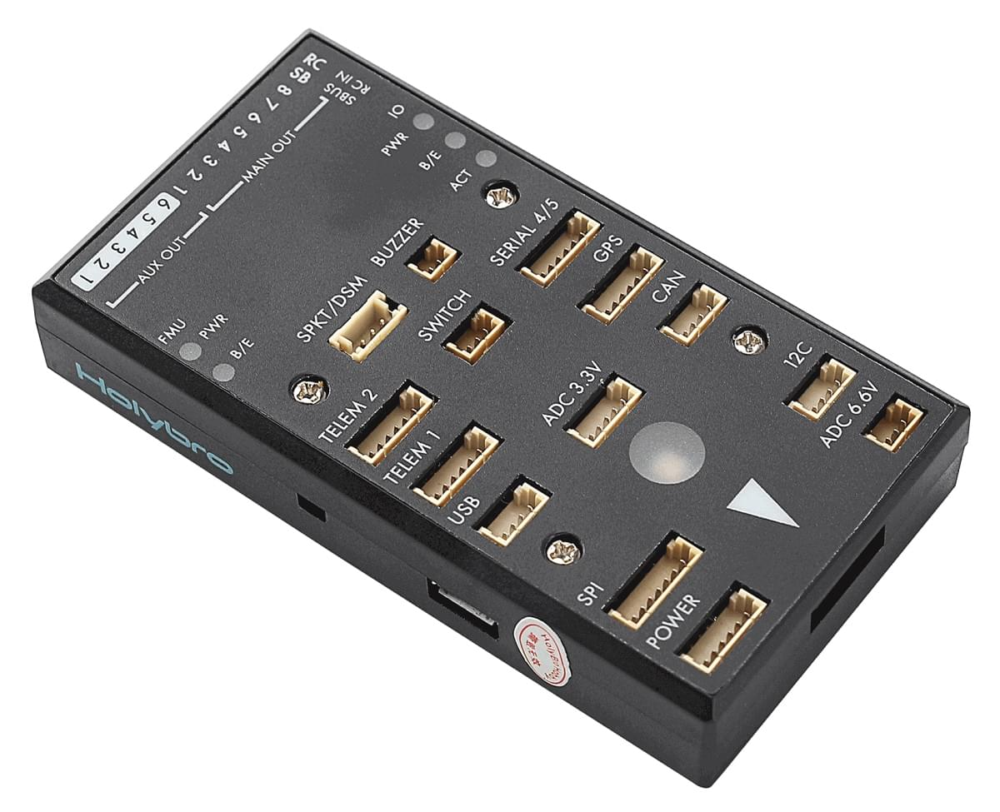

# Holybro pix32 Flight Controller (Discontinued)

<Badge type="info" text="Discontinued" />

:::warning
PX4 does not manufacture this (or any) autopilot.
Contact the [manufacturer](https://holybro.com/) for hardware support or compliance issues.
:::

The Holybro<sup>&reg;</sup> [pix32 autopilot](https://holybro.com/collections/autopilot-flight-controllers/products/pix32pixhawk-flight-controller) (also known as "Pixhawk 2", and formerly as HKPilot32) is based on the [Pixhawk<sup>&reg;</sup>-project](https://pixhawk.org/) **FMUv2** open hardware design.
This board is based on hardware version Pixhawk 2.4.6.
It runs the PX4 flight stack on the [NuttX](https://nuttx.apache.org/) OS.



As a CC-BY-SA 3.0 licensed Open Hardware design, schematics and design files should be [available here](https://github.com/PX4/Hardware).

:::tip
The Holybro pix32 is software compatible with the [3DR Pixhawk 1](../flight_controller/pixhawk.md).
It is not connector compatible, but is otherwise physically very similar to the 3DR Pixhawk or mRo Pixhawk.
:::

:::info
This flight controller is [manufacturer supported](../flight_controller/autopilot_manufacturer_supported.md).
:::

## 主要特性

- Main System-on-Chip: [STM32F427](http://www.st.com/web/en/catalog/mmc/FM141/SC1169/SS1577/LN1789)
  - CPU: 32-bit STM32F427 Cortex<sup>&reg;</sup> M4 core with FPU
  - RAM: 168 MHz/256 KB
  - Flash: 2 MB
- Failsafe System-on-Chip: STM32F103
- 传感器：
  - ST Micro L3GD20 3-axis 16-bit gyroscope
  - ST Micro LSM303D 3-axis 14-bit accelerometer / magnetometer
  - Invensense<sup>&reg;</sup> MPU 6000 3-axis accelerometer/gyroscope
  - MEAS MS5611 气压计
- 尺寸/重量
  - Size: 81x44x15mm
  - Weight: 33.1g
- GPS: u-blox<sup>&reg;</sup> super precision Neo-7M with compass
- Input Voltage: 2~10s (7.4~37V)

### 连接

- 1x I2C
- 2x CAN
- 3.3 and 6.6V ADC inputs
- 5x UART (serial ports), one high-power capable, 2x with HW flow control
- Spektrum DSM / DSM2 / DSM-X® Satellite compatible input up to DX8 (DX9 and above not supported)
- Futaba<sup>&reg;</sup> S.BUS compatible input and output
- PPM sum signal
- RSSI (PWM or voltage) input
- SPI
- External microUSB port
- Molex PicoBlade connectors

## 购买渠道

[shop.holybro.com](https://holybro.com/collections/autopilot-flight-controllers/products/pix32pixhawk-flight-controller)

### 配件

- [Digital airspeed sensor](https://holybro.com/products/digital-air-speed-sensor)
- [Hobbyking<sup>&reg;</sup> Wifi Telemetry](https://hobbyking.com/en_us/apm-pixhawk-wireless-wifi-radio-module.html)
- [HolyBro SiK Telemetry Radio (EU 433 MHz, US 915 MHz)](../telemetry/holybro_sik_radio.md)

## 编译固件

:::tip
Most users will not need to build this firmware!
It is pre-built and automatically installed by _QGroundControl_ when appropriate hardware is connected.
:::

To [build PX4](../dev_setup/building_px4.md) for this target:

```
make px4_fmu-v2_default
```

## 调试接口

See [3DR Pixhawk 1 > Debug Ports](../flight_controller/pixhawk.md#debug-ports).

## 引脚和原理图

The board is based on the [Pixhawk project](https://pixhawk.org/) **FMUv2** open hardware design.

- [FMUv2 + IOv2 schematic](https://raw.githubusercontent.com/PX4/Hardware/master/FMUv2/PX4FMUv2.4.5.pdf) -- Schematic and layout

:::info
As a CC-BY-SA 3.0 licensed Open Hardware design, all schematics and design files are [available](https://github.com/PX4/Hardware).
:::

## 串口映射

| UART   | 设备         | Port                                     |
| ------ | ---------- | ---------------------------------------- |
| UART1  | /dev/ttyS0 | IO debug                                 |
| USART2 | /dev/ttyS1 | TELEM1 (flow control) |
| USART3 | /dev/ttyS2 | TELEM2 (flow control) |
| UART4  |            |                                          |
| UART7  | CONSOLE    |                                          |
| UART8  | SERIAL4    |                                          |

<!-- Note: Got ports using https://github.com/PX4/PX4-user_guide/pull/672#issuecomment-598198434 -->
