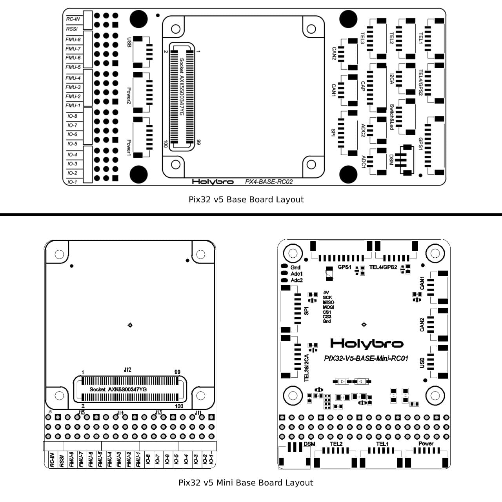

# Holybro Pix32 v5

:::warning
PX4 does not manufacture this (or any) autopilot.
Contact the [manufacturer](https://holybro.com/) for hardware support or compliance issues.
:::

[Pix32 v5](https://holybro.com/products/pix32-v5)<sup>&reg;</sup> is an advanced autopilot flight controller designed and made by Holybro<sup>&reg;</sup>.
It is optimized to run on PX4 firmware, which is intended for both academic and commercial developers.
It is based on the [Pixhawk-project](https://pixhawk.org/) **FMUv5** open hardware design and runs PX4 on the [NuttX](https://nuttx.apache.org/) OS.
It can be regarded as a variant version of Pixhawk4.

The Pix32 v5 is designed for pilots who need a high power, flexible and customisable flight control system.
It is comprised of a separate flight controller and carrier (base) board, which are connected by a 100pin connector.
This design allows users to either select a base board made by Holybro, or customize their own.


:::info
This flight controller is [manufacturer supported](../flight_controller/autopilot_manufacturer_supported.md).
:::

## 总览

- 主处理器：STM32F765
  - 32 位 Arm® Cortex®-M7，216MHz，2MB 储存，512KB RAM
- IO 处理器：STM32F100
  - 32 位 Arm® Cortex®-M3，24MHz，8KB SRAM
- 内置传感器：
  - 加速度计 / 陀螺仪：ICM-20689
  - Accel/Gyro: BMI055 or ICM20602
  - 磁力计：IST8310
  - 气压计：MS5611
- GPS：ublox Neo-M8N GPS/GLONASS 接收器；集成磁力计 IST8310
- 接口：
  - 8-16 路PWM输出（8路来自 IO，8路来自 FMU）
  - FMU上有3个专用PWM/Capture输入
  - CPPM专用的RC输入
  - 用于 Spektrum / DSM 与 有模拟 / PWM RSSI 的 S.Bus 的专用遥控输入
  - Dedicated S.Bus servo output
  - 5个通用串行口
    - 2 with full flow control
    - 1 with separate 1.5A current limit
  - 3 个 I2C 接口
  - 4路SPI总线
    - 1 internal high speed SPI sensor bus with 4 chip selects and 6 DRDYs
    - 1 internal low noise SPI bus dedicated for
    - Barometer with 2 chip selects, no DRDYs
    - 1 internal SPI bus dedicated for FRAM
    - Supports dedicated SPI calibration EEPROM located on sensor module
    - 1 external SPI buses
  - 多达 2 路 CAN 总线用于带串口的电调
    - Each CANBus has individual silent controls or ESC RX-MUX control
    - 2个电池电流/电压模拟输入口
    - 2 additional analog inputs
- Electrical System:
  - 电源模块输出：4.9~5.5V
  - Max input voltage: 6V
  - 最大电流感应：120A
  - USB 电源输入：4.75~5.25V
  - 伺服导轨输入电压：0~36V
- 重量和尺寸:
  - Dimensions: 45x45x13.5mm
  - Weight: 33.0g
- Environmental Data, Quality & Reliability:
  - 工作温度：-40 ~ 85°C
  - Storage temp. -40~85℃
  - CE
  - FCC
  - RoHS compliant (lead-free)

Additional information can be found in the [Pix32 V5 Technical Data Sheet](https://cdn.shopify.com/s/files/1/0604/5905/7341/files/Holybro_PIX32-V5_technical_data_sheet_v1.1.pdf).

## 购买渠道

Order from [Holybro website](https://holybro.com/products/pix32-v5).

## 组装 / 设置

The [Pix32 v5 Wiring Quick Start](../assembly/quick_start_holybro_pix32_v5.md) provides instructions on how to assemble required/important peripherals including GPS, Power Management Board etc.

## Base Board Layouts



## 针脚定义

[_pix32 v5_ and mini baseboard](https://cdn.shopify.com/s/files/1/0604/5905/7341/files/Holybro_Pix32-V5-Base-Mini-Pinouts.pdf)

## 尺寸


## 额定电压

_Pix32 v5_ can be triple-redundant on the power supply if three power sources are supplied.
The three power rails are: **POWER1**, **POWER2** and **USB**.

:::info
The output power rails **FMU PWM OUT** and **I/O PWM OUT** (0V to 36V) do not power the flight controller board (and are not powered by it).
You must supply power to one of **POWER1**, **POWER2** or **USB** or the board will be unpowered.
:::

**Normal Operation Maximum Ratings**

Under these conditions all power sources will be used in this order to power the system:

1. **POWER1** and **POWER2** inputs (4.9V to 5.5V)
2. **USB** input (4.75V to 5.25V)

**Absolute Maximum Ratings**

Under these conditions the system will not draw any power (will not be operational), but will remain intact.

1. **POWER1** and **POWER2** inputs (operational range 4.1V to 5.7V, 0V to 10V undamaged)
2. **USB** input (operational range 4.1V to 5.7V, 0V to 6V undamaged)
3. Servo input: VDD_SERVO pin of **FMU PWM OUT** and **I/O PWM OUT** (0V to 42V undamaged)

## 编译固件

:::tip
Most users will not need to build this firmware!
It is pre-built and automatically installed by _QGroundControl_ when appropriate hardware is connected.
:::

To [build PX4](../dev_setup/building_px4.md) for this target:

```
make holybro_pix32v5_default
```

## 调试接口

The system's [serial console](../debug/system_console.md) and SWD interface runs on the **FMU Debug** port

<!--while the I/O console and SWD interface can be accessed via **I/O Debug** port.-->


The pinout uses the standard [Pixhawk Debug Mini](../debug/swd_debug.md#pixhawk-debug-mini) interface defined in the [Pixhawk Connector Standard](https://github.com/pixhawk/Pixhawk-Standards/blob/master/DS-009%20Pixhawk%20Connector%20Standard.pdf).

## 外部设备

- [Digital Airspeed Sensor](../sensor/airspeed.md)
- [Telemetry Radio Modules](../telemetry/index.md)
- [Rangefinders/Distance sensors](../sensor/rangefinders.md)

## 支持的平台/机身

Any multicopter / airplane / rover or boat that can be controlled with normal RC servos or Futaba S-Bus servos.
The complete set of supported configurations can be seen in the [Airframes Reference](../airframes/airframe_reference.md).

## 附加信息

- [Pix32 v5 Technical Data Sheet](https://cdn.shopify.com/s/files/1/0604/5905/7341/files/Holybro_PIX32-V5_technical_data_sheet_v1.1.pdf)
- [Pix32 v5 Pinouts](https://cdn.shopify.com/s/files/1/0604/5905/7341/files/Holybro_Pix32-V5-Base-Mini-Pinouts.pdf)
- [Pix32 v5 Base Board Schematic Diagram](https://cdn.shopify.com/s/files/1/0604/5905/7341/files/Holybro_PIX32-V5-BASE-Schematic_diagram.pdf)
- [Pix32 v5 Mini Base Board Schematic Diagram](https://cdn.shopify.com/s/files/1/0604/5905/7341/files/Holybro_PIX32-V5-Base-Mini-Board_Schematic_diagram.pdf)
- [FMUv5 reference design pinout](https://docs.google.com/spreadsheets/d/1-n0__BYDedQrc_2NHqBenG1DNepAgnHpSGglke-QQwY/edit#gid=912976165).
