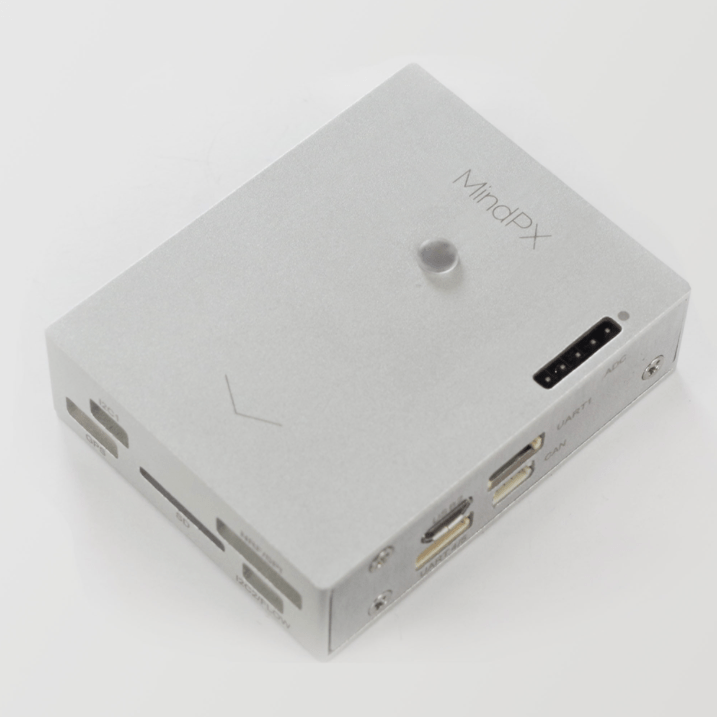
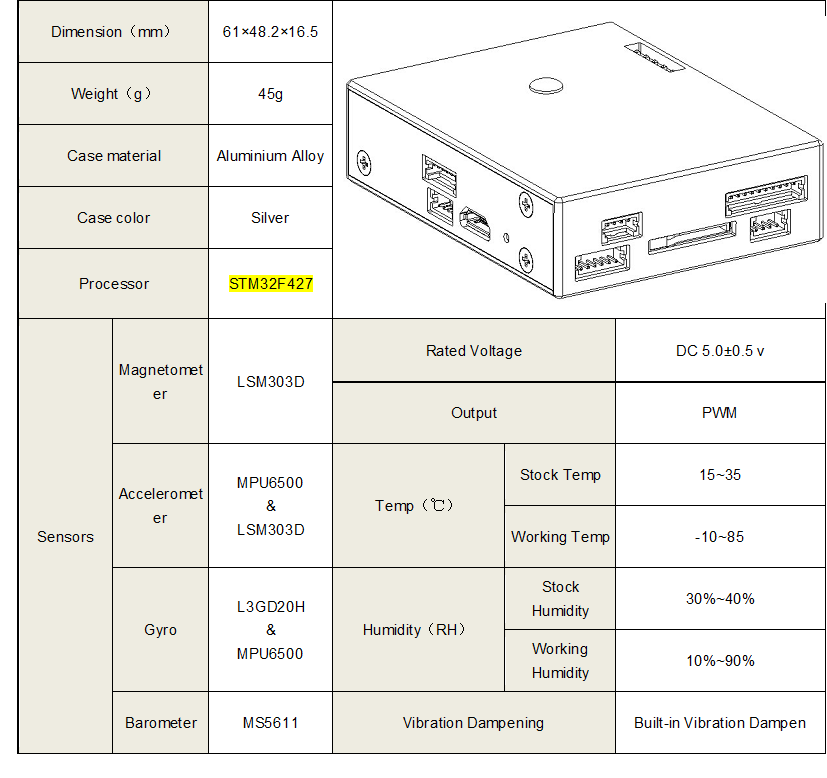
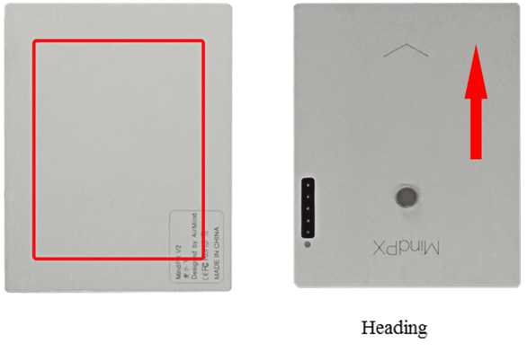
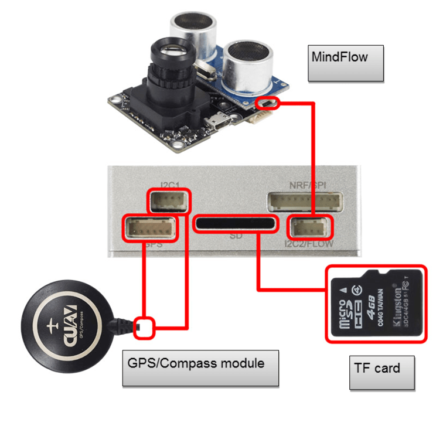
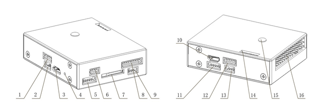

# MindPX Hardware

:::warning
PX4 does not manufacture this (or any) autopilot.
Contact the [manufacturer](http://mindpx.net) for hardware support or compliance issues.
:::

The AirMind<sup>&reg;</sup> [MindPX](http://mindpx.net) series is a new generation autopilot system branched from Pixhawk<sup>&reg;</sup>.



:::info
These flight controllers are [manufacturer supported](../flight_controller/autopilot_manufacturer_supported.md).
:::

## 总览

:::info
The main hardware documentation is [here](http://mindpx.net/assets/accessories/Specification9.18_3_pdf.pdf).
:::

MindPX is a new generation autopilot system branched from Pixhawk<sup>&reg;</sup>, been revised in schematic and structure, and been further enhanced with new features to make un-manned vehicle more smart and more friendly to use.

MindPX increases total PWM output channels to 16 (8 main outputs + 8 aux outputs).
This means that MindPX can support more complicated VTOL configurations and more fine control.
It is especially meaningful for those FMU-V4 based flight controllers as MindPX implements main and aux output in one single FMU.



- Main System-on-Chip: STM32F427

  - CPU: 32bits, 168 MHz ARM Cortex<sup>&reg;</sup> M4 with FPU
  - RAM: 256 KB SRAM
  - 2MB Flash
  - ST Micro LSM303D 14 bit accelerometer/magnetometer
  - MEAS MS5611 气压计
  - InvenSense<sup>&reg;</sup> MPU6500 integrated 6-axis sensors

- Highlighted features:
  - CNC processed aluminum alloy case, light and solid
  - Built-in isolated IMU redundancy
  - Total 16 PWM output channel (8 main + 8 aux)
  - 1 extra I2C port for flow connection.
  - 1 extra USB port for companion computer connection (built-in UART-to-USB converter)
  - Exposed debug port for development

## Quick Start

### Mounting



### 布线




### 针脚



| Num. |                       描述                      | Num. |                     描述                    |
| :------------------: | :-------------------------------------------: | :------------------: | :---------------------------------------: |
|           1          |                       电源                      |           9          |     I2C2 (MindFLow)    |
|           2          | Debug (refresh bootloader) |          10          | USB2 (Serial 2 to USB) |
|           3          |   USB1 (refresh firmware)  |          11          |                  UART4,5                  |
|           4          |                     Reset                     |          12          |    UART1 (Telemetry)   |
|           5          |         UART3 (GPS)        |          13          |                    CAN                    |
|           6          |   I2C1(external compass)   |          14          |                    ADC                    |
|           7          |                  TF card slot                 |          15          |               Tricolor Light              |
|           8          |   NRF/SPI(Remote Control)  |          16          |                   Looper                  |

### Radio Receiver

MindPX supports a wide variety of radio receivers (since V2.6) including: PPM/SBUS/DSM/DSM2/DSMX.
MindPX also support FrSky<sup>&reg;</sup> bi-direction telemetry D and S.Port.

For detailed Pin diagram, please refer to the [User Guide](http://mindpx.net/assets/accessories/UserGuide9.18_2_pdf.pdf).

### 编译固件

:::tip
Most users will not need to build this firmware!
It is pre-built and automatically installed by _QGroundControl_ when appropriate hardware is connected.
:::

To [build PX4](../dev_setup/building_px4.md) for this target:

```
make airmind_mindpx-v2_default
```

### Companion PC connection

MindPX has a USB-TO-UART Bridge IC on the board.
A micro-USB to USB type A cable is used for the connection.
Connect micro-USB end to the 'OBC' port of MindPX and USB type A end to companion computer.

And the max BAUD rate is the same with px4 family, which is up to 921600.

## User Guide

:::info
The user guide is [here](http://mindpx.net/assets/accessories/UserGuide9.18_2_pdf.pdf).
:::

## 购买渠道

MindRacer is available at [AirMind Store](http://drupal.xitronet.com/?q=catalog) on internet.
You can also find MindRacer at Amazon<sup>&reg;</sup> or eBay<sup>&reg;</sup>.

## 串口映射

| UART   | 设备         | Port          |
| ------ | ---------- | ------------- |
| USART1 | /dev/ttyS0 | RC            |
| USART2 | /dev/ttyS1 | TELEM1        |
| USART3 | /dev/ttyS2 | TELEM2        |
| UART4  | /dev/ttyS3 | GPS1          |
| USART6 | /dev/ttyS4 | ?             |
| UART7  | /dev/ttyS5 | Debug Console |
| UART8  | /dev/ttyS6 | ?             |

<!-- Note: Got ports using https://github.com/PX4/PX4-user_guide/pull/672#issuecomment-598198434 -->

## 技术支持

Please visit http://www.mindpx.org for more information.
Or you can send email to [support@mindpx.net](mailto:support@mindpx.net) for any inquiries or help.
