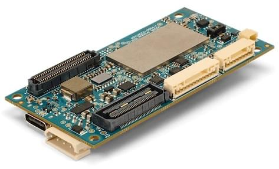
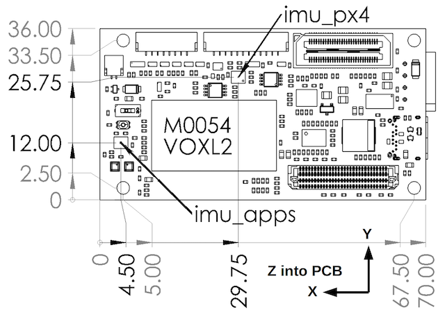
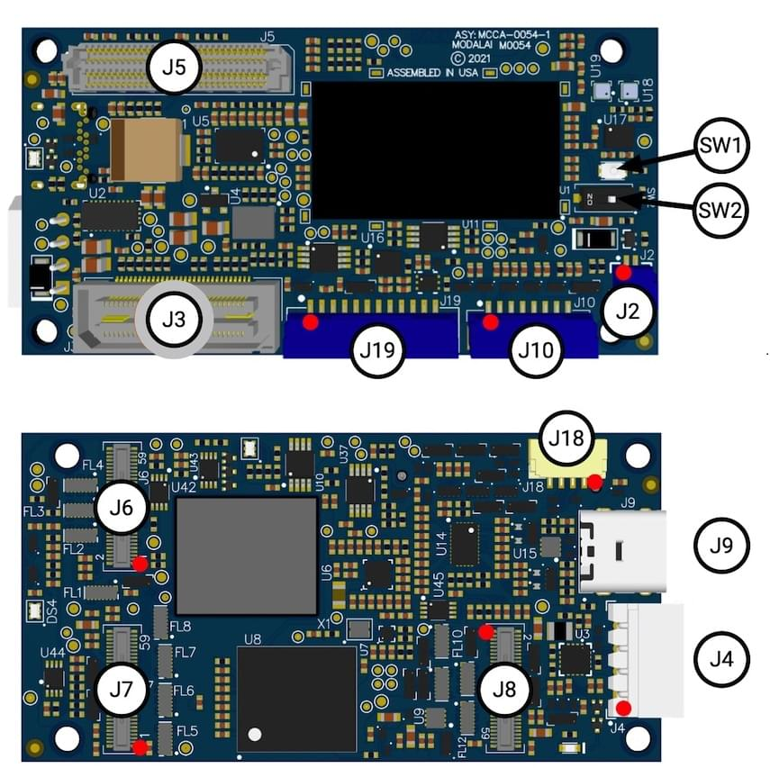

# ModalAI VOXL 2

:::warning
PX4 does not manufacture this (or any) autopilot.
Contact the [manufacturer](https://forum.modalai.com/) for hardware support or compliance issues.
:::

The ModalAI [VOXL 2](https://modalai.com/voxl-2) ([Datasheet](https://docs.modalai.com/voxl2-datasheets/)) is ModalAI’s next-gen autonomous computing platform built around the Qualcomm QRB5165 processor. VOXL 2 boasts 8 cores, integrated PX4, seven camera concurrency, advanced onboard AI up to 15+ TOPS, and 5G connectivity. At 16 grams, VOXL 2 is the future of fully autonomous and connected drones!

:::info
This flight controller is [manufacturer supported](../flight_controller/autopilot_manufacturer_supported.md).
:::

## 产品规格

### 系统

| 特性                                                                                                      | VOXL 2                                                                                                              |
| ------------------------------------------------------------------------------------------------------- | ------------------------------------------------------------------------------------------------------------------- |
| CPU                                                                                                     | QRB5165  8 cores up to 3.091GHz  8GB LPDDR5 128GB Flash                                    |
| OS                                                                                                      | Ubuntu 18.04 - Linux Kernel v4.19                                                   |
| GPU                                                                                                     | Adreno 650 GPU – 1024 ALU                                                                                           |
| NPU                                                                                                     | 15 TOPS                                                                                                             |
| Flight Controller Embedded                                                                              | Yes (Sensors DSP, PX4)                                                                           |
| Built in WiFi                                                                                           | No                                                                                                                  |
| Add-on Connectivity                                                                                     | WiFi, 5G, 4G/LTE, Microhard                                                                                         |
| Video Encoding                                                                                          | 8K30 h.264/h.265 108MP still images                                                 |
| Computer Vision Sensors                                                                                 | QTY 6 4-lane CSI, QTY4 CCI (e.g. 2 stereo pair, hires, tracking) |
| Tracking Sensor                                                                                         | Yes                                                                                                                 |
| 尺寸                                                                                                      | 70mm x 36mm                                                                                                         |
| 重量                                                                                                      | 16g                                                                                                                 |
| VOXL SDK: GPS-denied nav., SLAM, obstacle avoidance, object recognition | Yes                                                                                                                 |
| ROS                                                                                                     | ROS 1 & 2                                                                                       |
| QGroundControl                                                                                          | Yes                                                                                                                 |
| ATAK                                                                                                    | Yes                                                                                                                 |
| NDAA ’20 Section 848 Compliant                                                                          | Yes, Assembled in USA                                                                                               |
| PMD TOF                                                                                                 | Yes (SDK 1.0 and newer)                                                          |
| FLIR Boson                                                                                              | USB                                                                                                                 |
| FLIR Lepton                                                                                             | USB, SPI                                                                                                            |

:::info
More detailed hardware documentation can be found [here](https://docs.modalai.com/voxl-flight-datasheet/).
:::

## 尺寸

### 2D Dimensions

### 3D Dimensions

[3D STEP File](https://storage.googleapis.com/modalai_public/modal_drawings/M0054_VOXL2_PVT_SIP_REVA.step)

## PX4 Firmware Compatibility

### voxl-dev branch

ModalAI is actively maintaining a [branched PX4 version](https://github.com/modalai/px4-firmware/tree/voxl-dev) that can be used.

As VOXL 2 runs Ubuntu, the production releases of PX4 for VOXL 2 are distributed through [apt package management](https://docs.modalai.com/configure-pkg-manager/) and the [VOXL SDK](https://docs.modalai.com/voxl-sdk/).

More information about the firmware can be found [here](https://docs.modalai.com/voxl2-px4-developer-guide/).

### main branch

PX4 mainline supports VOXL 2 (board documentation [here](https://github.com/PX4/PX4-Autopilot/tree/main/boards/modalai/voxl2)).

## QGroundControl支持

This board supported in QGroundControl 4.0 and later.

## 访问链接

- [PX4 Autonomy Developer Kit](https://www.modalai.com/products/px4-autonomy-developer-kit)
- [Starling 2](https://www.modalai.com/products/starling-2)
- [Starling 2 MAX](https://www.modalai.com/products/starling-2-max)
- [Sentinel Development Drone powered by VOXL 2](https://www.modalai.com/pages/sentinel)
  - [Demo Video](https://www.youtube.com/watch?v=hMhQgWPLGXo)
- [VOXL 2 Flight Deck, ready to mount, tune and fly](https://www.modalai.com/collections/ready-to-mount/products/voxl-2-flight-deck)
- [VOXL 2 Development Kits](https://www.modalai.com/products/voxl-2)
  - [Demo Video](https://www.youtube.com/watch?v=aVHBWbwp488)

## Quick Start

Quickstarts from the vendor are located [here](https://docs.modalai.com/voxl2-quickstarts/).

### VOXL SDK

VOXL SDK (Software Development Kit) consists of the open source [voxl-px4](https://docs.modalai.com/voxl-px4/), [core libraries](https://docs.modalai.com/core-libs/), [services](https://docs.modalai.com/mpa-services/), [tools](https://docs.modalai.com/inspect-tools/), [utilities](https://docs.modalai.com/sdk-utilities/), and [build environments](https://docs.modalai.com/build-environments/) that ModalAI provide to accelerate the use and development of VOXL compute boards and accessories.

VOXL SDK runs on VOXL, VOXL 2 and RB5 Flight!

The source code for projects within VOXL SDK can be found at https://gitlab.com/voxl-public, alongside build instructions.

### 连接器

Detailed information about the pinouts can be found [here](https://docs.modalai.com/voxl2-connectors/) along with a [video overview here](https://www.youtube.com/watch?v=xmqI3msjqdo)

All single ended signals on B2B connectors J3, J5, J6, J7, and J8 are 1.8V CMOS unless explicitly noted.
All single ended signals on cable-to-board connectors J10, J18, & J19 are 3.3V CMOS unless explicitly noted.

| Connector | 描述                                               | MPN (Board Side)                         | Mating MPN (Board/Cable Side) | 类型                           | Signal Feature Summary                                                                                                                                                                                                                                                                                                              |
| --------- | ------------------------------------------------ | ----------------------------------------------------------- | ------------------------------------------------ | ---------------------------- | ----------------------------------------------------------------------------------------------------------------------------------------------------------------------------------------------------------------------------------------------------------------------------------------------------------------------------------- |
| J2        | Fan                                              | SM02B-SRSS-TB(LF)(SN) | SHR-02V-S                                        | Cable Header, 2-pin R/A      | 5V DC for FAN + PWM Controlled FAN-Return (GND)                                                                                                                                                                                                                                                                  |
| J3        | Legacy B2B                                       | QSH-030-01-L-D-K-TR                                         | QTH-030-01-L-D-A-K-TR                            | B2B Receptacle, 60-pin       | 5V/3.8V/3.3V/1.8V power for plug-in boards, JTAG and Debug Signals, QUP expansion, GPIOs, USB3.1 Gen 2 (USB1)                                                                                                                                    |
| J4        | Prime Power In                                   | 22057045                                                    | 0050375043                                       | Cable Connector, 4-pin R/A   | +5V main DC power in + GND, I2C@5V for power monitors                                                                                                                                                                                                                                                                  |
| J5        | High Speed B2B                                   | ADF6-30-03.5-L-4-2-A-TR                     | ADM6-30-01.5-L-4-2-A-TR          | B2B Socket, 120-pin          | More 3.8V/3.3V/1.8V power for plug-in boards, 5V power in for “SOM Mode”, QUP expansion, GPIOS (including I2S), SDCC (SD Card V3.0), UFS1 (secondary UFS Flash), 2L PCIe Gen 3, AMUX and SPMI PMIC signals |
| J6        | Camera Group 0                                   | DF40C-60DP-0.4V(51)      | DF40C-60DS-0.4V                  | B2B Plug, 60-pin             | Qty-2 4L MIPI CSI ports, CCI and camera control signals, 8 power rails (from 1.05V up to 5V) for cameras and other sensors, dedicated SPI (QUP) port                                                                                                                          |
| J7        | Camera Group 1                                   | DF40C-60DP-0.4V(51)      | DF40C-60DS-0.4V                  | B2B Plug, 60-pin             | Qty-2 4L MIPI CSI ports, CCI and camera control signals, 8 power rails (from 1.05V up to 5V) for cameras and other sensors, dedicated SPI (QUP) port                                                                                                                          |
| J8        | Camera Group 2                                   | DF40C-60DP-0.4V(51)      | DF40C-60DS-0.4V                  | B2B Plug, 60-pin             | Qty-2 4L MIPI CSI ports, CCI and camera control signals, 8 power rails (from 1.05V up to 5V) for cameras and other sensors, dedicated SPI (QUP) port                                                                                                                          |
| J9        | USB-C (ADB)                   | UJ31-CH-3-SMT-TR                                            | USB Type-C                                       | Cable Receptacle, 24-pin R/A | ADB USB-C with re-driver and display port alternate mode (USB0)                                                                                                                                                                                                                                                  |
| J10       | SPI Expansion                                    | SM08B-GHS-TB(LF)(SN)  | GHR-08V-S                                        | Cable Header, 8-pin R/A      | SPI@3.3V with 2 CS_N pins, 32kHz CLK_OUT@3.3V                                                                                                                                                                                   |
| J18       | ESC (SLPI Access)             | SM04B-GHS-TB(LF)(SN)  | GHR-04V-S                                        | Cable Header, 4-pin R/A      | ESC UART@3.3V, 3.3V reference voltage                                                                                                                                                                                                                                                  |
| J19       | GNSS/MAG/RC/I2C (SLPI Access) | SM12B-GHS-TB(LF)(SN)  | GHR-12V-S                                        | Cable Header, 6-pin R/A      | GNSS UART@3.3V, Magnetometer I2C@3.3V, 5V, RC UART, Spare I2C                                                                                                                                                                                                             |

### User Guide

The PX4 user guide for VOXL 2 is available [here](https://docs.modalai.com/voxl-px4/).

### Developer Guide

The PX4 developer guide for VOXL 2 is available [here](https://docs.modalai.com/voxl-px4-developer-guide/).

### How to Build

See the [VOXL PX4 Build Guide](https://docs.modalai.com/voxl2-px4-build-guide/) on how to build.

## 技术支持

Please visit the [ModalAI Forum](https://forum.modalai.com/category/26/voxl-2) for more information.
