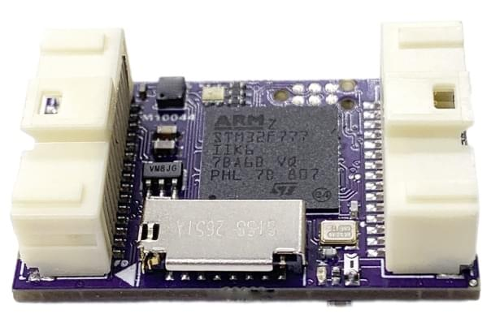
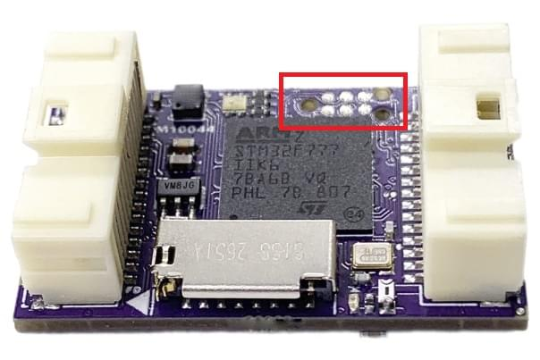
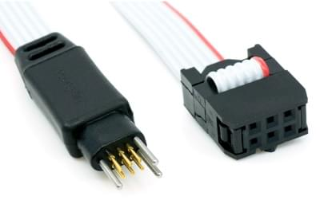
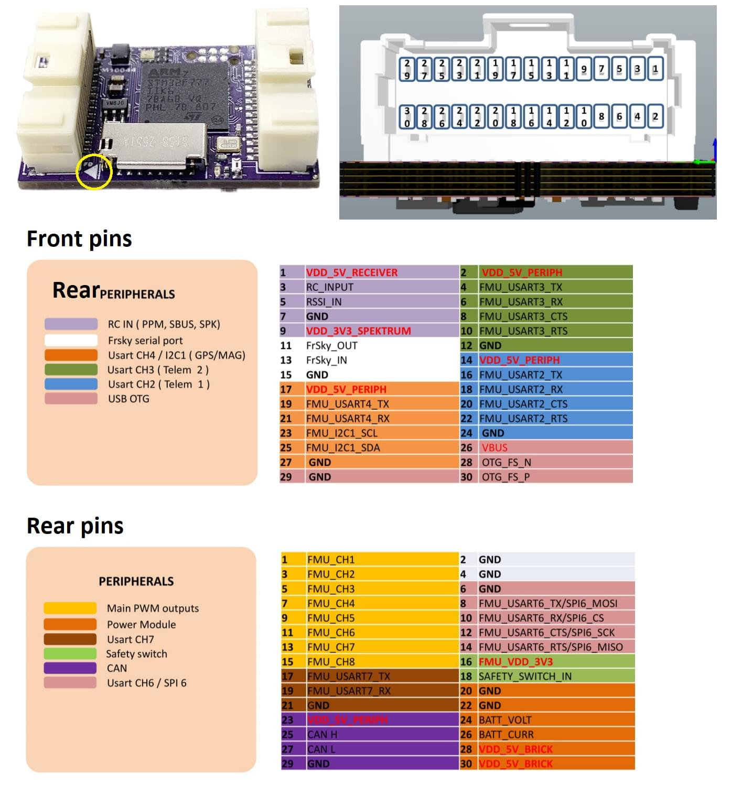

# mRo Control Zero F7 Flight Controller

:::warning
PX4 does not manufacture this (or any) autopilot.
Contact the [manufacturer](https://store.mrobotics.io/) for hardware support or compliance issues.
:::

The _mRo Control Zero F7<sup>&reg;</sup>_ is a new flight controller from mRo.



It is a no-compromise triple IMU commercial grade flight controller.
It includes 8x PWM outputs (DShot capable), 3x IMUs, 1x Magnetometer, 1x Barometric Pressure Sensor (Altimeter), 6x UART, and SD Card, all packed into a 32mm x 20mm PCB.
The PWMs are bidirectional, EMI protected, and level shifted to 5V logic levels.
All accessed using front and rear 30pin Molex PicoClasp connectors.
A durable plastic case, conformal board coating, and optional temperature calibration included.

:::info
This flight controller is [manufacturer supported](../flight_controller/autopilot_manufacturer_supported.md).
:::

## 主要特性

- 微处理器：

  - 32-bit STM32F777 Cortex<sup>&reg;</sup> M4 core with FPU rev. 3
  - 216 MHz/512 KB RAM/2 MB Flash
  - F-RAM Cypress MF25V02-G 256-Kbit nonvolatile memory (Flash memory that performs as fast as RAM)

- 传感器：

  - [Bosch BMI088](https://www.bosch-sensortec.com/bst/products/all_products/bmi088_1) 3-axis accelerometer/gyroscope (internally vibration dampened)
  - [Invensense ICM-20602](https://www.invensense.com/products/motion-tracking/6-axis/icm-20602/) 3-axis accelerometer/gyroscope
  - [Invensense ICM-20948](https://www.invensense.com/products/motion-tracking/9-axis/icm-20948/) 3-axis accelerometer/gyroscope/magnetometer
  - [Infineon DPS310 barometer](https://www.infineon.com/cms/en/product/sensor/pressure-sensors/pressure-sensors-for-iot/dps310/) (So smooth and NO more light sensitivity)

- 接口：

  - 6x UART (serial ports total), 3x with HW flow control, 1x FRSky Telemetry (D or X types), 1x Console and 1x GPS+I2C
  - 8x PWM outputs (all DShot capable)
  - 1x CAN
  - 1x I2C
  - 1x SPI
  - Spektrum DSM / DSM2 / DSM-X® Satellite compatible input and binding
  - Futaba S.BUS® & S.BUS2® compatible input
  - FRSky Telemetry port output
  - Graupner SUMD
  - Yuneec ST24
  - PPM sum input signal
  - 1x JTAG (TC2030 Connector)
  - 1x RSSI (PWM or voltage) input
  - Tricolor LED

- Weight and Dimensions (Uncased):

  - Weight: 5.3g (0.19oz)
  - Width: 20mm (0.79")
  - Length: 32mm (1.26")

- 电源系统
  - 3x Ultra low noise LDO voltage regulator

## 购买渠道

- [mRo Control Zero](https://store.mrobotics.io/mRo-Control-Zero-F7-p/mro-ctrl-zero-f7.htm)

## 编译固件

:::tip
Most users will not need to build this firmware!
It is pre-built and automatically installed by _QGroundControl_ when appropriate hardware is connected.
:::

To [build PX4](../dev_setup/building_px4.md) for this target:

```
make mro_ctrl-zero-f7
```

## Debug Ports

### Console Port

The [PX4 System Console](../debug/system_console.md) runs on `USART7` using the pins listed below.
This is a standard serial pinout, designed to connect to a [3.3V FTDI](https://www.digikey.com/en/products/detail/TTL-232R-3V3/768-1015-ND/1836393) cable (5V tolerant).

| mRo control zero f7 |             | FTDI |                                  |
| ------------------- | ----------- | ---- | -------------------------------- |
| 17                  | USART7 Tx   | 5    | FTDI RX （黄色）                     |
| 19                  | USART7 Rx   | 4    | FTDI TX （橙色）                     |
| 6                   | USART21 GND | 1    | FTDI GND (黑色) |

### SWD Port

The [SWD port](../debug/swd_debug.md) (JTAG) for FMU debugging is a TC2030 debug connector, as shown below.



You can use the [Tag Connect](https://www.tag-connect.com/) cable [TC2030 IDC NL](https://www.tag-connect.com/product/tc2030-idc-nl) below (with associated [retaining clip](https://www.tag-connect.com/product/tc2030-clip-retaining-clip-board-for-tc2030-nl-cables)) to attach to either a BlackMagic probe or a ST-LINK V2 debugger.



There is also an [ARM20-CTX 20-Pin to TC2030-IDC adapter](https://www.tag-connect.com/product/arm20-ctx-20-pin-to-tc2030-idc-adapter-for-cortex) that can be used with other debug probes.

## 针脚定义



## 串口映射

| UART   | 设备         | Port                                                                                               |
| ------ | ---------- | -------------------------------------------------------------------------------------------------- |
| USART2 | /dev/ttyS0 | TELEM1 (flow control)                                                           |
| USART3 | /dev/ttyS1 | TELEM2 (flow control)                                                           |
| UART4  | /dev/ttyS2 | GPS1                                                                                               |
| USART6 | /dev/ttyS3 | Flex port (can be configured as SPI or UART with Flow Control). |
| UART7  | /dev/ttyS4 | CONSOLE                                                                                            |
| UART8  | /dev/ttyS5 | Free serial port (typically for FrSky telemetry)                                |

<!-- Note: Got ports using https://github.com/PX4/PX4-user_guide/pull/672#issuecomment-598198434 -->

<!-- https://github.com/PX4/PX4-Autopilot/blob/main/boards/mro/ctrl-zero-f7/nuttx-config/nsh/defconfig#L202-L207 -->

## 更多信息

- [Introducing the new mRo Control Zero Autopilot](https://mrobotics.io/introducing-the-new-mro-control-zero-autopilot/) (blog)
- [Quick Start Guide](https://mrobotics.io/mrocontrolzero/)
