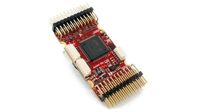
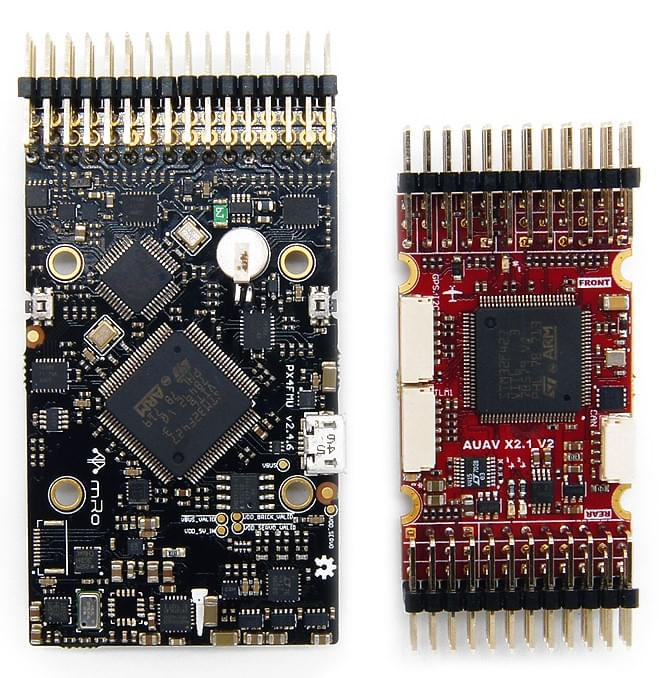
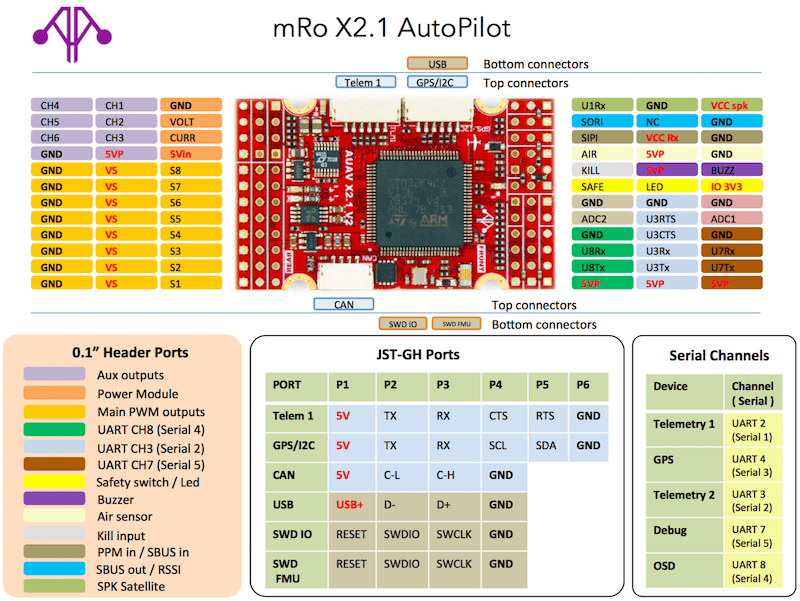

# mRo-X2.1 Autopilot

:::warning
PX4 does not manufacture this (or any) autopilot.
Contact the [manufacturer](https://store.mrobotics.io/) for hardware support or compliance issues.
:::

The [mRo-X2.1 autopilot](http://www.mRobotics.io/) is based on the [Pixhawk<sup>&reg;</sup>-project](https://pixhawk.org/) **FMUv2** open hardware design.
It runs PX4 on the [NuttX](https://nuttx.apache.org/) OS.



:::info
This flight controller is [manufacturer supported](../flight_controller/autopilot_manufacturer_supported.md).
:::

## 总览

- Main System-on-Chip: [STM32F427](http://www.st.com/web/en/catalog/mmc/FM141/SC1169/SS1577/LN1789)
  - CPU: STM32F427VIT6 ARM<sup>&reg;</sup> microcontroller - Revision 3
  - IO: STM32F100C8T6 ARM<sup>&reg;</sup> microcontroller
- 传感器：
  - Invensense<sup>&reg;</sup> MPU9250 9DOF
  - Invensense ICM-20602 6DOF
  - MEAS MS5611 气压计
- 尺寸/重量
  - Size: 36mm x 50mm
    (Can be ordered with vertical, horizontal or no headers installed)
  - 安装点：30.5mm x 30.5mm 直径 3.2mm
  - 重量: 10.9g

The diagram below provides a side-by-side comparison with a Pixhawk 1. The mRo features almost identical hardware and connectivity but
has a much smaller footprint. Major differences are updated sensors and Rev 3 FMU.



## 连接

- 2.54 毫米头：
- GPS (UART4) with I2C
- CAN Bus
- 遥控输入
- PPM 输入
- Spektrum 输入
- RSSI 输入
- sBus 输入
- sBus 输出
- 电源输入
- 蜂鸣器输出
- LED 输出
- 8路伺服输出
- 6路辅助输出
- Offboard microUSB connector
- Kill Pin output _(Currently not supported by firmware)_
- AirSpeed Sensor
- USART2 (Telem 1)
- USART3 (Telem 2)
- UART7 (Console)
- UART8 (OSD)

## PX4 BootLoader Issue

By default a mRo X2.1 might come preconfigured for ArduPilot<sup>&reg;</sup> rather than PX4. This
can be seen during firmware update when the board is recognized as FMUv2 instead of X2.1.

In this case you must update the BootLoader using [BL_Update_X21.zip](https://github.com/PX4/PX4-user_guide/raw/main/assets/hardware/BL_Update_X21.zip).
If this correction is not carried out your compass direction will be wrong and the
secondary IMU will not be detected.

The update steps are:

1. Download and extract [BL_Update_X21.zip](https://github.com/PX4/PX4-user_guide/raw/main/assets/hardware/BL_Update_X21.zip).
2. Find the folder _BL_Update_X21_. This contains a **bin** file and a subfolder named **/etc** containing an **rc.txt** file
3. Copy these files to your micro SD card's root directory and insert it into the mRO x2.1
4. Power on the mRO x2.1 Wait for it to boot and then reboot 1 time.

## 访问链接

This product can be ordered at the [mRobotics<sup>&reg;</sup> Store](https://store.mrobotics.io/mRo-X2-1-Rev-2-p/m10021a.htm).

## 接线指南



## 编译固件

:::tip
Most users will not need to build this firmware!
It is pre-built and automatically installed by _QGroundControl_ when appropriate hardware is connected.
:::

To [build PX4](../dev_setup/building_px4.md) for this target:

```
make mro_x21_default
```

## 原理图

The board is documented on the mRo hardware repo: [x21_V2_schematic.pdf](https://github.com/mRoboticsIO/Hardware/blob/master/X2.1/Docs/x21_V2_schematic.pdf).

## 串口映射

| UART   | 设备         | Port            |
| ------ | ---------- | --------------- |
| USART1 | /dev/ttyS0 | IO debug        |
| USART2 | /dev/ttyS1 | SERIAL1         |
| USART3 | /dev/ttyS2 | TELEM2          |
| UART4  | /dev/ttyS3 | GPS/I2C         |
| USART6 | /dev/ttyS4 | PX4IO           |
| UART7  | /dev/ttyS5 | SERIAL5 CONSOLE |
| UART8  | /dev/ttyS6 | SERIAL4         |

<!-- Note: Got ports using https://github.com/PX4/PX4-user_guide/pull/672#issuecomment-598198434 -->
