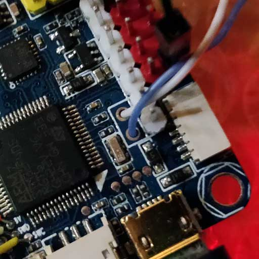
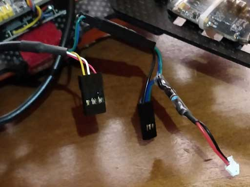

# Omnibus F4 SD

:::warning
This flight controller has been [discontinued](../flight_controller/autopilot_experimental.md) and is no longer commercially available.
:::

:::warning
PX4 does not manufacture this (or any) autopilot.
Contact the manufacturer for support or compliance issues.
:::

The _Omnibus F4 SD_ is a controller board designed for racers.
In contrast to a typical racer board it has some additional features, such as an SD card and a faster CPU.


These are the main differences compared to a [Pixracer](../flight_controller/pixracer.md):

- Lower price
- Fewer IO ports (though it's still possible to attach a GPS or a Flow sensor for example)
- Requires external pull up resistor on the I2C bus for external GPS, see [I2C](#i2c) below.
- Less RAM (192 KB vs. 256 KB) and FLASH (1 MB vs. 2 MB)
- Same board dimensions as a _Pixracer_, but slightly smaller form factor (because it has less connectors)
- Integrated OSD (not yet implemented in software)

:::tip
All the usual PX4 features can still be used for your racer!
:::

:::info
This flight controller is [manufacturer supported](../flight_controller/autopilot_manufacturer_supported.md).
:::

## 主要特性

- Main System-on-Chip: [STM32F405RGT6](https://www.st.com/en/microcontrollers/stm32f405rg.html)
  - CPU: 168 MHz ARM Cortex M4 with single-precision FPU
  - RAM: 192 KB SRAM
  - FLASH: 1 MB
- Standard racer form factor: 36x36 mm with standard 30.5 mm hole pattern
- MPU6000 Accel / Gyro
- BMP280 Baro (not all boards have it mounted)
- microSD (for logging)
- Futaba S.BUS and S.BUS2 / Spektrum DSM2 and DSMX / Graupner SUMD / PPM input / Yuneec ST24
- OneShot PWM out (configurable)
- Built-in current sensor
- Built-in OSD chip (AB7456 via SPI)

## 购买渠道

The board is produced by different vendors, with some variations (e.g. with or without a barometer).

:::tip
PX4 is compatible with boards that support the Betaflight OMNIBUSF4SD target (if _OMNIBUSF4SD_ is present on the product page the board should work with PX4).
:::

:::tip
Any Omnibus F4 labeled derivative (e.g. clone) should work as well. However, power distribution on these boards is of varying quality.
:::

These are the boards tested and known to work:

- [Hobbywing XRotor Flight Controller F4](https://www.hobbywing.com/en/products/info.html?id=164)

  ::: info
  This board fits on top of the [Hobbywing XRotor Micro 40A 4in1 ESC](https://www.hobbywing.com/en/products/info.html?id=116) without soldering. This ESC board also provides power for the Omnibus board.

:::

  Purchase from:

  - [Hobbywing XRotor F4 Flight Controller w/OSD](https://www.getfpv.com/hobbywing-xrotor-f4-flight-controller-w-osd.html) (getfpv)

- Original Airbot Omnibus F4 SD

  Purchase from:

  - [Airbot (CN manufacturer)](https://store.myairbot.com/omnibusf4prov3.html)
  - [Ready To Fly Quads (US reseller)](https://quadsrtf.com/product/flip-32-f4-omnibus-rev-2/)

Accessories include:

- [ESP8266 WiFi Module](../telemetry/esp8266_wifi_module.md) for MAVLink telemetry.
  You need to connect these pins: GND, RX, TX, VCC and CH-PD (CH-PD to 3.3V). The baud rate is 921600.

## 连接器

Boards from different vendors (based on this design) can have significantly different layout.
Layouts/Silkscreens for various versions are shown below.

### Airbot Omnibus F4 SD

Below are silkscreens for the Airbot Omnibus F4 SD (V1), showing both top and bottom.


### Hobbywing XRotor Flight Controller F4

Below are silkscreens for the Hobbywing XRotor Flight Controller F4.


## 针脚定义

### 遥控器

RC is connected to one of the following ports:

- UART1
- SBUS/PPM port (via inverter, internally goes to UART1)

:::info
Some Omnibus F4 boards have a jumper connecting either or both the MCU SBUS and PPM to a single pin header. Set your jumper or solder bridge to the appropriate MCU pin before use.
:::

### UARTs

- UART6: GPS port

  - TX: MCU pin PC6

  - RX: MCU pin PC7

  - Airbot Omnibus F4 SD Pinout is on Port J10 (TX6/RX6):

  

- UART4

  - TX: MCU pin PA0
  - RX: MCU pin PA1
  - 57600 波特率
  - This can be configured as the `TELEM 2` port.
  - Airbot Omnibus F4 SD Pinout:
    - TX: RSSI pin
    - RX: PWM out 5

  

  

### I2C

There is one I2C port available via:

- SCL: MCU pin PB10 (might be labeled as TX3)
- SDA: MCU pin PB11 (might be labeled as RX3)

:::info
You will need external pullups on both signals (clock and data).
You can use 2.2k pullups for example to attach an external mag.
:::

- Airbot Omnibus F4 SD Pinout is on Port J10 (SCL [clock] / SCA [data]): 

Here is an example implementation. I used a Spektrum plug to get 3.3v from the DSM port, connecting only 3.3v + to each line via 2.2k resistor.




## 串口映射

| UART   | 设备         | Port     |
| ------ | ---------- | -------- |
| USART1 | /dev/ttyS0 | SerialRX |
| USART4 | /dev/ttyS1 | TELEM1   |
| USART6 | /dev/ttyS2 | GPS      |

<!-- Note: Got ports using https://github.com/PX4/PX4-user_guide/pull/672#issuecomment-598198434 -->

## RC Telemetry

The Omnibus supports telemetry to the RC Transmitter using [FrSky Telemetry](../peripherals/frsky_telemetry.md) or [CRSF Crossfire Telemetry](#crsf_telemetry).

<a id="crsf_telemetry"></a>

### CRSF Crossfire Telemetry

[TBS CRSF Telemetry](../telemetry/crsf_telemetry.md) may be used to send telemetry data from the flight controller (the vehicle's attitude, battery, flight mode and GPS data) to an RC transmitter such as a Taranis.

Benefits over [FrSky telemetry](../peripherals/frsky_telemetry.md) include:

- Only a single UART is needed for RC and telemetry.
- The CRSF protocol is optimized for low latency.
- 150 Hz RC update rate.
- The signals are uninverted and thus no (external) inverter logic is required.

:::info
If you use CRSF Telemetry you will need to build custom PX4 firmware.
By contrast, FrSky telemetry can use prebuilt firmware.
:::

For Omnibus we recommend the [TBS Crossfire Nano RX](http://team-blacksheep.com/products/prod:crossfire_nano_rx), since it is specifically designed for small Quads.

On the handheld controller (e.g. Taranis) you will also need a [Transmitter Module](http://team-blacksheep.com/shop/cat:rc_transmitters#product_listing).
This can be plugged into the back of the RC controller.

:::info
The referenced links above contains the documentation for the TX/RX modules.
:::

#### 设置

Connect the Nano RX and Omnibus pins as shown:

| Omnibus UART1 | Nano RX |
| ------------- | ------- |
| TX            | Ch2     |
| RX            | Ch1     |

Next update the TX/RX modules to use the CRSF protocol and set up telemetry.
Instructions for this are provided in the [TBS Crossfire Manual](https://www.team-blacksheep.com/tbs-crossfire-manual.pdf) (search for 'Setting up radio for CRSF').

#### PX4 CRSF Configuration

You will need to build custom firmware to use CRSF.
For more information see [CRSF Telemetry](../telemetry/crsf_telemetry.md#px4-configuration).

## 原理图

The schematics are provided by [Airbot](https://myairbot.com/): [OmnibusF4-Pro-Sch.pdf](http://bit.ly/obf4pro).

<a id="bootloader"></a>

## PX4 Bootloader Update

The board comes pre-installed with [Betaflight](https://github.com/betaflight/betaflight/wiki).
Before PX4 firmware can be installed, the _PX4 bootloader_ must be flashed.
Download the [omnibusf4sd_bl.hex](https://github.com/PX4/PX4-user_guide/raw/main/assets/flight_controller/omnibus_f4_sd/omnibusf4sd_bl_d52b70cb39.hex) bootloader binary and read [this page](../advanced_config/bootloader_update_from_betaflight.md) for flashing instructions.

## 编译固件

To [build PX4](../dev_setup/building_px4.md) for this target:

```
make omnibus_f4sd_default
```

## Installing PX4 Firmware

You can use either pre-built firmware or your own custom firmware.

:::warning
If you use [CRSF Telemetry](../telemetry/crsf_telemetry.md#px4-configuration) in your radio system, as describe above, then you must use custom firmware.
:::

The firmware can be installed in any of the normal ways:

- Build and upload the source

  ```
  make omnibus_f4sd_default upload
  ```

- [Load the firmware](../config/firmware.md) using _QGroundControl_.

## 配置

In addition to the [basic configuration](../config/index.md), the following parameters are important:

| 参数                                                                                                               | 设置                                                                                                                                                      |
| ---------------------------------------------------------------------------------------------------------------- | ------------------------------------------------------------------------------------------------------------------------------------------------------- |
| [SYS_HAS_MAG](../advanced_config/parameter_reference.md#SYS_HAS_MAG)   | This should be disabled since the board does not have an internal mag. You can enable it if you attach an external mag. |
| [SYS_HAS_BARO](../advanced_config/parameter_reference.md#SYS_HAS_BARO) | Disable this if your board does not have a barometer.                                                                                   |

## Further Info

[This page](https://blog.dronetrest.com/omnibus-f4-flight-controller-guide/) provides a good overview with pinouts and setup instructions.
