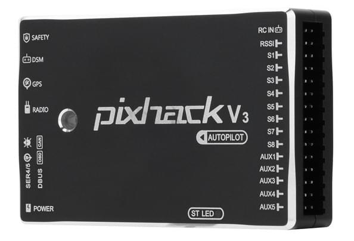

# Pixhack v3

:::warning
PX4 does not manufacture this (or any) autopilot.
Contact the [manufacturer](https://store.cuav.net/) for hardware support or compliance issues.
:::

The CUAV _Pixhack V3_ flight controller board is a flexible autopilot intended primarily for manufacturers of commercial systems.

The board is a variant of the SOLO Pixhawk<sup>&reg;</sup> 2 (PH2) flight controller, which is in turn based on the [Pixhawk-project](https://pixhawk.org/) **FMUv3** open hardware design.
It runs PX4 on the [NuttX](https://nuttx.apache.org/) OS, and is fully compatible with both PX4 or ArduPilot<sup>&reg;</sup> (APM) firmware.

_Pixhack V3_ has significant improvements with respect to the original design, including better interface layout and the addition of vibration damping and a thermostat system.



:::info
This flight controller is [manufacturer supported](../flight_controller/autopilot_manufacturer_supported.md).
:::

## 总览

- 微处理器：
  - STM32F427
  - STM32F100 (故障保护协处理器)
- 传感器：
  - 加速度计 (3): LSM303D,MPU6000,MPU6000
  - 陀螺仪 (3): L3GD20, MPU6000, MPU9250
  - 指南针 (2): LS303D, MPU9250
  - 气压计 (2): MS5611\*2
- 接口：
  - MAVLink UART (2)
  - GPS UART (2)
  - DEBUG UART (1)
  - 遥控信号输入(支持PPM, SBUS, DSM/DSM2)
  - RSSI输入: PWM或3.3ADC
  - I2C总线 (2)
  - CAN总线 (1)
  - ADC输入: 3.3V X1 , 6.6V X1
  - PWM输出: 8 PWM IO + 4 IO
- 电源系统
  - Power口输入电压: 4.5 ~ 5.5 V
  - USB口输入电压：5.0 V +- 0.25v
- 重量和尺寸:
  - 重量: 63g
  - 宽度：68mm
  - 厚度: 17mm
  - 长度：44mm
- 其它特性:
  - 工作温度: -20 ~ 60°C

## 访问链接

The board can be purchased from:

- [store.cuav.net](http://store.cuav.net/index.php?id_product=8&id_product_attribute=0&rewrite=pixhack-v3-autopilot&controller=product&id_lang=3)
- [leixun.aliexpress.com/store](https://leixun.aliexpress.com/store)

## 编译固件

:::tip
Most users will not need to build this firmware!
It is pre-built and automatically installed by _QGroundControl_ when appropriate hardware is connected.
:::

To [build PX4](../dev_setup/building_px4.md) for this target:

```
make px4_fmu-v3_default
```

## 引脚和原理图

- [Documentation/wiring guides](http://doc.cuav.net/flight-controller/pixhack/en/pixhack-v3.html)

## 串口映射

| UART   | 设备         | Port                                     |
| ------ | ---------- | ---------------------------------------- |
| UART1  | /dev/ttyS0 | IO debug                                 |
| USART2 | /dev/ttyS1 | TELEM1 (flow control) |
| USART3 | /dev/ttyS2 | TELEM2 (flow control) |
| UART4  |            |                                          |
| UART7  | CONSOLE    |                                          |
| UART8  | SERIAL4    |                                          |
