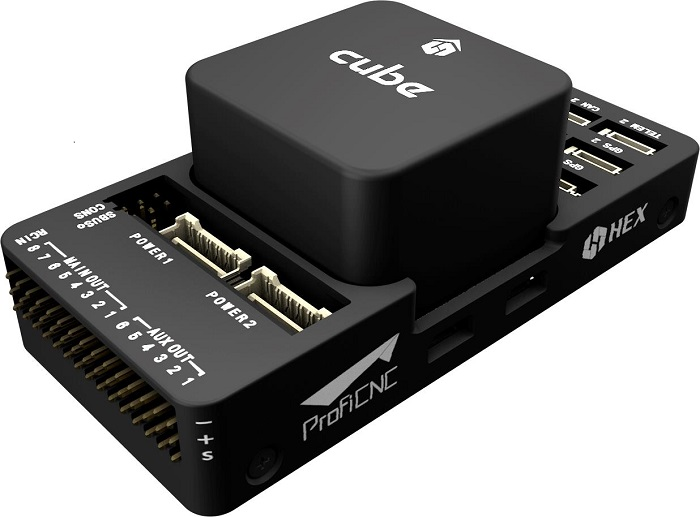

# Hex Cube Black Flight Controller

:::warning
PX4 does not manufacture this (or any) autopilot.
Contact the [manufacturer](https://cubepilot.org/#/home) for hardware support or compliance issues.
:::

:::tip
The [Cube Orange](cubepilot_cube_orange.md) is the successor to this product.
We recommend however to consider products built on industry standards, such as the [Pixhawk Standards](autopilot_pixhawk_standard.md).
This flight controller is not following the standard and uses a patented connector.
:::

The [Hex Cube Black](http://www.proficnc.com/61-system-kits2) flight controller (previously known as Pixhawk 2.1) is a flexible autopilot intended primarily for manufacturers of commercial systems.
It is based on the [Pixhawk-project](https://pixhawk.org/) **FMUv3** open hardware design and runs PX4 on the [NuttX](https://nuttx.apache.org/) OS.



The controller is designed to be used with a domain-specific carrier board in order to reduce the wiring, improve reliability, and ease of assembly.
For example, a carrier board for a commercial inspection vehicle might include connections for a companion computer,
while a carrier board for a racer could includes ESCs form the frame of the vehicle.

Cube includes vibration isolation on two of the IMU's, with a third fixed IMU as a reference / Backup.

:::info
The manufacturer [Cube Docs](https://docs.cubepilot.org/user-guides/autopilot/the-cube-module-overview) contain detailed information, including an overview of the [Differences between Cube Colours](https://docs.cubepilot.org/user-guides/autopilot/the-cube-module-overview#differences-between-cube-colours).
:::

:::tip
This autopilot is [supported](../flight_controller/autopilot_pixhawk_standard.md) by the PX4 maintenance and test teams.
:::

## 主要特性

- 32bit STM32F427 [Cortex-M4F](http://en.wikipedia.org/wiki/ARM_Cortex-M#Cortex-M4)<sup>&reg;</sup> core with FPU
- 168 MHz / 252 MIPS
- 256 KB RAM
- 2 MB Flash \(fully accessible\)
- 32 bit STM32F103 failsafe co-processor
- 14 PWM / Servo outputs (8 with failsafe and manual override, 6 auxiliary, high-power compatible)
- Abundant connectivity options for additional peripherals (UART, I2C, CAN)
- Integrated backup system for in-flight recovery and manual override with dedicated processor and stand-alone power supply (fixed-wing use)
- Backup system integrates mixing, providing consistent autopilot and manual override mixing modes (fixed-wing use)
- Redundant power supply inputs and automatic failover
- External safety switch
- Multicolor LED main visual indicator
- High-power, multi-tone piezo audio indicator
- microSD card for high-rate logging over extended periods of time

<a id="stores"></a>

## 购买渠道

[Cube Black](http://www.proficnc.com/61-system-kits) (ProfiCNC)

## 组装

[Cube Wiring Quickstart](../assembly/quick_start_cube.md)

## 产品规格

### 处理器

- 32bit STM32F427 [Cortex M4](http://en.wikipedia.org/wiki/ARM_Cortex-M#Cortex-M4) core with FPU
- 168 MHz / 252 MIPS
- 256 KB RAM
- 2 MB Flash (fully accessible)
- 32 bit STM32F103 failsafe co-processor

### 传感器

- TBA

### 接口

- 5x UART (serial ports), one high-power capable, 2x with HW flow control
- 2x CAN (one with internal 3.3V transceiver, one on expansion connector)
- Spektrum DSM / DSM2 / DSM-X® Satellite compatible input
- Futaba S.BUS® compatible input and output
- PPM sum signal input
- RSSI (PWM or voltage) input
- I2C
- SPI
- 3.3v ADC input
- Internal microUSB port and external microUSB port extension

### Power System and Protection

- Ideal diode controller with automatic failover
- Servo rail high-power (max. 10V) and high-current (10A+) ready
- All peripheral outputs over-current protected, all inputs ESD protected

### 额定电压

Pixhawk can be triple-redundant on the power supply if three power sources are supplied. The three rails are: Power module input, servo rail input, USB input.

#### Normal Operation Maximum Ratings

Under these conditions all power sources will be used in this order to power the system

- Power module input (4.8V to 5.4V)
- Servo rail input (4.8V to 5.4V) **UP TO 10V FOR MANUAL OVERRIDE, BUT AUTOPILOT PART WILL BE UNPOWERED ABOVE 5.7V IF POWER MODULE INPUT IS NOT PRESENT**
- USB power input (4.8V to 5.4V)

#### Absolute Maximum Ratings

Under these conditions the system will not draw any power (will not be operational), but will remain intact.

- Power module input (4.1V to 5.7V, 0V to 20V undamaged)
- Servo rail input (4.1V to 5.7V, 0V to 20V)
- USB power input (4.1V to 5.7V, 0V to 6V)

## 引脚和原理图

Board schematics and other documentation can be found here: [The Cube Project](https://github.com/proficnc/The-Cube).

## Ports

### Top-Side (GPS, TELEM etc)


<a id="serial_ports"></a>

### 串口映射

| UART   | 设备         | Port                                     |
| ------ | ---------- | ---------------------------------------- |
| USART1 | /dev/ttyS0 | <!-- IO debug? -->                       |
| USART2 | /dev/ttyS1 | TELEM1 (flow control) |
| USART3 | /dev/ttyS2 | TELEM2 (flow control) |
| UART4  | /dev/ttyS3 | GPS1                                     |
| USART6 | /dev/ttyS4 | PX4IO                                    |
| UART7  | /dev/ttyS5 | CONSOLE                                  |
| UART8  | /dev/ttyS6 | <!-- unknown -->                         |

<!-- Note: Got ports using https://github.com/PX4/PX4-user_guide/pull/672#issuecomment-598198434 -->

<!-- This originally said " **TEL4:** /dev/ttyS6 (ttyS4 UART):  **Note** `TEL4` is labeled as `GPS2` on Cube." -->

### Debug Ports


### USB/SDCard Ports


## 编译固件

:::tip
Most users will not need to build this firmware!
It is pre-built and automatically installed by _QGroundControl_ when appropriate hardware is connected.
:::

To [build PX4](../dev_setup/building_px4.md) for this target:

```
make px4_fmu-v3_default
```

## Issues

CAN1 and CAN2 silk screen on the Cube Black are flipped (CAN1 is CAN2 and vice versa).

## Further Information/Documentation

- [Cube Wiring Quickstart](../assembly/quick_start_cube.md)
- Cube Docs (Manufacturer):
  - [Cube Module Overview](https://docs.cubepilot.org/user-guides/autopilot/the-cube-module-overview)
  - [Cube User Manual](https://docs.cubepilot.org/user-guides/autopilot/the-cube-user-manual)
  - [Mini Carrier Board](https://docs.cubepilot.org/user-guides/carrier-boards/mini-carrier-board)
