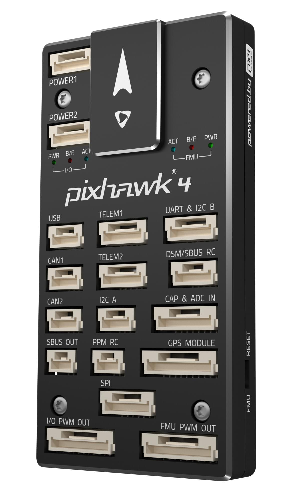

# Holybro Pixhawk 4

:::warning
PX4 does not manufacture this (or any) autopilot.
Contact the [manufacturer](https://holybro.com/) for hardware support or compliance issues.
:::

_Pixhawk 4_<sup>&reg;</sup> is an advanced autopilot designed and made in collaboration with Holybro<sup>&reg;</sup> and the PX4 team.
It is optimized to run PX4 v1.7 and later, and is suitable for academic and commercial developers.

It is based on the [Pixhawk-project](https://pixhawk.org/) **FMUv5** open hardware design and runs PX4 on the [NuttX](https://nuttx.apache.org/) OS.

 

:::tip
This autopilot is [supported](../flight_controller/autopilot_pixhawk_standard.md) by the PX4 maintenance and test teams.
:::

## 总览

- 主处理器：STM32F765
  - 32 位 Arm® Cortex®-M7，216MHz，2MB 储存，512KB RAM
- IO 处理器：STM32F100
  - 32 位 Arm® Cortex®-M3，24MHz，8KB SRAM
- 内置传感器：
  - 加速度计 / 陀螺仪：ICM-20689
  - Accel/Gyro: BMI055 or ICM20602
  - 磁力计：IST8310
  - 气压计：MS5611
- GPS：ublox Neo-M8N GPS/GLONASS 接收器；集成磁力计 IST8310
- 接口：
  - 8-16 路PWM输出（8路来自 IO，8路来自 FMU）
  - FMU上有3个专用PWM/Capture输入
  - CPPM专用的RC输入
  - 用于 Spektrum / DSM 与 有模拟 / PWM RSSI 的 S.Bus 的专用遥控输入
  - Dedicated S.Bus servo output
  - 5个通用串行口
  - 3 个 I2C 接口
  - 4路SPI总线
  - 多达 2 路 CAN 总线用于带串口的电调
  - 2个电池电流/电压模拟输入口
- 电源系统
  - 电源模块输出：4.9~5.5V
  - USB 电源输入：4.75~5.25V
  - 伺服导轨输入电压：0~36V
- 重量和尺寸:
  - 重量：15.8g
  - 尺寸：44_84_12mm
- 其它特性:
  - 工作温度：-40 ~ 85°C

Additional information can be found in the [Pixhawk 4 Technical Data Sheet](https://github.com/PX4/PX4-user_guide/raw/main/assets/flight_controller/pixhawk4/pixhawk4_technical_data_sheet.pdf).

## 购买渠道

Order from [Holybro](https://holybro.com/products/pixhawk-4).

## 连接器


:::warning
The **DSM/SBUS RC** and **PPM RC** ports are for RC receivers only.
These are powered! NEVER connect any servos, power supplies or batteries (or to any connected receiver).
:::

## 针脚定义

Download _Pixhawk 4_ pinouts from [here](https://cdn.shopify.com/s/files/1/0604/5905/7341/files/Pixhawk4-Pinouts.pdf).

:::info
Connector pin assignments are left to right (i.e. Pin 1 is the left-most pin).
The exception is the [debug port(s)](#debug_port) (pin 1 is the right-most, as shown below).
:::

## 串口映射

| UART   | 设备         | Port                                     |
| ------ | ---------- | ---------------------------------------- |
| UART1  | /dev/ttyS0 | GPS                                      |
| USART2 | /dev/ttyS1 | TELEM1 (flow control) |
| USART3 | /dev/ttyS2 | TELEM2 (flow control) |
| UART4  | /dev/ttyS3 | TELEM4                                   |
| USART6 | /dev/ttyS4 | RC SBUS                                  |
| UART7  | /dev/ttyS5 | Debug Console                            |
| UART8  | /dev/ttyS6 | PX4IO                                    |

## 尺寸


## 额定电压

_Pixhawk 4_ can be triple-redundant on the power supply if three power sources are supplied. The three power rails are: **POWER1**, **POWER2** and **USB**.

:::info
The output power rails **FMU PWM OUT** and **I/O PWM OUT** (0V to 36V) do not power the flight controller board (and are not powered by it).
You must supply power to one of **POWER1**, **POWER2** or **USB** or the board will be unpowered.
:::

**Normal Operation Maximum Ratings**

Under these conditions all power sources will be used in this order to power the system:

1. **POWER1** and **POWER2** inputs (4.9V to 5.5V)
2. **USB** input (4.75V to 5.25V)

**Absolute Maximum Ratings**

Under these conditions the system will not draw any power (will not be operational), but will remain intact.

1. **POWER1** and **POWER2** inputs (operational range 4.1V to 5.7V, 0V to 10V undamaged)
2. **USB** input (operational range 4.1V to 5.7V, 0V to 6V undamaged)
3. Servo input: VDD_SERVO pin of **FMU PWM OUT** and **I/O PWM OUT** (0V to 42V undamaged)

## 组装 / 设置

The [Pixhawk 4 Wiring Quick Start](../assembly/quick_start_pixhawk4.md) provides instructions on how to assemble required/important peripherals including GPS, Power Management Board etc.

## 编译固件

:::tip
Most users will not need to build this firmware!
It is pre-built and automatically installed by _QGroundControl_ when appropriate hardware is connected.
:::

To [build PX4](../dev_setup/building_px4.md) for this target:

```
make px4_fmu-v5_default
```

<a id="debug_port"></a>

## 调试接口

The [PX4 System Console](../debug/system_console.md) and [SWD interface](../debug/swd_debug.md) run on the **FMU Debug** port, while the I/O console and SWD interface can be accessed via **I/O Debug** port.
In order to access these ports, the user must remove the _Pixhawk 4_ casing.


The pinout uses the standard [Pixhawk debug connector pinout](https://github.com/pixhawk/Pixhawk-Standards/blob/master/DS-009%20Pixhawk%20Connector%20Standard.pdf).
For wiring information see:

- [System Console > Pixhawk Debug Port](../debug/system_console.md#pixhawk_debug_port)

## 外部设备

- [Digital Airspeed Sensor](https://store-drotek.com/793-digital-differential-airspeed-sensor-kit-.html)
- [Telemetry Radio Modules](../telemetry/index.md)
- [Rangefinders/Distance sensors](../sensor/rangefinders.md)

## 支持的平台/机身

Any multicopter / airplane / rover or boat that can be controlled with normal RC servos or Futaba S-Bus servos.
The complete set of supported configurations can be seen in the [Airframes Reference](../airframes/airframe_reference.md).

## 更多信息

- [Pixhawk 4 Technical Data Sheet](https://github.com/PX4/PX4-user_guide/raw/main/assets/flight_controller/pixhawk4/pixhawk4_technical_data_sheet.pdf)
- [FMUv5 reference design pinout](https://docs.google.com/spreadsheets/d/1-n0__BYDedQrc_2NHqBenG1DNepAgnHpSGglke-QQwY/edit#gid=912976165).
- [Pixhawk 4 Wiring QuickStart](../assembly/quick_start_pixhawk4.md)
- [Pixhawk 4 Pinouts](https://cdn.shopify.com/s/files/1/0604/5905/7341/files/Pixhawk4-Pinouts.pdf) (Holybro)
- [Pixhawk 4 Quick Start Guide](https://cdn.shopify.com/s/files/1/0604/5905/7341/files/Pixhawk4-quickstartguide.pdf) (Holybro)
