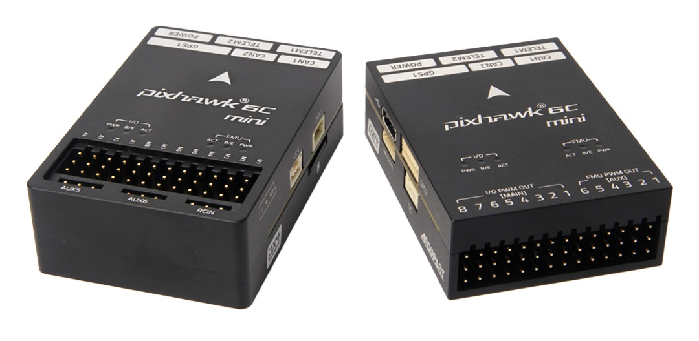
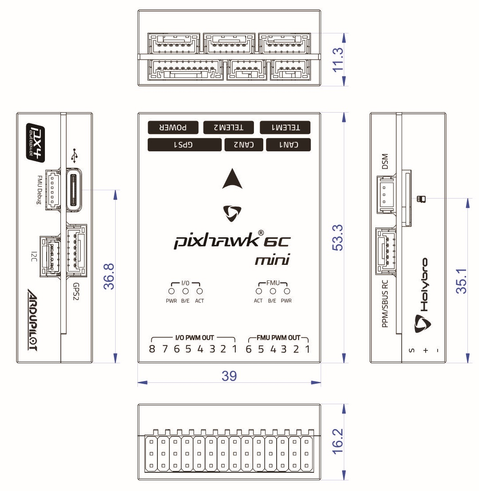
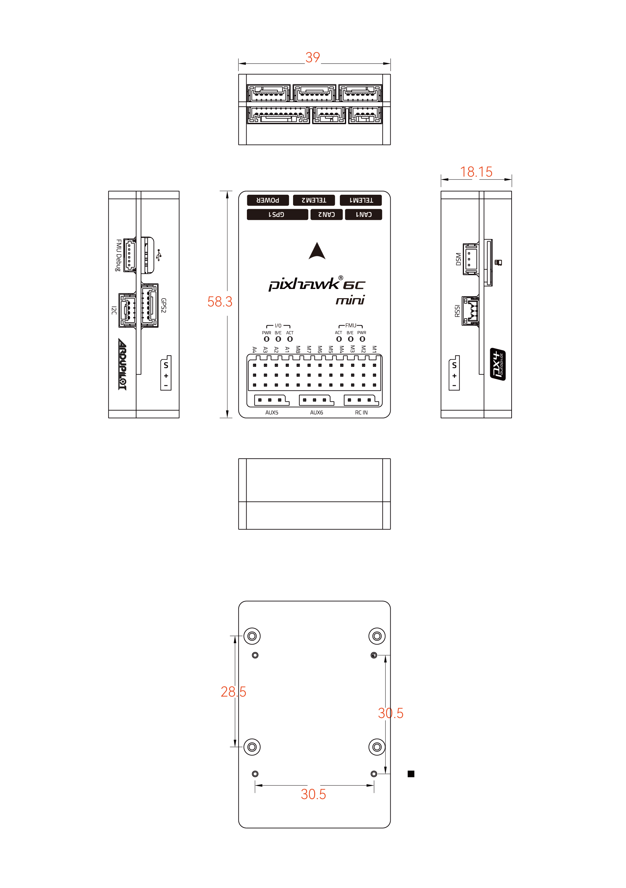

# Holybro Pixhawk 6C Mini

:::warning
PX4 does not manufacture this (or any) autopilot.
Contact the [manufacturer](https://holybro.com/) for hardware support or compliance issues.
:::

_Pixhawk 6C Mini_<sup>&reg;</sup> is the latest update to the successful family of Pixhawk® flight controllers designed and made in collaboration with Holybro<sup>&reg;</sup> and the PX4 team.

It is equipped with a high performance H7 Processor and comes with IMU redundancy, temperature-controlled IMU board, and cost effective design, delivering incredible performance and reliability.
It complies with the Pixhawk [Connector Standard](https://github.com/pixhawk/Pixhawk-Standards/blob/master/DS-009%20Pixhawk%20Connector%20Standard.pdf).



:::tip
This autopilot is [supported](../flight_controller/autopilot_pixhawk_standard.md) by the PX4 maintenance and test teams.
:::

## 简介

The Pixhawk® 6C Mini is the latest update to the successful family of Pixhawk® flight controllers.

Inside the Pixhawk® 6C Mini, you can find an STMicroelectronics® based STM32H743, paired with sensor technology from Bosch® & InvenSense®, giving you flexibility and reliability for controlling any autonomous vehicle, suitable for both academic and commercial applications.

The Pixhawk® 6C Mini's H7 microcontroller contain the Arm® Cortex®-M7 core running up to 480 MHz, and has 2MB flash memory and 1MB RAM.
Thanks to the updated processing power, developers can be more productive and efficient with their development work, allowing for complex algorithms and models.

The Pixhawk 6C Mini includes high-performance, low-noise IMUs on board, designed to be cost effective while having IMU redundancy.
A vibration isolation System to filter out high-frequency vibration and reduce noise to ensure accurate readings, allowing vehicles to reach better overall flight performances.

The Pixhawk® 6C Mini is perfect for developers at corporate research labs, startups, academics (research, professors, students), and commercial applications.

**Key Design Points**

- High performance STM32H743 Processor with more computing power & RAM
- New cost-effective design with low-profile form factor
- Newly designed integrated vibration isolation system to filter out high frequency vibration and reduce noise to ensure accurate readings
- IMUs are temperature-controlled by onboard heating resistors, allowing optimum working temperature of IMUs&#x20;

## Technical Specification

### **Processors & Sensors**

- FMU Processor: STM32H743&#x20;
  - 32 Bit Arm® Cortex®-M7, 480MHz, 2MB memory, 1MB SRAM&#x20;
- IO Processor: STM32F103
  - &#x20;32 Bit Arm® Cortex®-M3, 72MHz, 64KB SRAM&#x20;
- On-board sensors&#x20;
  - &#x20;Accel/Gyro: ICM-42688-P&#x20;
  - Accel/Gyro: BMI055&#x20;
  - Mag: IST8310&#x20;
  - 气压计：MS5611

### **Electrical data**

- Voltage Ratings:
  - Max input voltage: 6V
  - USB Power Input: 4.75\~5.25V
  - Servo Rail Input: 0\~36V
- Current Ratings:
  - \`TELEM1\`\` Max output current limiter: 1A
  - All other port combined output current limiter: 1A

### **Mechanical data**

- Dimensions: 53.3 x 39 x 16.2 mm
- Weight: 39.2g

### **Interfaces**

- 14- PWM servo outputs (8 from IO, 6 from FMU)

- 3个通用串行口
  - `TELEM1` - Full flow control, separate 1A current limit
  - `TELEM2` - Full flow control

- 2 GPS ports
  - GPS1 - Full GPS port (GPS plus safety switch)
  - GPS2 - Basic GPS port

- 1 I2C port
  - Supports dedicated I2C calibration EEPROM located on sensor module

- 2 CAN Buses
  - CAN Bus has individual silent controls or ESC RX-MUX control

- 1 Debug ports:
  - FMU Debug Mini

- Dedicated R/C input for Spektrum/DSM and S.BUS, CPPM, analog / PWM RSSI

- 1 Power input ports (Analog)

- 其它特性:
  - Operating & storage temperature: -40 ~ 85°c

## 购买渠道

Order from [Holybro](https://holybro.com/products/pixhawk-6c-mini).

## 组装 / 设置

The Pixhawk 4 Mini's port is very similar to the Pixhawk 6C Mini's port.
Please refer to the [Pixhawk 4 Mini Wiring Quick Start](../assembly/quick_start_pixhawk4_mini.md) as it provides instructions on how to assemble required/important peripherals including GPS, Power Module etc.

## 针脚定义

- [Holybro Pixhawk 6C Mini Port Pinout](https://docs.holybro.com/autopilot/pixhawk-6c-mini/pixhawk-6c-mini-ports)

## 串口映射

| UART   | 设备         | QGC Parameter Description | Port Label on FC |
| ------ | ---------- | ------------------------- | ---------------- |
| USART1 | /dev/ttyS0 | GPS1                      | GPS1             |
| USART2 | /dev/ttyS1 | TELEM3                    | N/A              |
| USART3 | /dev/ttyS2 | N/A                       | FMU Debug        |
| UART5  | /dev/ttyS3 | TELEM2                    | TELEM2           |
| USART6 | /dev/ttyS4 | PX4IO                     | I/O PWM Out      |
| UART7  | /dev/ttyS5 | TELEM1                    | TELEM1           |
| UART8  | /dev/ttyS6 | GPS2                      | GPS2             |

<!-- See http://docs.px4.io/main/en/hardware/serial_port_mapping.html#serial-port-mapping -->

## 尺寸




## 额定电压

_Pixhawk 6C Mini_ can be double-redundant on the power supply if two power sources are supplied. The two power rails are: **POWER1** and **USB**.

**Normal Operation Maximum Ratings**

Under these conditions, all power sources will be used in this order to power the system:

1. **POWER1** inputs (4.9V to 5.5V)
2. **USB** input (4.75V to 5.25V)

**Absolute Maximum Ratings**

Under these conditions, the system will not draw any power (will not be operational), but will remain intact.

1. **POWER1** inputs (operational range 4.1V to 5.7V, 0V to 10V undamaged)
2. **USB** input (operational range 4.1V to 5.7V, 0V to 6V undamaged)
3. Servo input: VDD_SERVO pin of **FMU PWM OUT** and **I/O PWM OUT** (0V to 42V undamaged)

**Voltage monitoring**

Pixhawk 6C Mini uses analog power modules.

Holybro makes various analog [power modules](../power_module/index.md) for different needs:

- [PM02 Power Module](../power_module/holybro_pm02.md)
- [PM06 Power Module](../power_module/holybro_pm06_pixhawk4mini_power_module.md)
- [PM07 Power Module](../power_module/holybro_pm07_pixhawk4_power_module.md)
- [PM08 Power Module](https://holybro.com/products/pm08-power-module-14s-200a)

## 编译固件

:::tip
Most users will not need to build this firmware!
It is pre-built and automatically installed by _QGroundControl_ when appropriate hardware is connected.
:::

To [build PX4](../dev_setup/building_px4.md) for this target:

```
make px4_fmu-v6c_default
```

<a id="debug_port"></a>

## 调试接口

The [PX4 System Console](../debug/system_console.md) and [SWD interface](../debug/swd_debug.md) run on the **FMU Debug** port.

The pinouts and connector comply with the [Pixhawk Debug Mini](../debug/swd_debug.md#pixhawk-debug-mini) interface defined in the [Pixhawk Connector Standard](https://github.com/pixhawk/Pixhawk-Standards/blob/master/DS-009%20Pixhawk%20Connector%20Standard.pdf) interface (JST SH connector).

| 针脚   | 信号                                  | 电压                    |
| ---- | ----------------------------------- | --------------------- |
| 1（红） | `Vtref`                             | +3.3V |
| 2    | Console TX (OUT) | +3.3V |
| 3    | Console RX (IN)  | +3.3V |
| 4（黑） | `SWDIO`                             | +3.3V |
| 6    | `SWCLK`                             | +3.3V |
| 6    | `GND`                               | GND                   |

For information about using this port see:

- [SWD Debug Port](../debug/swd_debug.md)
- [PX4 System Console](../debug/system_console.md) (Note, the FMU console maps to USART3).

## 外部设备

- [Digital Airspeed Sensor](https://holybro.com/products/digital-air-speed-sensor)
- [Telemetry Radio Modules](../telemetry/index.md):
  - [Holybro Telemetry Radio](../telemetry/holybro_sik_radio.md)
  - [Holybro Microhard P900 Radio](../telemetry/holybro_microhard_p900_radio.md)
  - [Holybro XBP9X Telemetry Radio](../telemetry/holybro_xbp9x_radio.md)
- [Rangefinders/Distance sensors](../sensor/rangefinders.md)

## 支持的平台/机身

Any multicopter / airplane / rover or boat that can be controlled with normal RC servos or Futaba S-Bus servos.
The complete set of supported configurations can be seen in the [Airframes Reference](../airframes/airframe_reference.md).

## See Also

- [Holybro Docs](https://docs.holybro.com/) (Holybro)
- [Pixhawk 4 Mini Wiring Quick Start](../assembly/quick_start_pixhawk4_mini.md) (and [Pixhawk 6C Wiring QuickStart](../assembly/quick_start_pixhawk6c.md))
- [PM02 Power Module](../power_module/holybro_pm02.md)
- [PM06 Power Module](../power_module/holybro_pm06_pixhawk4mini_power_module.md)
- [PM07 Power Module](../power_module/holybro_pm07_pixhawk4_power_module.md)
- [PM08 Power Module](https://holybro.com/products/pm08-power-module-14s-200a)
- FMUv6C reference design pinout.
- [Pixhawk Connector Standard](https://github.com/pixhawk/Pixhawk-Standards/blob/master/DS-009%20Pixhawk%20Connector%20Standard.pdf).
