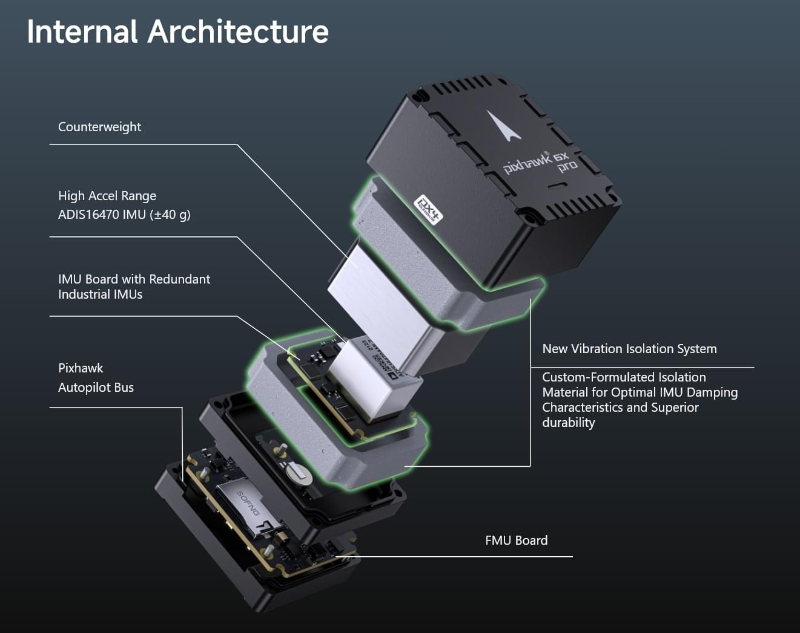
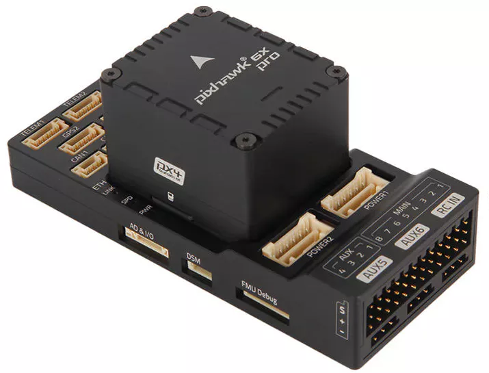
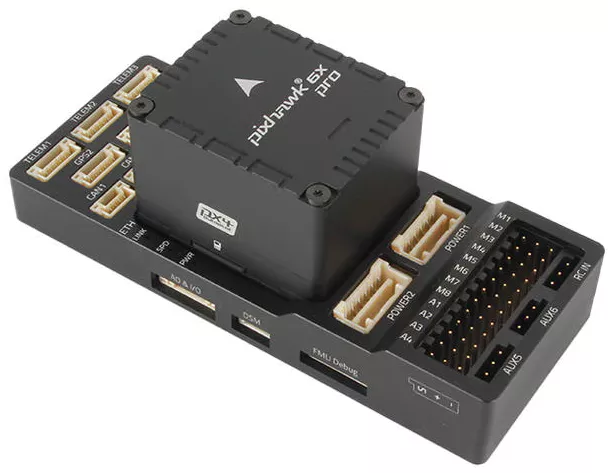
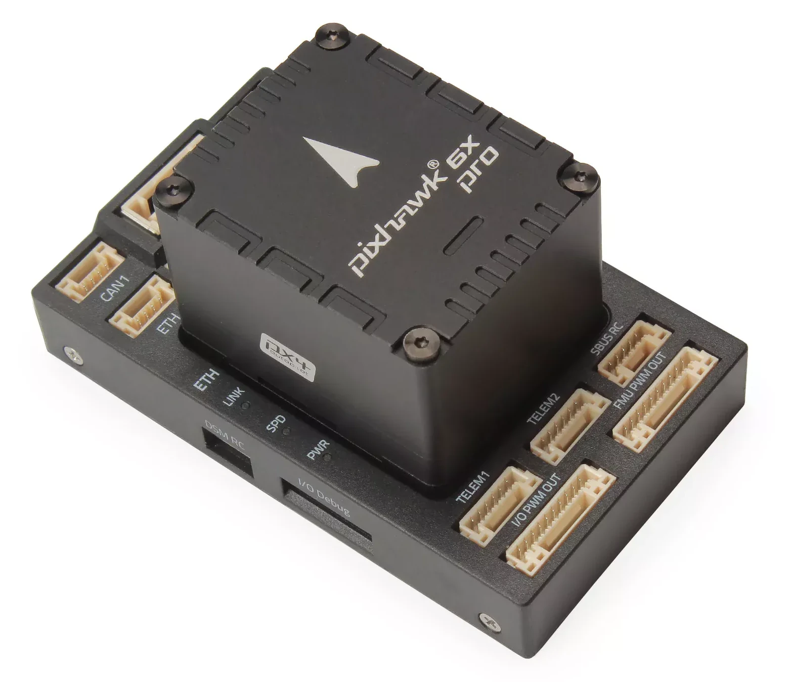
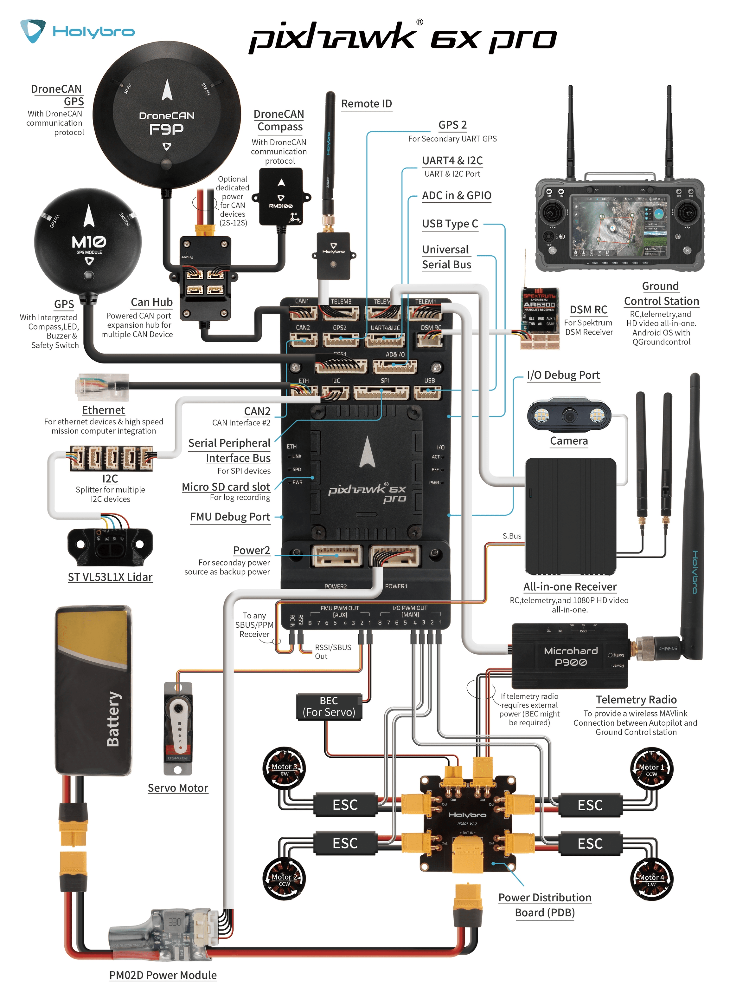
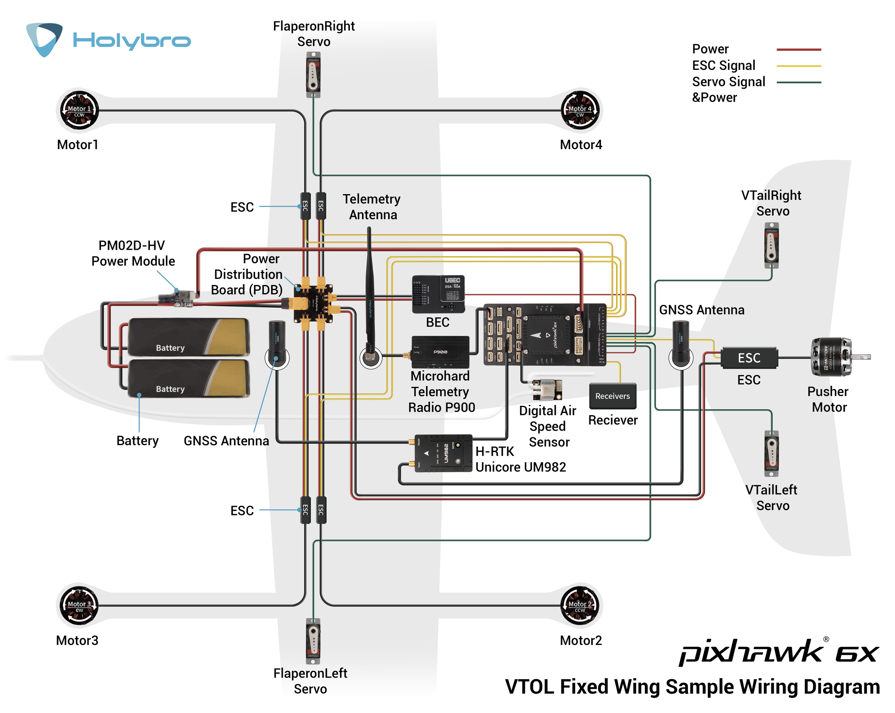

# Holybro Pixhawk 6X Pro

:::warning
PX4 does not manufacture this (or any) autopilot.
Contact the [manufacturer](https://holybro.com/) for hardware support or compliance issues.
:::



## Key Design Points

- High-performance ADIS16470 Industrial IMU with high accelerometer dynamic range (±40 g), perfect for accurate motion sensing in demanding UAV applications
- All new advanced durable vibration isolation material with resonance frequency in the higher spectrum, ideal for industrial and commercial drone applications
- High performance STM32H753 Processor
- Ethernet interface for high-speed mission computer integration

## Baseboards

The Pixhawk 6X Pro can be purchased with a number of baseboards (or no baseboard) to suit different use cases and vehicle types, including [Standard v2A](https://docs.holybro.com/autopilot/pixhawk-baseboards/pixhawk-baseboard-v2-ports), [Standard v2B](https://docs.holybro.com/autopilot/pixhawk-baseboards/pixhawk-baseboard-v2-ports), and [Mini](https://docs.holybro.com/autopilot/pixhawk-baseboards/pixhawk-mini-baseboard-ports), which are shown below.
It can also be used with any other Pixhawk Autopilot Bus (PAB) specification-compliant baseboard, such as the [Holybro Pixhawk Jetson Baseboard](../companion_computer/holybro_pixhawk_jetson_baseboard.md) and [Holybro Pixhawk RPi CM4 Baseboard](../companion_computer/holybro_pixhawk_rpi_cm4_baseboard.md).

:::: tabs

:::tab Pixhawk 6X Pro Standard v2A



:::

:::tab Pixhawk 6X Pro Standard v2B


:::

:::tab Pixhawk 6X Pro Mini


:::

::::

## 特性

- Triple redundant IMU & double redundant barometer on separate buses
- Modular flight controller: separated IMU, FMU, and Base system
- Safety-driven design incorporates sensors from different manufacturers and model lineups
- Independent LDO powers every sensor set with independent power control.
- Temperature-controlled IMU board, allowing optimum working temperature of IMUs

:::details
Processors & Sensors

- FMU Processor: STM32H753
  - 32 Bit Arm® Cortex®-M7, 480MHz, 2MB flash memory, 1MB RAM
- IO Processor: STM32F103
  - 32 Bit Arm® Cortex®-M3, 72MHz, 64KB SRAM
- On-board sensors
  - Accel/Gyro: ADIS16470 (±40g, Vibration Isolated, Industrial IMU)
  - Accel/Gyro: IIM-42652 (±16g, Vibration Isolated, Industrial IMU)
  - Accel/Gyro: ICM-45686 with BalancedGyro™ Technology (±32g, Hard Mounted)
  - Barometer: ICP20100
  - Barometer: BMP388
  - Mag: BMM150

:::

:::details
Electrical data

- Voltage Ratings:
  - Max input voltage: 6V
  - USB 电源输入：4.75~5.25V
  - 伺服导轨输入电压：0~36V
- Current Ratings: - Telem1 output current limiter: 1.5A - All other port combined output current limiter: 1.5A

:::

:::details
Mechanical data

- 尺寸
  - Flight Controller Module: 38.8 x 31.8 x 30.1mm
  - Standard Baseboard: 52.4 x 103.4 x 16.7mm
  - Mini Baseboard: 43.4 x 72.8 x 14.2 mm
- Weight - Flight Controller Module: 50g - Standard Baseboard: 51g - Mini Baseboard: 26.5g

:::

:::details
接口

- 16- PWM servo outputs
- R/C input for Spektrum / DSM
- Dedicated R/C input for PPM and S.Bus input
- Dedicated analog / PWM RSSI input and S.Bus output
- 4个通用串行口
  - 3 with full flow control
  - 1 with separate 1.5A current limit (Telem1)
  - 1 with I2C and additional GPIO line for external NFC reader
- 2 GPS ports
  - 1 full GPS plus Safety Switch Port
  - 1 basic GPS port
- 1 I2C port
- 1 Ethernet port
  - Transformerless Applications
  - 100Mbps
- 1 SPI bus
  - 2 chip select lines
  - 2 data-ready lines
  - 1 SPI SYNC line
  - 1 SPI reset line
- 2 CAN Buses for CAN peripheral
  - CAN Bus has individual silent controls or ESC RX-MUX control
- 2 Power input ports with SMBus - 1 AD & IO port - 2 additional analog input - 1 PWM/Capture input - 2 Dedicated debug and GPIO lines

:::

## 购买渠道

Order from [Holybro](https://holybro.com/products/pixhawk-6x-pro).

## 组装 / 设置

The [Pixhawk 6X Wiring Quick Start](../assembly/quick_start_pixhawk6x.md) provides instructions on how to assemble required/important peripherals including GPS, Power Module etc.

## Connections

### Multicopter Wiring Example



### VTOL Wiring Example



## 针脚定义

- [Holybro Pixhawk Baseboard Pinout](https://docs.holybro.com/autopilot/pixhawk-6x/pixhawk-baseboard-pinout)
- [Holybro Pixhawk Mini-Baseboard Pinout](https://docs.holybro.com/autopilot/pixhawk-6x/pixhawk-mini-baseboard-pinout)
- [Holybro Pixhawk Jetson Baseboard](https://docs.holybro.com/autopilot/pixhawk-baseboards/pixhawk-jetson-baseboard)
- [Holybro Pixhawk RPi CM4 Baseboard](https://docs.holybro.com/autopilot/pixhawk-baseboards/pixhawk-rpi-cm4-baseboard)

备注：

- The [camera capture pin](../camera/fc_connected_camera.md#camera-capture-configuration) (`PI0`) is pin 2 on the AD&IO port, marked above as `FMU_CAP1`.

## 串口映射

| UART   | 设备         | Port                            |
| ------ | ---------- | ------------------------------- |
| USART1 | /dev/ttyS0 | GPS                             |
| USART2 | /dev/ttyS1 | TELEM3                          |
| USART3 | /dev/ttyS2 | Debug Console                   |
| UART4  | /dev/ttyS3 | UART4 & I2C |
| UART5  | /dev/ttyS4 | TELEM2                          |
| USART6 | /dev/ttyS5 | PX4IO/RC                        |
| UART7  | /dev/ttyS6 | TELEM1                          |
| UART8  | /dev/ttyS7 | GPS2                            |

## 尺寸

[Pixhawk 6X Pro Dimensions](https://docs.holybro.com/autopilot/pixhawk-6x-pro/dimensions)

## 额定电压

_Pixhawk 6X Pro_ can be triple-redundant on the power supply if three power sources are supplied.
The three power rails are: **POWER1**, **POWER2** and **USB**.
The **POWER1** & **POWER2** ports on the Pixhawk 6X uses the 6 circuit [2.00mm Pitch CLIK-Mate Wire-to-Board PCB Receptacle](https://www.molex.com/molex/products/part-detail/pcb_receptacles/5024430670).

**Normal Operation Maximum Ratings**

Under these conditions all power sources will be used in this order to power the system:

1. **POWER1** and **POWER2** inputs (4.9V to 5.5V)
2. **USB** input (4.75V to 5.25V)

**Absolute Maximum Ratings**

Under these conditions the system will not draw any power (will not be operational), but will remain intact.

1. **POWER1** and **POWER2** inputs (operational range 4.1V to 5.7V, 0V to 10V undamaged)
2. **USB** input (operational range 4.1V to 5.7V, 0V to 6V undamaged)
3. Servo input: VDD_SERVO pin of **FMU PWM OUT** and **I/O PWM OUT** (0V to 42V undamaged)

**Voltage monitoring**

Digital I2C battery monitoring is enabled by default (see [Quickstart > Power](../assembly/quick_start_pixhawk6x.md#power)).

:::info
Analog battery monitoring via an ADC is not supported on this particular board, but may be supported in variations of this flight controller with a different baseboard.
:::

## 编译固件

:::tip
Most users will not need to build this firmware!
It is pre-built and automatically installed by _QGroundControl_ when appropriate hardware is connected.
:::

To [build PX4](../dev_setup/building_px4.md) for this target:

```
make px4_fmu-v6x_default
```

## 调试接口

The [PX4 System Console](../debug/system_console.md) and [SWD interface](../debug/swd_debug.md) run on the **FMU Debug** port.

The pinouts and connector comply with the [Pixhawk Debug Full](../debug/swd_debug.md#pixhawk-debug-full) interface defined in the [Pixhawk Connector Standard](https://github.com/pixhawk/Pixhawk-Standards/blob/master/DS-009%20Pixhawk%20Connector%20Standard.pdf) interface (JST SM10B connector).

| 针脚                          | 信号                                  | 电压                    |
| --------------------------- | ----------------------------------- | --------------------- |
| 1（红）                        | `Vtref`                             | +3.3V |
| 2                           | Console TX (OUT) | +3.3V |
| 3                           | Console RX (IN)  | +3.3V |
| 4（黑）                        | `SWDIO`                             | +3.3V |
| 6                           | `SWCLK`                             | +3.3V |
| 6                           | `SWO`                               | +3.3V |
| 7                           | NFC GPIO                            | +3.3V |
| 8 (blk)  | PH11                                | +3.3V |
| 9 (blk)  | nRST                                | +3.3V |
| 10 (blk) | `GND`                               | GND                   |

For information about using this port see:

- [SWD Debug Port](../debug/swd_debug.md)
- [PX4 System Console](../debug/system_console.md) (Note, the FMU console maps to USART3).

## 外部设备

- [Telemetry Radio Modules](https://holybro.com/collections/telemetry-radios?orderby=date)
- [Rangefinders/Distance sensors](../sensor/rangefinders.md)
- [Holybro Sensors](https://holybro.com/collections/sensors)
- [Holybro GPS & RTK Systems](https://holybro.com/collections/gps-rtk-systems)
- [Power Modules & PDBs](https://holybro.com/collections/power-modules-pdbs)

## Supported Platforms/Airframes

Any multicopter / airplane / rover or boat that can be controlled with normal RC servos or Futaba S-Bus servos.
The complete set of supported configurations can be seen in the [Airframes Reference](../airframes/airframe_reference.md).

## CAD File

Download [here](https://docs.holybro.com/autopilot/pixhawk-6x-pro/download).

## See Also

- [Holybro Docs](https://docs.holybro.com/autopilot/pixhawk-6x-pro) (Holybro)
- [Pixhawk 6X Wiring QuickStart](../assembly/quick_start_pixhawk6x.md)
- [Pixhawk Autopilot FMUv6X Standard](https://github.com/pixhawk/Pixhawk-Standards/blob/master/DS-012%20Pixhawk%20Autopilot%20v6X%20Standard.pdf).
- [Pixhawk Autopilot Bus Standard](https://github.com/pixhawk/Pixhawk-Standards/blob/master/DS-010%20Pixhawk%20Autopilot%20Bus%20Standard.pdf).
- [Pixhawk Connector Standard](https://github.com/pixhawk/Pixhawk-Standards/blob/master/DS-009%20Pixhawk%20Connector%20Standard.pdf).
