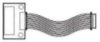
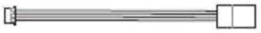
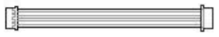
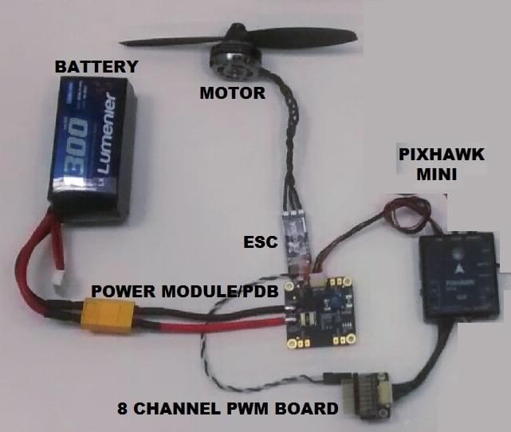

# Holybro Pixhawk Mini (Discontinued)

:::warning
PX4 does not manufacture this (or any) autopilot.
Contact the [manufacturer](https://holybro.com/) for hardware support or compliance issues.
:::

The Holybro _Pixhawk<sup>&reg;</sup> Mini_ autopilot is a next-generation evolution of the Pixhawk.
It is about 1/3rd the size of the original Pixhawk and has more powerful processors and sensors.

The Pixhawk Mini is based on the PX4 open-hardware project and has been optimized for the PX4 flight stack.


Wiring information is available [below](#wiring).

:::info
This flight controller was designed by 3DR in collaboration with HobbyKing<sup>&reg;</sup>.
It was formerly known as the 3DR Pixhawk Mini.
:::

:::tip
This autopilot is [supported](../flight_controller/autopilot_pixhawk_standard.md) by the PX4 maintenance and test teams.
:::

## 产品规格

**Processors:**

- **Main Processor:** STM32F427 Rev 3
- **IO Processor:** STM32F103

**Sensors:**

- **Accel/Gyro/Mag:** MPU9250
  - [deprecated](https://github.com/PX4/PX4-Autopilot/pull/7618) by the PX4 firmware
- **Accel/Gyro:** ICM20608
- **Barometer:** MS5611

**Voltage ratings:**

- **Power module output:** 4.1\~5.5V
- **Max input voltage:** 45V (10S LiPo)
- **Max current sensing:** 90A
- **USB Power Input:** 4.1\\`5.5V
- **Servo Rail Input:** 0\~10V

**Interfaces:**

- 1 x UART Serial Port (for GPS)
- Spektrum DSM/DSM2/DSM-X® Satellite Compatible RC input
- Futaba S BUS® Compatible RC input
- PPM Sum Signal RC Input
- I2C (for digital sensors)
- CAN (for digital motor control with compatible controllers)
- ADC (for analog sensors)
- Micro USB Port

**Weight and dimensions:**

- **Dimensions:** 38x43x12mm
- **Weight:** 15.8g

**GPS module (supplied with kit):**

- **GNSS receiver:** u-blox<sup>&reg;</sup> Neo-M8N; compass HMC5983
- **Weight:** 22.4g
- **Dimensions:** 37x37x12mm

## 购买渠道

Discontinued.

## Connector assignments

`<To be added>`

## 特性

Key features of the Pixhawk Mini are:

- Advanced 32 bit ARM Cortex® M4 Processor running NuttX RTOS
- 8 PWM/servo outputs
- Multiple connectivity options for additional peripherals (UART, I2C, CAN)
- Redundant power supply inputs and automatic failover
- Integrated safety switch and optional external safety button for easy motor activation
- Multicolor LED indicator
- Integrated multi-tone piezo audio indicator
- microSD card for long-time high-rate logging
- Easy-to-use Micro JST connectors

The Pixhawk Mini is shipped with new **GPS module**:

- Based on the u-blox M8N
- Concurrent reception of up to 3 GNSS (GPS, Galileo, GLONASS, BeiDou)
- Industry leading -167 dBm navigation sensitivity
- Security and integrity protection
- Supports all satellite augmentation systems
- Advanced jamming and spoofing detection
- Product variants to meet performance and cost requirements

## Kit package

The _Pixhawk Mini_ is shipped with the following contents:

| Component                                                                                                | Image                                                                                                                                |
| -------------------------------------------------------------------------------------------------------- | ------------------------------------------------------------------------------------------------------------------------------------ |
| Pixhawk Mini Autopilot                                                                                   |                                                 |
| GPS module                                                                                               |                                   |
| Quad Power Distribution Board                                                                            |  |
| 8 Channel PWM Breakout board                                                                             |    |
| 4-pin cable (for I2C)                                                                 |         |
| RC-in cable for PPM/SBUS                                                                                 |                         |
| 6 to 6/4 ‘Y’ adapter for GPS and additional I2C devices                                                  |                |
| 6 pin cable (2) (for power distribution board and for compass/gps) |                                      |
| 6 pin JST to DF13 for legacy telemetry radio                                                             |                     |
| Safety switch                                                                                            |                                  |
| 8 Channel PWM Breakout cable                                                                             |     |
| Mounting foam                                                                                            |                                                 |
| I2C breakout board ? - not listed parts on handout                                                       | -                                                                                                                                    |

## Optional accessories

- Telemetry Radio Sets: 915 MHz (USA), 433 MHz (European)
  ::: info
  When installing the 3DR telemetry radios, use the connectors that come with Pixhawk Mini, rather than those that come with the radios.

:::

- 3DR 10S Power Module

- WiFi 数传电台

- 数字空速传感器

## Compatibility

### RC radio

- PPM output RC receivers
- Spektrum DSM RC receivers
- Futaba S BUS RC receivers

### ESCs

- All standard PWM input ESCs

## Connector pin assignments (pin outs)


## Product comparisons

### Pixhawk Mini vs Pixhawk (original)

- One-third the size - from 50x81.5x15.5mm to 38x43x12mm.
- Rev 3 processor for full utilization of 2MB flash memory.
- Improved sensors, both primary and secondary IMU MPU9250 and ICM20608 respectively.
  The result is more stable, more reliable flight and navigation.
- GPS+Compass module included. Features the Neo M8N with GLONASS support; compass HMC5983.
  Expect faster and stronger GPS lock.
- Micro JST connectors instead of DF-13.
  These are much easier to work with.
- Integrated piezo speaker and safety switch.
- Natively supports 4S batteries with the included PDB.

### Pixhawk Mini vs Pixfalcon

- Improved sensors, both primary and secondary IMU MPU9250 and ICM20608 respectively.
  Expect better vibration handling and reliability.
- CAN interface for UAVCAN support.
- Includes 8-channel breakout servo rail for planes and other vehicles requiring powered PWM output.
- Includes I2C breakout board for a total of 5 I2C connections.
- Similar size.

Pixhawk Mini features an advanced processor and sensor technology from ST Microelectronics® and a NuttX real-time operating system, delivering excellent performance, flexibility, and reliability for controlling any autonomous vehicle.

## Known issues

- Some Pixhawk Minis have a [hardware defect](https://github.com/PX4/PX4-Autopilot/issues/7327#issuecomment-317132917) that makes the internal MPU9250 IMU unreliable.
  - The problem is only present in older hardware revisions, because [it was fixed at some point by the manufacturer](https://github.com/PX4/PX4-Autopilot/issues/7327#issuecomment-372393609).
  - To check whether a specific board is affected or not, leave the board disconnected for some time, then power it on and try to start the mpu9250 driver from the PX4 command line. If the board is affected, the driver will not start.
  - The MPU9250 is [disabled by default](https://github.com/PX4/PX4-Autopilot/pull/7618) on the PX4 firmware.
  - The defective Pixhawk Minis will not calibrate without an external magnetometer or an attached GPS, even indoor.
  - When using an external GPS, [this is not a problem](https://github.com/PX4/PX4-Autopilot/pull/7618#issuecomment-320270082) because the secondary ICM20608 provides the accelerometer and the gyro, while the external GPS provides the magnetometer.

<a id="wiring"></a>

## Wiring Quick Start

:::warning
The _Pixhawk Mini_ is no longer manufactured or available from 3DR.
:::

This quick start guide shows how power the [Pixhawk Mini](../flight_controller/pixhawk_mini.md) and connect its most important peripherals.

### Standard Wiring Chart

The image below shows standard _quadcopter_ wiring using the _Pixhawk Mini Kit_ and 3DR Telemetry Radios (along with ESC, motor, battery and a ground control station running on a phone).
We'll go through each main part in the following sections.


:::info
The output wiring/powering is slightly different for other types of vehicles. This is covered in more detail below for VTOL, Plane, Copter.
:::

### 飞控的安装和方向

The _Pixhawk Mini_ should be mounted on the frame using
vibration-damping foam pads (included in the kit). It should be
positioned as close to your vehicle's center of gravity as possible, oriented top-side up
with the arrow points towards the front of the vehicle.


:::info
If the controller cannot be mounted in the recommended/default orientation (e.g. due to space constraints) you will need to configure the autopilot software with the orientation that you actually used: [Flight Controller Orientation](../config/flight_controller_orientation.md).
:::

### GPS + Compass

Attach the 3DR GPS + Compass to the Pixhawk Mini's **GPS&I2C** port (top right) using the supplied 6 pin cable.
The GPS/Compass should be mounted on the frame as far away from other electronics as possible, facing the front of the vehicle (separating the compass from other electronics will reduce interference).


NOTE - INSERT IMAGE SHOWING BOTH PORTS? OR FRONT-FACING image of GPS&I2C

The compass must be calibrated before it is first used: [Compass Calibration](../config/compass.md)

### 电源

The image below shows typical power-supply wiring when using _Pixhawk Mini_ in a Quadcopter.
This uses the _Quad Power Distribution Board_ that comes in the kit to supply both the Pixhawk Mini and the ESC/Motor from the battery (and can also power other accessories).

:::info
The _Quad Power Distribution Board_ includes a power module (PM) that is suitable for batteries <= 4S.
The _3DR 10S Power Module_ (Discontinued) is recommended if you need more power.
:::



The _Pixhawk Mini_ is powered through the **PM** port.
When using a power module (as in this case) the port will also read analog voltage and current measurements.

Up to 4 ESCs can be separately powered from the power distribution board (though in this case we only have one connected).

The control signals come from MAIN OUT. In this case there is only one control channel, which is connected to the ESC via the _8 Channel PWM Breakout Board_.

The Pixhawk Mini output rail (MAIN OUT) cannot power attached devices (and does not need to in the circuit as shown).
For vehicles where MAIN OUT is attached to devices that draw power (e.g. a servo used in a plane) then you will need to power the rail using a BEC (battery elimination circuit).
The included breakout board allows one channel to provide power on the other outputs.

### 遥控器

Pixhawk Mini supports many different radio receiver models:

- Spektrum and DSM receivers connect to the **SPKT/DSM** input.

  

- PPM-SUM and S.BUS receivers connect to the **RCIN** port.

  

- PPM and PWM receivers that have an _individual wire for each channel_ must connect to the **RCIN** port _via a PPM encoder_ [like this one](http://www.getfpv.com/radios/radio-accessories/holybro-ppm-encoder-module.html) (PPM-Sum receivers use a single signal wire for all channels).

For more information about selecting a radio system, receiver compatibility, and binding your transmitter/receiver pair, see: [Remote Control Transmitters & Receivers](../getting_started/rc_transmitter_receiver.md).

### Safety switch (optional)

The controller has an integrated safety switch that you can use for motor activation once the autopilot is ready to take off.
If this switch is hard to access on a particular vehicle you can attach the (optional) external safety button, as shown below.


### 数传电台

### 电机

The mappings between MAIN/AUX output ports and motor/servos for all supported air and ground frames are listed in the [Airframe Reference](../airframes/airframe_reference.md).

:::warning
The mapping is not consistent across frames (e.g. you can't rely on the throttle being on the same output for all plane frames).
Make sure to use the correct mapping for your vehicle.
:::

:::tip
If your frame is not listed in the reference then use a "generic" airframe of the correct type.
::: infos:

- The output rail must be separately powered, as discussed in the [Power](#power) section above.
- Pixhawk Mini cannot be used for QuadPlane VTOL airframes. This is because QuadPlane requires 9 outputs (4 Main, 5 AUX) and the Pixhawk Mini only has 8 outputs (8 Main).


### 其它外设

The wiring and configuration of other components is covered within the topics for individual [peripherals](../peripherals/index.md).

### 配置

General configuration information is covered in: [Autopilot Configuration](../config/index.md).

QuadPlane specific configuration is covered here: [QuadPlane VTOL Configuration](../config_vtol/vtol_quad_configuration.md)

## 编译固件

:::tip
Most users will not need to build this firmware!
It is pre-built and automatically installed by _QGroundControl_ when appropriate hardware is connected.
:::

To [build PX4](../dev_setup/building_px4.md) for this target:

```
make px4_fmu-v3_default
```

## 调试接口

This board does not have a debug port (i.e it does not have a port for accessing the [System Console](../debug/system_console.md) or [SWD interface](../debug/swd_debug.md)).

Developers will need to solder wires to the board test pads for SWD, and to the STM32F4 (IC) TX and RX to get a console.
