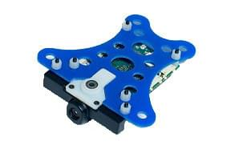

# Snapdragon Flight Autopilot (Discontinued)

<Badge type="info" text="Discontinued" />

:::warning
The Snapdragon Flight Autopilot has been [discontinued](../flight_controller/autopilot_experimental.md) and is no longer commercially available.
For information about how it is/was used see [PX4 User Guide v1.11](https://docs.px4.io/v1.11/en/flight_controller/snapdragon_flight.html)

PX4 does not manufacture this (or any) autopilot.
Contact the [manufacturer](https://www.intrinsyc.com/) for hardware support or compliance issues.
:::

The _Qualcomm Snapdragon Flight_ platform is a high-end autopilot / onboard computer which runs the PX4 Flight Stack on the DSP on the QuRT real time operating system using the [DSPAL API](https://github.com/ATLFlight/dspal) for POSIX compatibility.
In comparison to [Pixhawk](../flight_controller/pixhawk.md) it adds a camera and WiFi and high-end processing power, and different IO.

