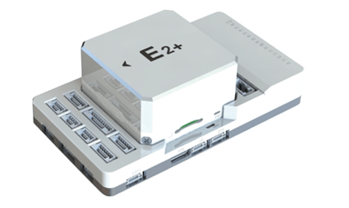
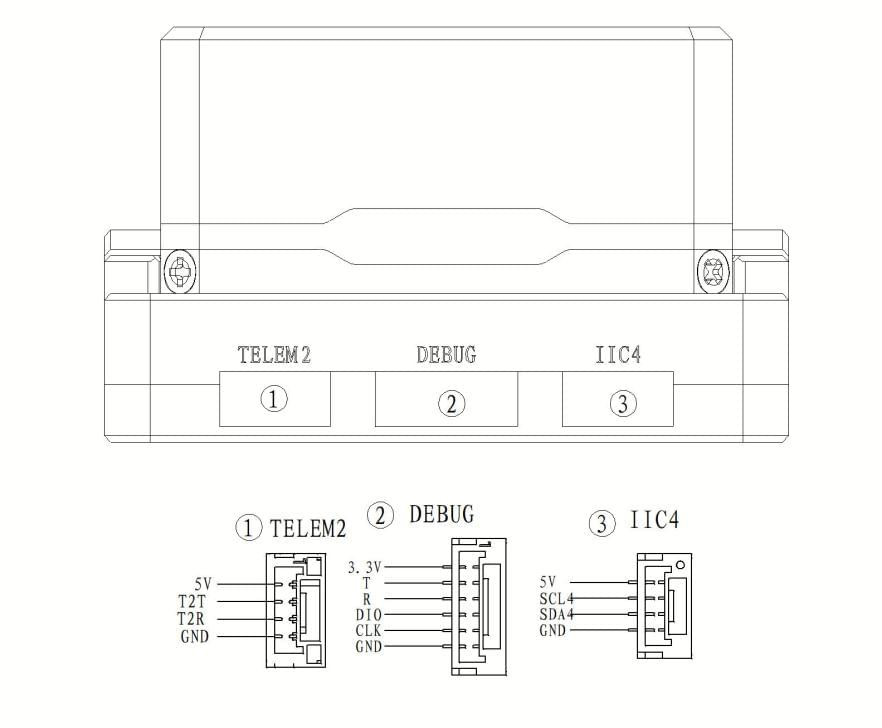

# S-Vehicle E2

:::warning
PX4 does not manufacture this (or any) autopilot.
:::

The _E2_ is an advanced autopilot manufactured by S-Vehicle<sup>&reg;</sup>.

The autopilot is recommended for commercial system integration, but is also suitable for academic research and any other applications.
It brings you ultimate performance, stability, and reliability in every aspect.



:::info
These flight controllers are [manufacturer supported](../flight_controller/autopilot_manufacturer_supported.md).
:::

### Processors & Sensors

- FMU Processor: STM32H753IIK6
  - 32 Bit Arm® Cortex®-M7, 480MHz, 2MB flash memory, 1MB RAM
- IO Processor: STM32F103
  - 32 Bit Arm® Cortex®-M3, 72MHz, 20KB SRAM
- On-board sensors
  - Accel/Gyro: BMI088
  - Accel/Gyro: ICM-42688-P
  - Accel/Gyro: ICM-20649
  - Mag: RM3100
  - Barometer: 2x ICP-20100

### 接口

- 14x PWM Servo Outputs
- 1x Dedicated R/C Input for Spektrum / DSM and S.Bus
- 1x Analog/PWM RSSI Input
- 2x TELEM Ports (with full flow control)
- 1x UART4 Port
- 2x GPS Ports
  - 1x Full GPS plus Safety Switch Port (GPS1)
  - 1x Basic GPS Port (with I2C, GPS2)
- 1x USB Port (TYPE-C)
- 1x Ethernet Port
  - Transformerless application
  - 100Mbps
- 3x I2C Bus Ports
- 1x SPI Bus
  - 1x Chip Select Line
  - 1x Data Ready Line
  - 1x SPI Reset Line
- 2x CAN Ports
- 3x Power Input Ports
  - ADC Power Input
  - I2C Power Input
  - DroneCAN/UAVCAN Power Input
- 2x AD Ports
  - Analog Input (3.3V)
  - Analog Input (6.6V - not supported by PX4)
- 1x Dedicated Debug Port
  - FMU Debug

## Purchase Channels

Order from [S-Vehicle](https://svehicle.cn/).

## 遥控器

A Radio Control (RC) system is required if you want to manually control your vehicle (PX4 does not require a radio system for autonomous flight modes).

将 <em>HW\\u PM</em> 模块的6针连接器连接到飞控的<code>电源</code>接口。

Spektrum/DSM receivers connect to the DSM/SBUS RC input.
PPM or SBUS receivers connect to the RC IN input port.
CRSF receiver must be wired to a spare port (UART) on the Flight Controller. Then you can bind the transmitter and receiver together.

## 串口映射

| UART   | 设备         | Port          |
| ------ | ---------- | ------------- |
| USART1 | /dev/ttyS0 | GPS           |
| USART2 | /dev/ttyS1 | TELEM3        |
| USART3 | /dev/ttyS2 | Debug Console |
| UART4  | /dev/ttyS3 | UART4         |
| UART5  | /dev/ttyS4 | TELEM2        |
| USART6 | /dev/ttyS5 | PX4IO/RC      |
| UART7  | /dev/ttyS6 | TELEM1        |
| UART8  | /dev/ttyS7 | GPS2          |

## PWM Output

The E2-Plus flight controller supports up to 14 PWM outputs.
The first 8 outputs (labelled M1 to M8) are controlled by a dedicated STM32F103 IOMCU controller.
The remaining 6 outputs (labelled 9 to 14) are the "auxiliary" outputs.
These are directly attached to the STM32H753 FMU controller .

The 14 PWM outputs are:

M1 - M8 are connected to the IOMCU
A1 - A6 are connected to the FMU

M1 - M8 support DShot and are in 3 groups:

- M1, M2 in group 1
- M3, M4 in group 2
- M5, M6, M7, M8 in group 3

The 6 FMU PWM outputs are in 2 groups:

A1 - A4 are in one group.
A5, A6 are in a 2nd group.

Channels within the same group need to use the same output rate.
If any channel in a group uses DShot then all channels in the group need to use DShot.

### Electrical data

- Voltage Ratings:
  - Max input voltage: 5.7V
  - USB Power Input: 4.75\~5.25V
  - Servo Rail Input: 0\~9.9V
- Current Ratings:
  - TELEM1 and GPS2 combined output current limiter: 1.5A
  - All other port combined output current limiter: 1.5A

## Battery Monitoring

The board has connectors for 3 power monitors.

- POWER1 -- ADC
- POWER2 -- DroneCAN
- POWER3 -- I2C

The board is configure by default for a analog power monitor, and also has DroneCAN power monitor and I2C defaults configured which is enabled.

The default PDB included with the E2+ is analog and must be connected to `POWER1`.

## 编译固件

To [build PX4](../dev_setup/building_px4.md) for this target, execute:

```sh
make svehicle_e2_default
```

## 调试接口

The [PX4 System Console](../debug/system_console.md) and [SWD Interface](../debug/swd_debug.md) operate on the **FMU Debug** port.

| 针脚   | 信号                                | 电压                    |
| ---- | --------------------------------- | --------------------- |
| 1（红） | 5V+                               | +5V                   |
| 2    | DEBUG TX (OUT) | +3.3V |
| 3    | DEBUG RX (IN)  | +3.3V |
| 4（黑） | FMU_SWDIO    | +3.3V |
| 6    | FMU_SWCLK    | +3.3V |
| 6    | GND                               | GND                   |

For information about using this port see:

- [SWD Debug Port](../debug/swd_debug.md)
- [PX4 System Console](../debug/system_console.md) (Note, the FMU console maps to USART3).
- All ports use GH1.25 ,power ports use ports on E2 uses the 6 circuit [2.00mm Pitch CLIK-Mate Wire-to-Board PCB Receptacle](https://www.molex.com/en-us/products/part-detail/5024430670).

## 针脚定义





## 支持的平台/机身

Any multirotor/airplane/rover or boat that can be controlled using normal RC servos or Futaba S-Bus servos.
The complete set of supported configurations can be found in the [Airframe Reference](../airframes/airframe_reference.md).
