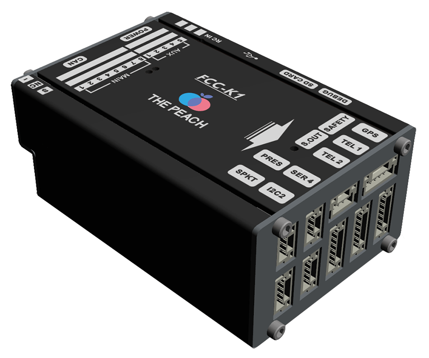
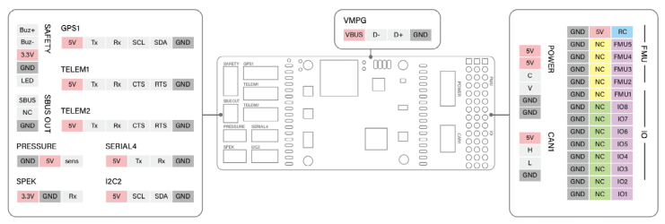
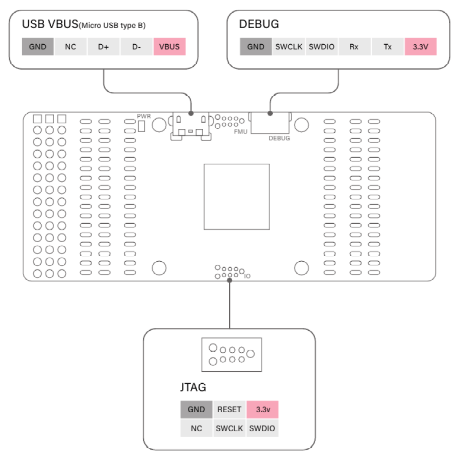

# ThePeach FCC-K1

:::warning
PX4 does not manufacture this (or any) autopilot.
Contact the [manufacturer](https://thepeach.kr/) for hardware support or compliance issues.
:::

**ThePeach FCC-K1** is an advanced autopilot designed and manufactured in **ThePeach**.

It is based on the **Pixhawk-project FMUv3** open hardware design and runs **PX4** on **Nuttx OS**.



## 产品规格

- Main Processor: STM32F427VIT6

  - 32bit ARM Cortex-M4, 168 MHz 256 KB RAM 2 MB Flash memory

- IO Processor: STM32F100C8T6

  - ARM Cortex-M3, 32bit ARM Cortex-M3, 24 MHz, 8KB SRAM

- On-board sensors

  - 加速度计 / 陀螺仪：ICM-20602
  - Accel/Gyro/Mag: MPU-9250
  - 气压计：MS5611

- 接口

  - 8+5 PWM output (8 from IO, 5 from FMU)
  - Spektrum DSM / DSM2 / DSM-X Satellite compatible input
  - Futaba S.BUS compatible input and output
  - PPM sum signal input
  - Analogue / PWM RSSI input
  - S.BUS伺服输出
  - Safety switch/LED
  - 4x UART Ports: TELEM1, TELEM2, GPS, SERIAL4
  - 2x I2C Ports
  - 1x CAN bus
  - 1x ADC
  - Analog inputs for voltage / Current of 1 battery

- Mechanical
  - Dimensions: 40.2 x 61.1 x 24.8 mm
  - Weight: 65g

## 连接器





## 串口映射

| UART   | 设备         | Port                                     |
| ------ | ---------- | ---------------------------------------- |
| USART1 | /dev/ttyS0 | IO Processor Debug                       |
| USART2 | /dev/ttyS1 | TELEM1 (flow control) |
| USART3 | /dev/ttyS2 | TELEM2 (flow control) |
| UART4  | /dev/ttyS3 | GPS1                                     |
| USART6 | /dev/ttyS4 | PX4IO                                    |
| UART7  | /dev/ttyS5 | Debug Console                            |
| UART8  | /dev/ttyS6 | TELEM4                                   |

## 额定电压

**ThePeach FCC-K1** can be double-redundant on the power supply if two power sources are supplied.
The two power rails are: **POWER** and **USB**.

:::info
The output power rails **FMU PWM OUT** and **I/O PWM OUT** do not power the flight controller board (and are not powered by it).
You must supply power to one of **POWER** or **USB** or the board will be unpowered.
:::

**Normal Operation Maximum Ratings**

Under these conditions all power sources will be used in this order to power the system:

1. POWER input (5V to 5.5V)
2. USB input (4.75V to 5.25V)

**Absolute Maximum Ratings**

Under these conditions, all power sources cause permanent damage to the flight controller.

1. POWER input (5.5V Over)
2. USB input (5.5V Over)

## 编译固件

To build PX4 for this target:

```jsx
make thepeach_k1_default
```

## Where to buy

Order from [ThePeach](http://thepeach.shop/)
