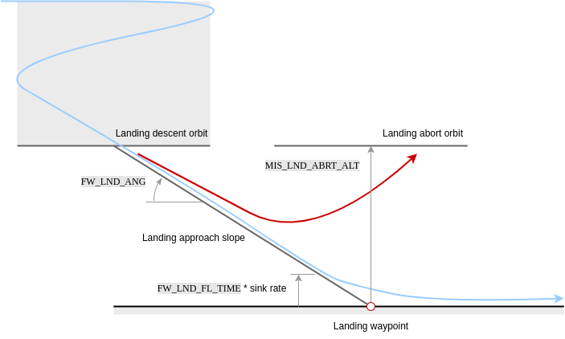
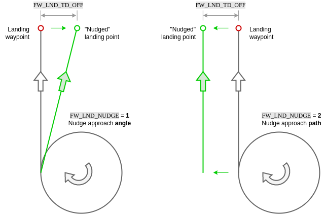
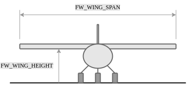

# Mission Mode (Fixed-Wing)

_Mission mode_ causes the vehicle to execute a predefined autonomous [mission](../flying/missions.md) (flight plan) that has been uploaded to the flight controller.
The mission is typically created and uploaded with a Ground Control Station (GCS) application like [QGroundControl](https://docs.qgroundcontrol.com/master/en/) (QGC).

::: info

- This mode requires a global 3d position estimate (from GPS or inferred from a [local position](../ros/external_position_estimation.md#enabling-auto-modes-with-a-local-position)).
- The vehicle must be armed before this mode can be engaged.
- This mode is automatic - no user intervention is _required_ to control the vehicle.
- 遥控开关可以在任何无人机上更改飞行模式。

:::

## 描述

Missions are usually created in a ground control station (e.g. [QGroundControl](https://docs.qgroundcontrol.com/master/en/qgc-user-guide/plan_view/plan_view.html)) and uploaded prior to launch.
They may also be created by a developer API, and/or uploaded in flight.

[Mission commands](#mission-commands) are handled in a way that is appropriate for each fixed-wing flight characteristics (for example loiter is implemented as flying in a circle).

:::info
Missions are uploaded onto a SD card that needs to be inserted **before** booting up the autopilot.
:::

At high level all vehicle types behave in the same way when MISSION mode is engaged:

1. If no mission is stored, or if PX4 has finished executing all mission commands, or if the [mission is not feasible](#mission-feasibility-checks):

  - If flying the vehicle will loiter.
  - If landed the vehicle will "wait".

2. If a mission is stored and PX4 is flying it will execute the [mission/flight plan](../flying/missions.md) from the current step.
  - A takeoff mission item will be treated as a normal waypoint.

3. If a mission is stored and the vehicle is landed it will only takeoff if the active waypoint is a `Takeoff`.
  If configured for catapult launch, the vehicle must also be launched (see [FW Takeoff/Landing in Mission](#mission-takeoff)).

4. If no mission is stored, or if PX4 has finished executing all mission commands:
  - If flying the vehicle will loiter.
  - If landed the vehicle will "wait".

5. You can manually change the current mission command by selecting it in _QGroundControl_.

  ::: info
  If you have a _Jump to item_ command in the mission, moving to another item will **not** reset the loop counter.
  One implication is that if you change the current mission command to 1 this will not "fully restart" the mission.

:::

6. The mission will only reset when the vehicle is disarmed or when a new mission is uploaded.

  :::tip
  To automatically disarm the vehicle after it lands, in _QGroundControl_ go to [Vehicle Setup > Safety](https://docs.qgroundcontrol.com/master/en/qgc-user-guide/setup_view/safety.html), navigate to _Land Mode Settings_ and check the box labeled _Disarm after_.
  Enter the time to wait after landing before disarming the vehicle.

:::

Missions can be paused by switching out of mission mode to any other mode (such as [Hold mode](../flight_modes_fw/hold.md) or [Position mode](../flight_modes_fw/position.md)), and resumed by switching back to mission mode.
If the vehicle was not capturing images when it was paused, on resuming it will head from its _current position_ towards the same waypoint as it as was heading towards originally.
If the vehicle was capturing images (has camera trigger items) it will instead head from its current position towards the last waypoint it traveled through (before pausing), and then retrace its path at the same speed and with the same camera triggering behaviour.
This ensures that in survey/camera missions the planned path is captured.
A mission can be uploaded while the vehicle is paused, in which which case the current active mission item is set to 1.

:::info
When a mission is paused while the camera on the vehicle was triggering, PX4 sets the current active mission item to the previous waypoint, so that when the mission is restarted the vehicle will retrace its last mission leg.
In addition, PX4 stores the last applied mission items for speed setting and camera triggering (from the already covered mission plan), and re-applies those settings on resuming the mission.
:::

:::warning
Ensure that the throttle stick is non-zero before switching to any RC mode (otherwise the vehicle will crash).
We recommend you centre the control sticks before switching to any other mode.
:::

For more information about mission planning, see:

- [Mission Planning](../flying/missions.md)
- [Plan View](https://docs.qgroundcontrol.com/master/en/qgc-user-guide/plan_view/plan_view.html) (_QGroundControl_ User Guide)

## 任务可行性检查

PX4 runs some basic sanity checks to determine if a mission is feasible when it is uploaded and before executing a mission.
If any of the checks fail, the user is notified and it is not possible to start the mission (the vehicle will switch to [Hold mode](../flight_modes_mc/hold.md) instead of Mission mode).

A subset of the most important checks are listed below:

- Any mission item conflicts with a plan or safety geofence
- More than one land start mission item defined ([MAV_CMD_DO_LAND_START](https://mavlink.io/en/messages/common.html#MAV_CMD_DO_LAND_START))
- A fixed-wing landing has an infeasible slope angle ([FW_LND_ANG](#FW_LND_ANG))
- Land start item (`MAV_CMD_DO_LAND_START`) appears in mission before an RTL item ([MAV_CMD_NAV_RETURN_TO_LAUNCH](https://mavlink.io/en/messages/common.html#MAV_CMD_NAV_RETURN_TO_LAUNCH))
- Missing takeoff and/or land item when these are configured as a requirement ([MIS_TKO_LAND_REQ](#MIS_TKO_LAND_REQ))

Additionally there is a check if the first waypoint is too far from the Home position ([MIS_DIST_1WP](#MIS_DIST_1WP)).
The user is notified should the check fail, but it has no effect on the validity of a mission plan (the mission can still be started even if the distance is too great).

## QGroundControl支持

_QGroundControl_ provides additional GCS-level mission handling support (in addition to that provided by the flight controller).

有关详细信息，请参阅︰

- [Remove mission after vehicle lands](https://docs.qgroundcontrol.com/master/en/qgc-user-guide/releases/stable_v3.2_long.html#remove-mission-after-vehicle-lands)
- [Resume mission after Return mode](https://docs.qgroundcontrol.com/master/en/qgc-user-guide/releases/stable_v3.2_long.html#resume-mission)

## Mission Parameters

Mission behaviour is affected by a number of parameters, most of which are documented in [Parameter Reference > Mission](../advanced_config/parameter_reference.md#mission).
A very small subset are listed below.

General parameters:

| 参数                                                                                                                                           | 描述                                                                                                                                                                                                 |
| -------------------------------------------------------------------------------------------------------------------------------------------- | -------------------------------------------------------------------------------------------------------------------------------------------------------------------------------------------------- |
| [NAV_RCL_ACT](../advanced_config/parameter_reference.md#NAV_RCL_ACT)       | RC loss failsafe mode (what the vehicle will do if it looses RC connection) - e.g. enter hold mode, return mode, terminate etc. |
| [NAV_LOITER_RAD](../advanced_config/parameter_reference.md#NAV_RCL_ACT) | Fixed-wing loiter radius.                                                                                                                                                          |

Parameters related to [mission feasibility checks](#mission-feasibility-checks):

| 参数                                                                                                                                                                         | 描述                                                                                                                                                                                                 |
| -------------------------------------------------------------------------------------------------------------------------------------------------------------------------- | -------------------------------------------------------------------------------------------------------------------------------------------------------------------------------------------------- |
| [MIS_DIST_1WP](../advanced_config/parameter_reference.md#MIS_DIST_1WP)                                  | There is a warning message if the distance of the first waypoint to Home is more than this value. Disabled if value is 0 or less.                                  |
| [FW_LND_ANG](../advanced_config/parameter_reference.md#FW_LND_ANG)                                        | Maximum landing slope angle.                                                                                                                                                       |
| [MIS_TKO_LAND_REQ](../advanced_config/parameter_reference.md#MIS_TKO_LAND_REQ) | Sets whether mission _requires_ takeoff and/or landing items. FW and VTOL both have it set to 2 by default, which means that the mission has to contain a landing. |

## Mission Commands

PX4 "accepts" the following MAVLink mission commands in Mission mode (with some _caveats_, given after the list).
Unless otherwise noted, the implementation is as defined in the MAVLink specification.

Mission Items:

- [MAV_CMD_NAV_WAYPOINT](https://mavlink.io/en/messages/common.html#MAV_CMD_NAV_WAYPOINT)
  - _Param3_ (flythrough) is ignored. Flythrough is always enabled if _param 1_ (time_inside) > 0.
- [MAV_CMD_NAV_LOITER_UNLIM](https://mavlink.io/en/messages/common.html#MAV_CMD_NAV_LOITER_UNLIM)
- [MAV_CMD_NAV_LOITER_TIME](https://mavlink.io/en/messages/common.html#MAV_CMD_NAV_LOITER_TIME)
- [MAV_CMD_NAV_LAND](https://mavlink.io/en/messages/common.html#MAV_CMD_NAV_LAND)
- [MAV_CMD_NAV_TAKEOFF](https://mavlink.io/en/messages/common.html#MAV_CMD_NAV_TAKEOFF)
- [MAV_CMD_NAV_LOITER_TO_ALT](https://mavlink.io/en/messages/common.html#MAV_CMD_NAV_LOITER_TO_ALT)
- [MAV_CMD_DO_JUMP](https://mavlink.io/en/messages/common.html#MAV_CMD_DO_JUMP)
- [MAV_CMD_NAV_ROI](https://mavlink.io/en/messages/common.html#MAV_CMD_NAV_ROI)
- [MAV_CMD_DO_SET_ROI](https://mavlink.io/en/messages/common.html#MAV_CMD_DO_SET_ROI)
- [MAV_CMD_DO_SET_ROI_LOCATION](https://mavlink.io/en/messages/common.html#MAV_CMD_DO_SET_ROI_LOCATION)
- [MAV_CMD_DO_SET_ROI_WPNEXT_OFFSET](https://mavlink.io/en/messages/common.html#MAV_CMD_DO_SET_ROI_WPNEXT_OFFSET)
- [MAV_CMD_DO_SET_ROI_NONE](https://mavlink.io/en/messages/common.html#MAV_CMD_DO_SET_ROI_NONE)
- [MAV_CMD_DO_CHANGE_SPEED](https://mavlink.io/en/messages/common.html#MAV_CMD_DO_CHANGE_SPEED)
- [MAV_CMD_DO_SET_HOME](https://mavlink.io/en/messages/common.html#MAV_CMD_DO_SET_HOME)
- [MAV_CMD_DO_SET_SERVO](https://mavlink.io/en/messages/common.html#MAV_CMD_DO_SET_SERVO)
- [MAV_CMD_DO_LAND_START](https://mavlink.io/en/messages/common.html#MAV_CMD_DO_LAND_START)
- [MAV_CMD_DO_TRIGGER_CONTROL](https://mavlink.io/en/messages/common.html#MAV_CMD_DO_TRIGGER_CONTROL)
- [MAV_CMD_DO_DIGICAM_CONTROL](https://mavlink.io/en/messages/common.html#MAV_CMD_DO_DIGICAM_CONTROL)
- [MAV_CMD_DO_MOUNT_CONFIGURE](https://mavlink.io/en/messages/common.html#MAV_CMD_DO_MOUNT_CONFIGURE)
- [MAV_CMD_DO_MOUNT_CONTROL](https://mavlink.io/en/messages/common.html#MAV_CMD_DO_MOUNT_CONTROL)
- [MAV_CMD_IMAGE_START_CAPTURE](https://mavlink.io/en/messages/common.html#MAV_CMD_IMAGE_START_CAPTURE)
- [MAV_CMD_IMAGE_STOP_CAPTURE](https://mavlink.io/en/messages/common.html#MAV_CMD_IMAGE_STOP_CAPTURE)
- [MAV_CMD_VIDEO_START_CAPTURE](https://mavlink.io/en/messages/common.html#MAV_CMD_VIDEO_START_CAPTURE)
- [MAV_CMD_VIDEO_STOP_CAPTURE](https://mavlink.io/en/messages/common.html#MAV_CMD_VIDEO_STOP_CAPTURE)
- [MAV_CMD_DO_SET_CAM_TRIGG_DIST](https://mavlink.io/en/messages/common.html#MAV_CMD_DO_SET_CAM_TRIGG_DIST)
- [MAV_CMD_DO_SET_CAM_TRIGG_INTERVAL](https://mavlink.io/en/messages/common.html#MAV_CMD_DO_SET_CAM_TRIGG_INTERVAL)
- [MAV_CMD_SET_CAMERA_MODE](https://mavlink.io/en/messages/common.html#MAV_CMD_SET_CAMERA_MODE)
- [MAV_CMD_NAV_DELAY](https://mavlink.io/en/messages/common.html#MAV_CMD_NAV_DELAY)
- [MAV_CMD_NAV_RETURN_TO_LAUNCH](https://mavlink.io/en/messages/common.html#MAV_CMD_NAV_RETURN_TO_LAUNCH)
- [MAV_CMD_DO_CONTROL_VIDEO](https://mavlink.io/en/messages/common.html#MAV_CMD_DO_CONTROL_VIDEO)
- [MAV_CMD_DO_GIMBAL_MANAGER_PITCHYAW](https://mavlink.io/en/messages/common.html#MAV_CMD_DO_GIMBAL_MANAGER_PITCHYAW)
- [MAV_CMD_DO_GIMBAL_MANAGER_CONFIGURE](https://mavlink.io/en/messages/common.html#MAV_CMD_DO_GIMBAL_MANAGER_CONFIGURE)
- [MAV_CMD_OBLIQUE_SURVEY](https://mavlink.io/en/messages/common.html#MAV_CMD_OBLIQUE_SURVEY)
- [MAV_CMD_DO_SET_CAMERA_ZOOM](https://mavlink.io/en/messages/common.html#MAV_CMD_DO_SET_CAMERA_ZOOM)
- [MAV_CMD_DO_SET_CAMERA_FOCUS](https://mavlink.io/en/messages/common.html#MAV_CMD_DO_SET_CAMERA_FOCUS)

GeoFence Definitions

- [MAV_CMD_NAV_FENCE_RETURN_POINT](https://mavlink.io/en/messages/common.html#MAV_CMD_NAV_FENCE_RETURN_POINT)
- [MAV_CMD_NAV_FENCE_POLYGON_VERTEX_INCLUSION](https://mavlink.io/en/messages/common.html#MAV_CMD_NAV_FENCE_POLYGON_VERTEX_INCLUSION)
- [MAV_CMD_NAV_FENCE_POLYGON_VERTEX_EXCLUSION](https://mavlink.io/en/messages/common.html#MAV_CMD_NAV_FENCE_POLYGON_VERTEX_EXCLUSION)
- [MAV_CMD_NAV_FENCE_CIRCLE_INCLUSION](https://mavlink.io/en/messages/common.html#MAV_CMD_NAV_FENCE_CIRCLE_INCLUSION)
- [MAV_CMD_NAV_FENCE_CIRCLE_EXCLUSION](https://mavlink.io/en/messages/common.html#MAV_CMD_NAV_FENCE_CIRCLE_EXCLUSION)

Rally Points

- [MAV_CMD_NAV_RALLY_POINT](https://mavlink.io/en/messages/common.html#MAV_CMD_NAV_RALLY_POINT)

:::info
Please add an issue report or PR if you find a missing/incorrect message.

- PX4 parses the above messages, but they are not necessary _acted_ on. For example, some messages are vehicle-type specific.
- PX4 does not support local frames for mission commands (e.g. [MAV_FRAME_LOCAL_NED](https://mavlink.io/en/messages/common.html#MAV_FRAME_LOCAL_NED)).
- Not all messages/commands are exposed via _QGroundControl_.
- The list may become out of date as messages are added.
  You can check the current set by inspecting the code.
  Support is `MavlinkMissionManager::parse_mavlink_mission_item` in [/src/modules/mavlink/mavlink_mission.cpp](https://github.com/PX4/PX4-Autopilot/blob/main/src/modules/mavlink/mavlink_mission.cpp).

:::

## Mission Command Timeouts

Some mission commands/items can take time to complete, such as a gripper opening and closing, a winch extending or retracting, or a gimbal moving to point at a region of interest.

Where provided PX4 may use sensor feedback from the hardware to determine when the action has completed and then move to the next mission item.
If not provided, or if the feedback is lost, a mission command timeout can be used to ensure that these kinds of actions will progress to the next mission item rather than blocking progression.

The timeout is set using the [MIS_COMMAND_TOUT](../advanced_config/parameter_reference.md#MIS_COMMAND_TOUT) parameter.
This should be set to be a small amount greater than the time required for the longest long-running action in the mission to complete.

## Rounded turns: Inter-Waypoint Trajectory

PX4 expects to follow a straight line from the previous waypoint to the current target (it does not plan any other kind of path between waypoints - if you need one you can simulate this by adding additional waypoints).

The vehicle will follow a smooth rounded curve towards the next waypoint (if one is defined) defined by the acceptance radius ([NAV_ACC_RAD](../advanced_config/parameter_reference.md#NAV_ACC_RAD)).
The diagram below shows the sorts of paths that you might expect.

Vehicles switch to the next waypoint as soon as they enter the acceptance radius.
This is defined by the "L1 distance", which is is computed from two parameters: [NPFG_DAMPING](../advanced_config/parameter_reference.md#NPFG_DAMPING) and [NPFG_PERIOD](../advanced_config/parameter_reference.md#NPFG_PERIOD), and the current ground speed.
By default, it's about 70 meters.

The equation is:

$$L_{1_{distance}}=\frac{1}{\pi}L_{1_{damping}}L_{1_{period}}\left \| \vec{v}_{ {xy}_{ground} } \right \|$$

## Mission Takeoff

Starting flights with mission takeoff (and landing using a mission landing) is the recommended way of operating a plane autonomously.

Both [runway takeoff](../flight_modes_fw/takeoff.md#runway-takeoff) and [hand-launched takeoff](../flight_modes_fw/takeoff.md#catapult-hand-launch) are supported — for configuration information see [Takeoff mode (FW)](../flight_modes_fw/takeoff.md).

The takeoff behaviour is defined in a Takeoff mission item, which corresponds to the [MAV_CMD_NAV_TAKEOFF](https://mavlink.io/en/messages/common.html#MAV_CMD_NAV_TAKEOFF) MAVLink command.
During mission execution the vehicle will takeoff towards this waypoint, and climb until the specified altitude is reached.
The mission item is then accepted, and the mission will start executing the next item.

More specifically, the takeoff mission item defines the takeoff course and clearance altitude.
The course is the line between the vehicle starting point and the horizontal position defined in the mission item, while the clearance altitude is the mission item altitude.

For a runway takeoff, the `Takeoff` mission item will cause the vehicle to arm, throttle up the motors and take off.
When hand-launching the vehicle will arm, but only throttle up when the vehicle is thrown (the acceleration trigger is detected).
In both cases, the vehicle should be placed (or launched) facing towards the takeoff waypoint when the mission is started.
If possible, always make the vehicle takeoff into the wind.

:::info
A fixed-wing mission requires a `Takeoff` mission item to takeoff; if however the vehicle is already flying when the mission is started the takeoff item will be treated as a normal waypoint.
:::

For more infomormation about takeoff behaviour and configuration see [Takeoff mode (FW)](../flight_modes_fw/takeoff.md).

## Mission Landing

Fixed-wing mission landing is the recommended way to land a plane autonomously.
This can be planned in _QGroundControl_ using [fixed-wing landing pattern](https://docs.qgroundcontrol.com/master/en/qgc-user-guide/plan_view/pattern_fixed_wing_landing.html).

If possible, always plan the landing such that it does the approach into the wind.

The following sections describe the landing sequence, land abort and nudging, safety considerations, and configuration.

### Landing Sequence

A landing pattern consists of a loiter waypoint ([MAV_CMD_NAV_LOITER_TO_ALT](https://mavlink.io/en/messages/common.html#MAV_CMD_NAV_LOITER_TO_ALT)) followed by a land waypoint ([MAV_CMD_NAV_LAND](https://mavlink.io/en/messages/common.html#MAV_CMD_NAV_LAND)).
The positions of the two points define the start and end point of the landing approach, and hence the glide slope for the landing approach.

This pattern results in the following landing sequence:

1. **Fly to landing location**: The aircraft flies at its current altitude towards the loiter waypoint.
2. **Descending orbit to approach altitude**: On reaching the loiter radius of the waypoint, the vehicle performs a descending orbit until it reaches the "approach altitude" (the altitude of the loiter waypoint).
  The vehicle continues to orbit at this altitude until it has a tanjential path towards the land waypoint, at which point the landing approach is initiated.
3. **Landing approach**: The aircraft follows the landing approach slope towards the land waypoint until the flare altitude is reached.
4. **Flare**: The vehicle flares until it touches down.

### Landing Approach

The vehicle tracks the landing slope (generally at a slower speed than cruise) until reaching the flare altitude.

Note that the glide slope is calculated from the 3D positions of the loiter and landing waypoints; if its angle exceeds the parameter [FW_LND_ANG](#FW_LND_ANG) the mission will be rejected as unfeasible on upload.

The parameters that affect the landing approach are listed below.

| 参数                                                                                                                                            | 描述                                                                                                                                                                                    |
| --------------------------------------------------------------------------------------------------------------------------------------------- | ------------------------------------------------------------------------------------------------------------------------------------------------------------------------------------- |
| [FW_LND_ANG](../advanced_config/parameter_reference.md#FW_LND_ANG)           | The maximum achievable landing approach slope angle. Note that smaller angles may still be commanded via the landing pattern mission item.            |
| [FW_LND_EARLYCFG](../advanced_config/parameter_reference.md#FW_LND_EARLYCFG)                        | Optionally deploy landing configuration during the landing descent orbit (e.g. flaps, spoilers, landing airspeed). |
| [FW_LND_AIRSPD](../advanced_config/parameter_reference.md#FW_LND_AIRSPD)                            | Calibrated airspeed setpoint during landing.                                                                                                                          |
| [FW_FLAPS_LND_SCL](../advanced_config/parameter_reference.md#FW_FLAPS_LND_SCL) | Flaps setting during landing.                                                                                                                                         |
| [FW_LND_THRTC_SC](../advanced_config/parameter_reference.md#FW_LND_THRTC_SC)   | Altitude time constant factor for landing (overrides default [TECS tuning](../config_fw/position_tuning_guide_fixedwing.md)).                      |

### Flaring / Roll-out

Flaring consists of a switch from altitude tracking to a shallow sink rate setpoint and constraints on the commandable throttle, resulting in nose up manuevering to slow the descent and produce a softer touchdown.

The flaring altitude is calculated during the final approach via "time-to-impact" ([FW_LND_FL_TIME](#FW_LND_FL_TIME)) and the approach descent rate.
An additional safety parameter [FW_LND_FLALT](#FW_LND_FLALT) sets the minimum altitude at which the vehicle will flare (if the time based altitude is too low to allow a safe flare maneuver).

If belly landing, the vehicle will continue in the flaring state until touchdown, land detection, and subsequent disarm. For runway landings, [FW_LND_TD_TIME](#FW_LND_TD_TIME) enables setting the time post flare start to pitch down the nose (e.g. consider tricycle gear) onto the runway ([RWTO_PSP](#RWTO_PSP)) and avoid bouncing. This time roughly corresponds to the touchdown post flare, and should be tuned for a given airframe during test flights only after the flare has been tuned.

The parameters that affect flaring are listed below.

| 参数                                                                                                                                                                   | 描述                                                                                                                                                                                                     |
| -------------------------------------------------------------------------------------------------------------------------------------------------------------------- | ------------------------------------------------------------------------------------------------------------------------------------------------------------------------------------------------------ |
| [FW_LND_FL_TIME](../advanced_config/parameter_reference.md#FW_LND_FL_TIME) | Time before impact (at current descent rate) at which the vehicle should flare.                                                                                     |
| [FW_LND_FL_SINK](../advanced_config/parameter_reference.md#FW_LND_FL_SINK) | A shallow sink rate the aircraft will track during the flare.                                                                                                                          |
| [FW_LND_FLALT](../advanced_config/parameter_reference.md#FW_LND_FLALT)                            | Minimum altitude above ground the aircraft must flare. This is only used when the time-based flare altitude is too low.                                                |
| [FW_LND_FL_PMAX](../advanced_config/parameter_reference.md#FW_LND_FL_PMAX) | Maximum allowed pitch during the flare.                                                                                                                                                |
| [FW_LND_FL_PMIN](../advanced_config/parameter_reference.md#FW_LND_FL_PMIN) | Minimum allowed pitch during the flare (often necessary to avoid negative pitch angles commanded to increase airspeed, as the throttle is reduced to idle setting.) |
| [FW_LND_TD_TIME](../advanced_config/parameter_reference.md#FW_LND_TD_TIME) | The time after flare start when the vehicle should pitch the nose down.                                                                                                                |
| [RWTO_PSP](../advanced_config/parameter_reference.md#RWTO_PSP)                                                             | Pitch setpoint while on the runway. For tricycle gear, typically near zero. For tail draggers, positive.                                               |
| [FW_THR_IDLE](../advanced_config/parameter_reference.md#FW_THR_IDLE)                               | Idle throttle setting. The vehicle will retain this setting throughout the flare and roll out.                                                                         |

### Abort

#### Operator Abort

The landing may be aborted by the operator at any point during the final approach using the [MAV_CMD_DO_GO_AROUND](https://mavlink.io/en/messages/common.html#MAV_CMD_DO_GO_AROUND) command.
On _QGroundControl_ a popup button appears during landing to enable this.

Aborting the landing results in a climb out to an orbit pattern centered above the land waypoint.
The maximum of the aircraft's current altitude and [MIS_LND_ABRT_ALT](#MIS_LND_ABRT_ALT) is set as the abort orbit altitude height relative to (above) the landing waypoint.
Landing configuration (e.g. flaps, spoilers, landing airspeed) is disabled during abort and the aicraft flies in cruise conditions.

The abort command is disabled during the flare for safety.
Operators may still manually abort the landing by switching to any manual mode, such as [Stabilized mode](../flight_modes_fw/stabilized.md)), though it should be noted that this is risky!

#### Automatic Abort

Automatic abort logic is additionally available for several conditions, if configured.
Available automatic abort criteria may be enabled via bitmask parameter [FW_LND_ABORT](#FW_LND_ABORT).
One example of an automatic abort criteria is the absence of a valid range measurement from a distance sensor.

:::warning
Landing without a distance sensor is **strongly** discouraged.
Disabling terrain estimation with [FW_LND_USETER](#FW_LND_USETER) and select bits of [FW_LND_ABORT](#FW_LND_ABORT) will remove the default distance sensor requirement, but consequently falls back to GNSS altitude to determine the flaring altitude, which may be several meters too high or too low, potentially resulting in damage to the airframe.
:::

| 参数                                                                                                                                                                         | 描述                                                                                         |
| -------------------------------------------------------------------------------------------------------------------------------------------------------------------------- | ------------------------------------------------------------------------------------------ |
| [MIS_LND_ABRT_ALT](../advanced_config/parameter_reference.md#MIS_LND_ABRT_ALT) | The minimum altitude above the land point an abort orbit can be commanded. |
| [FW_LND_ABORT](../advanced_config/parameter_reference.md#FW_LND_ABORT)                                  | Determines which automatic abort criteria are enabled.                     |
| [FW_LND_USETER](../advanced_config/parameter_reference.md#FW_LND_USETER)                               | Enables use of the distance sensor during the final approach.              |

### Nudging

In the case of minor GNSS or map discrepancies causing an offset approach, small manual adjustments to the landing approach and roll out can be made by the operator (via yaw stick) when [FW_LND_NUDGE](../advanced_config/parameter_reference.md#FW_LND_NUDGE) is enabled.
Options include either nudging the approach angle or the full approach path.

In both cases, the vehicle remains in full auto mode, tracking the shifted approach vector.
[FW_LND_TD_OFF](../advanced_config/parameter_reference.md#FW_LND_TD_OFF) allows determination of how far to the left or right of the landing waypoint the projected touchdown point may be nudged.
Yaw stick input corresponds to a nudge "rate".
Once the stick is released (zero rate), the approach path or angle will stop moving.

Approach path nudging is frozen once the flare starts.
If conducting a runway landing with steerable nose wheel, the yaw stick command passes directly to the nose wheel from flare start, during roll out, until disarm.
Note that if the wheel controller is enabled ([FW_W_EN](#FW_W_EN)), the controller will actively attempt to steer the vehicle to the approach path, i.e. "fighting" operator yaw stick inputs.

:::info
Nudging should not be used to supplement poor position control tuning.
If the vehicle is regularly showing poor tracking peformance on a defined path, please refer to the [fixed-wing control tuning guide](../flight_modes_fw/position.md) for instruction.
:::

| 参数                                                                                                                                                                | 描述                                                                                                 |
| ----------------------------------------------------------------------------------------------------------------------------------------------------------------- | -------------------------------------------------------------------------------------------------- |
| [FW_LND_NUDGE](../advanced_config/parameter_reference.md#FW_LND_NUDGE)                         | Enable nudging behavior for fixed-wing landing.                                    |
| [FW_LND_TD_OFF](../advanced_config/parameter_reference.md#FW_LND_TD_OFF) | Configure the allowable touchdown lateral offset from the commanded landing point. |
| [FW_W_EN](../advanced_config/parameter_reference.md#FW_W_EN)                                        | Enable the nose wheel steering controller.                                         |

### Near Ground Safety Constraints

In landing mode, the distance sensor is used to determine proximity to the ground, and the airframe's geometry is used to calculate roll contraints to prevent wing strike.

| 参数                                                                                                                   | 描述                                                                                           |
| -------------------------------------------------------------------------------------------------------------------- | -------------------------------------------------------------------------------------------- |
| [FW_WING_SPAN](../advanced_config/parameter_reference.md#FW_WING_SPAN)     | Wing span of the airframe.                                                   |
| [FW_WING_HEIGHT](../advanced_config/parameter_reference.md#FW_WING_HEIGHT) | Height of wing from bottom of gear (or belly if no gear). |

## See Also

- [Missions](../flying/missions.md)
  - [Package Delivery Mission](../flying/package_delivery_mission.md)
- [Mission Mode (MC)](../flight_modes_mc/mission.md)
