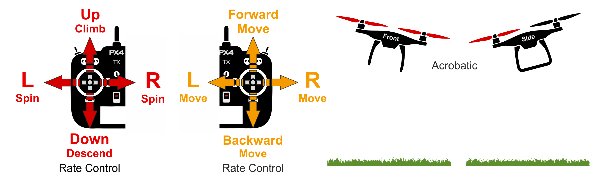
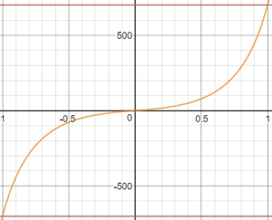
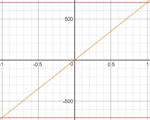
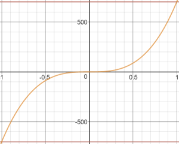

# 特技模式（多旋翼）

&nbsp;&nbsp;

_Acro mode_ is the RC mode for performing acrobatic maneuvers e.g. flips, rolls and loops.

The roll, pitch and yaw sticks control the rate of angular rotation around the respective axes and throttle is passed directly to control allocation. 当操纵杆居中时，飞机将停止旋转，但保持其当前朝向（在其侧面，倒置或任何其他方向）并根据当前动量移动。 When sticks are centered the vehicle will stop rotating, but remain in its current orientation (on its side, inverted, or whatever) and moving according to its current momentum.

<!-- image above incorrect: https://github.com/PX4/PX4-user_guide/issues/182 -->

## 技术描述

用于执行特技动作的R遥控/手动模式，例如翻转，滚转和环绕。

RC Roll/Pitch/Yaw (RPY) stick inputs control the rate of angular rotation around the respective axes.
Throttle is passed directly to control allocation.
When sticks are centered the vehicle will stop rotating, but remain in its current orientation (not necessarily level) and moving according to its current momentum.

Manual control input is required (such as RC control, joystick):

- Roll, Pitch, Yaw: Assistance from autopilot to stabilize the attitude rate.
  Position of RC stick maps to the rate of rotation of vehicle in that orientation.
- Throttle: Manual control via RC sticks.
  RC input is sent directly to control allocation.

## 杆输入映射

The default values for expo and rate [parameters](#parameters) are _beginner friendly_, reducing the chance that users will flip the vehicle when first trying this mode, or when using Acro mode for manual rate tuning.

Unfortunately they are poor for Acro flying though!
The following values are more reasonable for experienced users:

- [MC_ACRO_R_MAX](#MC_ACRO_R_MAX): `720` (2 turns per second)
- [MC_ACRO_P_MAX](#MC_ACRO_P_MAX): `720` (2 turns per second)
- [MC_ACRO_Y_MAX](#MC_ACRO_Y_MAX): `540` (2 turns per second)
- [MC_ACRO_EXPO](#MC_ACRO_R_MAX): `0.69`
- [MC_ACRO_EXPO_Y](#MC_ACRO_EXPO_Y): `0.69`
- [MC_ACRO_SUPEXPO](#MC_ACRO_SUPEXPO): `0.69`
- [MC_ACRO_SUPEXPOY](#MC_ACRO_SUPEXPOY): `0.7`

The roll, pitch, and yaw input stick mapping for Acro mode using the values above are shown below.
该曲线使得在最大杆输入处具有大转弯速率能够进行特技动作，在靠近杆回中位置的区域具有较低灵敏度以进行微调。

This roll and pitch input stick response can be tuned using the [MC_ACRO_EXPO](#MC_ACRO_EXPO) and [MC_ACRO_SUPEXPO](#MC_ACRO_SUPEXPO) "exponential" parameters, while the yaw stick input response is tuned using [MC_ACRO_EXPO_Y](#MC_ACRO_EXPO_Y) and [MC_ACRO_SUPEXPOY](#MC_ACRO_SUPEXPOY).
`MC_ACRO_EXPO` and `MC_ACRO_EXPO_Y` tune the curve(s) between a linear and cubic curve as shown below.
`MC_ACRO_SUPEXPO` and `MC_ACRO_SUPEXPOY` allow the shape to be further tuned, modifying the width of the area of reduced sensitivity.

 

:::info
The mathematical relationship is:

$$\mathrm{y} = r(f \cdot x^3 + x(1-f)) (1-g)/(1-g |x|)$$

Where `f = MC_ACRO_EXPO` or `MC_ACRO_EXPO_Y`, `g = MC_ACRO_SUPEXPO` or `MC_ACRO_SUPEXPOY`, and `r` is the maximum rate.

You can experiment with the relationships graphically using the [PX4 SuperExpo calculator](https://www.desmos.com/calculator/yty5kgurmc).
:::

## 参数

| 参数                                                                                                                                                                   | 描述                                                                                                                                                                                                                                                                                                                                                                                                 |
| -------------------------------------------------------------------------------------------------------------------------------------------------------------------- | -------------------------------------------------------------------------------------------------------------------------------------------------------------------------------------------------------------------------------------------------------------------------------------------------------------------------------------------------------------------------------------------------- |
| [MC_ACRO_EXPO](../advanced_config/parameter_reference.md#MC_ACRO_EXPO)                            | 特技模式“指数”因子，用于调整滚转和俯仰轴的杆输入曲线形状。 Values: `0` Purely linear input curve, `1` Purely cubic input curve. Default: `0`.                                                                                                                                                                                                                  |
| [MC_ACRO_EXPO_Y](../advanced_config/parameter_reference.md#MC_ACRO_EXPO_Y) | 特技模式“指数”因子，用于调整偏航轴的杆输入曲线形状。 Values: `0` Purely linear input curve, `1` Purely cubic input curve. Default: `0`.69.                                                                                                                                                                                                  |
| [MC_ACRO_SUPEXPO](../advanced_config/parameter_reference.md#MC_ACRO_SUPEXPO)                   | Acro mode "SuperExpo" factor for refining stick input curve shape for the roll and pitch axes (tuned using `MC_ACRO_EXPO`). 值：0——纯指数函数，0.7——合理增强直观操纵感的形状，0.95——非常弯曲的输入曲线，仅在最大值附近有效。 Default: `0`.                                                                                               |
| [MC_ACRO_SUPEXPOY](../advanced_config/parameter_reference.md#MC_ACRO_SUPEXPOY)                | Acro mode "SuperExpo" factor for refining stick input curve shape for the yaw axis (tuned using `MC_ACRO_EXPO_Y`). Values: `0` Pure Expo function, `0.7` reasonable shape enhancement for intuitive stick feel, `0.95` very strong bent input curve only near maxima have effect. Default: `0`. |
| [MC_ACRO_P_MAX](../advanced_config/parameter_reference.md#MC_ACRO_P_MAX)    | Max acro pitch rate. Default: `100.0` deg/s.                                                                                                                                                                                                                                                                                                       |
| [MC_ACRO_R_MAX](../advanced_config/parameter_reference.md#MC_ACRO_R_MAX)    | Max acro roll rate. Default: `100` deg/s.                                                                                                                                                                                                                                                                                                          |
| [MC_ACRO_Y_MAX](../advanced_config/parameter_reference.md#MC_ACRO_Y_MAX)    | Max acro yaw rate. Default: `100` deg/s.                                                                                                                                                                                                                                                                                                           |
