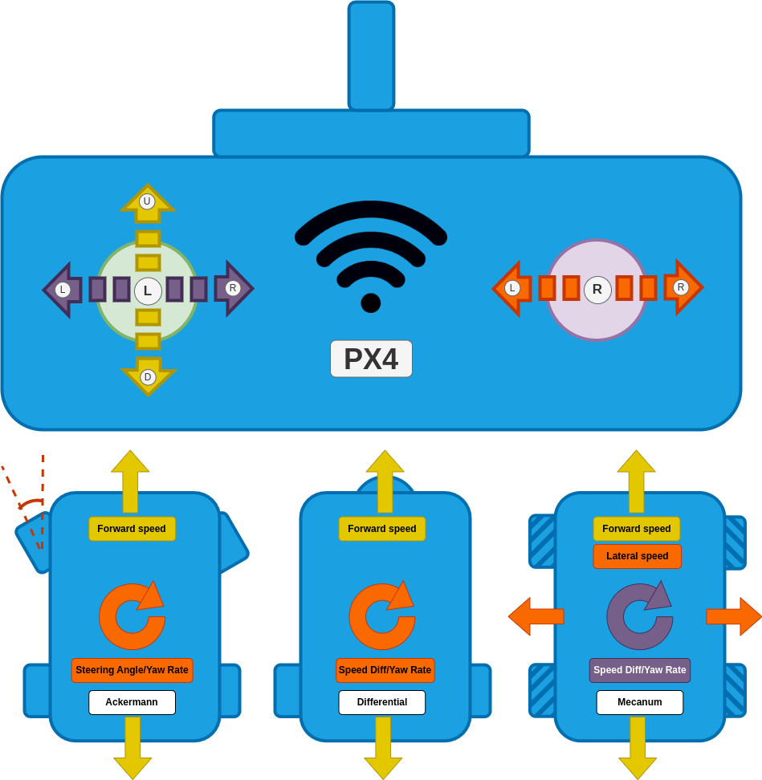

# Manual Modes

Manual modes require stick inputs from the user to drive the vehicle.

The sticks provide the same "high level" control effects over direction and rate of movement in all manual modes:

| Rover Type   | Left stick up/down                                                                         | Left stick left/right                                                                                                                                                                                                             | Right stick left/right                                                                                                                                                                                                            |
| ------------ | ------------------------------------------------------------------------------------------ | --------------------------------------------------------------------------------------------------------------------------------------------------------------------------------------------------------------------------------- | --------------------------------------------------------------------------------------------------------------------------------------------------------------------------------------------------------------------------------- |
| Ackermann    | Drive the rover forwards/backwards (controlling speed)                  | -                                                                                                                                                                                                                                 | Make a left/right turn (controlling steering angle in [Manual mode](#manual-mode), and yaw rate in [Acro](#acro-mode), [Stabilized](#stabilized-mode) and [Position](#position-mode) modes).   |
| Differential | Drive the rover forwards/backwards (controlling speed). | -                                                                                                                                                                                                                                 | Make a left/right turn (controlling speed difference in [Manual mode](#manual-mode), and yaw rate in [Acro](#acro-mode), [Stabilized](#stabilized-mode) and [Position](#position-mode) modes). |
| Mecanum      | Drive the rover forwards/backwards (controlling speed)                  | Make a left/right turn (controlling speed difference in [Manual mode](#manual-mode), and yaw rate in [Acro](#acro-mode), [Stabilized](#stabilized-mode) and [Position](#position-mode) modes). | Drive the rover left/right (controlling speed).                                                                                                                                                |

The manual modes provide progressively increasing levels of autopilot support for maintaining a course, speed, and rate of turn, compensating for external factors such as slopes or uneven terrain.

| 模式                                      | 描述                                                                                                                                                                                                                                                                                  |
| --------------------------------------- | ----------------------------------------------------------------------------------------------------------------------------------------------------------------------------------------------------------------------------------------------------------------------------------- |
| [Manual](manual.md#manual-mode)         | No autopilot support. User is responsible for keeping the rover on the desired course and maintaining speed and rate of turn.                                                                                                                       |
| [Acro](manual.md#acro-mode)             | + Maintains the yaw rate (feels more like driving a car than manual mode).  + Allows maximum yaw rate to be limited (protects against roll over).                                                          |
| [Stabilized](manual.md#stabilized-mode) | + Maintains the yaw (significantly better at holding a straight line).                                                                                                                                                                           |
| [Position](manual.md#position-mode)     | + Maintains the course (best mode for driving a straight line). + Maintains speed against disturbances, e.g. when driving up a hill. + Allows maximum speed to be limited. |

:::details
Overview mode mapping to control effect

| 模式                             | Speed                                                                                    | Turning                                                                                                                                                                                                                                                                 | Required measurements                                                              |
| ------------------------------ | ---------------------------------------------------------------------------------------- | ----------------------------------------------------------------------------------------------------------------------------------------------------------------------------------------------------------------------------------------------------------------------- | ---------------------------------------------------------------------------------- |
| [Manual](#manual-mode)         | Directly map stick input to motor command.                               | Directly map stick input to steering angle/speed difference.                                                                                                                                                                                            | None.                                                              |
| [Acro](#acro-mode)             | Directly map stick input to motor command.                               | Stick input creates a yaw rate setpoint for the control system to regulate.                                                                                                                                                                             | yaw rate.                                                          |
| [Stabilized](#stabilized-mode) | Directly map stick input to motor commands.                              | Stick input creates a yaw rate setpoint for the control system to regulate. If this setpoint is zero (stick is centered) the control system will maintain the current yaw (heading) of the rover. | Yaw rate and yaw.                                                  |
| [Position](#position-mode)     | Stick input creates a speed setpoint for the control system to regulate. | Stick input creates a yaw rate setpoint for the control system to regulate. If this setpoint is zero (stick is centered) the control system will keep the rover driving in a straight line.                          | yaw rate, yaw, speed and global position (GPS). |

:::

## 手动模式

In this mode the stick inputs are directly mapped to motor commands.
The rover does not attempt to maintain a specific orientation or compensate for external factors like slopes or uneven terrain!
The user is responsible for making the necessary adjustments to the stick inputs to keep the rover on the desired course.

| Rover Type   | Left stick up/down                                  | Left stick left/right                            | Right stick left/right                                     |
| ------------ | --------------------------------------------------- | ------------------------------------------------ | ---------------------------------------------------------- |
| Ackermann    | Drive the rover forwards/backwards. | -                                                | Move the steering angle to the left/right. |
| Differential | Drive the rover forwards/backwards. | -                                                | Yaw the rover to the left/right.           |
| Mecanum      | Drive the rover forwards/backwards. | Yaw the rover to the left/right. | Drive the rover left/right                                 |

For the configuration/tuning of this mode see [Basic Setup](../config_rover/basic_setup.md).

## Acro Mode

:::info
This mode requires a yaw rate measurement.
:::

In this mode the vehicle regulates its yaw rate to a setpoint (but does not stabilize heading or regulate speed).

| Rover Type   | Left stick up/down                                  | Left stick left/right                                                                                                                                                                                               | Right stick left/right                                                                                                                                                                                                               |
| ------------ | --------------------------------------------------- | ------------------------------------------------------------------------------------------------------------------------------------------------------------------------------------------------------------------- | ------------------------------------------------------------------------------------------------------------------------------------------------------------------------------------------------------------------------------------ |
| Ackermann    | Drive the rover forwards/backwards. | -                                                                                                                                                                                                                   | Create a yaw rate setpoint for the control system to regulate. If this input is zero the control system will attempt to maintain a zero yaw rate (minimal disturbance rejection). |
| Differential | Drive the rover forwards/backwards. | -                                                                                                                                                                                                                   | Create a yaw rate setpoint for the control system to regulate. If this input is zero the control system will attempt to maintain a zero yaw rate (minimal disturbance rejection)                  |
| Mecanum      | Drive the rover forwards/backwards. | Create a yaw rate setpoint for the control system to regulate. If this input is zero the control system will attempt to maintain a zero yaw rate (minimal disturbance rejection) | Drive the rover left/right                                                                                                                                                                                                           |

For the configuration/tuning of this mode see [Rate tuning](../config_rover/rate_tuning.md).

## Stabilized Mode

:::info
This mode requires a yaw rate and yaw estimate.
:::

In this mode the vehicle regulates its yaw rate to a setpoint and will maintain its heading if this setpoint is zero (but does not regulate speed).
Compared to [Acro mode](#acro-mode), this mode is much better at driving in a straight line as it can more effectively reject disturbances.

| Rover Type   | Left stick up/down                                  | Left stick left/right                                                                                                                                                  | Right stick left/right                                                                                                                                                 |
| ------------ | --------------------------------------------------- | ---------------------------------------------------------------------------------------------------------------------------------------------------------------------- | ---------------------------------------------------------------------------------------------------------------------------------------------------------------------- |
| Ackermann    | Drive the rover forwards/backwards. | -                                                                                                                                                                      | Create a yaw rate setpoint for the control system to regulate. If this input is zero the control system will maintain the current yaw. |
| Differential | Drive the rover forwards/backwards. | -                                                                                                                                                                      | Create a yaw rate setpoint for the control system to regulate. If this input is zero the control system will maintain the current yaw. |
| Mecanum      | Drive the rover forwards/backwards. | Create a yaw rate setpoint for the control system to regulate. If this input is zero the control system will maintain the current yaw. | Drive the rover left/right                                                                                                                                             |

For the configuration/tuning of this mode see [Attitude tuning](../config_rover/attitude_tuning.md).

## Position Mode

:::info
This mode requires a yaw rate, yaw, speed and global position estimate.
:::

This is the manual mode with the most autopilot support.
The vehicle regulates its yaw rate and speed to a setpoint.
If the yaw rate setpoint is zero, the controller will remember the GPS coordinates and yaw (heading) of the vehicle and use those to construct a line that the rover will then follow (course control).
This offers the highest amount of disturbance rejection, which leads to the best straight line driving behavior.

| Rover Type   | Left stick up/down                                                                                                                            | Left stick left/right                                                                                                                                                          | Right stick left/right                                                                                                                                                         |
| ------------ | --------------------------------------------------------------------------------------------------------------------------------------------- | ------------------------------------------------------------------------------------------------------------------------------------------------------------------------------ | ------------------------------------------------------------------------------------------------------------------------------------------------------------------------------ |
| Ackermann    | Stick position sets a forward/back speed setpoint. The vehicle attempts to maintain this speed on slopes etc. | -                                                                                                                                                                              | Create a yaw rate setpoint for the control system to regulate. If this input is zero the control system will maintain the course of the rover. |
| Differential | Stick position sets a forward/back speed setpoint. The vehicle attempts to maintain this speed on slopes etc. | -                                                                                                                                                                              | Create a yaw rate setpoint for the control system to regulate. If this input is zero the control system will maintain the course of the rover. |
| Mecanum      | Stick position sets a forward/back speed setpoint. The vehicle attempts to maintain this speed on slopes etc. | Create a yaw rate setpoint for the control system to regulate. If this input is zero the control system will maintain the course of the rover. | Stick position sets a left/right speed setpoint. The vehicle attempts to maintain this speed on slopes etc.                                    |

For the configuration/tuning of this mode see [Velocity tuning](../config_rover/velocity_tuning.md).
