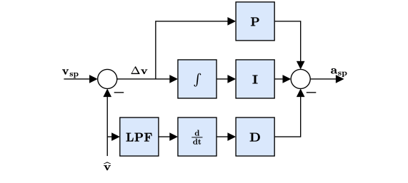
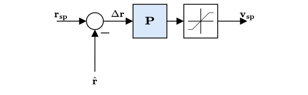

# 控制器图解

本节包括PX4主要控制器的图解。

The diagrams use the standard [PX4 notation](../contribute/notation.md) (and each have an annotated legend).

<!--    The diagrams were created with LaTeX / TikZ.
        The code can be found in assets/diagrams/mc_control_arch_tikz.tex.
        The easiest way to generate the diagrams and edit them is to copy the code and paste it an Overleaf (www.overleaf.com/) document to see the output.
-->

## 多旋翼的控制架构

- 这是一个标准的级联控制架构。
- 控制器采用P和PID控制的组合方式。
- Estimates come from [EKF2](../advanced_config/tuning_the_ecl_ekf.md).
- 在某些模式下，外环(位置回路) 可能会被绕过 (在图中表示为外环之后增加一个多路开关)。
  只有在位置保持模式或某轴无速度请求时，位置回路才会发挥作用。

### 多旋翼角速率控制器

- 采用K-PID控制器。 See [Rate Controller](../config_mc/pid_tuning_guide_multicopter.md#rate-controller) for more information.
- 为了防止积分饱和，积分环节的权重是受限的，
- The outputs are limited (in the control allocation module), usually at -1 and 1.
- A Low Pass Filter (LPF) is used on the derivative path to reduce noise (the gyro driver provides a filtered derivative to the controller).

  ::: info
  The IMU pipeline is:
  gyro data > apply calibration parameters > remove estimated bias > notch filter (`IMU_GYRO_NF0_BW` and `IMU_GYRO_NF0_FRQ`) > low-pass filter (`IMU_GYRO_CUTOFF`) > vehicle_angular_velocity (_filtered angular rate used by the P and I controllers_) > derivative -> low-pass filter (`IMU_DGYRO_CUTOFF`) > vehicle_angular_acceleration (_filtered angular acceleration used by the D controller_)

  

:::

  <!-- source for image is https://github.com/PX4/PX4-Autopilot/blob/850d0bc588af79186286652af4c8293daafd2c4c/src/lib/mixer/MultirotorMixer/MultirotorMixer.cpp#L323-L326 -->

### 多旋翼姿态控制器

- The attitude controller makes use of [quaternions](https://en.wikipedia.org/wiki/Quaternion).
- The controller is implemented from this [article](https://www.research-collection.ethz.ch/bitstream/handle/20.500.11850/154099/eth-7387-01.pdf).
- 当你调整这个控制器时，唯一需要考虑的参数是增益 P。
- 输出的角速率命令是饱和的。

### Multicopter Acceleration to Thrust and Attitude Setpoint Conversion

- The acceleration setpoints generated by the velocity controller will be converted to thrust and attitude setpoints.
- Converted acceleration setpoints will be saturated and prioritized in vertical and horizontal thrust.
- Thrust saturation is done after computing the corresponding thrust:
  1. Compute required vertical thrust (`thrust_z`)
  2. Saturate `thrust_z` with `MPC_THR_MAX`
  3. Saturate `thrust_xy` with `(MPC_THR_MAX^2 - thrust_z^2)^0.5`

Implementation details can be found in `PositionControl.cpp` and `ControlMath.cpp`.

### 多旋翼速度控制器

- 采用PID控制器来稳定速度。 该控制器输出的命令是加速度。
- 积分器包括了一个采用钳制方法的反复位饱和措施。
- The commanded acceleration is NOT saturated - a saturation will be applied to the converted thrust setpoints in combination with the maximum tilt angle.
- Horizontal gains set via parameter `MPC_XY_VEL_P_ACC`, `MPC_XY_VEL_I_ACC` and `MPC_XY_VEL_D_ACC`.
- Vertical gains set via parameter `MPC_Z_VEL_P_ACC`, `MPC_Z_VEL_I_ACC` and `MPC_Z_VEL_D_ACC`.

### 多旋翼位置控制器

- 采用简单的P控制器来控制速度。
- 输出的速度命令是饱和的，目的是保持一定的速度限制。 See parameter `MPC_XY_VEL_MAX`. This parameter sets the maximum possible horizontal velocity. This differs from the maximum **desired** speed `MPC_XY_CRUISE` (autonomous modes) and `MPC_VEL_MANUAL` (manual position control mode).
- Horizontal P gain set via parameter `MPC_XY_P`.
- Vertical P gain set via parameter `MPC_Z_P`.

#### 静态力矩 (PI) 缩放补偿

- Mode dependent feedforwards (ff) - e.g. Mission mode trajectory generator (jerk-limited trajectory) computes position, velocity and acceleration setpoints.
- Acceleration setpoints (inertial frame) will be transformed (with yaw setpoint) into attitude setpoints (quaternion) and collective thrust setpoint.

<!-- The drawing is on draw.io: https://drive.google.com/open?id=13Mzjks1KqBiZZQs15nDN0r0Y9gM_EjtX
Request access from dev team. -->

## 固定翼位置控制器

### 总能量控制系统(TECS)

The PX4 implementation of the Total Energy Control System (TECS) enables simultaneous control of true airspeed and altitude of a fixed-wing aircraft.
The code is implemented as a library which is used in the fixed-wing position control module.

从上面的图表可以看出，TECS 接受空速和高度需求量，然后输出油门和俯仰角控制量。
These two outputs are sent to the fixed-wing attitude controller which implements the attitude control solution. However, the throttle setpoint is passed through if it is finite and if no engine failure was detected.
It's therefore important to understand that the performance of TECS is directly affected by the performance of the pitch control loop.
A poor tracking of airspeed and altitude is often caused by a poor tracking of the aircraft pitch angle.

:::info
Make sure to tune the attitude controller before attempting to tune TECS.
:::

同时控制飞机的空速和高度不是一件简单的事。
增加飞行器的俯仰角会导致高度上升，同时也会导致空速下降。
推力（通过油门控制）增加整个飞机的总能量。
因此，俯仰角和油门两个输入量都会对空速和高度产生影响，从而使控制问题变得难了。

TECS 提供了一种解决方案，即根据能量而不是初始设定值来反映问题。
一架飞行器的总能量是飞行器动能和势能之和。 推力（通过油门控制）可以增加飞机的总能量。 一个给定的总能量状态可以通过势能和动能的任意组合来实现。
换句话说，飞行器在高海拔以低空速飞行和在低海拔以高空速飞行时的总能量是等价的。 我们称这种情况叫做比能量平衡，它是根据当前高度和真实空速设定值计算的。
可以通过控制俯仰角来控制飞行器的比能量平衡。
俯仰角增加将动能转变为势能，俯仰角减少则情况相反。
这样，通过将初始空速和海拔设定值转化为能量大小（空速和海拔存在耦合，而能量大小可以独立控制），就可以把控制问题解耦。
我们利用油门调节飞行器的特定总能量，利用俯仰角来维持势能（高度）和动能（真空速）的特定平衡点。

#### 总能量控制回路

<!-- https://drive.google.com/file/d/1q12b6ASbQRkFWqLMXm92cryOI-cZnrKv/view?usp=sharing -->

#### 比能量控制回路

<!-- The drawing is on draw.io: https://drive.google.com/file/d/1bZtFULYmys-_EQNhC9MNcKLFauc7OYJZ/view -->

一架飞行器的总能量包括动能和势能。

$$E_T = \frac{1}{2} m V_T^2 + m g h$$

对时间求微分，就可以得到能量的变化率：

$$\dot{E_T} = m V_T \dot{V_T} + m g \dot{h}$$

通过上式，我们可以定义能量变化率：

$$\dot{E} = \frac{\dot{E_T}}{mgV_T}  = \frac{\dot{V_T}}{g} + \frac{\dot{h}}{V_T} = \frac{\dot{V_T}}{g} + sin(\gamma)$$

其中$\gamma{}$是飞行器纵平面的速度角。
当$\gamma{}$很小时，我们可以近似认为sin（$\gamma{}$）=$\gamma{}$，所以可以得到下式：

$$\dot{E} \approx  \frac{\dot{V_T}}{g} + \gamma$$

列出飞行器的动力学方程，我们可以得到下式：

$$T - D = mg(\frac{\dot{V_T}}{g} + sin(\gamma)) \approx mg(\frac{\dot{V_T}}{g} + \gamma)$$

这里面的 T 和 D 分别是飞行器的推力和受到的阻力。
在水平飞行中，推力和阻力应该相等，所以推力的变化会导致下面式子：

$$\Delta T = mg(\frac{\dot{V_T}}{g} + \gamma)$$

正如可以看到的，$\Delta T{}$ 成正比 $\dot{E}{}$，因此推力设置值应该用于控制总能量。

另一方面，对升降舵的控制是能量守恒的，因此用来交换动力能源，反之亦然。控制升降舵可以将势能转换为动能，反之亦然。 为此，特定的能量平衡变化率定义为：

$$\dot{B} = \gamma - \frac{\dot{V_T}}{g}$$

## 固定翼姿态控制器

<!-- The drawing is on draw.io: https://drive.google.com/file/d/1ibxekmtc6Ljq60DvNMplgnnU-JOvKYLQ/view?usp=sharing
Request access from dev team. -->

姿态控制器采用级联环路的方法工作。
外环计算姿态设定值和估计值的误差，并将误差乘上一个增益（比例控制器），产生角速率设定值。
内环计算角速率误差，并采用（比例+积分）控制器产生一个所需要的角加速度。

The angular position of the control effectors (ailerons, elevators, rudders, ...) is then computed using this desired angular acceleration and a priori knowledge of the system through control allocation (also known as mixing).
此外，由于控制面在高速时更有效，而在低速时效率较低，因此根据巡航速度调整的控制器使用空速测量值进行缩放（如果使用这样的传感器）。

:::info
If no airspeed sensor is used then gain scheduling for the FW attitude controller is  disabled (it's open loop); no correction is/can be made in TECS using airspeed feedback.
:::

前馈增益用于补偿空气动力阻尼。
基本上，绕机体轴的两个主要力矩分量分别来自：控制翼面 (副翼，水平尾翼，垂直尾翼 - 驱动机体转动) 和 空气动力阻尼 (与机体角速率成正比 - 阻止机体转动) 。
为了保持恒定的角速率, 可以在角速率回路中使用前馈来补偿这种气动阻尼。

### Turn coordination

滚转和俯仰控制器具有相同的结构，并且假设纵向和横向动力学足够解耦，可以独立工作。
但是，为了将飞机侧滑产生的侧向加速度最小化，偏航控制器利用转向协调约束产生偏航速率设定值。  The turn coordination algorithm is based solely on coordinated turn geometry calculation.

$$\dot{\Psi}_{sp} = \frac{g}{V_T} \tan{\phi_{sp}} \cos{\theta_{sp}}$$

The yaw rate controller also helps to counteract [adverse yaw effects](https://youtu.be/sNV_SDDxuWk) and to damp the [Dutch roll mode](https://en.wikipedia.org/wiki/Dutch_roll) by providing extra directional damping.

## VTOL 飞行控制器

<!-- The drawing is on draw.io: https://drive.google.com/file/d/1tVpmFhLosYjAtVI46lfZkxBz_vTNi8VH/view?usp=sharing
Request access from dev team. -->

This section gives a short overview on the control structure of Vertical Take-off and Landing (VTOL) aircraft.
The VTOL flight controller consists of both the multicopter and fixed-wing controllers, either running separately in the corresponding VTOL modes, or together during transitions.
The diagram above presents a simplified control diagram.
Note the VTOL attitude controller block, which mainly facilitates the necessary switching and blending logic for the different VTOL modes, as well as VTOL-type-specific control actions during transitions (e.g. ramping up the pusher motor of a standard VTOL during forward transition).
The inputs into this block are called "virtual" as, depending on the current VTOL mode, some are ignored by the controller.

For a standard and tilt-rotor VTOL, during transition the fixed-wing attitude controller produces the rate setpoints, which are then fed into the separate rate controllers, resulting in torque commands for the multicopter and fixed-wing actuators.
For tailsitters, during transition the multicopter attitude controller is running.

The outputs of the VTOL attitude block are separate torque and force commands for the multicopter and fixed-wing actuators (two instances for `vehicle_torque_setpoint` and `vehicle_thrust_setpoint`).
These are handled in an airframe-specific control allocation class.

For more information on the tuning of the transition logic inside the VTOL block, see [VTOL Configuration](../config_vtol/index.md).

### Airspeed Scaling

The objective of this section is to explain with the help of equations why and how the output of the rate PI and feedforward (FF) controllers can be scaled with airspeed to improve the control performance.
We will first present the simplified linear dimensional moment equation on the roll axis, then show the influence of airspeed on the direct moment generation and finally, the influence of airspeed during a constant roll.

As shown in the fixed-wing attitude controller above, the rate controllers produce angular acceleration setpoints for the control allocator (here named "mixer").
In order to generate these desired angular accelerations, the mixer produces torques using available aerodynamic control surfaces (e.g.: a standard airplane typically has two ailerons, two elevators and a rudder).
The torques generated by those control surfaces is highly influenced by the relative airspeed and the air density, or more precisely, by the dynamic pressure.
If no airspeed scaling is made, a controller tightly tuned for a certain cruise airspeed will make the aircraft oscillate at higher airspeed or will give bad tracking performance at low airspeed.

The reader should be aware of the difference between the [true airspeed (TAS)](https://en.wikipedia.org/wiki/True_airspeed) and the [indicated airspeed (IAS)](https://en.wikipedia.org/wiki/Indicated_airspeed) as their values are significantly different when not flying at sea level.

The definition of the dynamic pressure is

$$\bar{q} = \frac{1}{2} \rho V_T^2$$

where $\rho{}$ is the air density and $V_T{}$ the true airspeed (TAS).

Taking the roll axis for the rest of this section as an example, the dimensional roll moment can be written

$$\ell = \frac{1}{2}\rho V_T^2 S b C_\ell = \bar{q} S b C_\ell$$

where $\ell{}$ is the roll moment, $b{}$ the wing span and $S{}$ the reference surface.

The nondimensional roll moment derivative $C_\ell{}$ can be modeled using the aileron effectiveness derivative $C_{\ell_{\delta_a}}{}$, the roll damping derivative $C_{\ell_p}{}$ and the dihedral derivative $C_{\ell_\beta}{}$

$$C_\ell = C_{\ell_0} + C_{\ell_\beta}\:\beta + C_{\ell_p}\:\frac{b}{2V_T}\:p + C_{\ell_{\delta_a}} \:\delta_a$$

where $\beta{}$ is the sideslip angle, $p{}$ the body roll rate and $\delta_a{}$ the aileron deflection.

Assuming a symmetric ($C_{\ell_0} = 0{}$) and coordinated ($\beta = 0{}$) aircraft, the equation can be simplified using only the rollrate damping and the roll moment produced by the ailerons

$$\ell = \frac{1}{2}\rho V_T^2 S b \left [C_{\ell_{\delta_a}} \:\delta_a + C_{\ell_p}\:\frac{b}{2V_T} \: p \right ]$$

This final equation is then taken as a baseline for the two next subsections to determine the airspeed scaling expression required for the PI and the FF controllers.

#### 静态力矩 (PI) 缩放补偿

At a zero rates condition ($p = 0{}$), the damping term vanishes and a constant - instantaneous - torque can be generated using:

$$\ell = \frac{1}{2}\rho V_T^2 S b \: C_{\ell_{\delta_a}} \:\delta_a = \bar{q} S b \: C_{\ell_{\delta_a}} \:\delta_a$$

Extracting $\delta_a{}$ gives

$$\delta_a = \frac{2bS}{C_{\ell_{\delta_a}}} \frac{1}{\rho V_T^2} \ell = \frac{bS}{C_{\ell_{\delta_a}}} \frac{1}{\bar{q}} \ell$$

where the first fraction is constant and the second one depends on the air density and the true airspeed squared.

Furthermore, instead of scaling with the air density and the TAS, it can be shown that the indicated airspeed (IAS, $V_I{}$) is inherently adjusted by the air density since at low altitude and speed, IAS can be converted to TAS using a simple density error factor

$$V_T = V_I \sqrt{\frac{\rho_0}{\rho}}$$

, where $\rho_o{}$ is the air density as sea level, 15°C.

Squaring, rearranging and adding a 1/2 factor to both sides makes the dynamic pressure $\bar{q}{}$ expression appear

$$\bar{q} = \frac{1}{2} \rho V_T^2 = \frac{1}{2} V_I^2 \rho_0$$

We can now easily see that the dynamic pressure is proportional to the IAS squared:

$$\bar{q} \propto V_I^2$$

The scaler previously containing TAS and the air density can finally be written using IAS only

$$\delta_a = \frac{2bS}{C_{\ell_{\delta_a}}\rho_0} \frac{1}{V_I^2} \ell$$

#### 角速率回路 (FF) 缩放补偿

The main use of the feedforward of the rate controller is to compensate for the natural rate damping.
Starting again from the baseline dimensional equation but this time, during a roll at constant speed, the torque produced by the ailerons should exactly compensate for the damping such as

$$- C_{\ell_{\delta_a}} \:\delta_a = C_{\ell_p} \frac{b}{2 V_T} \: p$$

Rearranging to extract the ideal ailerons deflection gives

$$\delta_a = -\frac{b \: C_{\ell_p}}{2 \: C_{\ell_{\delta_a}}} \frac{1}{V_T} \: p$$

The first fraction gives the value of the ideal feedforward and we can see that the scaling is linear to the TAS.
Note that the negative sign is then absorbed by the roll damping derivative which is also negative.

#### 总结

The output of the rate PI controller has to be scaled with the indicated airspeed (IAS) squared and the output of the rate feedforward (FF) has to be scaled with the true airspeed (TAS)

$$\delta_{a} = \frac{V_{I_0}^2}{V_I^2} \delta_{a_{PI}} + \frac{V_{T_0}}{V_T} \delta_{a_{FF}}$$

where $V_{I_0}{}$ and $V_{T_0}{}$ are the IAS and TAS at trim conditions.

Finally, since the actuator outputs are normalized and that the mixer and the servo blocks are assumed to be linear, we can rewrite this last equation as follows:

$$\dot{\mathbf{\omega}}_{sp}^b = \frac{V_{I_0}^2}{V_I^2} \dot{\mathbf{\omega}}_{sp_{PI}}^b + \frac{V_{T_0}}{V_T} \dot{\mathbf{\omega}}_{sp_{FF}}^b$$

and implement it directly in the rollrate, pitchrate and yawrate controllers.

In the case of airframes with controls performance that is not dependent directly on airspeed e.g. a rotorcraft like [autogyro](../frames_autogyro/index.md). There is possibility to disable airspeed scaling feature by [FW_ARSP_SCALE_EN](../advanced_config/parameter_reference.md#FW_ARSP_SCALE_EN) parameter.

#### Tuning recommendations

The beauty of this airspeed scaling algorithm is that it does not require any specific tuning.
However, the quality of the airspeed measurements directly influences its performance.

Furthermore, to get the largest stable flight envelope, one should tune the attitude controllers at an airspeed value centered between the stall speed and the maximum airspeed of the vehicle (e.g.: an airplane that can fly between 15 and 25m/s should be tuned at 20m/s).
This "tuning" airspeed should be set in the [FW_AIRSPD_TRIM](../advanced_config/parameter_reference.md#FW_AIRSPD_TRIM) parameter.
