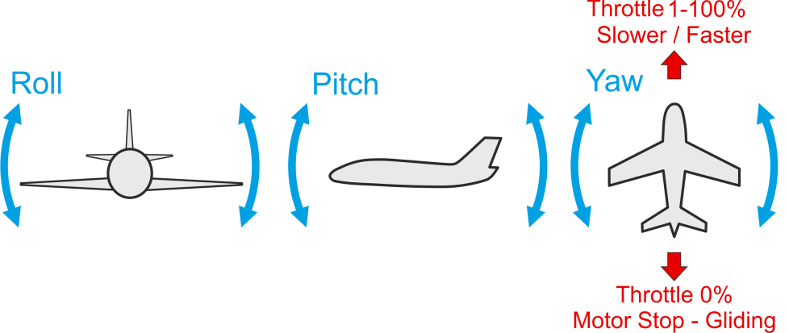

# Basic Flying (Fixed Wing)

This topic explains the basics of flying a vehicle using an [RC Transmitter](../getting_started/rc_transmitter_receiver.md) in a manual or autopilot-assisted flight mode (for autonomous flight see: [Missions](../flying/missions.md)).

:::info
Before you fly for the first time you should read our [First Flight Guidelines](../flying/first_flight_guidelines.md).
:::

## Arm the Vehicle

Before you can fly the vehicle it must first be [armed](../getting_started/px4_basic_concepts.md#arming-and-disarming).
This will power all motors and actuators, and may start propellers turning.

To arm the drone:

- First disengage the [safety switch](../getting_started/px4_basic_concepts.md#safety-switch) (if present).
- Use the arm command for your vehicle
  - Put the throttle stick in the bottom right corner (use the [arming gesture](../advanced_config/prearm_arm_disarm.md#arm_disarm_gestures)).
  - Alternatively configure an [arm/disarm switch](../config/safety.md#arm-disarm-switch).
  - You can also arm in _QGroundControl_ (PX4 does not require a radio control for flying autonomously).

:::tip
The vehicle will not arm until it is [calibrated/configured](../config/index.md) and has a position lock.
[Vehicle Status Notifications](../getting_started/vehicle_status.md) (including on-vehicle LEDs, audio notifications and _QGroundControl_ updates) can tell you when the vehicle is ready to fly (and help you work out the cause when it is not ready to fly).
:::

:::info
The vehicle will (by [default](../advanced_config/parameter_reference.md#COM_DISARM_PRFLT)) automatically [disarm](../advanced_config/prearm_arm_disarm.md#auto-disarming) (turn off motors) if you take too long to take off!
This is a safety measure to ensure that vehicles return to a safe state when not in use.
:::

<!--
A VTOL vehicle can only arm in multicopter mode (by default - arming in fixed-wing mode can be enabled using [CBRK_VTOLARMING](../advanced_config/parameter_reference.md#CBRK_VTOLARMING)).
-->

## Takeoff

:::info
Taking off manually (and landing) is not easy!
We recommend using with the automatic modes instead, especially for inexperienced pilots.
:::

[Stabilized mode](../flight_modes_fw/stabilized.md), [Acro mode](../flight_modes_fw/acro.md) or [Manual mode](../flight_modes_fw/manual.md) mode are recommended for manual takeoff.
[Position mode](../flight_modes_fw/position.md) and [Altitude mode](../flight_modes_fw/altitude.md) can also be used, but it is important to accelerate the vehicle sufficiently before bringing them airborne — strong thrust if hand-launched, long runway phase for runway takeoff (this is required because the controller in these modes can prioritize airspeed over altitude tracking).

Manual takeoffs with hand-launched planes:

- Ramp up the motor and throw the vehicle horizontally.
- Do not pitch up too fast as this may stall the plane.
- A good vehicle trim is crucial for safe hand-launch takeoffs, because if the vehicle doesn't fly level there is only a very short time for the pilot to react before the vehicle crashes!

Manual takeoffs with runway-launched planes:

- Accelerate on the runway until the speed is sufficient for takeoff.
- If the plane has a steerable wheel, use the yaw stick to keep it on course.
- Once the speed is sufficient pull up the nose with the pitch stick.

Automatic takeoffs are possible in the [Mission mode](../flight_modes_fw/mission.md#mission-takeoff) or [Takeoff mode (FW)](../flight_modes_fw/takeoff.md).
The pilot can take over manual control over the vehicle at any moment during the takeoff process or after it by changing into a manual flight mode.

## 降落

[Stabilized mode](../flight_modes_fw/stabilized.md), [Acro mode](../flight_modes_fw/acro.md) or [Manual mode](../flight_modes_fw/manual.md) are recommended for landing (just as they are for takeoff).
In these modes the pilot has full control over the motor thrust, which is required to perform a manual flaring maneuver when close to the ground (raising the vehicle nose without increasing throttle).
You should perform the landing in headwind to reduce the groundspeed before touching down.

For auto landings you should use a [Fixed-Wing Mission Landing](../flight_modes_fw/mission.md#mission-landing).
This landing is defined in a mission, and can be used in either [Mission](../flight_modes_fw/mission.md) or [Return](../flight_modes_fw/return.md) modes.

The automatic [Land mode](../flight_modes_fw/land.md) mode is not recommended unless absolutely necessary, as it cannot account for underlying terrain.

<!-- Added this to make it more generic: We'll split this out later -->

Note that vehicles automatically disarm on landing by default:

- Use [COM_DISARM_LAND](../advanced_config/parameter_reference.md#COM_DISARM_LAND) to set the time to auto-disarm after landing (or disable it altogether).
- Manually disarm by putting the throttle stick in the bottom left corner.

## Flight Controls/Commands

All flying, including takeoff and landing, is controlled using the 4 basic commands: roll, yaw, pitch and throttle.

In order to control your aircraft you need to understand how the basic Roll, Pitch, Yaw and Throttle commands affect movement in 3D space.
Forward-flying aircraft (planes, VTOL in forward flight) respond to the movement commands as shown below:

- Pitch => Up/down.
- Roll => Left/right and a turn.
- Yaw => Left/right tail rotation and turn.
- Throttle => Changed forward speed.

:::info
The best turn for airplanes is called a coordinated turn, and is performed using roll and little yaw at the same time.
This maneuver requires experience!
:::

## Assisted Flight

Even with an understanding of how the vehicle is controlled, flight in fully manual mode can be quite unforgiving.
New users should [configure their transmitter](../config/flight_mode.md) to use flight modes where the autopilot automatically compensates for erratic user input or environmental factors.

The following three modes are highly recommended for new users:

- [Stabilized Mode](../flight_modes_fw/stabilized.md) - Vehicle hard to flip, and will level-out if the sticks are released (but not hold position)
- [Altitude Mode)](../flight_modes_fw/altitude.md) - Climb and drop are controlled to have a maximum rate.
- [Position Mode](../flight_modes_fw/position.md) - When sticks are released the vehicle will stop (and hold position against wind drift)

:::info
You can also engage automatic modes through the _QGroundControl_ main flight screen.
:::
