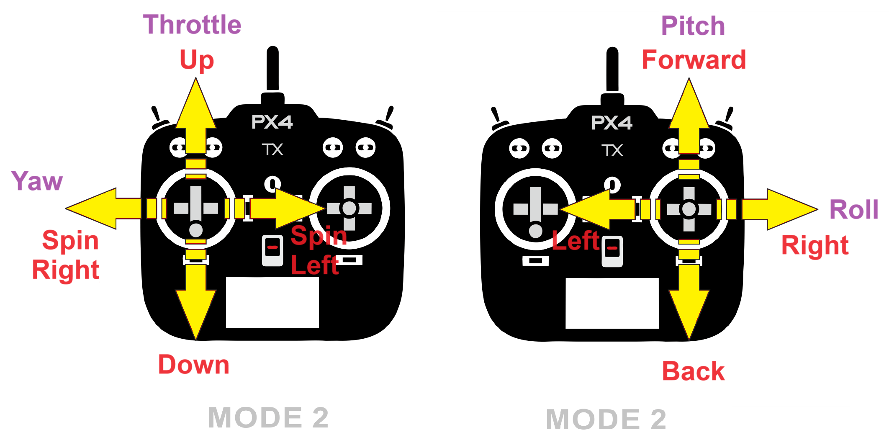
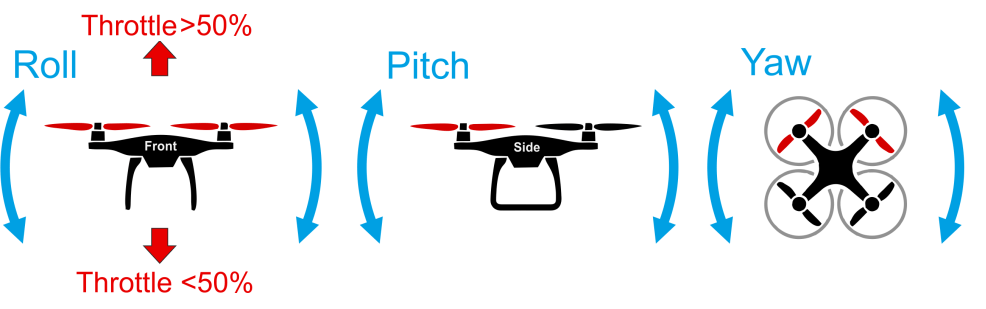

# Basic Flying (Multicopter)

This topic explains the basics of flying a vehicle using an [RC Transmitter](../getting_started/rc_transmitter_receiver.md) or [Joystick](../config/joystick.md) in a manual or autopilot-assisted flight mode (for autonomous flight see: [Missions](../flying/missions.md)).

:::info
Before you fly for the first time you should read our [First Flight Guidelines](../flying/first_flight_guidelines.md).
:::

## Arm the Vehicle

Before you can fly the vehicle it must first be [armed](../getting_started/px4_basic_concepts.md#arming-and-disarming).
This will power all motors and actuators.
Unless you're doing a [Throw Launch](../flight_modes_mc/throw_launch.md) the propellers will also start turning.

To arm the drone:

- First disengage the [safety switch](../getting_started/px4_basic_concepts.md#safety-switch) (if present).
- Use the arm command for your vehicle:
  - Put the throttle stick in the bottom right corner (use the [arming gesture](../advanced_config/prearm_arm_disarm.md#arm_disarm_gestures)).
  - Alternatively configure an [arm/disarm switch](../config/safety.md#arm-disarm-switch).
  - You can also arm in _QGroundControl_ (PX4 does not require a radio control for flying autonomously).

:::tip
The vehicle will not arm until it is [calibrated/configured](../config/index.md) and has a position lock.
[Vehicle Status Notifications](../getting_started/vehicle_status.md) (including on-vehicle LEDs, audio notifications and _QGroundControl_ updates) can tell you when the vehicle is ready to fly (and help you work out the cause when it is not ready to fly).
:::

:::info
The vehicle will (by [default](../advanced_config/parameter_reference.md#COM_DISARM_PRFLT)) automatically [disarm](../advanced_config/prearm_arm_disarm.md#auto-disarming) (turn off motors) if you take too long to take off!
This is a safety measure to ensure that vehicles return to a safe state when not in use.
:::

<!--
A VTOL vehicle can only arm in multicopter mode (by default - arming in fixed-wing mode can be enabled using [CBRK_VTOLARMING](../advanced_config/parameter_reference.md#CBRK_VTOLARMING)).
-->

## Takeoff

Multicopter pilots can take off _manually_ by enabling any manual mode, arming the vehicle and then raising the throttle stick until the motors produce enough thrust to leave the ground.
In [Position mode](../flight_modes_mc/position.md) or [Altitude mode](../flight_modes_mc/altitude.md) the throttle stick has to be increased to above 62.5% to command a climb rate and make the vehicle leave the ground.
Above this value all controllers are enabled and the vehicle goes to the throttle level required for hovering ([MPC_THR_HOVER](../advanced_config/parameter_reference.md#MPC_THR_HOVER)).

[Throw Launch](../flight_modes_mc/throw_launch.md) is also supported, in which the vehicle activates motors after it detects that it has reached the apex of a throw, and then operates according to its current mode.

Alternatively the takeoff can performed by switching to the automatic [Takeoff mode](../flight_modes_mc/takeoff.md).

:::info
The vehicle may disarm if you take too long to take off after arming (tune the timeout using [COM_DISARM_PRFLT](../advanced_config/parameter_reference.md#COM_DISARM_PRFLT)).
:::

:::info
The [Failure Detector](../config/safety.md#failure-detector) will automatically stop the engines if there is a problem on takeoff.
:::

## 降落

Multicopters can be landed in any manual mode.
Make sure to keep the throttle stick pulled down after touching down until the motors have switched off.

Note that vehicles automatically disarm on landing by default:

- Use [COM_DISARM_LAND](../advanced_config/parameter_reference.md#COM_DISARM_LAND) to set the time to auto-disarm after landing (or disable it altogether).
- Manually disarm by putting the throttle stick in the bottom left corner.

The vehicle can also be landed autonomously by engaging [Land mode](../flight_modes_mc/land.md) or [Return mode](../flight_modes_mc/return.md).

:::info
If you see the vehicle "twitch" during landing (turn down the motors, and then immediately turn them back up) this is probably caused by a poor [Land Detector Configuration](../advanced_config/land_detector.md) (specifically, a poorly set [MPC_THR_HOVER](../advanced_config/parameter_reference.md#MPC_THR_HOVER)).
:::

## Flight Controls/Commands

Vehicle movement is controlled using the 4 basic commands: roll, yaw, pitch and throttle.
As the throttle is increased the rotors spin faster and the vehicle moves up, if the vehicle pitches forward then some of that that force will move the vehicle forward, if it rolls to the left/right, then some of that force will move the vehicle left/right, and changing the yaw spins the vehicle on its axis over the ground plane.

These commands therefore allow you to move left/right, spin left/right, forward/back, and up/down, respectively, as shown on the [Mode 2](../getting_started/rc_transmitter_receiver.md#remote-control-units-for-aircraft) RC controller shown below.

## Assisted Flight

Even with an understanding of how the vehicle is controlled, flight in fully manual mode can be quite unforgiving.
New users should [configure their transmitter](../config/flight_mode.md) to use flight modes where the autopilot automatically compensates for erratic user input or environmental factors.

The following three modes are highly recommended for new users:

- [Position mode](../flight_modes_mc/position.md) - When sticks are released the vehicle will stop (and hold position against wind drift)
- [Altitude mode](../flight_modes_mc/altitude.md) - Climb and drop are controlled to have a maximum rate.
- [Stabilized mode](../flight_modes_mc/manual_stabilized.md) - Vehicle hard to flip, and will level-out if the sticks are released (but not hold position)

:::info
You can also engage automatic modes on the _QGroundControl_ main flight screen.
:::

## See Also

- [Terrain Follow/Hold & Range Assistance](../flying/terrain_following_holding.md) — How to enable terrain following
- [Missions](../flying/missions.md)
