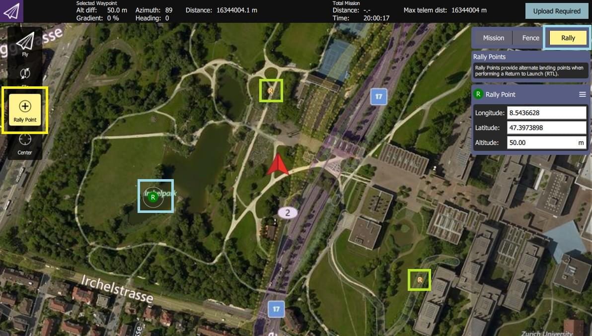

# 安全点(集结点)

Safety points are alternative [Return Mode](../flight_modes/return.md) destinations/landing points.
When enabled, the vehicle will choose the _closest return destination_ of: home location, mission landing pattern or a _safety point_.

## 创建/定义安全点

Safety points are created in _QGroundControl_ (which calls them "Rally Points").

总结：

1. Open **QGroundControl > Plan View**
2. Select the **Rally** tab/button on the _Plan Editor_ (right of screen).
3. Select the **Rally Point** button on the toolbar (left of screen).
4. 在地图上点击任意位置来添加集结/安全点。
   - The _Plan Editor_ displays and lets you edit the current rally point (shown as a green **R** on the map).
   - You can select another rally point (shown as a more orange/yellow **R** on the map) to edit it instead.
5. Select the **Upload Required** button to upload the rally points (along with any [mission](../flying/missions.md) and [geofence](../flying/geofence.md)) to the vehicle.

:::tip
More complete documentation can be found in the _QGroundControl User Guide_: [Plan View - Rally Points](https://docs.qgroundcontrol.com/master/en/qgc-user-guide/plan_view/plan_rally_points.html).
:::

## 使用安全点

Safety points are not enabled by default (there are a number of different [Return Mode Types](../flight_modes/return.md#return_types)).

启用安全点的方法：

1. [Use the QGroundControl Parameter Editor](../advanced_config/parameters.md) to set parameter: [RTL_TYPE=3](../advanced_config/parameter_reference.md#RTL_TYPE).
