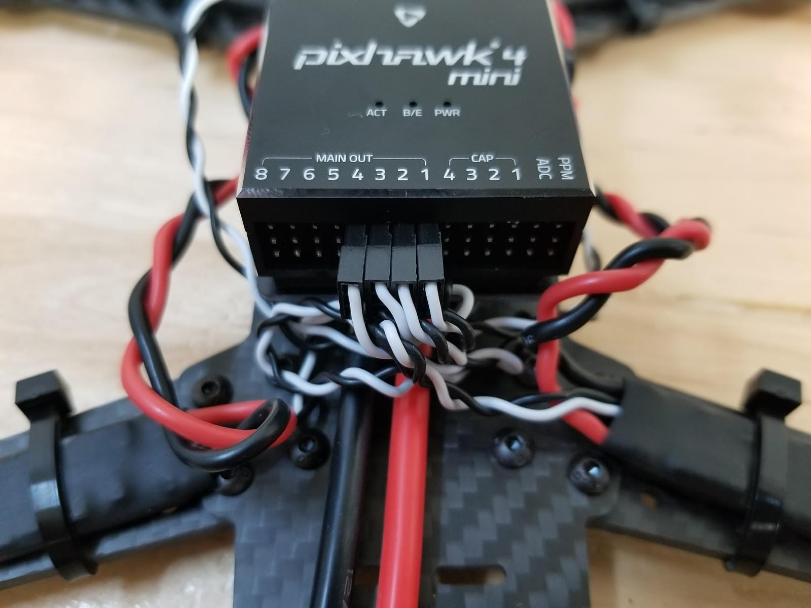
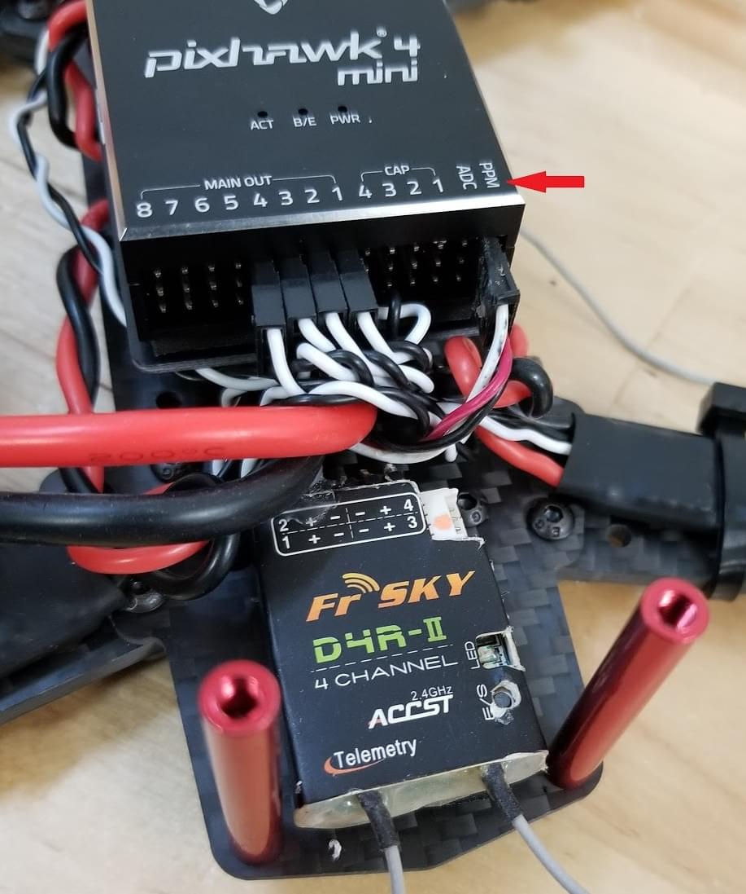
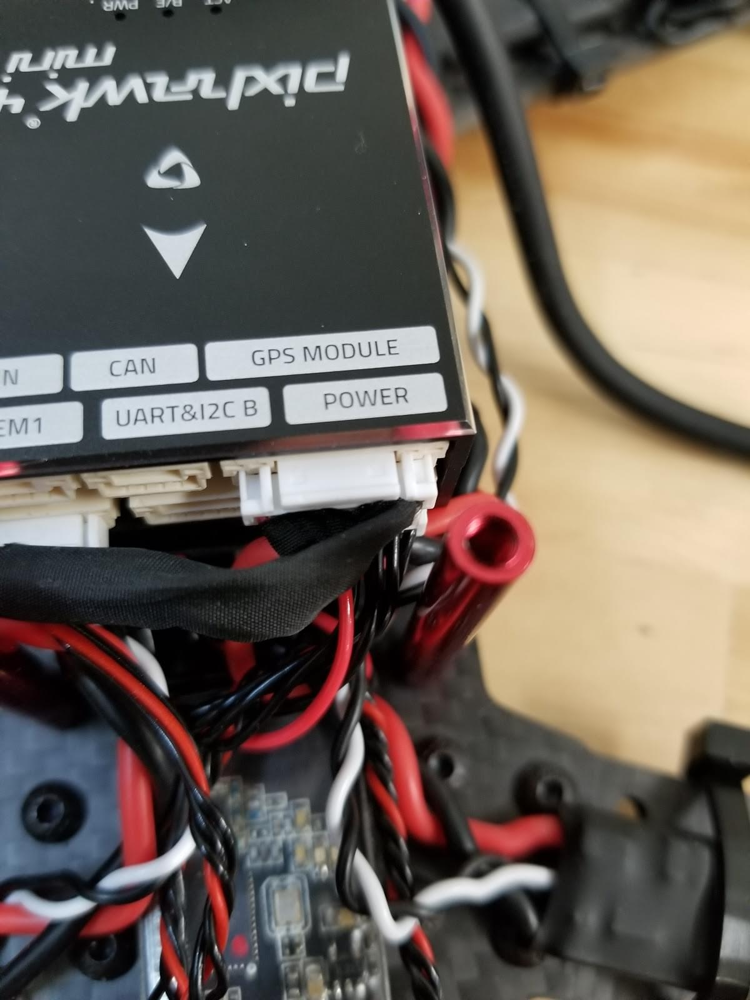
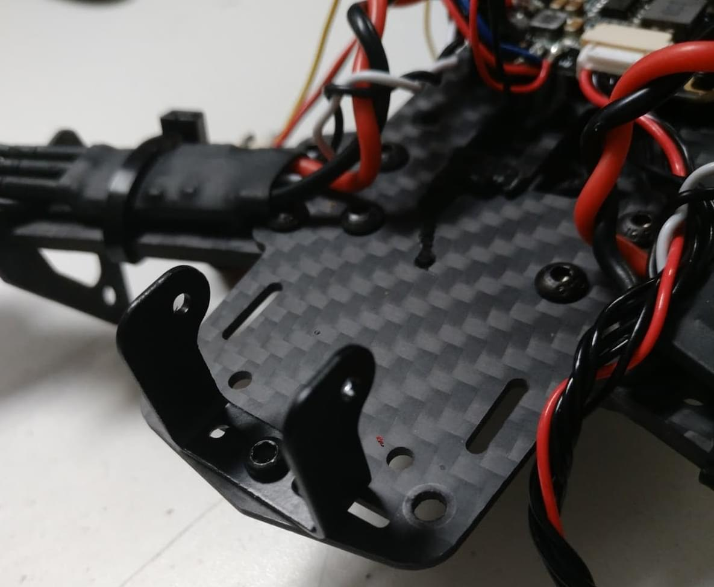
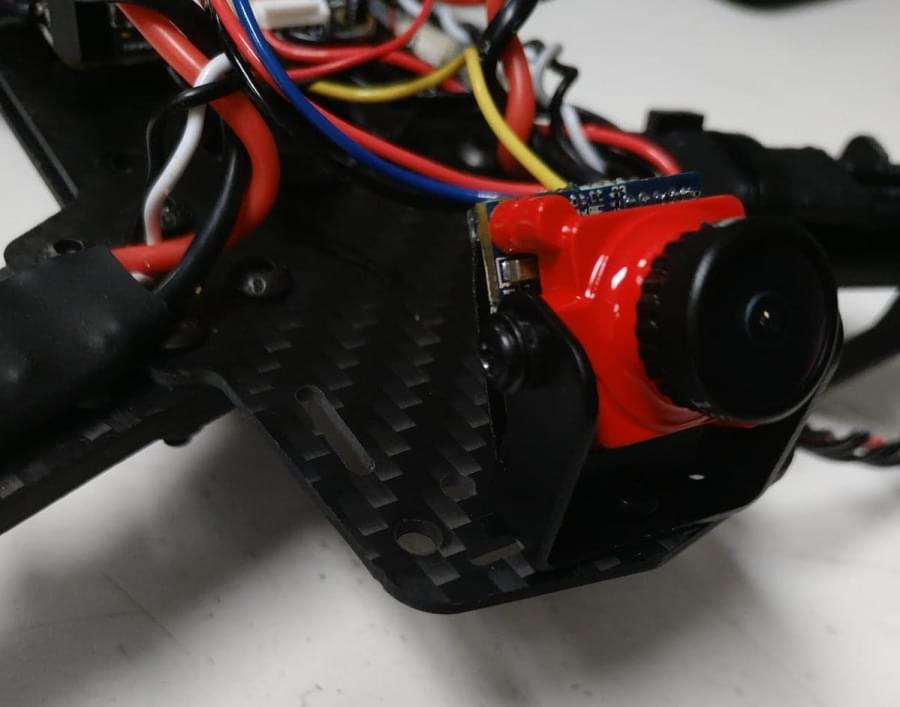
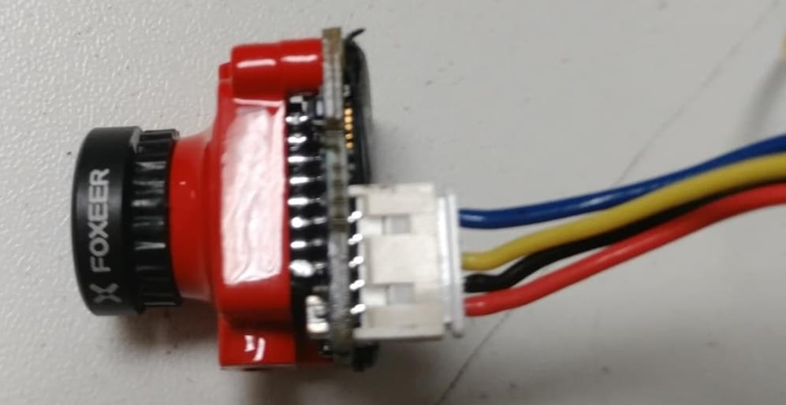

# Holybro QAV250 + Pixhawk 4 Mini Build (Discontinued)

:::info
The _Holybro Pixhawk 4 Mini QAV250 Kit_ is no longer available.

The instructions have been left here because very similar kits based on the Pix32 v6 are [available here](https://holybro.com/products/qav250-kit).
These instructions can therefore still be followed (and might be updated to Pix32 v6).
:::

The complete kits include a carbon-fibre QAV250 racing frame, flight controller and almost all other components needed (except battery and receiver).
There are variants of the kit both with and without FPV support.
This topic provides full instructions for building the kit and configuring PX4 using _QGroundControl_.

Key information

- **Frame:** Holybro QAV250
- **Flight controller:** [Pixhawk 4 Mini](../flight_controller/pixhawk4_mini.md)
- **Assembly time (approx.):** 3.5 hours (2 for frame, 1.5 autopilot installation/configuration)

## Quickstart Guide

[Pixhawk 4 Mini QAV250 Kit Quickstart Guide](https://github.com/PX4/PX4-user_guide/raw/main/assets/flight_controller/pixhawk4mini/pixhawk4mini_qav250kit_quickstart_web.pdf)

## Bill of materials

The Holybro [QAV250 Kit](https://holybro.com/products/qav250-kit) kits includes almost all required components:

- [Holybro Transceiver Telemetry Radio V3](../telemetry/holybro_sik_radio.md)
- Power module holybro
- Fully assembled Power Management Board with ESCs
- Motors - DR2205 KV2300
- 5” Plastic Props
- Carbon fiber 250 airframe with hardware
- Foxer camera
- Vtx 5.8ghz

Additionally you will need a battery and receiver (+compatible transmitter).
This build uses:

- Receiver: [FrSSKY D4R-II](https://www.frsky-rc.com/product/d4r-ii/)
- Battery: [4S 1300 mAh](http://www.getfpv.com/lumenier-1300mah-4s-60c-lipo-battery-xt60.html)

## 硬件

This section lists all hardware for the frame and the autopilot installation.

### Frame QAV250

| 描述                            | Quantity |
| ----------------------------- | -------- |
| Unibody frame plate           | 1        |
| Flight controller cover plate | 1        |
| PDB                           | 1        |
| Camera plate                  | 1        |
| 35mm standoffs                | 6        |
| Vinyl screws and nuts         | 4        |
| 15mm steel screws             | 8        |
| Steel nuts                    | 8        |
| 7mm steel screws              | 12       |
| Velcro battery strap          | 1        |
| Foam for battery              | 1        |
| Landing pads                  | 4        |

### Electronics

| 描述                                                                          | Quantity |
| --------------------------------------------------------------------------- | -------- |
| Motors - DR2205 KV2300                                                      | 4        |
| Fully assembled Power Management Board with ESCs                            | 4        |
| Holybro power module                                                        | 1        |
| Fr-sky D4R-II receiver                                                      | 1        |
| Pixhawk 4 mini                                                              | 1        |
| Holybro GPS Neo-M8N                                                         | 1        |
| [Holybro Transceiver Telemetry Radio V3](../telemetry/holybro_sik_radio.md) | 1        |
| Battery lumenier 1300 mAh 4S 14.8V                          | 1        |
| Vtx 5.8gHz                                                  | 1        |
| FPV camera (Complete Kit - only)                         | 1        |

The image below shows both frame and electronic components.

## 组装

Estimated time to assemble frame is 2 hours and 1.5 hours installing the autopilot and configuring the airframe in _QGroundControl_.

### Tools needed

The following tools are used in this assembly:

- 2.0mm Hex screwdriver
- 3mm Phillips screwdriver
- Wire cutters
- Precision tweezers

### Frame assembly

1. Attach arms to the button plate with the 15mm screws as shown:

  
2. Put the short plate over the arms

  
3. Put the nuts on the 15mm screws (shown next step)
4. Insert the plastic screws into the indicated holes (note that this part of the frame faces down when the vehicle is complete).
  
5. Add the plastic nuts to the screws (turn over, as shown)
  
6. Lower the power module over the plastic screws and then add the plastics standoffs
  
7. Put the flight controller plate on the standoffs (over the power module)
  
8. Attach the motors. The motors have an arrow indicating the direction of rotation.
  
9. Use double sided tape from kit to attach the _Pixhawk 4 Mini_ to the flight controller plate.
  
10. Connect the power module's "power" cable to _Pixhawk 4 mini_.
  
11. Attach the aluminium standoffs to the button plate
  
12. Connect the Esc’s with the motors and hold. In this image shown the order of the motors and direction of the rotation.
  

  Connect the motors on the ESC’s, make sure the motors turns to the correct side, if the motor turns of the opposite side change the cable A to the pad C and C to the pad A of the ESC.

  :::warning
  Test motor directions with propellers removed.

:::

  
13. Connect the signal ESC cables to the PWM outputs of the Pixhawk in the correct order (see previous image)

  
14. Connect the receiver.
  - If using a PPM receiver connect to the PPM port.

    
  - If using the SBUS receiver connect to the RC IN port

    
15. Connect the telemetry module. Paste the module with double tape and connect on the port of the telemetry.

  
16. Connect the GPS module

  

  Attach the module on the top plate (using provided 3M tape, or paste). Then put the top plate on the standoffs as shown

  
17. The last "mandatory" assembly step is to add the velcro to hold the battery

  

The "basic" frame build is now complete (though if you need them, you can find more information about connecting components in the [Pixhawk 4 Wiring Quickstart](../assembly/quick_start_pixhawk4.md)).

If you have the "basic" version of the kit, you can now jump ahead to instructions on how to [Install/Configure PX4](#px4-configuration).

### FPV Assembly

The "Complete" version of the kit additionally comes with an FPV system, which is mounted on the front of the vehicle as shown.

The steps to install the kit are:

1. Install the camera bracket on the frame
  
2. Install the camera on the bracket
  
3. The power module on the complete kit comes with wiring ready to connect the Video Transmitter and Camera:
  
  - Attach the camera connector
    
    The wires are: blue=voltage sensor, yellow=video out, black=ground, red=+voltage.
  - Connect the Video Transmitter (VTX) connector
    
    The wires are: yellow=video out, black=ground, red=+voltage.
4. Secure the Video Transmitter and OSD board to the frame using tape.

:::info
If you have to wire the system yourself, the diagram below shows all the connections between camera, VTX and power module:

:::

## PX4 配置

_QGroundControl_ is used to install the PX4 autopilot and configure/tune it for the QAV250 frame.
[Download and install](http://qgroundcontrol.com/downloads/) _QGroundControl_ for your platform.

:::tip
Full instructions for installing and configuring PX4 can be found in [Basic Configuration](../config/index.md).
:::

First update the firmware, airframe, and actuator mappings:

- [Firmware](../config/firmware.md)

- [Airframe](../config/airframe.md)

  ::: info
  You will need to select the _HolyBro QAV250_ airframe (**Quadrotor x > HolyBro QAV250**).

  

:::

- [Actuators](../config/actuators.md)
  - You should not need to update the vehicle geometry (as this is a preconfigured airframe).
  - Assign actuator functions to outputs to match your wiring.
    - For the Pixhawk 4 Mini, and other controllers that do not have an [I/O board](../hardware/reference_design.md#main-io-function-breakdown), you will need to assign actuators to outputs on the `PWM AUX` tab in the configuration screen.
    - The Pix32 v6 has an I/O board, so you can assign to either AUX or MAIN.
  - Test the configuration using the sliders.

Then perform the mandatory setup/calibration:

- [Sensor Orientation](../config/flight_controller_orientation.md)
- [Compass](../config/compass.md)
- [Accelerometer](../config/accelerometer.md)
- [Level Horizon Calibration](../config/level_horizon_calibration.md)
- [Radio Setup](../config/radio.md)
- [Flight Modes](../config/flight_mode.md)

Ideally you should also do:

- [ESC Calibration](../advanced_config/esc_calibration.md)
- [Battery Estimation Tuning](../config/battery.md)
- [Safety](../config/safety.md)

## 调试

Airframe selection sets _default_ autopilot parameters for the frame.
These may be good enough to fly with, but you should tune each frame build.

For instructions on how, start from [Autotune](../config/autotune_mc.md).

## Acknowledgements

This build log was provided by the PX4 Test Team.
