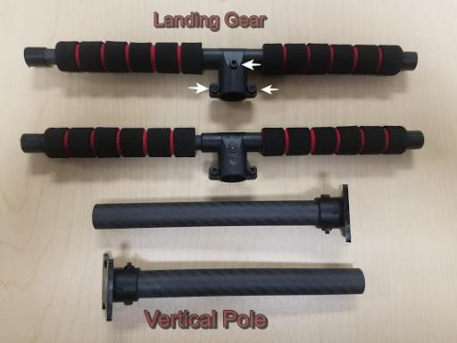
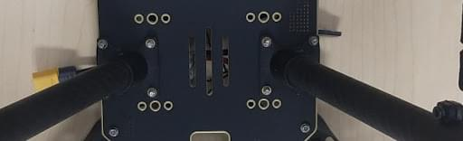
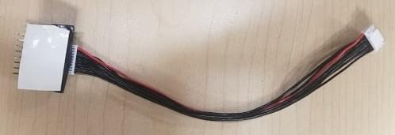
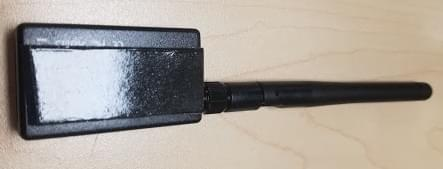
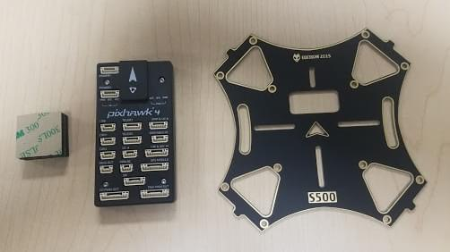
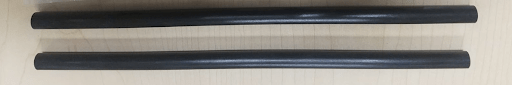
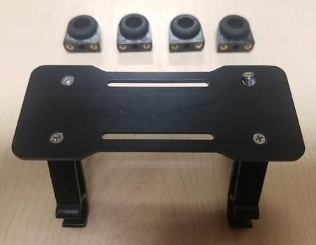
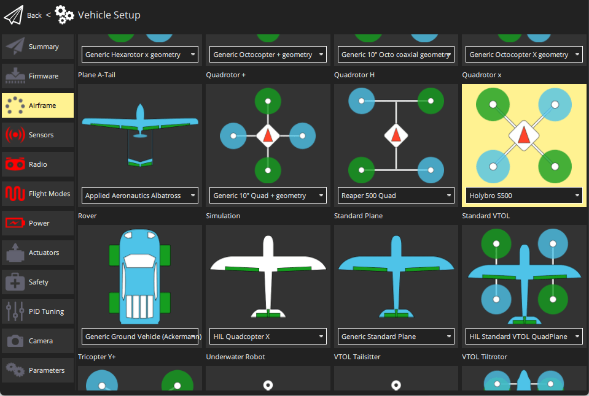

# Holybro S500 V2 + Pixhawk 4 装机

This topic provides full instructions for building the kit and configuring PX4 using _QGroundControl_.

:::info
Holybro最初提供了和[Holybro Pixhawk 4](../flight_controller/pixhawk4.md)飞控一起提供这个套件, 但在撰写本文档时，这个系统已升级为较新的 Pixhawk (6C)。
这个构建记录仍然具有相关性，因为套装组件几乎是一样的，而且随着飞行控制器升级，很可能仍然如此。
:::

## Key information

- **机架：** Holybro S500
- **飞行控制器：** [Pixhawk 4](../flight_controller/pixhawk4.md)
- **大约组装时间：** 90 分钟 (机架组装45分钟，飞控安装和配置45分钟)

## Bill of materials

Holybro [S500 V2 套件](https://holybro.com/collections/s500/products/s500-v2-development-kit) 包含几乎所有需要的组件：

- 一个近期发布的 Pixhawk 飞控
  - 对于这个装机日志，它是 Pixhawk 4，但是现在的套件包含了更新的版本。
- 电源管理模块 PM02(已组装)
- 采用高强度塑料的机臂
- 马达 - 2216 KV880(V2 版本)
- 1045桨叶(V2 版本)
- Pixhawk4 GPS模组
- Fully assembled Power Management Board with ESCs
- 433 MHz / 915 MHz [Holybro数传电台](../telemetry/holybro_sik_radio.md)
- 电源线和信号线
- 电池绑带
- 尺寸：383_385_240毫米
- 轴距：480毫米

:::info
不包含锂电池。
此外，我们使用一个FrSky Taranis遥控。
:::

## 硬件

| 物品描述                             | Quantity |
| -------------------------------- | -------- |
| 轴距：480毫米                         | 1        |
| 机臂                               | 4        |
| 起落架                              | 2        |
| M3\*8螺丝                          | 18       |
| M2.5\*6 螺丝       | 24       |
| 电池绑带                             | 1        |
| 1045桨叶(V2 版本) | 1        |

## 包装

| 物品                                                   | 包装 |
| ---------------------------------------------------- | -- |
| Pixhawk 4                                            | 1  |
| Pixhawk4 GPS MODULE                                  | 1  |
| I2C splitter Board                                   | 2  |
| 6 to 6 pin cable (power)          | 3  |
| 4 to 4 pin cable (CAN)            | 2  |
| 6 to 4 pin cable (Data)           | 1  |
| 10 to 10 pin cable (PWM)          | 2  |
| 8 to 8 pin cable(AUX)             | 1  |
| 7 to 7 pin cable(SPI)             | 1  |
| 6 to 6 pin cable(Debug)           | 1  |
| PPM/SBUS out cable                                   | 1  |
| XSR receiver cable                                   | 1  |
| DSMX receiver cable                                  | 1  |
| SBUS receiver cable                                  | 1  |
| USB cable                                            | 1  |
| 'X'type folding pedestal mount                       | 1  |
| 70mm & 140mm carbon rod standoff | 2  |
| 6\*3 2.54mm pitch Horizontal Pin     | 1  |
| 8\*3 2.54mm pitch Horizontal Pin     | 2  |
| Foam Set                                             | 1  |
| Pixhawk4 Quick Start Guide                           | 1  |
| Pixhawk4 Pinouts                                     | 1  |
| GPS Quick Start Guide                                | 1  |

### Electronics

| 物品描述                                                       | Quantity |
| ---------------------------------------------------------- | -------- |
| Pixhawk 4 autopilot (PM06 not included) | 1        |
| Power Management PM02 (Assembled)       | 1        |
| Motors - 2216 KV880 (V2 Update)         | 4        |
| Pixhawk 4 GPS                                              | 1        |
| Fully assembled Power Management Board with ESCs           | 1        |
| 433MHz Telemetry Radio / 915MHz Telemetry Radio            | 1        |

### Tools needed

The following tools are used in this assembly:

- 1.5 mm Hex screwdriver
- 2.0 mm Hex screwdriver
- 2.5 mm Hex screwdriver
- 3mm Phillips screwdriver
- Wire cutters
- Precision tweezers

## 组装

估计的组装时间是90分钟，组装机架约45分钟，安装和在QGroundControl配置飞控约45分钟。

1. 安装起落架。
   We are going to start by assembling the landing gear to the vertical pole. Unscrew the landing gear screws and insert the vertical pole as shown below.

   

   

2. Assemble the Power Management Board to the landing gear. Screw the landing gear with a vertical pole to the Fully assembled Power Management Board.

板子有4个洞(见下面的箭头)。

用 M3X8 螺丝连接，总共8个，每侧4个。

1. 把机臂装到电源管理板上。
   把机臂装到电源管理板上。

   

   

   在每个臂上使用2个M2.5X6螺丝。
   从板块底部插入螺丝。

   

   确保电调的电线穿过机臂中间。

   

2. Assemble the 8_3 2.54mm pitch Horizontal Pin to the 10 to 10 pin cable (PWM) to the Power Management Board.
   Connect the 10 to 10 pin cable (PWM) to the 8_3 2.54mm pitch Horizontal Pin.

   

   Cut a piece of 3M Tape and attach to the bottom of the Horizontal Pin:

   

   Stick the Horizontal Pin to the Power Management Board:

   

   

3. Assemble the motors to the arms. For this, we will need the 16 screws M3X7, 4 motors, and the 4 arms.

   Mount the motors in each arm put the screw through the bottom of the arm:

   

   

   After the 4 motors are mounted on the arm grab the cables(red, blue, black) and put them through the arm thread.
   The 3 cables that are color-coded go connected to the ESC.

   

   

4. Mounting the GPS on the frame.
   For this, we will need the Pixhawk 4 GPS and the mounting plate.

   

   Mount the GPS mast to the back of the Board, use the 4 screws:

   

   

   Use the tape and stick the GPS to the top of the GPS mast:

   

5. Paste the FrSky to the Board. Paste FrSky with double-sided tape (3M) to the bottom board.
   Attach the FrSky to the frame:

   

   

6. Attach the Telemetry to the frame.
   The next step is to take the Holybro telemetry radio and attach it onto the frame, use 3M tape.

   

   

   This assembly attached it inside the frame facing outwards to the front of the vehicle.
   A picture is shown below of the radio sitting inside the bottom of the frame.

   

7. Mounting the Pixhawk 4 to the plate.
   Use double-sided tape to attach the Pixhawk 4 to the center plate:

   

   

   

   The next step is to mount the Pixhawk 4 with the plate to the frame.
   For this, we will need the M2 5X6 screws.
   Align the plate to the frame and insert the screws.
   Before you mount the plate we recommend putting tape on the Power Module (that way it's tight).

   

   

8. Assembling the Battery Mount to the frame.
   For this we will need the M2 5X6 screws and the battery mount:

   

   Insert the long rods to the small rings:

   

   

   Attach that to the frame, make sure all four sides are aligned to insert the screws:

   

   Assemble the small plate to the legs and screw on all four sides.

   

   The final step is to attach the plate:

   

9. Pixhawk 4 wiring. The Pixhawk 4, which has several different wires and connections with it.
   Included below is a picture of every wire needed with the Pixhawk and how it looks when connected.

10. 如图37所示，把数传模块和GPS模块接到飞行控制器上；连接遥控接收器、4 个电调以及电源模块到飞行控制器上。

    

装好以后套件看起来像下面这样：

## PX4 配置

_QGroundControl_ is used to install the PX4 autopilot and configure/tune it for the QAV250 frame.
[Download and install](https://docs.qgroundcontrol.com/master/en/qgc-user-guide/getting_started/download_and_install.html) _QGroundControl_ for your platform.

:::tip
Full instructions for installing and configuring PX4 can be found in [Basic Configuration](../config/index.md).
:::

首先更新固件和机架配置：

- [Firmware](../config/firmware.md)
- [Airframe](../config/airframe.md)

  您需要选择 _Holybro S500_ 机架(**Quadrotor x > Holybro S500**)。

  

然后设置执行器输出：

- [Actuators](../config/actuators.md)
  - You should not need to update the vehicle geometry (as this is a preconfigured airframe).
  - Assign actuator functions to outputs to match your wiring.
  - Test the configuration using the sliders.

Then perform the mandatory setup/calibration:

- [Sensor Orientation](../config/flight_controller_orientation.md)
- [Compass](../config/compass.md)
- [Accelerometer](../config/accelerometer.md)
- [Level Horizon Calibration](../config/level_horizon_calibration.md)
- [Radio Setup](../config/radio.md)
- [Flight Modes](../config/flight_mode.md)

Ideally you should also do:

- [ESC Calibration](../advanced_config/esc_calibration.md)
- [Battery Estimation Tuning](../config/battery.md)
- [Safety](../config/safety.md)

## 调试

Airframe selection sets _default_ autopilot parameters for the frame.
这些足以让它起飞，但是为你的特定框架调整专有参数是一个好主意。

For instructions on how, start from [Autotune](../config/autotune_mc.md).

## Acknowledgements

This build log was provided by the Dronecode Test Flight Team.
