# Holybro X500 V2 (Pixhawk 5X Build)

:::info
Holybro initially supplied this kit with a [Pixhawk 5X](../flight_controller/pixhawk5x.md), but at time of writing this has been upgraded to a [Holybro Pixhawk 6C](../flight_controller/pixhawk6c.md).
This build log is still relevant as the kit assembly is virtually the same, and likely to remain so as the flight controller is upgraded.
:::

This topic provides full instructions for building the [Holybro X500 V2 ARF Kit](https://holybro.com/collections/x500-kits) and configuring PX4 using _QGroundControl_.

The ARF ("Almost Ready to Fly") kit provides the shortest and straightforward assembly experience for those who want to jump into drone development and not spend that much time on setting up the hardware.
It includes the frame, motors, ESCs, propellers and power distribution board.

In addition to the kit you will need to have the flight controller, radio transmitters, GPS and RC controller.
The ARF kit can be used with most flight controllers supported by PX4.

## Key information

- **Kit:** [Holybro X500 V2 ARF Kit](https://holybro.com/collections/x500-kits)
- **Flight controller:** [Pixhawk 5X](../flight_controller/pixhawk5x.md)
- **Assembly time (approx.):** 55 min (25 minutes for frame, 30 minutes for autopilot installation/configuration)

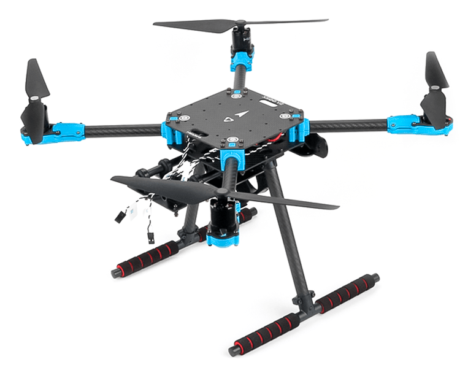

## Bill of materials

The Holybro [X500 V2 Kit](https://holybro.com/collections/x500-kits) includes almost all the required components:

- X500V2 Frame Kit
 - Body - Full Carbon Fiber Top & Bottom plate (144 x 144mm, 2mm thick)
 - Arm - High strength & ultra-lightweight 16mm carbon fiber tubes
 - Landing gear - 16mm & 10mm diameter carbon fiber tubes
 - Platform board - With mounting holes for GPS & popular companion computer
 - Dual 10mm Ø rod x 250 mm long rail mounting system
 - Battery mount with two Battery Straps
 - Hand tools for installation
- Holybro Motors - 2216 KV880 x6 (superseded - check [spare parts list](https://holybro.com/products/spare-parts-x500-v2-kit) for current version).
- Holybro BLHeli S ESC 20A x4 (superseded - check [spare parts list](https://holybro.com/products/spare-parts-x500-v2-kit) for current version).
- Propellers - 1045 x4 (superseded - check [spare parts list](https://holybro.com/products/spare-parts-x500-v2-kit) for current version).
- Power Distribution Board – XT60 plug for battery & XT30 plug for ESCs & peripherals
- Camera mount (optional and the 3D file can be downloaded from [here](https://cdn.shopify.com/s/files/1/0604/5905/7341/files/Holybro_X500_V2_3D_Print.rar?v=1665561017))

Other parts in this build(**Not included in the ARF kit**):

- [Pixhawk 5X autopilot](../flight_controller/pixhawk5x.md)
- [M8N GPS](https://holybro.com/products/m8n-gps)
- [Power Module - PM02D](../power_module/holybro_pm02d.md)
- [433/915 MHz Telemetry Radio](../telemetry/holybro_sik_radio.md)

Additionally you will need a battery (Holybro recommends a 4S 5000mAh) and receiver ([compatible radio system](../getting_started/rc_transmitter_receiver.md)) if you want to control the drone manually.

## Kit Hardware

This section lists all hardware for the frame and the autopilot installation.

| Item                                            | 描述                                                                   | Quantity |
| ----------------------------------------------- | -------------------------------------------------------------------- | -------- |
| Bottom plate                                    | Carbon fiber (2mm thick)                          | 1        |
| Top plate                                       | Carbon fiber (1.5mm thick)        | 1        |
| Arm                                             | Carbon fiber tube (Assembled with motors mounted) | 4        |
| Landing gear - Vertical pole                    | Carbon fiber tube + engineering plastic                              | 2        |
| Landing gear - Cross bar                        | Carbon fiber tube + engineering plastic + foam                       | 2        |
| Mounting Rail                                   | Diameter: 10mm length: 250mm         | 2        |
| Battery mounting board                          | Thickness: 2mm                                       | 1        |
| Battery pad                                     | 3mm Silicone sheet black                                             | 1        |
| Platform board                                  | Thickness: 2mm                                       | 1        |
| Hanger & rubber ring gasket | Inner hole diameter: 10mm black                      | 8        |

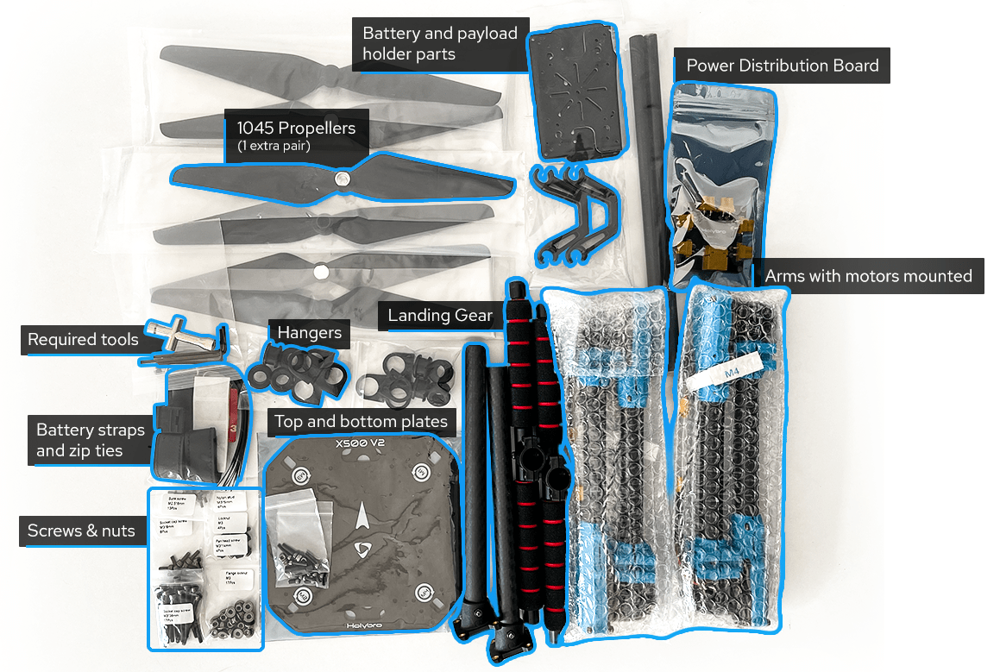

_Figure 1_: X500 V2 ARF Kit what's inside

### Electronics

| Item Description                                                               | Quantity |
| ------------------------------------------------------------------------------ | -------- |
| Pixhawk5x & Assorted Cables                                | 1        |
| M8N GPS Module                                                                 | 1        |
| Power Module PM02D (with pre-soldered ESC power cables)     | 1        |
| Motors 2216 KV880（V2 Update)                                                   | 4        |
| Holybro BLHeli S ESC 20A x4                                                    | 1        |
| Holybro BLHeli S ESC 20A x4                                                    | 1        |
| 433 MHz / 915 MHz [Holybro Telemetry Radio](../telemetry/holybro_sik_radio.md) | 1        |

### Tools needed

Tools are included to do the assembly, however you may need:

- Wire cutters
- Precision tweezers

## 组装

Estimate time to assemble is 55 min (25 minutes for frame, 30 minutes for autopilot installation/configuration)

1. Start by assembling the payload & battery holder.
 Push the rubbers into grippers (Do not use sharp items to push them in!).
 Next, pass the holders through the holder bars with the battery holder bases as Figure 3.

 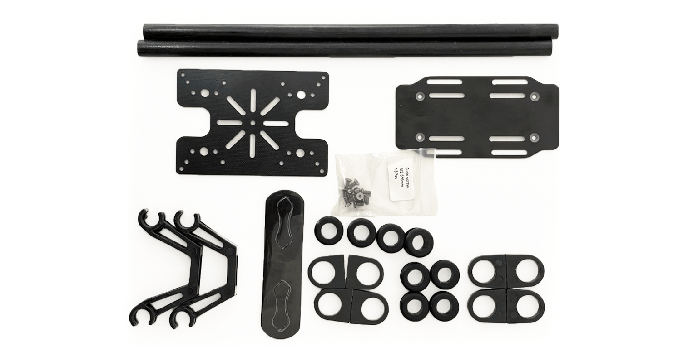

 _Figure 2_: Payload holder components

 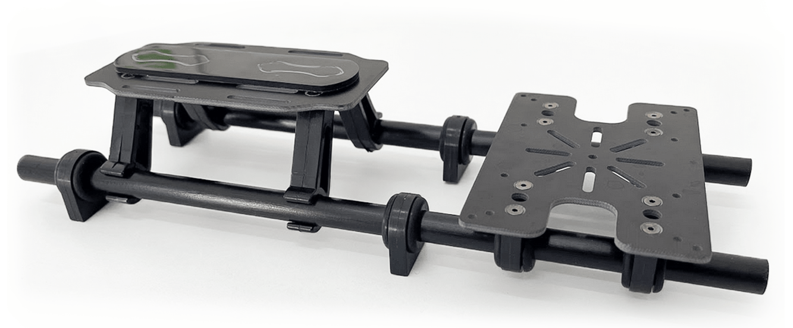

 _Figure 3_: Payload holder assembled

2. The next is to go for attaching the bottom plate to the payload holder.

 You will need the parts as shown in Figure 4.
 Then mount the base for power distribution board using nylon nuts as Figure 5.
 Finally using 8 hex screws you can join the bottom plate to the payload holder (Figure 7)

 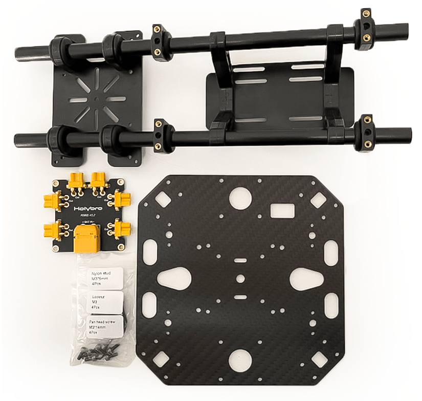

 _Figure 4_: Needed Materials

 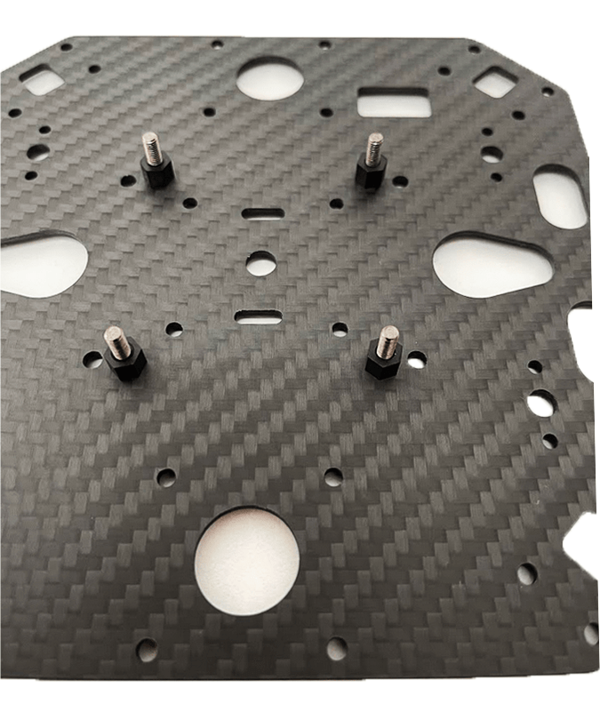

 _Figure 5_: PDB mount base

 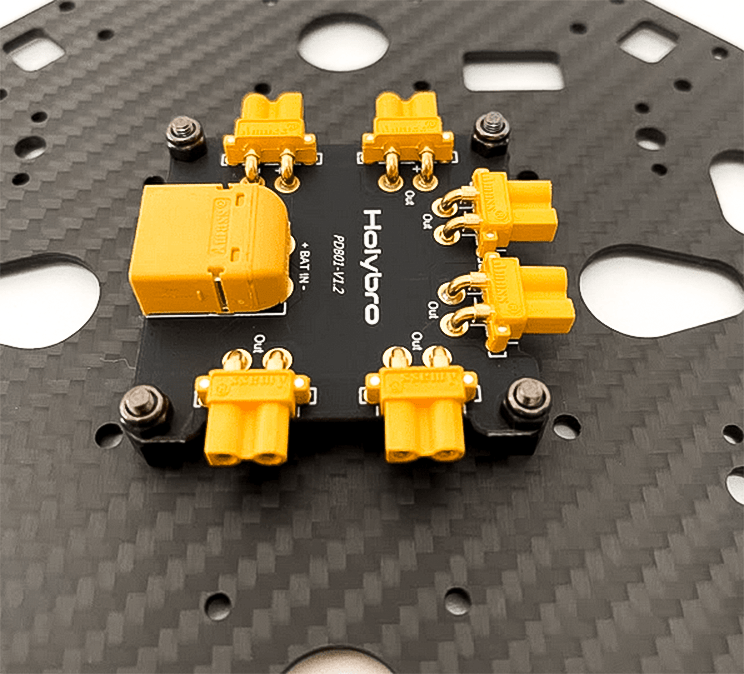

 _Figure 6_: Mounted pdb with nylon nuts

 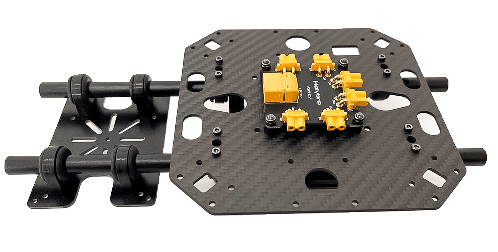

 _Figure 7_: Mounted Plate on payload holder

3. Let's gather the stuff needed for mounting landing gear as Figure 8.
 Use the hex screws to join landing gears to the bottom plate.
 You also need to open three hex screws on each of the leg stands so you can push them into carbon fiber pipes.
 Do not forget to tighten them back again.

 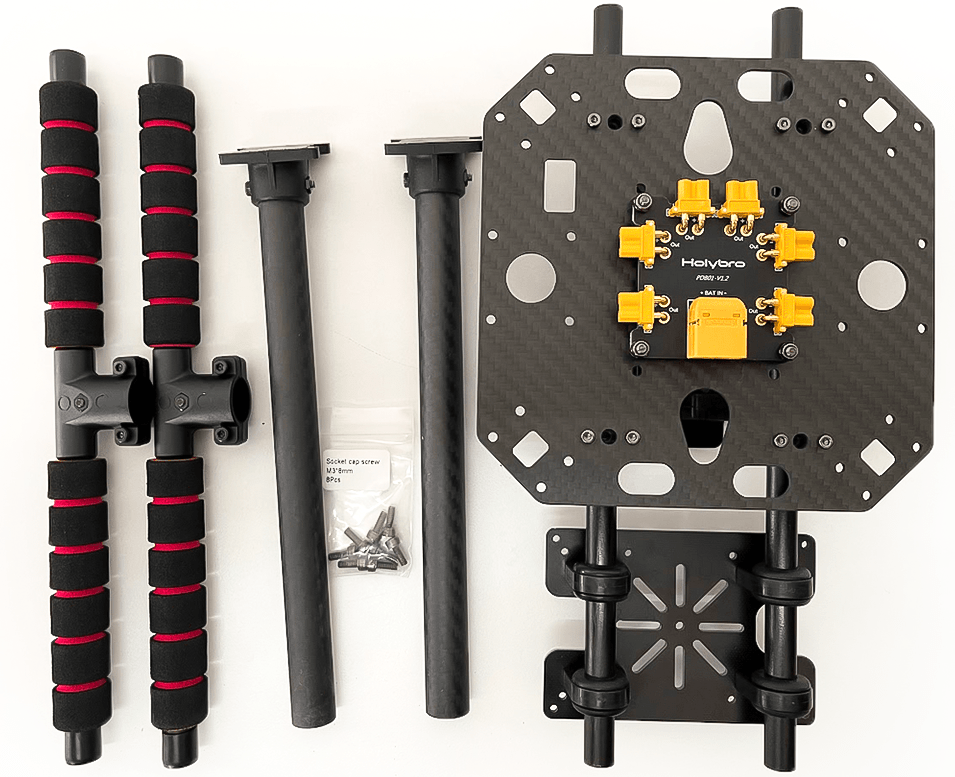

 _Figure 8_: Required parts for landing gear attachment

 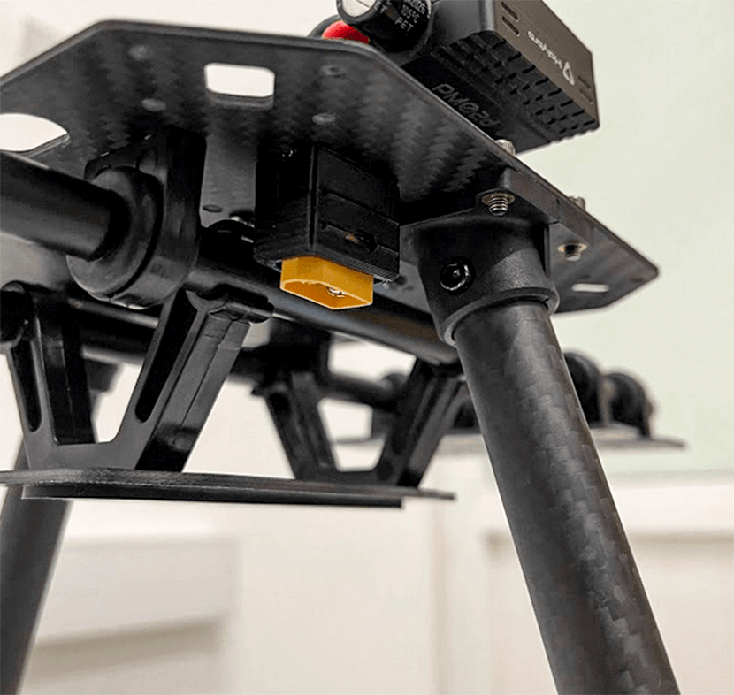

 _Figure 9_: Landing gear attachment to the body

4. We will gather all the arms now to mount the top plate.
 Please pay attention that the motor numbers on arms are a match with the ones mentioned on the top plate.
 Fortunately, motors are mounted and ESCs have been connected in advance.
 Start by passing through all the screws as you have the arms fixed in their own places (They have a guide as shown in Figure 11 to ensure they are in place) and tighten all nylon nuts a bit.
 Then you can connect XT30 power connectors to the power board.
 Please keep in mind that the signal wires have to be passed through the top plate such that we can connect them later to Pixhawk.

 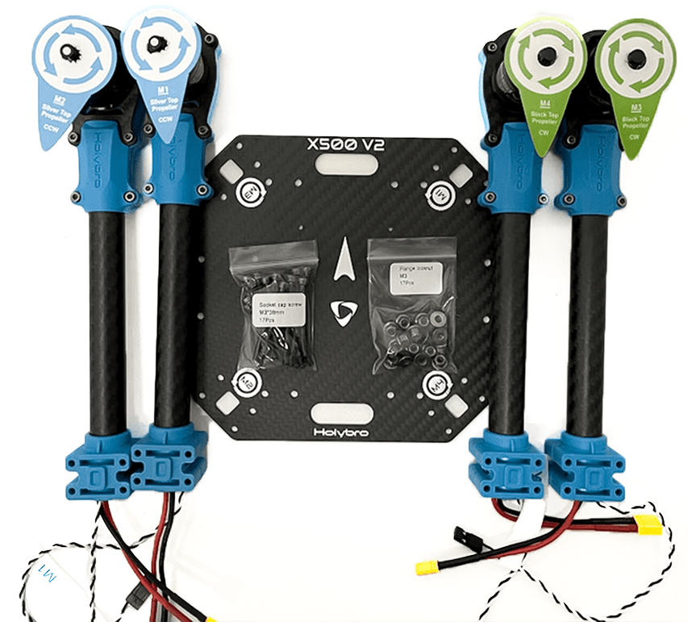

 _Figure 10_: Connecting arms needed materials.

 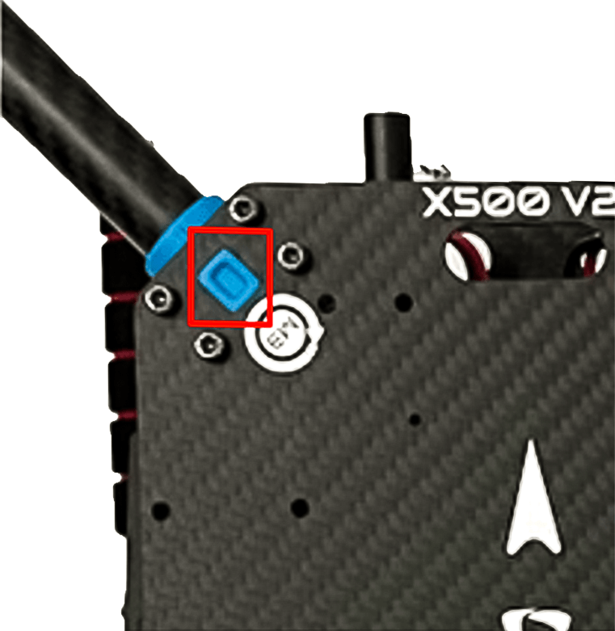

 _Figure 11_: Guide for the arms mount

5. Tighten all 16 screws and nuts by using both hex wrench and nut driver.

 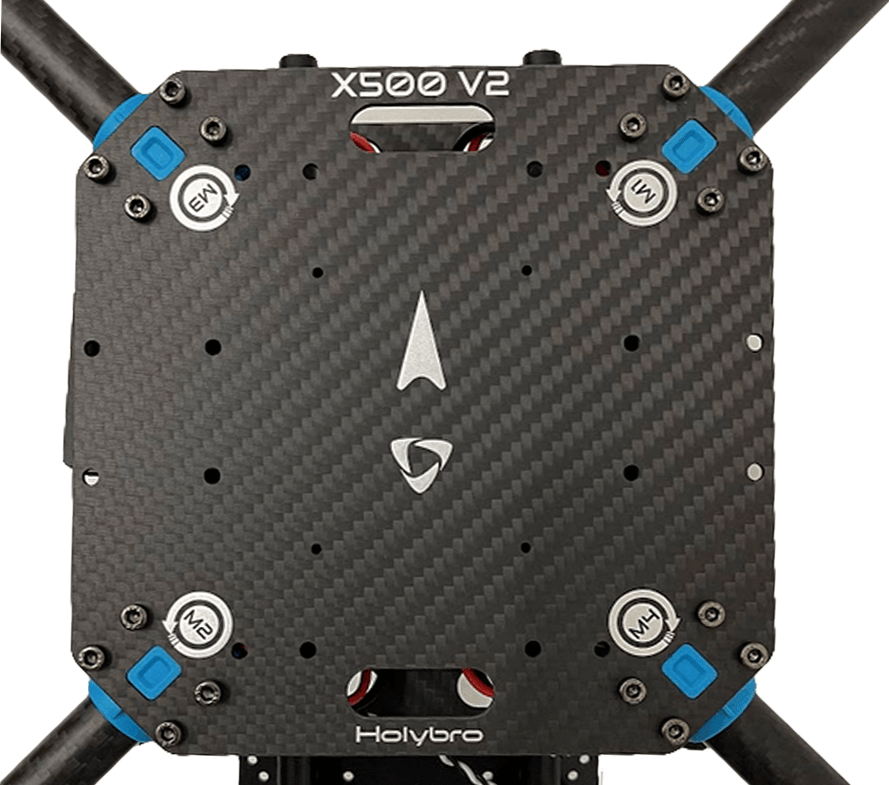

 _Figure 12_: Mounted top plate

6. Next you can mount your pixhawk on the top plate by using the stickers.
 It is recommended to have the direction of your Pixhawk's arrow the same as the one mentioned on the top plate.

 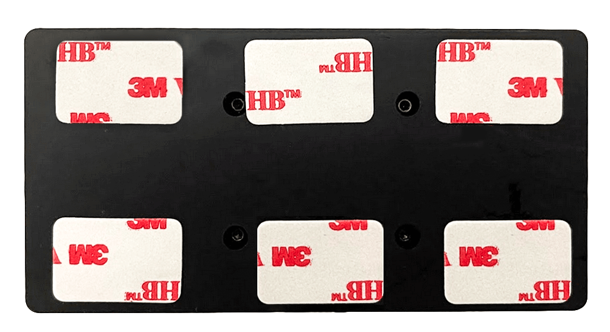

 _Figure 13_: Sticker tapes on Pixhawk

7. If you want to mount the GPS on the companion computer plate, you can now secure the GPS mount onto it using 4 screws and nuts.

 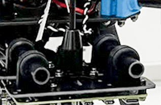

 _Figure 14_: Secure GPS mount onto companion plate

8. Use the tape and stick the GPS to the top of the GPS mast and mount the GPS mast.
 Make sure the arrow on the gps is pointing forward (Figure 15).

 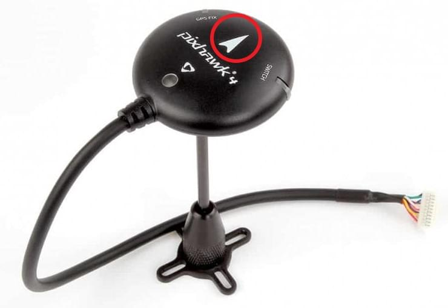

 _Figure 15_: GPS and mast

9. Finally, you can connect the Pixhawk interfaces such as telemetry radio to 'TELEM1' and motors signal cables accordingly.

Please refer to [Pixhawk 5X Quick Start](../assembly/quick_start_pixhawk5x.md) for more information.

That's it.
The fully assembled kit is shown below (Depth camera not included in the kit):

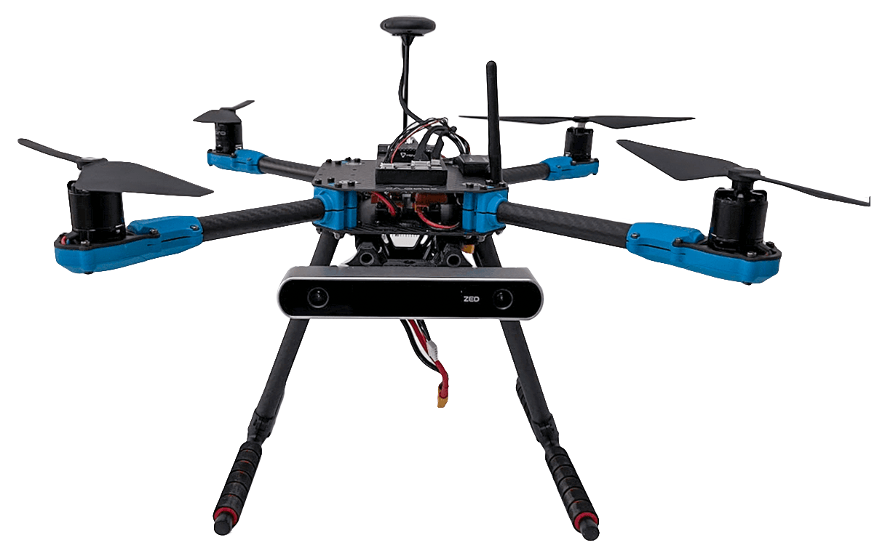

## PX4 配置

:::tip
Full instructions for installing and configuring PX4 can be found in [Basic Configuration](../config/index.md).
:::

_QGroundControl_ is used to install the PX4 autopilot and configure/tune it for the X500 frame.
[Download and install](http://qgroundcontrol.com/downloads/) _QGroundControl_ for your platform.

First update the firmware, airframe, and actuator mappings:

- [Firmware](../config/firmware.md)

- [Airframe](../config/airframe.md)

 You will need to select the _Holybro X500 V2_ airframe (**Quadrotor x > Holybro 500 V2**)

 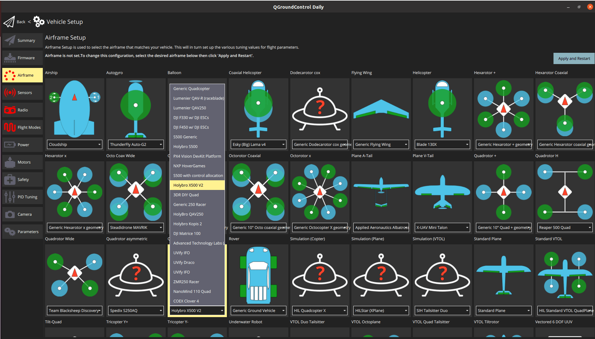

- [Actuators](../config/actuators.md)
 - You should not need to update the vehicle geometry (as this is a preconfigured airframe).
 - Assign actuator functions to outputs to match your wiring.
 - Test the configuration using the sliders.

Then perform the mandatory setup/calibration:

- [Sensor Orientation](../config/flight_controller_orientation.md)
- [Compass](../config/compass.md)
- [Accelerometer](../config/accelerometer.md)
- [Level Horizon Calibration](../config/level_horizon_calibration.md)
- [Radio Setup](../config/radio.md)
- [Flight Modes](../config/flight_mode.md)

Ideally you should also do:

- [ESC Calibration](../advanced_config/esc_calibration.md)
- [Battery Estimation Tuning](../config/battery.md)
- [Safety](../config/safety.md)

## 调试

Airframe selection sets _default_ autopilot parameters for the frame.
These are good enough to fly with, but it is a good idea to tune the parameters for a specific frame build.

For instructions on how, start from [Autotune](../config/autotune_mc.md).

## Acknowledgements

This build log was provided by PX4 Team.
