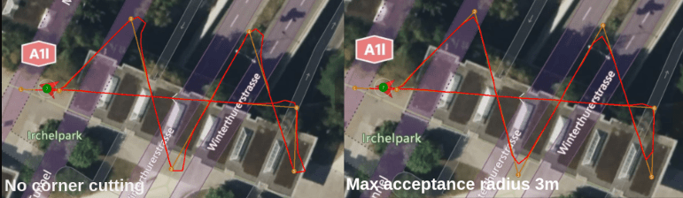

# Ackermann Rover

<Badge type="tip" text="main (PX4 v1.16+)" /> <Badge type="warning" text="Experimental" />

An _Ackermann rover_ controls its direction by pointing the front wheels in the direction of travel — the [Ackermann steering geometry](https://en.wikipedia.org/wiki/Ackermann_steering_geometry) compensates for the fact that wheels on the inside and outside of the turn move at different rates.
This kind of steering is used on most commercial vehicles, including cars, trucks etc.

:::info
PX4 does not require that the vehicle uses the Ackermann geometry and will work with any front-steering rover.
:::

## Basic Setup

To start using the ackermann rover:

1. Enable the module by flashing the [PX4 rover build](../frames_rover/index.md#flashing-the-rover-build) onto your flight controller.

2. In the [Airframe](../config/airframe.md) configuration select the _Generic Rover Ackermann_:

   

   ::: warning
   Do not use the _Generic Ground Vehicle (Ackermann)_ airframe as that will load the [(Deprecated) Rover Position Control](../frames_rover/rover_position_control.md) module.

:::

   Select the **Apply and Restart** button.

   ::: info
   If this airframe is not displayed and you have checked that you are using rover firmware (not the default), you can alternatively enable this frame by setting the [SYS_AUTOSTART](../advanced_config/parameter_reference.md#SYS_AUTOSTART) parameter to `51000`.

:::

3. Open the [Actuators Configuration & Testing](../config/actuators.md) to map the steering and throttle functions to flight controller outputs.

This is sufficient to drive the the rover in [manual mode](../flight_modes_rover/index.md#manual-mode) (see [Drive modes](../flight_modes_rover/index.md)).

:::info
Many features of this module are disabled by default, and are only enabled by setting certain parameters.
The [Tuning (basic)](#tuning-basic) section goes through the minimum setup required to start driving missions
and the [Tuning (advanced)](#tuning-advanced) section outlines the remaining features and tuning variables of the module.
:::

## Tuning (Basic)

To start driving missions navigate to [Parameters](../advanced_config/parameters.md) in QGroundControl and set the following parameters:

| Parameter                                                                                                                                                               | Description                                                                | Unit |
| ----------------------------------------------------------------------------------------------------------------------------------------------------------------------- | -------------------------------------------------------------------------- | ---- |
| [RA_WHEEL_BASE](../advanced_config/parameter_reference.md#RA_WHEEL_BASE)                            | Wheel-base of the rover which is measured from the back to the front wheel | m    |
| [RA_MAX_STR_ANG](../advanced_config/parameter_reference.md#RA_MAX_STR_ANG)    | Maximum steering angle of the rover                                        | deg  |
| [RA_MISS_VEL_DEF](../advanced_config/parameter_reference.md#RA_MISS_VEL_DEF) | Default velocity the rover will drive during the mission                   | m/s  |

This is enough to start driving missions, but depending on the rover might not yet lead to satisfactory performance .
If that is the case further tuning is required which is outlined in [Mission parameters](#mission-parameters).

## Tuning (Advanced)

To get an overview of all parameters that are related to the Ackermann rover module navigate to the _Rover Ackermann_ group in the _Parameters_ section of QGroundControl.

### General Parameters

These parameters affect the general behaviour of the rover. This will influence both auto and manual modes.

| Parameter                                                                                                                                 | Description                                | Unit |
| ----------------------------------------------------------------------------------------------------------------------------------------- | ------------------------------------------ | ---- |
| [RA_MAX_SPEED](../advanced_config/parameter_reference.md#RA_MAX_SPEED) | Speed the rover drives at maximum throttle | m/s  |

This is used for a feed-forward term on the speed controller in mission mode and necessary for the [acceleration slew rate](#slew-rates).

#### Slew Rates

Slew rates limit how fast the signal that is sent to the motors is allowed to change:

| Parameter                                                                                                                                                               | Description                            | Unit  |
| ----------------------------------------------------------------------------------------------------------------------------------------------------------------------- | -------------------------------------- | ----- |
| [RA_MAX_ACCEL](../advanced_config/parameter_reference.md#RA_MAX_ACCEL)                               | Limit on the acceleration of the rover | m/s^2 |
| [RA_MAX_STR_RATE](../advanced_config/parameter_reference.md#RA_MAX_STR_RATE) | Limit on the steering rate             | deg/s |

:::warning
The slew rates are not based on measurements but on assumed linear relation between the throttle input and [RA_MAX_SPEED](#RA_MAX_SPEED) or steering input and [RA_MAX_STR_ANG](#RA_MAX_STR_ANG) respectively.
Therefore these two parameters have to be set for the slew rates to work!
:::

## Mission Parameters

These parameters only affect vehicle in [Mission Mode](../flight_modes_rover/index.md#mission-mode).

:::warning
The parameters in [Tuning (basic)](#tuning-basic) must also be set to drive missions!
:::

The module uses a control algorithm called pure pursuit, see [Pure Pursuit Guidance Logic](../flight_modes_rover/index.md#pure-pursuit-guidance-logic) for the basic tuning process.

:::info
Increasing [PP_LOOKAHD_MIN](../advanced_config/parameter_reference.md#PP_LOOKAHD_MIN) can help to make the steering less aggressive at slow speeds.
This can be useful especially if the [corner slow down effect](#corner-slow-down) is enabled.
:::

### Cornering Parameters

#### Corner cutting

The module employs a special cornering logic causing the rover to "cut corners" to achieve a smooth trajectory.
This is done by scaling the acceptance radius based on the corner the rover has to drive (for geometric explanation see [Cornering logic](#mission-cornering-logic-info-only)).

The degree to which corner cutting is allowed can be tuned, or disabled, with the following parameters:

| Parameter                                                                                                                                                               | Description                                           | Unit |
| ----------------------------------------------------------------------------------------------------------------------------------------------------------------------- | ----------------------------------------------------- | ---- |
| [NAV_ACC_RAD](../advanced_config/parameter_reference.md#NAV_ACC_RAD)                                  | Default acceptance radius                             | m    |
| [RA_ACC_RAD_MAX](../advanced_config/parameter_reference.md#RA_ACC_RAD_MAX)    | Maximum radius the acceptance radius can be scaled to | m    |
| [RA_ACC_RAD_GAIN](../advanced_config/parameter_reference.md#RA_ACC_RAD_GAIN) | Tuning parameter                                      | -    |

The tuning parameter is a multiplicand on the calculated ideal acceptance radius to account for dynamic effects.

#### Corner slow down

To smoothen the trajectory further and reduce the risk of the rover rolling over, the mission speed is reduced as the rover gets closer to a waypoint:

- During cornering the rover drives at a speed that is equal to the the inverse of the acceptance radius (calculated using the [corner cutting logic](#corner-cutting)) multiplied with a tuning parameter called [RA_MISS_VEL_GAIN](#RA_MISS_VEL_GAIN).
- In between waypoints (straight line) the rover speed is regulated such that it will arrive at the acceptance radius of the waypoint with the desired cornering speed.
  This requires [RA_MAX_ACCEL](#RA_MAX_ACCEL) and [RA_MAX_JERK](#RA_MAX_JERK) to be set.

The mission speed is constrained between a minimum allowed speed [RA_MISS_VEL_MIN](#RA_MISS_VEL_MIN) and the default mission speed [RA_MISS_VEL_DEF](#RA_MISS_VEL_DEF).

| Parameter                                                                                                                                                                  | Description                                                 | Unit    |
| -------------------------------------------------------------------------------------------------------------------------------------------------------------------------- | ----------------------------------------------------------- | ------- |
| [RA_MISS_VEL_DEF](../advanced_config/parameter_reference.md#RA_MISS_VEL_DEF)    | Default mission speed                                       | $m/s$   |
| [RA_MISS_VEL_MIN](../advanced_config/parameter_reference.md#RA_MISS_VEL_MIN)    | Minimum the speed can be reduced to during cornering        | $m/s$   |
| [RA_MISS_VEL_GAIN](../advanced_config/parameter_reference.md#RA_MISS_VEL_GAIN) | Tuning parameter for the velocity reduction                 | -       |
| [RA_MAX_JERK](../advanced_config/parameter_reference.md#RA_MAX_JERK)                                     | Limit for forwards acc/deceleration change. | $m/s^3$ |

### Mission Cornering Logic (Info only)

To enable a smooth trajectory, the acceptance radius of waypoints is scaled based on the angle between a line segment from the current-to-previous and current-to-next waypoints.
The ideal trajectory would be to arrive at the next line segment with the heading pointing towards the next waypoint.
For this purpose the minimum turning circle of the rover is inscribed tangentially to both line segments.

The acceptance radius of the waypoint is set to the distance from the waypoint to the tangential points between the circle and the line segments:

$$
\begin{align*}
r_{min} &= \frac{L}{\sin\left( \delta_{max}\right) } \\
\theta  &= \frac{1}{2}\arccos\left( \frac{\vec{a}*\vec{b}}{|\vec{a}||\vec{b}|}\right) \\
r_{acc} &= \frac{r_{min}}{\tan\left( \theta\right) }
\end{align*}
$$

| Symbol                              | Description                        | Unit |
| ----------------------------------- | ---------------------------------- | ---- |
| $\vec{a}$                           | Vector from current to previous WP | m    |
| $\vec{b}$                           | Vector from current to next WP     | m    |
| $r_{min}$      | Minimum turn radius                | m    |
| $\delta_{max}$ | Maximum steer angle                | m    |
| $r_{acc}$      | Acceptance radius                  | m    |

<!--
## Parameters

The following parameters affect the ackermann-steering rover:
-->
