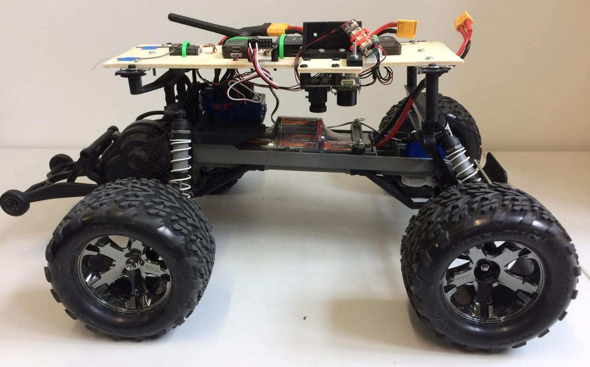
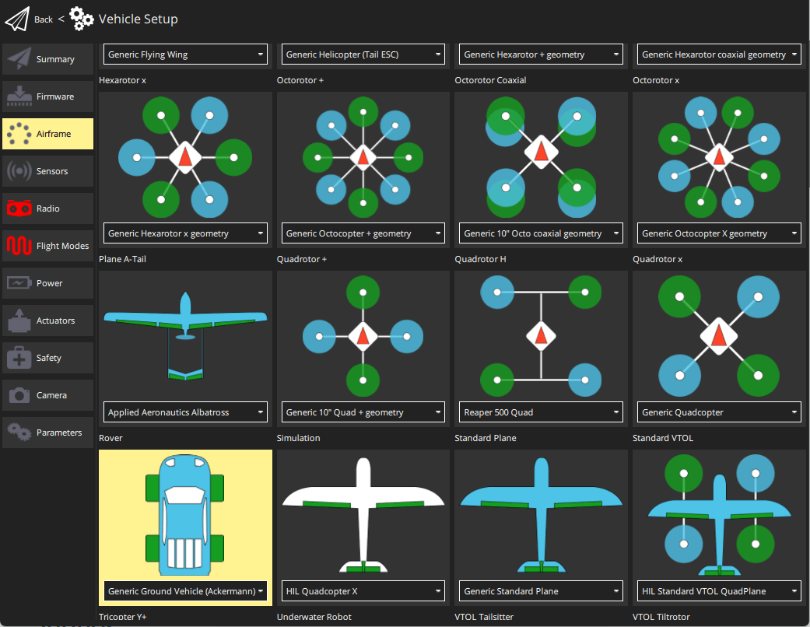
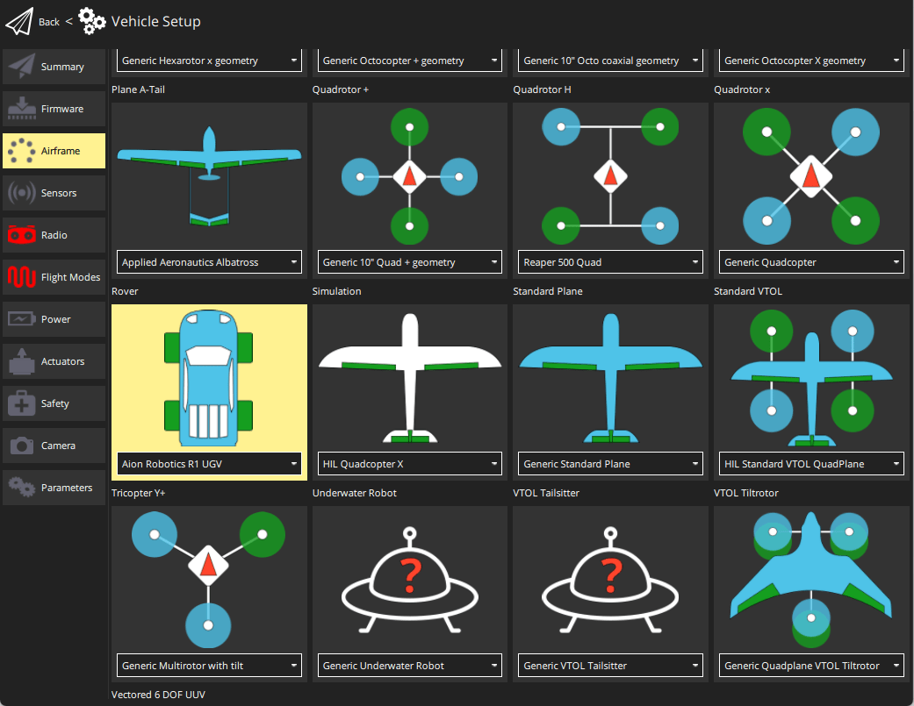
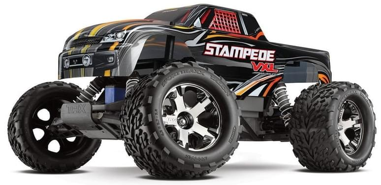
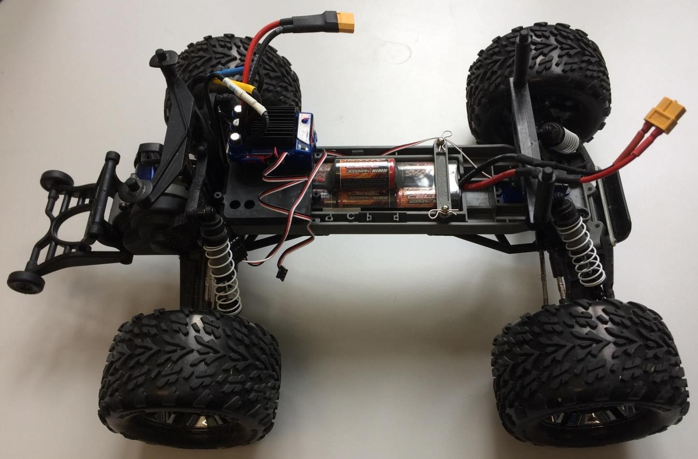
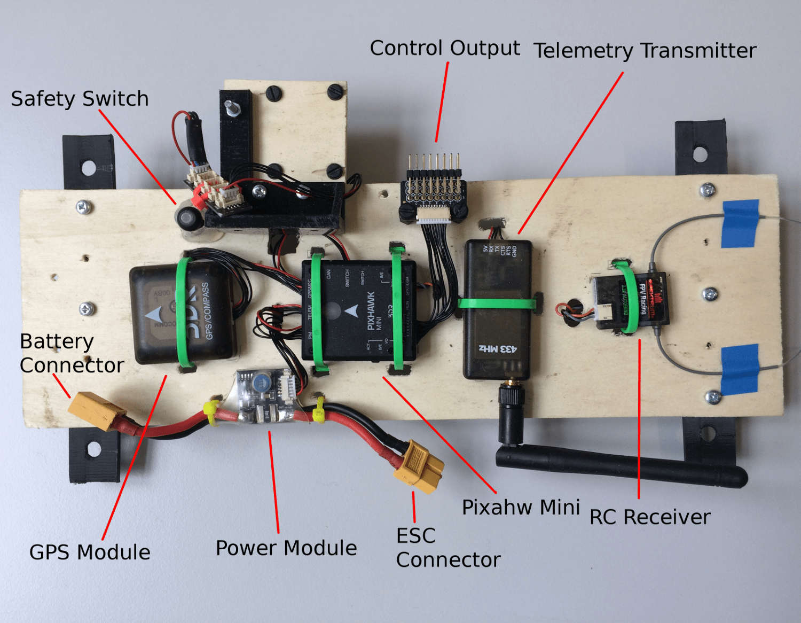
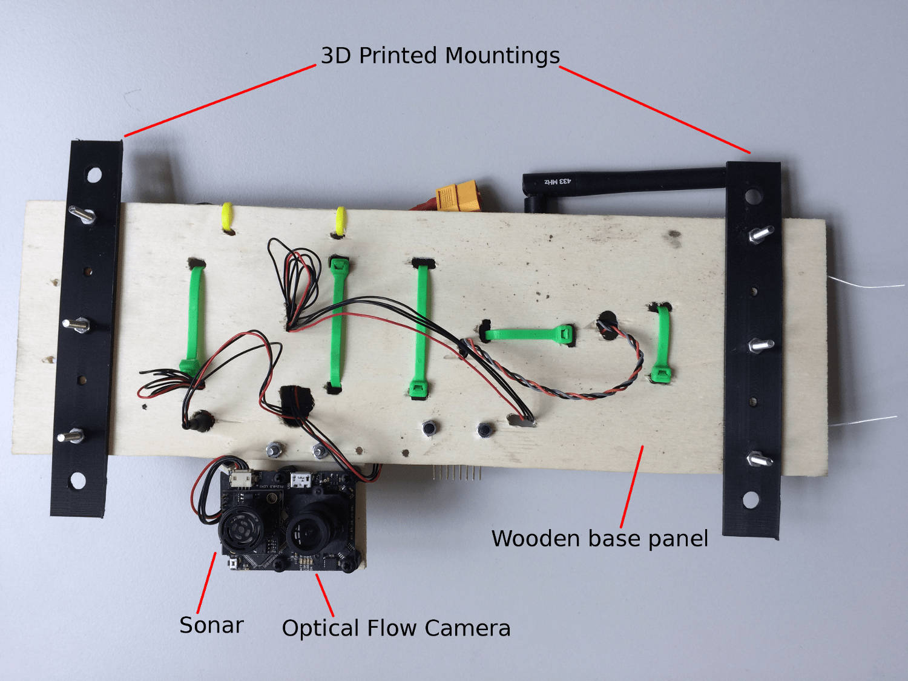
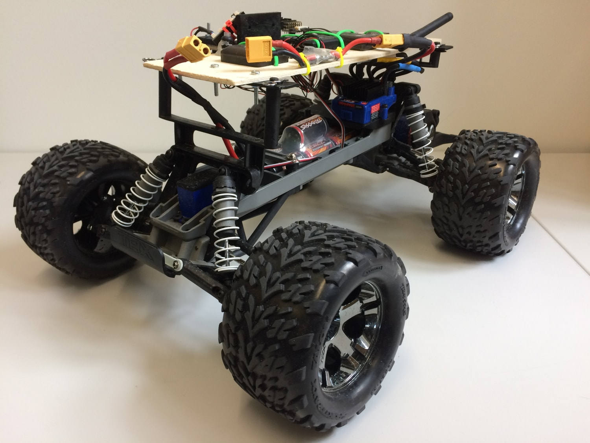
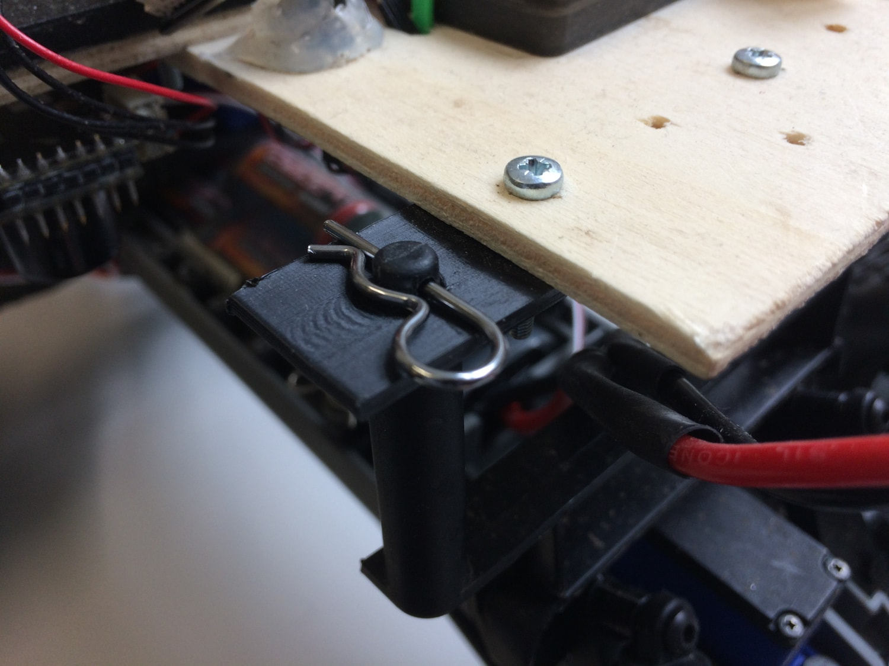
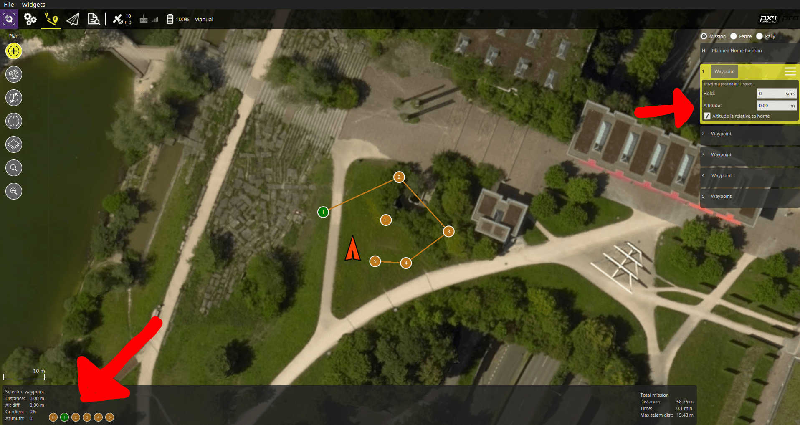

# (Deprecated) Rover Position Control

<LinkedBadge type="warning" text="Experimental" url="../airframes/#experimental-vehicles"/>

:::warning
This information applies to the original generic rover module that was derived from the fixed wing controller.
It has been replaced with new modules for [Ackermann](../frames_rover/ackermann.md) and [Differential-steering](../frames_rover/differential.md) rovers.
This module is no longer supported and will receive no updates.
:::

PX4 supports rovers (Unmanned Ground Vehicles - UGVs) with [ackermann and differential](#rover-types) steering.

This section contains build logs/instructions for assembling as well as configuring a number of UGV frames.

## Rover Types

PX4 supports rovers with:

- **Differential steering**: direction is controlled by moving the left- and right-side wheels at different speeds.

  This kind of steering commonly used on bulldozers, tanks, and other tracked vehicles.

- **Ackermann steering**: direction is controlled by pointing wheels in the direction of travel ([ackermann geometry](https://en.wikipedia.org/wiki/Ackermann_steering_geometry) compensates for the fact that wheels on the inside and outside of the turn move at different rates).
  This kind of steering is used on most commercial vehicles, including cars, trucks etc.

The supported frames can be seen in [Airframes Reference > Rover](../airframes/airframe_reference.md#rover): these are the frames like _Generic Ground Vehicle (Deprecated)_ that include "(Deprecated)" in their name.

## How to Configure a Rover

### Ackermann Steering Configuration

Setting up a rover with Ackermann steering is straightforward:

1. In the [Airframe](../config/airframe.md) configuration, select the _Generic Ground Vehicle (Deprecated)_.

  

  Select the **Apply and Restart** button.

2. Open the [Actuators Configuration & Testing](../config/actuators.md) to map the steering and throttle functions to flight controller outputs.

### Differential Steering Configuration

1. In the [Airframe](../config/airframe.md) configuration, select either the _Aion Robotics R1 UGV_ or _NXP Cup car: DF Robot GPX (Deprecated)_

  

Select the **Apply and Restart** button.

1. Open the [Actuators Configuration & Testing](../config/actuators.md) and map the left and right motor functions to flight controller outputs.

## 仿真

[Gazebo Classic](../sim_gazebo_classic/index.md) provides simulations for both types of steering:

- Ackermann: [ackermann rover](../sim_gazebo_classic/vehicles.md#ackermann-ugv)
- Differential: [r1 rover](../sim_gazebo_classic/vehicles.md#differential-ugv)

## Drive Modes (Rover)

Flight modes (or more accurately "Drive modes" for ground vehicles) provide autopilot support to make it easier to manually drive the vehicle, to execute autonomous missions, or to defer control to an external system.

PX4 ground vehicles using the deprecated rover position control module only support [manual mode](#manual-mode), [mission mode](#mission-mode) and [offboard mode](#offboard-mode) (other modes may be offered in a ground station, but these all behave just like manual mode).

### 手动模式

_Manual mode_ is the only manual mode for ground vehicles on PX4, and requires a manual controller (RC controller, gamepad, joystick etc.).

In this mode, motors are stopped when RC control sticks are centered.
To move the vehicle you move the sticks outside of the center.

一旦释放摇杆，它们将会返回中心停顿区。
This will turn off the motors and center the wheels.
There is no active braking, so the vehicle may continue to move until its momentum dissipates.

### Mission Mode

_Mission mode_ is an automatic mode that causes the vehicle to execute a predefined autonomous [mission](../flying/missions.md) plan that has been uploaded to the flight controller.
The mission is typically created and uploaded with a Ground Control Station (GCS) application, such as [QGroundControl](https://docs.qgroundcontrol.com/master/en/).

### Offboard Mode

[Offboard mode](../flight_modes/offboard.md) causes the vehicle to obey position, velocity, or attitude, setpoints provided over MAVLink.
Not all setpoint types make sense for a ground vehicle, or are supported.

:::info
This mode is intended for vehicle control from companion computers and ground stations!
:::

## 更多信息

- [Basic Configuration > Flight Modes](../config/flight_mode.md) - How to map RC control switches to specific flight modes
- [Flight Modes (Multicopter)](../flight_modes_mc/index.md)
- [Flight Modes (Fixed-wing)](../flight_modes_fw/index.md)
- [Flight Modes (VTOL)](../flight_modes_vtol/index.md)

## Traxxas Stampede VXL

This vehicle was chosen to understand how a Pixhawk could be used for wheeled platforms.
We chose to use a Traxxas vehicle as they are very popular and it is a very strong brand in the RC community.
The idea was to develop a platform that allows for easy control of wheeled UGVs with an autopilot.

### 配件列表

- [Traxxas Stampede](https://traxxas.com/products/models/electric/stampede-vxl-tsm) All of this is used except for the top plastic cover.
- [Pixhawk Mini (Discontinued)](../flight_controller/pixhawk_mini.md)
  - 3DR 10S Power Module
  - 3DR 433MHz Telemetry Module (EU)
- [Spektrum Dxe Controller](http://www.spektrumrc.com/Products/Default.aspx?ProdId=SPM1000) or other PX4-compatible remotes
- [Spektrum Quad Race Serial Receiver w/Diversity](http://www.spektrumrc.com/Products/Default.aspx?ProdID=SPM4648)
- [PX4Flow](../sensor/px4flow.md) (Deprecated)

### 组装

The assembly consists of a wooden frame on which all the autopilot parts were attached.
Tests showed that a better vibration insulation should be used, especially for the Pixhawk and the Flow module.

For this particular mounting we chose to use the clip supplied with the rover to attach the upper plate.
For this, two supports were 3D printed.
The CAD files are provided [here](https://github.com/PX4/PX4-user_guide/raw/main/assets/airframes/rover/traxxas_stampede_vxl/plane_holders.zip).

:::warning
It is **HIGHLY RECOMMENDED** to set the ESC in training mode (see Traxxas Stampede Manual), which reduces power to 50%.
:::

### Output Connections

| PWM Output | 执行器                                     |
| ---------- | --------------------------------------- |
| MAIN2      | Steering servo                          |
| MAIN4      | Throttle (ESC input) |

### 配置

Rovers are configured using _QGroundControl_ in the same way as any other vehicle.

The main rover-specific configuration is setting the correct frame:

1. Switch to the [Basic Configuration](../config/index.md) section in _QGroundControl_
2. Select the [Airframe](../config/airframe.md) tab.
3. Scroll down the list to find the **Rover** icon.
4. Choose **Traxxas stampede vxl 2wd** from the drop down list.

### 用法

At the current time, PX4 only supports Mission and Manual modes when a RC remote is connected.
To use the mission mode, first upload a new mission to the vehicle with QGC. Then, BEFORE ARMING, select `MISSION` and then arm.

:::warning
It is very important to do a mission composed \*only\*\* of normal waypoints (i.e. no takeoff waypoints etc.) and it is crucial to set the waypoint height of \*\*every\*\* waypoint to 0 for correct execution.
Failing to do so will cause the rover to continuously spin around a waypoint.
:::

A correct mission setup looks as follows:

## 视频

<iframe width="740" height="416" src="https://www.youtube.com/embed/N3HvSKS3nCw" frameborder="0" allow="accelerometer; autoplay; clipboard-write; encrypted-media; gyroscope; picture-in-picture" allowfullscreen></iframe>
