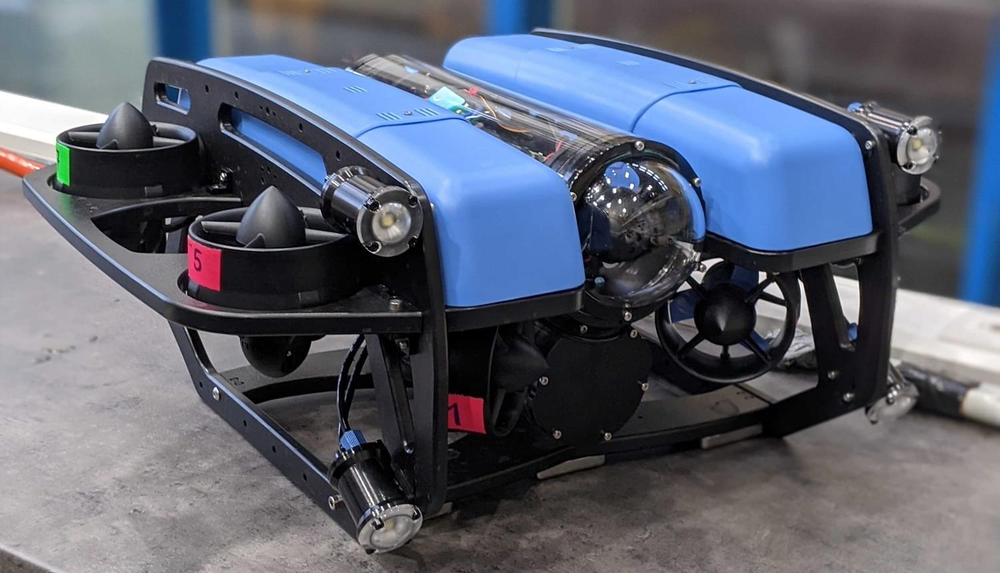

# BlueROV2 (UUV)

<Badge type="tip" text="PX4 v1.12" />

The [BlueROV2](https://bluerobotics.com/store/rov/bluerov2-upgrade-kits/brov2-heavy-retrofit-r1-rp/BlueROV2) is an affordable high-performance underwater vehicle that is perfect for inspections, research, and adventuring.

PX4 provides [experimental support](index.md) for an 8-thrust vectored configuration, known as the _BlueROV2 Heavy Configuration_.

## 购买渠道

[BlueROV2](https://bluerobotics.com/store/rov/bluerov2/) + [BlueROV2 Heavy Configuration Retrofit Kit](https://bluerobotics.com/store/rov/bluerov2-upgrade-kits/brov2-heavy-retrofit-r1-rp/)

### Motor Mapping/Wiring

The motors must be wired to the flight controller following the standard instructions supplied by BlueRobotics for this vehicle .

The vehicle will then match the configuration documented in the [Airframe Reference](../airframes/airframe_reference.md#vectored-6-dof-uuv):

- **MAIN1:** motor 1 CCW, bow starboard horizontal, , propeller CCW
- **MAIN2:** motor 2 CCW, bow port horizontal, propeller CCW
- **MAIN3:** motor 3 CCW, stern starboard horizontal, propeller CW
- **MAIN4:** motor 4 CCW, stern port horizontal, propeller CW
- **MAIN5:** motor 5 CCW, bow starboard vertical, propeller CCW
- **MAIN6:** motor 6 CCW, bow port vertical, propeller CW
- **MAIN7:** motor 7 CCW, stern starboard vertical, propeller CW
- **MAIN8:** motor 8 CCW, stern port vertical, propeller CCW

## Airframe Configuration

BlueROV2 does not come with PX4 installed.
You will need to:

1. [Install PX4 Firmware](../config/firmware.md#installing-px4-main-beta-or-custom-firmware)
2. [Set the Airframe](../config/airframe.md).
   You will need to select the "BlueROV2 Heavy Configuration" as shown:
   

<!-- what other tuning/testing/ etc? -->

## 视频

<lite-youtube videoid="1sUaURmlmT8" title="PX4 on BlueRov Demo"/>

<!-- @DanielDuecker on github is good person to ask about this frame -->
