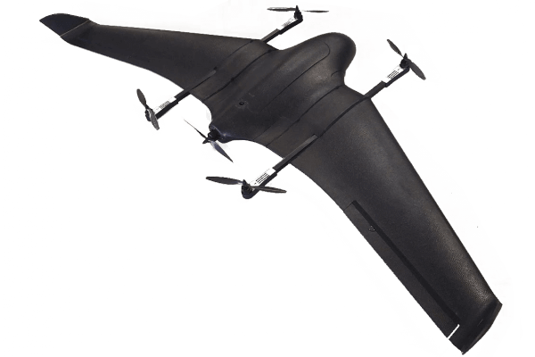

# 标准垂起固定翼

A **Standard VTOL** is a [VTOL](../frames_vtol/index.md) that has _completely separate_ flight controls for multicopter and fixed-wing flight.

_Vertical Technologies: Deltaquad QuadPlane VTOL_

## 视频

This section contains videos that are specific to Standard VTOL (videos that apply to all VTOL types can be found in [VTOL](../frames_vtol/index.md)).

---

[FunCub QuadPlane](../frames_vtol/vtol_quadplane_fun_cub_vtol_pixhawk.md)

<lite-youtube videoid="4K8yaa6A0ks" title="Fun Cub PX4 VTOL Maiden"/>

[Falcon Vertigo QuadPlane](../frames_vtol/vtol_quadplane_falcon_vertigo_hybrid_rtf_dropix.md)

<lite-youtube videoid="h7OHTigtU0s" title="PX4 Vtol test"/>

[Ranger QuadPlane](../frames_vtol/vtol_quadplane_volantex_ranger_ex_pixhawk.md)

<lite-youtube videoid="7tGXkW6d3sA" title="PX4 Autopilot - Experimental VTOL with Pixhawk and U-Blox M8N GPS"/>
