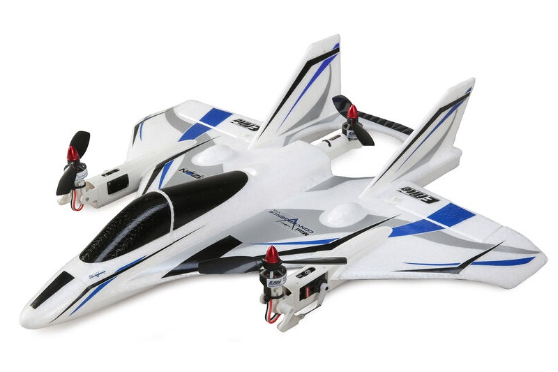

# 倾转旋翼式VTOL

A **Tiltrotor VTOL** is a [VTOL](../frames_vtol/index.md) vehicle that has rotors that can swivel 90 degrees, allowing them to act as either multicopter rotors or as fixed-wing propellers.

## Builds

- [Convergence Tiltrotor](../frames_vtol/vtol_tiltrotor_eflite_convergence_pixfalcon.md)
- [OMP Hobby ZMO FPV](../frames_vtol/vtol_tiltrotor_omp_hobby_zmo_fpv.md)

## 视频

This section contains videos that are specific to Tiltrotor VTOL (videos that apply to all VTOL types can be found in [VTOL](../frames_vtol/index.md)).

[Convergence Tiltrotor](../frames_vtol/vtol_tiltrotor_eflite_convergence_pixfalcon.md)

<lite-youtube videoid="E61P2f2WPNU" title="E-flite Convergence Autonomous Mission Flight"/>
