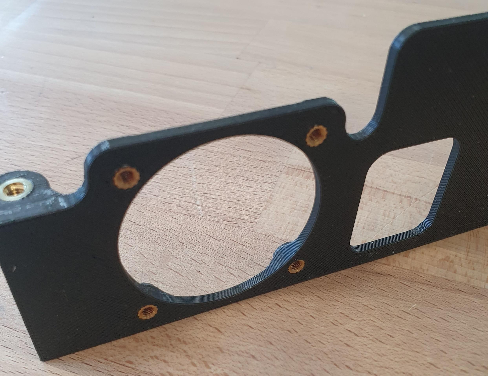

# Foxtech Loong 2160 VTOL

The _Foxtech Loong 2160 VTOL_ is a easy to build almost-ready-to-fly (ARF) quadplane VTOL drone with wingspan of 2160mm.
This build guide shows how to add a flight controller system using [Auterion Skynode evaluation kit](../companion_computer/auterion_skynode.md) or [Pixhawk 6C](../flight_controller/pixhawk6c.md) and setup PX4.

## 综述

Specifications:

- Wingspan: 2160mm
- Fuselage Length: 1200mm
- Takeoff Weight: Approximately 7kg (excluding payload)
- Max Flight Time: Up to 1 hour and 30 minutes
- Cruising Speed: Approximately 17m/s
- Max Payload Weight: Around 1.5kg
- Carry Case Dimensions: 125cm x 34cm x 34cm

Key Features:

- Effortless Assembly: Quick and easy setup
- Portability: Compact design for convenient transportation with the included carry case
- Ready to Fly: All actuators are pre-installed and wired, minimizing setup time
- Extended Flight Time: Up to 1 hour and 30 minutes, depending on weather conditions and takeoff weight
- Versatile Payload Capacity: Spacious fuselage accommodates diverse payloads, including options like the Sony A7R for mapping applications.

## 购买渠道

- [Foxtech FPV (ARF Combo)](https://www.foxtechfpv.com/foxtech-loong-2160-vtol.html) - recommended
- [Alibaba](https://www.alibaba.com/product-detail/Loong-2160-Long-Endurance-VTOL-Mapping_1600280686653.html)

## Flight Controller

The following options have been tested:

- [Auterion Skynode evaluation kit](../companion_computer/auterion_skynode.md)
- [Pixhawk 6C](../flight_controller/pixhawk6c.md)

## Additional Accessories

- Auterion 12S Power Module
- [Holybro PM08D Power Module (alternative to Auterion PM)](https://holybro.com/collections/power-modules-pdbs/products/pm08d-digital-power-module-14s-200a)
- [GPS F9P (included in Skynode eval. kit)](../gps_compass/rtk_gps_holybro_h-rtk-f9p.md)
- [GPS M9N (cheaper alternative to F9P)](../gps_compass/rtk_gps_holybro_h-rtk-m8p.md)
- [Airspeed sensor (included in Skynode eval. kit)](https://www.dualrc.com/parts/airspeed-sensor-sdp33) — recommended for improved safety and performance
- [Airspeed sensor (cheaper alternative)](https://holybro.com/products/digital-air-speed-sensor?pr_prod_strat=use_description&pr_rec_id=236dfda00&pr_rec_pid=7150470561981&pr_ref_pid=7150472462525&pr_seq=uniform)
- [Lidar Lightware lw20-c (included in Skynode eval. kit)](../sensor/sfxx_lidar.md) (Optional)
- [Lidar Seeed Studio PSK-CM8JL65-CC5 (cheaper alternative)](https://www.seeedstudio.com/PSK-CM8JL65-CC5-Infrared-Distance-Measuring-Sensor-p-4028.html) (Optional)
- [Radio (RC) System](../getting_started/rc_transmitter_receiver.md) of your preference
- [Groundstation and Radio link](https://holybro.com/collections/rc-radio-transmitter-receiver/products/skydroid-h12?variant=42940989931709)
- [USB-C extension cable](https://www.digitec.ch/en/s1/product/powerguard-usb-c-usb-c-025-m-usb-cables-22529949?dbq=1&gclid=Cj0KCQjw2cWgBhDYARIsALggUhrh-z-7DSU0wKfLBVa8filkXLQaxUpi7pC0ffQyRzLng8Ph01h2R1gaAp0mEALw_wcB&gclsrc=aw.ds)
- [I2C Splitter](https://www.3dxr.co.uk/autopilots-c2/the-cube-aka-pixhawk-2-1-c9/cube-cables-accessories-sensors-c15/cubepilot-i2c-can-splitter-jst-gh-4pin-p2840)
- [3D-Printed mounts](https://github.com/PX4/PX4-user_guide/raw/main/assets/airframes/vtol/foxtech_loong_2160/loong-3d-prints.zip)
  - 1x Baseplate
  - 1x Stack-fixture
  - 1x Fan-Mount
  - 1x Radio-Mount
  - 1x Top-Plate
  - 1x Radio-Antenna-Adapter
  - 1x USB-C Holder 1
  - 1x USB-C Holder 2
- [Messing threaded inserts](https://cnckitchen.store/products/gewindeeinsatz-threaded-insert-set-standard-200-stk-pcs)
- [XT30 connectors](https://www.amazon.com/Connectors-Female-Pieces-Shrink-Battery/dp/B0875MBLNH/ref=sr_1_1?keywords=xt30+connector&qid=1700643604&sr=8-1)
- [Div. Screws](https://de.aliexpress.com/item/1005005999729125.html?spm=a2g0o.productlist.main.1.7fe0c7fcvInMsM&algo_pvid=2e5373e9-747f-4a28-9739-cd59d05d64f1&aem_p4p_detail=202311220106396068090130108300006423842&algo_exp_id=2e5373e9-747f-4a28-9739-cd59d05d64f1-0&pdp_npi=4%40dis%21CHF%2114.42%213.72%21%21%2116.01%21%21%402101f04d17006439995917563eeeb0%2112000035246480339%21sea%21CH%210%21AB&curPageLogUid=24AixvgVOlG3&search_p4p_id=202311220106396068090130108300006423842_1)
- [Zip ties](https://www.amazon.com/Superun-Cable-Tie-Kit-Assorted/dp/B07TMKJP5S/ref=sr_1_2?crid=968Z3XJK9N3J&keywords=zip%2Bties%2Bset&qid=1700644053&sprefix=zip%2Bties%2Bset%2Caps%2C155&sr=8-2&th=1)
- [Antenna extension cable - matching your radio system](https://www.digikey.ch/de/products/detail/amphenol-rf/095-902-536-012/13246174)
- [Recommended Battery (12S 22Ah)](https://genstattu.com/tattu-22-2v-30c-6s-22000mah-lipo-battery-with-xt90-s-plug-for-uav.html)

## 工具

The following tools were used for this build.

- Hex driver set
- Wrench set
- [Soldering station](https://www.amazon.com/UY-CHAN-Programmable-Pocket-size-Soldering/dp/B07G71CKC4/ref=sr_1_7?crid=2S2XK6363XRDF&keywords=ts+80+soldering+iron&qid=1700644208&sprefix=ts+80%2Caps%2C151&sr=8-7)
- Glue: Hot glue, 5 min Epoxy
- Tape
- 3M Double sided tape ([3M VHB tape](https://www.amazon.in/3M-VHB-Tape-4910-Length/dp/B00GTABM3Y))
- 3D-Printer
- [Blue Loctite](https://www.amazon.com/Loctite-Heavy-Duty-Threadlocker-Single/dp/B000I1RSNS?th=1)

## Hardware Integration

In this documentation the integration of a Auterion Skynode is described.
The installation of a Pixhawk can be done similarly.

### Preparations

### Avionics Unit

#### Prepare 3D-Printed Parts

:::info
Use a soldering iron to press the threaded inserts into the 3D-Printed parts.
:::

1. Insert 10x M3 threaded inserts into the baseplate as shown in the picture:

  

2. Insert 2x M3 threaded inserts into the stack fixture as shown in the picture below:

  

3. Insert 2x M4 threaded inserts into the fan mount and radio mount as shown in the picture below.

  

  If you would like to add a 40mm 5V fan to the fan mount, insert 4x M3 inserts.

  

4. Change the cable connector to a servo connector so it can be plugged into the servo rail to be powered.

  ::: info
  A fan might be needed if a powerful radio is used.

:::

  

5. Remove the original mounting plate from the vehicle.
  Tape the cables to the outside of the fuselage.

  

6. Slide the baseplate into the vehicle.

7. Screw the stack fixture to the baseplate and mark the location of the stack fixture with tape or a pen.

8. Remove the parts from the fuselage and glue the stack fixture into place using hot glue.

### 40A Power Module

The 40A power module provides power for the avionics when using Skynode (and comes with the Skynode evaluation kit):

1. Remove the case from the 40A PM.
2. Screw the PM with 2x M2x6mm to the bottom of the baseplate.
3. Create a cable to extend the XT60 connector to an XT30 that is mounted on the baseplate.
  With that, the 6S battery power can be directly plugged into the XT30 connector with the pre-configured cable that comes with the vehicle.

  

If necessary, the 10V output of the radio port on the PM can also be exposed via an XT30 that can be mounted next to the 6S battery input XT60.

### 传感器

#### Pitot Tube

1. The sensor can be installed with 2x M3x16mm screws in the front right corner of the baseplate.
  Take care that the connector is facing the center of the fuselage.

  

  Only the front tube (not as shown in the picture) is used; the other tube can be removed since our experience showed that the pressure inside the fuselage is sufficient as static pressure.

2. When the stack is mounted inside the fuselage, the tube coming from the wing and the one from the airspeed sensor need to be spliced together.
  Use some spit (that's the easiest way) to push them together and afterward use a heat shrink tube to reinforce the connection.

  :::warning
  Use a heat source carefully since the foam starts to melt at high temperatures.

:::

#### Lidar

:::info
A lidar is recommended!
If no lidar is mounted you should disable using fixed-wing actuation in hover to accelerate forward (set [VT_FWD_THRUST_EN](../advanced_config/parameter_reference.md#VT_FWD_THRUST_EN) to `0` instead of `1`).
:::

1. Mark the location to install the lidar with some tape or a pen.
  Cut a hole inside the PVC shell and the foam, so that the lidar fits in place.

  

2. Secure the lidar with hot glue.

  

#### GPS/Compass

1. Use double sided tape to mount the GPS in the rear of the vehicle underneath the rear latch.

  

  The arrow on the GPS for the orientation can be ignored.
  The orientation will be detected by the flight controller during the calibration.

### Flight Controller

Install either the Pixhawk or Skynode onto the baseplate.

#### Pixhawk 6c/6c mini

1. Use double sided tape to mount the flight controller to the baseplate.

#### Skynode

1. Use 4x M3x8 screws to mount the Skynode to the baseplate.
  Make sure that the top of the "A" is facing to the front of the vehicle.
2. Plug the 40A Power Module into the upper one of the two power connectors.
3. Plug one (or if needed two) USB adapters into the 4-pin JST-GH connectors into the back of the Skynode and feed them to the front of the plate.
  Fix the cables with zip ties in place.
4. Tape a I2C splitter to the front right side of the baseplate (The splitter can be used to plug in ETH devices such as a radio link.)
5. Connect the I2C splitter with the ETH port in the back of the Skynode.
6. Plug in the two 40-pin cables into the front of the Skynode.
7. Plug in the USB-C extension cable and bend it over to the front.
  The bend needs to be very tight, so that the plate will fit into the vehicle.

#### Adapter Boards

1. Screw the Pixhawk adapter Boards to the top plate.

### Antennas and RC Receiver

1. Tape the Skynode LTE antennas to the side of the fuselage as shown in the picture:

  

2. If you are using a radio telemetry module you can mount the antennas to the top of the fuselage.
  In the front you can mount the antenna extension cable directly.

  

  In the back you can use the 3D-Printed antenna adapter.
  The adapter can be glued in place with hot glue.

  

### 12S Power Module

This 12S power module is the main power module for the motors.
It can handle higher currents than the 40A power module used to power the avionics, and is needed since the Loong uses up to 120A in the hover phase.

The 12S Power Module will be mounted on top of the battery.
Plug the XT90 that is installed inside the vehicle into the PM.
The power cable to connect the Skynode needs to be extended.
This is necessary to get battery readings from the power module.

The power module can be used as a 5V backup for Skynode.

### 组装

The assembly steps are:

1. Slide the baseplate into the vehicle.
2. Plug in the LTE-Antennas into the Skynode.
3. Screw the Fan-Mount and Radio-Mount to the baseplate.
4. Slide the baseplate all the way back and screw it to the stack fixture.
5. Place the top plate on top of the stack and feed the 40-pin cables from the Skynode through the two holes in front of the Pixhawk adapter boards.
6. Make sure to connect the top connector to the adapter board that has the 'GPS1' input.

Plug the actuators in to the Pixhawk adapter board in the following order:

MAIN:

1. Puller Motor
2. Empty, or fan if installed
3. Aileron right
4. Aileron left
5. Elevator right
6. Elevator left
7. Rudder

AUX:

1. Motor front right
2. Motor rear left
3. Motor front left
4. Motor rear right

If you wish connect the actuators to different outputs you will need to modify the Actuator Output mappings (see [Actuator Configuration](../config/actuators.md)).

## 软件设置

### 选择机架

1. Open QGC, select the **Q** icon, and then select **Vehicle Setup**.
2. Select the [Airframe](../config/airframe.md) tab
3. Select [Generic Standard VTOL](../airframes/airframe_reference.md#vtol_standard_vtol_generic_standard_vtol) from the _Standard VTOL_ group, and then and click **Apply and Restart**.

### Load Parameters File

Next we load a [parameter file](https://github.com/PX4/PX4-user_guide/raw/main/assets/airframes/vtol/foxtech_loong_2160/loong.params) that contains parameters that define the frame geometry, output mappings, and tuning values — so you don't have to!
If you have followed the wiring instructions for the motors you probably won't need to do much further configuration other than sensor calibration and fixing the trims.

To load the file:

1. Download the [parameter file](https://github.com/PX4/PX4-user_guide/raw/main/assets/airframes/vtol/foxtech_loong_2160/loong.params).
2. Select the [Parameters](../advanced_config/parameters.md#finding-updating-parameters) tab and then click on **Tools** in the top right corner.
3. Select **Load from file** and then choose the `loong.params` file you just downloaded.
4. Reboot the vehicle.

### Sensor Selection

- If the [Lidar Lightware lw20-c (included in Skynode eval. kit)](../sensor/sfxx_lidar.md) is used, [SENS_EN_SF1XX](../advanced_config/parameter_reference.md#SENS_EN_SF1XX) needs to be set to 6 (SF/LW/20c).
- Make that the correct airspeed sensor is selected.
  If you use the recommended [SDP33 airspeed sensor](https://www.dualrc.com/parts/airspeed-sensor-sdp33) no changes will be needed as [SENS_EN_SDP3X](../advanced_config/parameter_reference.md#SENS_EN_SDP3X) is enabled (set to `1`) in the parameter file.

### Sensor Calibration

First make sure to set the [correct orientation of the flight controller](../config/flight_controller_orientation.md).
This should be the default (`ROTATION_NONE`).

Then calibrate the main sensors:

- [Compass](../config/compass.md)
- [Gyroscope](../config/gyroscope.md)
- [Accelerometer](../config/accelerometer.md)
- [Airspeed](../config/airspeed.md)

### RC-Setup

[Calibrate your RC Controller](../config/radio.md) and setup the [flight mode switches](../config/flight_mode.md).

We recommend you assign RC switches for the set of modes defined in [Flight Mode Configuration > What Flight Modes and Switches Should I Set?](../config/flight_mode.md#what-flight-modes-and-switches-should-i-set).
In particular you should assign a _VTOL Transition Switch_, _Kill Switch_, and a switch to select [Stabilized mode](../flight_modes_fw/stabilized.md) and [Position mode](../flight_modes_fw/position.md).

### Actuator Setup and ESC Calibration

:::warning
Make sure the props are removed!
The motors are easy to start in the actuators tab by accident.
:::

Motors, control surfaces, and other actuators are configured in the QGroundControl [Actuator Configuration & Testing](../config/actuators.md).

The [parameter file](#load-parameters-file) loaded previously means that this screen should already be correctly setup: you just need to adjust the trims for your particular vehicle.
If motors/servos were connected to different outputs than suggested, you will need to change the output to function mappings in the actuator output section.

To calibrate the ESC's power up the vehicle with the wings not connected and go into the **Actuators** tab in QGC.
Enable motor test and side the slider for Motor you would like to calibrate up to the maximum.
Plug the wings into the fuselage and wait until the beeb-sequence if finished (ca. 5s).
Then side the slider to the minimum.

#### Control Surfaces

Check if the actuators need to be reversed using the RC-Controller:

- Switch into [Manual mode](../flight_modes_fw/stabilized.md)
- Roll stick to the right.
  The right aileron should go up, left aileron should go down.
- Pitch stick to the back (fly upwards).
  Both V-tail surfaces should move up.
- Yaw stick to the right.
  Both surfaces should move to the right

Now adjust the trim value so that all the surfaces are in neutral position.

#### Motor Direction and Orientation

Arm the vehicle with the propellers still detached in [Stabilized mode](../flight_modes_fw/stabilized.md).
Check that all the quad-motors spin with a similar low idle speed and verify that the direction is correct.
Check the following reactions:

- Roll stick to the right.
  The left two motors should spool up
- Roll stick to the back.
  The front two motors should spool up
- Yaw stick to the right.
  Front right and rear left motor should spool up

:::info
increase the throttle a bit if you can't see a reaction since [Airmode](../config_mc/pid_tuning_guide_multicopter.md#airmode-mixer-saturation) is not enabled for the yaw axis.
:::

## 第一次飞行

- Mount the propellers (use blue Loctite for the screws).
- Check center of gravity (GG).
  To check the CG lift the vehicle with two fingers up at the latches that connect the wing.
  The vehicle should balance horizontally.
  If the vehicle tips to either the tail or to the nose then you need to move the battery into the opposite direction.
  If you are not able to balance the vehicle with this method you will need to reposition some components or add weight to balance the vehicle.
- Check actuator orientations and neutral trim
- Check control surface reactions in [Stabilized mode](../flight_modes_fw/stabilized.md).
  Switch the vehicle into forward flight mode.
  - Roll the vehicle to the right.
    The right aileron should go down.
    The left aileron should go up.
  - Pitch the vehicle up (nose up).
    Both elevons should go down.
  - Yaw the vehicle to the right (nose to the right).
    Both elevons should go to the left.
- If a [kill-switch](../config/safety.md#kill-switch) is used, make sure it's working properly and will not be activated accidentally in flight!
- Arm in [Stabilized mode](../flight_modes_fw/stabilized.md) and check if motors respond to the commands, e.g. roll left increases throttle on the right motor
- Takeoff in [Stabilized mode](../flight_modes_fw/stabilized.md) and make some basic maneuvers
- If everything went without any issue, takeoff in [Position mode](../flight_modes_fw/position.md) and do a transition at around 50m.
  If something goes wrong switch back to multicopter mode as fast as possible (using the transition switch).
