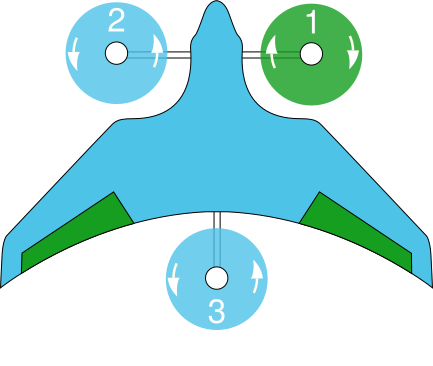
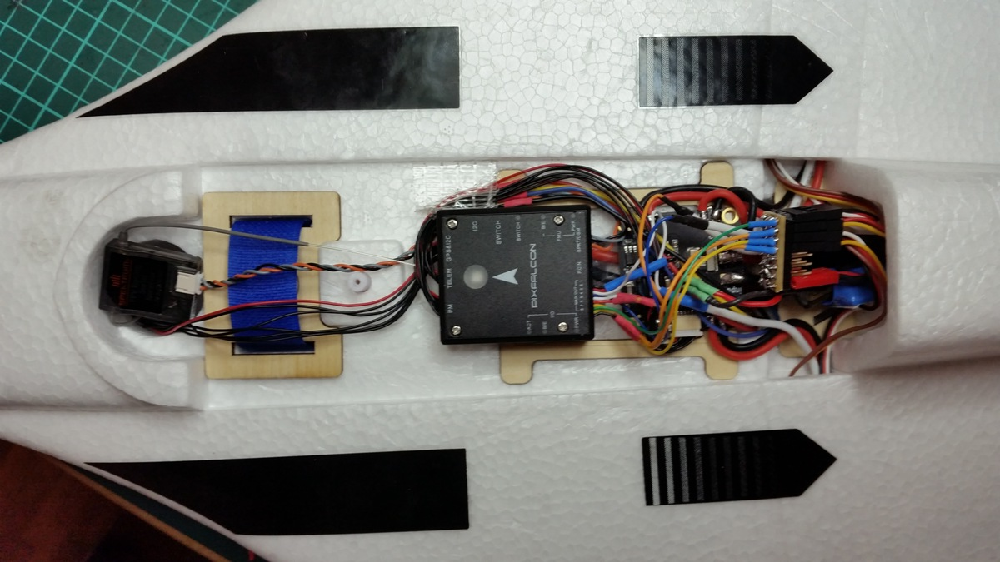
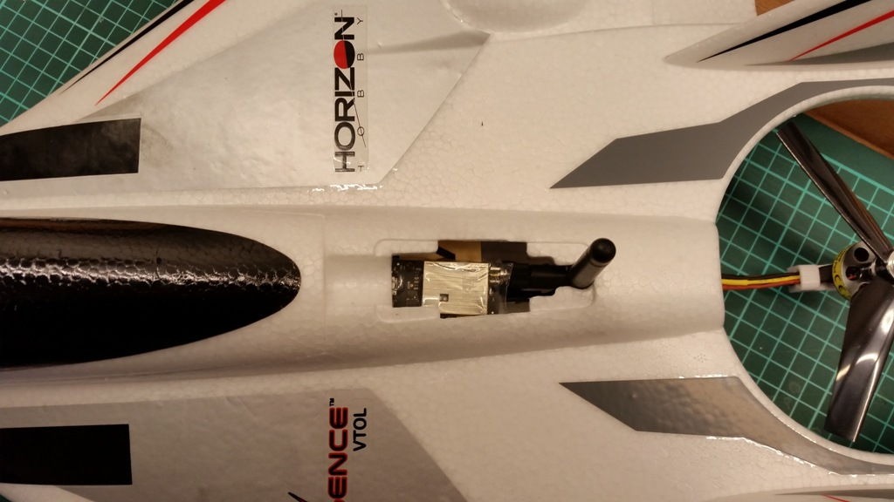
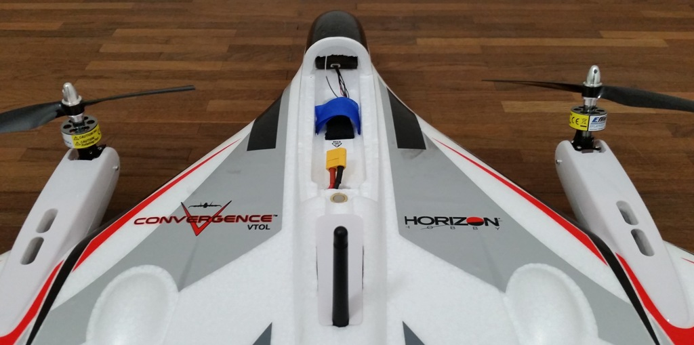
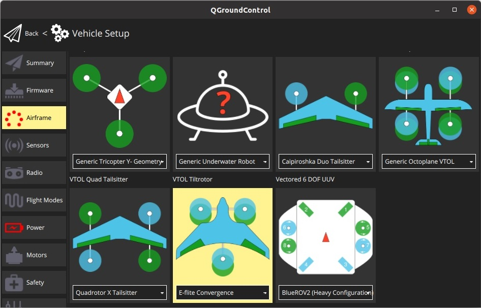

# E-Flite Convergence 倾转旋翼 （Pixfalcon）

The [E-Flite Convergence](https://youtu.be/HNedXQ_jhYo) can easily be converted to a fully autonomous VTOL with PX4.
There is not much space but it's enough for a [Pixfalcon](../flight_controller/pixfalcon.md) flight controller with GPS and telemetry.

:::info
The original Horizon Hobby _E-Flite Convergence_ frame and [Pixfalcon](../flight_controller/pixfalcon.md) have been discontinued.
Alternatives are provided in the [Purchase](#where-to-buy) section.
:::

<lite-youtube videoid="E61P2f2WPNU" title="E-flite Convergence Autonomous Mission Flight"/>

## 购买渠道

Vehicle frame options:

- **WL Tech XK X450** - [AliExpress](https://www.aliexpress.com/item/1005001946025611.html)
- **JJRC M02** - [Banggood (AU)](https://au.banggood.com/JJRC-M02-2_4G-6CH-450mm-Wingspan-EPO-Brushless-6-axis-Gyro-Aerobatic-RC-Airplane-RTF-3D-or-6G-Mode-Aircraft-p-1588201.html), [AliExpress](https://www.aliexpress.com/item/4001031497018.html)

Flight controller options ():

- [Pixhawk 4 Mini](../flight_controller/pixhawk4_mini.md)
- [Holybro Pixhawk Mini](../flight_controller/pixhawk_mini.md).
- Any other compatible flight controller with small enough form-factor.

## 硬件安装

The vehicle needs 7 PWM signals for the motors and control surfaces:

- Motor (left/right/back)
- Tilt servos (right/left)
- Elevons (left/right)

These can be wired to flight controller outputs more-or-less in any way you want (though outputs for motors should be grouped together, and so on).

The outputs are configured in the [Actuators Configuration](../config/actuators.md) by following the instructions for VTOL tiltrotor geometry and output configuration.
Note that you will need to start from the [Generic Tiltrotor VTOL](../airframes/airframe_reference.md#vtol_vtol_tiltrotor_generic_tiltrotor_vtol) frame.

Note that left and right in the configuration screen and frame reference are defined from the perspective of a human pilot inside a real plane (or looking from above, as shown below):

### Flight Controller

The flight controller can be mounted at the same place the original autopilot was.

### 数传电台

The telemetry module fits into the bay meant to hold FPV transmission gear.

### GPS

For the GPS we cut out a section of foam inside the "cockpit".
That way the GPS can be put inside the body and is nicely stowed away without compromising the vehicle appearance.

## PX4 配置

Follow the [Standard Configuration](../config/index.md) in _QGroundControl_ (radio, sensors, flight modes, etc.).

The particular settings that are relevant to this vehicle are:

- [Airframe](../config/airframe.md)
  - Select the airframe configuration **E-flite Convergence** under **VTOL Tiltrotor** and restart _QGroundControl_.
    
- [Flight Modes/Switches](../config/flight_mode.md)
  - As this is a VTOL vehicle, you must [assign an RC controller switch](../config/flight_mode.md#what-flight-modes-and-switches-should-i-set) for transitioning between multicopter and fixed-wing modes.
