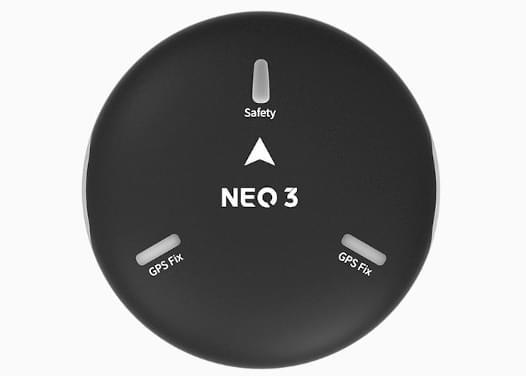
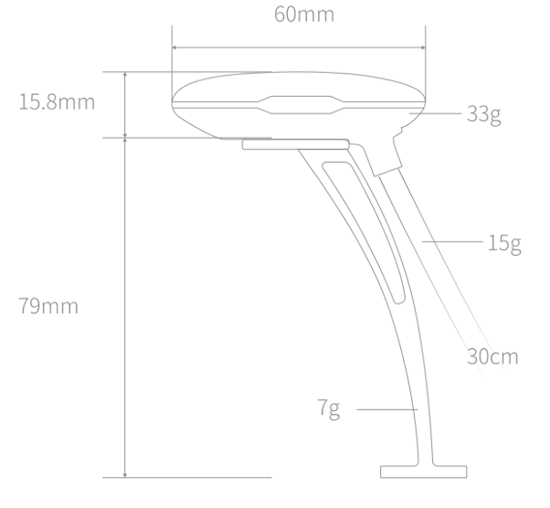
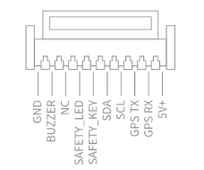
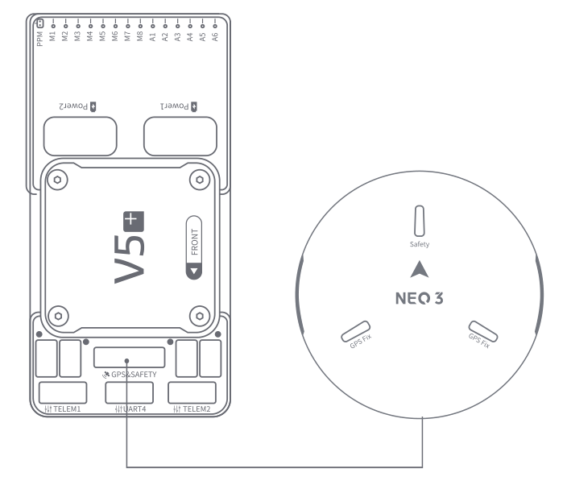

# CUAV NEO 3 GPS

<Badge type="tip" text="PX4 v1.13" />

This NEO 3 GPS is manufactured by CUAV.
It integrates Ublox M9N, IST8310, three-color LED lights and safety switches, and is compatible with CUAV and Pixhawk standard controllers.

## Technical Specification

| 硬件                                                | 类型                                                                                                                         |
| :------------------------------------------------ | :------------------------------------------------------------------------------------------------------------------------- |
| 罗盘                                                | IST8310                                                                                                                    |
| GNSS receiver                                     | UBLOX NEO M9N                                                                                                              |
| RGB drive                                         | NC5623C                                                                                                                    |
| 蜂鸣器                                               | Passive buzzer                                                                                                             |
| Safety switch                                     | Physical button                                                                                                            |
| GNSS                                              | Beidou, Galileo, GLONASS, GPS                                                                                              |
| GNSS Augmentation System                          | SBAS:WAAS,EGNOS,MSAS QZSS:L1s(SAIF) other：RTCM3.3 |
| Number of concurrent GNSS                         | 4                                                                                                                          |
| Frequency band                                    | GPS:L1C/A GLONASS:L10F Beidou:B1I Galileo:E1B/C   |
| Horizontal accuracy                               | 2.0M                                                                                                       |
| Speed accuracy                                    | 0.05M/S                                                                                                    |
| Nav. update rate                  | 25Hz(Max)                                                                                               |
| Acquisition                                       | Cold start：24S Hot start：2S Aided start:2s                                                           |
| Number of satellites(MAX)      | 32+                                                                                                                        |
| Sensitivity                                       | Tracking and nav-167dBm Cold start Hot star-148dBm Reacquisition -160dBm                                             |
| Protocol                                          | UART+IO+I2C                                                                                                                |
| Port TYpe                                         | GHR-10V-S                                                                                                                  |
| Supported flight controller                       | CUAV series, Pixahwk series                                                                                             |
| Wave filtering                                    | SAW+LNA+SAW                                                                                                                |
| Anti-Electromagnetic/radio frequency interference | EMI+RFI                                                                                                                    |
| Upgrade firmware                                  | support                                                                                                                    |
| Input voltage                                     | 5V                                                                                                                         |
| Operating temperature                             | -10~70℃                                                                                                    |
| Size                                              | 60\*60\*16MM                                                                                                               |
| 重量                                                | 33g                                                                                                                        |

## 尺寸

## 针脚定义

## 购买渠道

- [CUAV](https://cuav.en.alibaba.com/product/1600217379204-820872629/CUAV_NEO_3_M9N_GPS_Module_for_Pixhawk_Compass_gps_tracker_navigation_gps.html?spm=a2700.shop_oth.74.1.636e28725EvVHb)

## 接线和连接

Neo3 wiring and connection diagram

## More info

- [CUAV docs](https://doc.cuav.net/gps/neo-series-gnss/zh-hans/neo-3.html)
