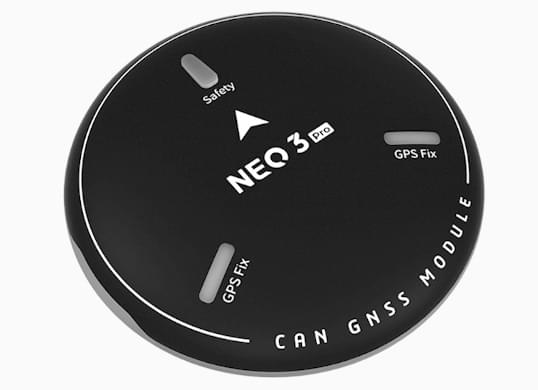

# CUAV NEO 3 Pro

<Badge type="tip" text="PX4 v1.13" />

NEO 3Pro is a DroneCan GPS receiver produced by CUAV.
It integrates UBLOX M9N, STM32F4 MCU, RM3100 compass, three-color LED light and safety switch.

## Technical Specifications

| 硬件                                                | 类型                                                                                                                         |
| :------------------------------------------------ | :------------------------------------------------------------------------------------------------------------------------- |
| 处理器                                               | STM32F412                                                                                                                  |
| 罗盘                                                | RM3100                                                                                                                     |
| Barometer                                         | MS5611                                                                                                                     |
| GNSS receiver                                     | UBLOX NEO M9N                                                                                                              |
| RGB drive                                         | NCP5623C                                                                                                                   |
| 蜂鸣器                                               | Passive buzzer                                                                                                             |
| Safety switch                                     | Physical button                                                                                                            |
| GNSS                                              | Beidou, Galileo, GLONASS, GPS                                                                                              |
| GNSS Augmentation System                          | SBAS:WAAS,EGNOS,MSAS QZSS:L1s(SAIF) other：RTCM3.3 |
| Number of concurrent GNSS                         | 4                                                                                                                          |
| Frequency band                                    | GPS:L1C/A GLONASS:L10F Beidou:B1I Galileo:E1B/C   |
| Horizontal accuracy                               | 2.0M                                                                                                       |
| Speed accuracy                                    | 0.05M/S                                                                                                    |
| Nav. update rate                  | 25Hz(Max)                                                                                               |
| Acquisition                                       | Cold start：24S Hot start：2S Aided start:2s                                                           |
| Number of satellites(MAX)      | 32+                                                                                                                        |
| Sensitivity                                       | Tracking and nav-167dBm Cold start Hot star-148dBm Reacquisition -160dBm                                             |
| Protocol                                          | UAVCAN                                                                                                                     |
| Port TYpe                                         | GHR-04V-S                                                                                                                  |
| Supported flight controller                       | CUAV series, Pixahwk series                                                                                             |
| Wave filtering                                    | SAW+LNA+SAW                                                                                                                |
| Anti-Electromagnetic/radio frequency interference | EMI+RFI                                                                                                                    |
| Upgrade firmware                                  | support                                                                                                                    |
| Input voltage                                     | 5V                                                                                                                         |
| Operating temperature                             | -10~70℃                                                                                                    |
| Size                                              | 60_60_16MM                                                                                                                 |
| 重量                                                | 33g                                                                                                                        |

## 购买渠道

- [CUAV](https://cuav.en.alibaba.com/product/1600165544920-820872629/Free_shipping_CUAV_Neo_3_pro_drone_UAVCAN_GNSS_processor_STM32F412_autopilot_ublox_M9N_positioning_RM3100_compass_uav_gps_module.html?spm=a2700.shop_oth.74.2.636e28725EvVHb)

## 接线和连接

NEO 3 Pro connected to autopilot CAN1/CAN2 interface

## PX4 配置

Open **QGroundControl > Parameters** and modify the following parameters:

- `UAVCAN_ENABLE`Set to `Sensors Automatic config` .
- `UAVCAN_SUB_GPS` Set to `Enable`.

## More info

- [CUAV docs](https://doc.cuav.net/gps/neo-series-gnss/en/neo-3-pro.html)
