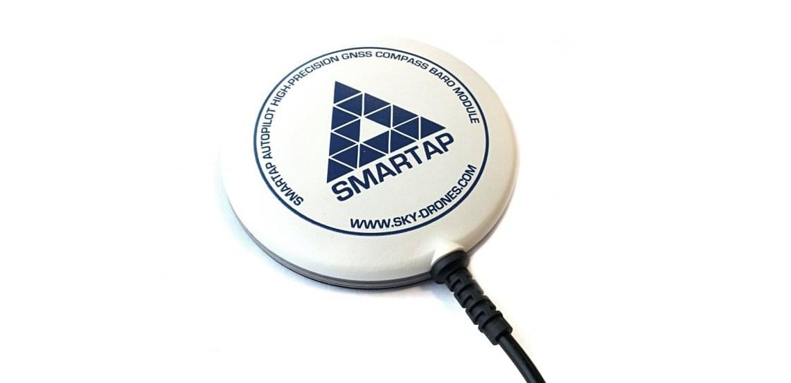

# Sky-Drones SmartAP GPS

[SmartAP GPS](https://sky-drones.com/navigation/smartap-gnss.html) is a GNSS navigation module with integrated antenna, UBlox Neo-M8N chipset, 3x 3-axis magnetometer (compass), 1x MS-5611 pressure sensor and RGB LED driver.
SmartAP GPS supports concurrent reception of up to 3 GNSS (GPS, Galileo, GLONASS, BeiDou).

Key features include:

- Concurrent reception of up to 3 GNSS (GPS, Galileo, GLONASS, BeiDou)
- 3x built-in magnetometers: HMC5983, IST8310 and LIS3MDL
- 1x built-in barometer: MS5611
- RGB LED Driver and status LEDs

## 购买渠道

- [Sky-Drones Store](https://sky-drones.com/navigation/smartap-gnss.html)

## Kit Contents

An SmartAP GPS kit includes:

- 1x GPS modules
- 1x 30cm cable

## 配置

For the aircraft, you should set the parameter [SER_GPS1_BAUD](../advanced_config/parameter_reference.md#SER_GPS1_BAUD) to 115200 8N1 to ensure that PX4 uses the correct baudrate.

## Pinout and Connections

SmartAP GPS has 10 pin JST-GH connector that can be plugged into a Pixhawk flight controller (compliant with Pixhawk connector standard).

| Pin number | Pin name                        |
| ---------- | ------------------------------- |
| 1          | 5V                              |
| 2          | USART1_RX  |
| 3          | USART1_TX  |
| 4          | I2C1_SCL   |
| 5          | I2C1_SDA   |
| 6          | SAFETY_BTN |
| 7          | SAFETY_LED |
| 8          | +3V3                            |
| 9          | BUZZER                          |
| 10         | GND                             |

## 技术规范

- U-blox M8N GPS Receiver
- IST8310 Magnetometer
- HMC5983 Magnetometer
- LIS3MDL Magnetometer
- MS5611 Pressure sensor
- RGB LEDs for status indication
  - NCP5623 I2C Driver
- Diameter: 75mm
- Weight: 34g

## 更多信息

- [Buy SmartAP GPS](https://sky-drones.com/navigation/smartap-gnss.html)
- [Documentation](https://docs.sky-drones.com/avionics/smartap-gnss)
- [CAD Models](https://docs.sky-drones.com/avionics/smartap-gnss/cad-model)
