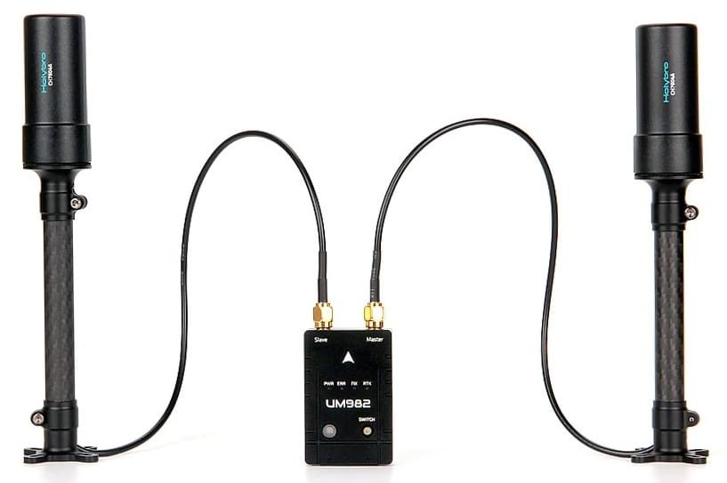

# Holybro H-RTK Unicore UM982 GPS

The [Holybro H-RTK Unicore UM982 GPS](https://holybro.com/products/h-rtk-um982) is an multi-band high-precision [RTK GNSS System](../gps_compass/rtk_gps.md) launched by Holybro.

This module is based on the [Unicore UM982 Chip](https://en.unicorecomm.com/products/detail/24), which supports RTK positioning and dual-antenna heading calculation.

This means that it can generate a moving baseline headline/yaw determinations for autopilots with just one GPS module and dual antennas - a magnetometer is not needed.
Unlike when using a module such as the U-blox F9P, where you would need [two U-blox F9P modules to compute a heading angle](../gps_compass/u-blox_f9p_heading.md), with the Unicore UM982 GPS, you only need one GPS module!

Using this GPS as a yaw source, instead of a compass, prevents magnetic interference from causing incorrect yaw reports to the autopilot (compasses are commonly affected by the vehicle motors and electrical systems, and other environmental interference sources such as metallic structures or equipment).
This works even if the GPSs are not receiving RTCM data from a fixed RTK station or NTRIP server.
It supports RTK positioning adjustment for centimeter-level accuracy, GPS/GLONASS,Beidou, Galileo, and QZSS global positioning systems.

The module also includes a magnetometer, LED, and safety switch button.
It also serves as an RTK-corrected vehicle GPS, with or without moving baseline yaw determination, and as a base station GPS for sending RTCM data to a ground control station to provide an RTK source for the vehicle via telemetry.

Additional technical information can be found at [Holybro Technical Documentation page](https://docs.holybro.com/gps-and-rtk-system/h-rtk-unicore-um982)

## 购买渠道

- [Holybro Website](https://holybro.com/products/h-rtk-um982)

## 布线

The module comes with both GH 10-pin & 6-pin cables that are compatible with the GPS1 & GPS2 ports on flight controllers that use the [Pixhawk Connector Standard](https://github.com/pixhawk/Pixhawk-Standards/blob/master/DS-009%20Pixhawk%20Connector%20Standard.pdf), such as [Pixhawk 6x](../flight_controller/pixhawk6x.md) and [Pixhawk 6c](../flight_controller/pixhawk6c.md).

It can also be used with Cubepilot Flight Controller.
The 10Pin - 6Pin cable allows users to connect the UM982 to `GPS2` port on Cubepilot and Holybro Autopilots.

The module can be used with one antenna or both antennas.
If it is used with only one antenna, the right/primary antenna connector must be connected.

## PX4 配置

### Port Setup

The Unicore module talks the NMEA protocol extended with some proprietary Unicore sentences.
The serial baudrate is 230400.

The following PX4 parameters [must be set](../advanced_config/parameters.md):

- [SER_GPS1_BAUD](../advanced_config/parameter_reference.md#SER_GPS1_BAUD) -> 230400
- [GPS_1_PROTOCOL](../advanced_config/parameter_reference.md#GPS_1_PROTOCOL) -> 6: NMEA

Note, the above parameters assume you are connected to `GPS 1`.
If you are using another port you will have to use its parameters to configure the baud rate and protocol.

### Enable GPS Heading/Yaw

The Unicore module comes with two antennas, a primary (right connector) and a secondary (left connector) antenna, which can be used to get yaw from GPS.
You will need to set the following parameters:

- [EKF2_GPS_CTRL](../advanced_config/parameter_reference.md#EKF2_GPS_CTRL): Set bit 3 (8) to enable dual antenna heading into the yaw estimation.
- [GPS_YAW_OFFSET](../advanced_config/parameter_reference.md#GPS_YAW_OFFSET): Set heading offset to 0 if the primary antenna is in the front.
  The angle increases clock-wise, so set the offset to 90 degrees if the primary antenna is on the right side of the vehicle (and the secondary on the left side).

### RTK Corrections

RTK works the same way as uBlox F9P modules.
RTCMv3 corrections as sent by QGroundControl from an RTK GPS base station are consumed by the Unicore module, which should then change fix type to `RTK float` or `RTK fixed`.
