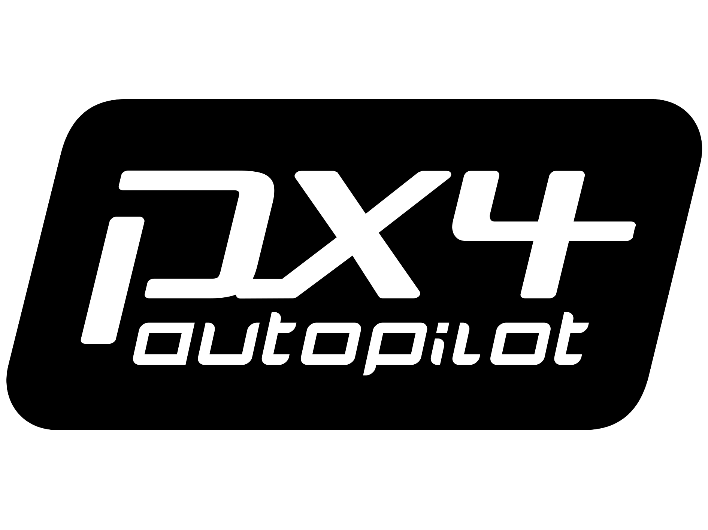

# PX4 自动驾驶仪用户指南

  

PX4 is the _Professional Autopilot_.
它由来自业界和学术界的世界级开发商开发，并得到活跃的全球社区的支持，为从竞速和物流无人机到地面车辆和潜水艇的各种载具提供动力。

:::tip
这份指南包含组装、配置、安全使用 PX4 的设备的各种只是。 对贡献感兴趣吗 Check out the [Development](development/development.md) section.

:::

:::warning
This guide is for the _development_ version of PX4 (`main` branch).
Use the **Version** selector to find the current _stable_ version.

Documented changes since the stable release are captured in the evolving [release note](releases/main.md).
:::

## 如何开始？

所有用户都应该先阅读[基本概念](getting_started/px4_basic_concepts.md) !
It provides an overview of PX4, including features provided by the flight stack (flight modes and safety features) and the supported hardware (flight controller, vehicle types, telemetry systems, RC control systems).

根据您想要实现的目标，以下提示将帮助您浏览本指南：

### 我想要一个能与PX4配合使用的载具

In the [Multicopter](frames_multicopter/index.md), [VTOL](frames_vtol/index.md), and [Plane (Fixed-Wing)](frames_plane/index.md) sections you'll find topics like the following (these links are for multicopter):

- [完整的载具](complete_vehicles_mc/index.md)列出了到手飞(RTF)的硬件
- [Kits](frames_multicopter/kits.md) lists drones that you have to build yourself from a set of preselected parts
- [DIY Builds](frames_multicopter/diy_builds.md) shows some examples of drones that have been built using parts that were sourced individually

Both kits and complete vehicles usually include everything you need except for a battery and RC System.
Kits are usually not hard to build, provide a good introduction to how drones fit together, and are relatively inexpensive.
We provide generic instructions for assembly, such as [Assembling a Multicopter](assembly/assembly_mc.md), and most kits come with specific instructions too.

If the kits and complete drones aren't quite right for you then you can build a vehicle from scratch, but this requires more knowledge.
[Airframe Builds](airframes/index.md) lists the supported frame starting points to give you some idea of what is possible.

Once you have a vehicle that supports PX4 you will need to configure it and calibrate the sensors.
Each vehicle type has its own configuration section that explains the main steps, such as [Multicopter Configuration/Tuning](config_mc/index.md).

### I want to add a payload/camera

The [Payloads](payloads/index.md) section describes how to add a camera and how to configure PX4 to enable you to deliver packages.

### I am modifying a supported vehicle

The [Hardware Selection & Setup](hardware/drone_parts.md) section provides both high level and product-specific information about hardware that you might use with PX4 and its configuration.
This is the first place you should look if you want to modify a drone and add new components.

### I want to fly

Before you fly you should read [Operations](config/operations.md) to understand how to set up the safety features of your vehicle and the common behaviours of all frame types.
Once you've done that you're ready to fly.

Basic instructions for flying each vehicle type are provided in the respective sections, such as [Basic Flying (Multicopter)](flying/basic_flying_mc.md).

### I want to run PX4 on a new Flight Controller and extend the platform

The [Development](development/development.md) section explains how to support new airframes and types of vehicles, modify flight algorithms, add new modes, integrate new hardware, communicate with PX4 from outside the flight controller, and contribute to PX4.

## 获取帮助

The [Support](contribute/support.md) page explains how to get help from the core dev team and the wider community.

除此以外，它还包括了：

- [Forums where you can get help](contribute/support.md#forums-and-chat)
- [Diagnosing issues](contribute/support.md#diagnosing-problems)
- [How to report bugs](contribute/support.md#issue-bug-reporting)
- [Weekly dev call](contribute/support.md#weekly-dev-call)

## Reporting Bugs & Issues

If you have any problems using PX4 first post them on the [support forums](contribute/support.md#forums-and-chat) (as they may be caused by vehicle configuration).

If directed by the development team, code issues may be raised on [Github here](https://github.com/PX4/PX4-Autopilot/issues).
Where possible provide [flight logs](getting_started/flight_reporting.md) and other information requested in the issue template.

## 参与贡献

Information on how to contribute to code and documentation can be found in the [Contributing](contribute/index.md) section:

- [Code](contribute/index.md)
- [Documentation](contribute/docs.md)
- [Translation](contribute/translation.md)

## 翻译

There are several [translations](contribute/translation.md) of this guide.
您可以从语言菜单中访问到它们（右上角）：

<!--@include: _contributors.md-->

## 许可证

PX4 code is free to use and modify under the terms of the permissive [BSD 3-clause license](https://opensource.org/licenses/BSD-3-Clause).
This documentation is licensed under [CC BY 4.0](https://creativecommons.org/licenses/by/4.0/).
For more information see: [Licences](contribute/licenses.md).

## Calendar & Events

The _Dronecode Calendar_ shows important community events for platform users and developers.
选择以下链接将其显示在您所在的时区日历中(并将其添加到您自己的日历中)：

- [Switzerland – Zurich](https://calendar.google.com/calendar/embed?src=linuxfoundation.org_g21tvam24m7pm7jhev01bvlqh8%40group.calendar.google.com&ctz=Europe%2FZurich)
- [Pacific Time – Tijuana](https://calendar.google.com/calendar/embed?src=linuxfoundation.org_g21tvam24m7pm7jhev01bvlqh8%40group.calendar.google.com&ctz=America%2FTijuana)
- [Australia – Melbourne/Sydney/Hobart](https://calendar.google.com/calendar/embed?src=linuxfoundation.org_g21tvam24m7pm7jhev01bvlqh8%40group.calendar.google.com&ctz=Australia%2FSydney)

:::tip
The calendar default timezone is Central European Time (CET).

:::

<iframe src="https://calendar.google.com/calendar/embed?title=Dronecode%20Calendar&amp;mode=WEEK&amp;height=600&amp;wkst=1&amp;bgcolor=%23FFFFFF&amp;src=linuxfoundation.org_g21tvam24m7pm7jhev01bvlqh8%40group.calendar.google.com&amp;color=%23691426&amp;ctz=Europe%2FZurich" style="border-width:0" width="800" height="600" frameborder="0" scrolling="no"></iframe>

### 图标

此库中使用的以下图标是单独授权的（如下所示）：

 _placeholder_ icon made by <a href="https://www.flaticon.com/authors/smashicons" title="Smashicons">Smashicons</a> from <a href="https://www.flaticon.com/" title="Flaticon">www.flaticon.com</a> is licensed by <a href="https://creativecommons.org/licenses/by/3.0/" title="Creative Commons BY 3.0" target="_blank">CC 3.0 BY</a>.

 _camera-automatic-mode_ icon made by <a href="https://www.freepik.com" title="Freepik">Freepik</a> from <a href="https://www.flaticon.com/" title="Flaticon">www.flaticon.com</a> is licensed by <a href="http://creativecommons.org/licenses/by/3.0/" title="Creative Commons BY 3.0" target="_blank">CC 3.0 BY</a>.

## 治理

The PX4 flight stack is hosted under the governance of the [Dronecode Project](https://www.dronecode.org/).

 

&nbsp;

