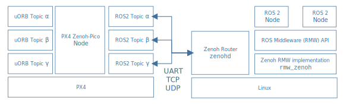

# Zenoh (PX4 ROS 2 rmw_zenoh)

<Badge type="tip" text="main (planned for: PX4 v1.17)" /> <Badge type="warning" text="Experimental" />

:::warning
Experimental
At the time of writing, PX4 Zenoh-pico is experimental, and hence subject to change.
:::

PX4 supports Zenoh as an alternative mechanism (to DDS) for bridging uORB topics to [ROS 2](../ros2/user_guide.md) (via the ROS 2 [`rmw_zenoh`](https://github.com/ros2/rmw_zenoh) middleware).
This allows uORB messages to be published and subscribed on a companion computer as though they were ROS 2 topics.
It provides a fast and lightweight way to connect PX4 to ROS 2, making it easier for applications to access vehicle telemetry and send control commands.

The following guide describes the architecture and various options for setting up the Zenoh client and router.
In particular, it covers the options that are most important to PX4 users exploring Zenoh as an alternative communication layer for ROS 2.

## 软件架构

The Zenoh-based middleware consists of a client running on PX4 and a Zenoh router running on the companion computer, with bi-directional data exchange between them over a UART, TCP, UDP, or multicast-UDP link.
The router acts as a broker and discovery service, enabling PX4 to publish and subscribe to topics in the global Zenoh data space.
This allows seamless integration with ROS 2 nodes using [`rmw_zenoh`](https://github.com/ros2/rmw_zenoh), and supports flexible deployment across distributed systems.



The client is the _PX4 Zenoh-Pico Node_ referred to above, which is implemented in the [PX4 `zenoh` module](../modules/modules_driver.md#zenoh).
This is based on Zenoh-Pico, a minimalistic version of [Eclipse Zenoh](https://zenoh.io/) (a data-centric protocol designed for real-time, distributed, and resource-constrained environments).

The router suggested above is [zenohd](https://github.com/eclipse-zenoh/zenoh/tree/main/zenohd).

:::info
UART is supported by Zenoh but has not yet implemented in the PX4 Zenoh-Pico node.
:::

## ROS 2 Zenoh Bring-up on Linux Companion

In order for PX4 uORB topics to be shared with ROS 2 applications, you will need the PX4 Zenoh-Pico Node client running on your FMU, connected to a Zenoh router running on the companion computer (or elsewhere in the network).

First select Zenoh as the ROS 2 transport by setting the `RMW_IMPLEMENTATION` environment variable as shown:

```sh
export RMW_IMPLEMENTATION=rmw_zenoh_cpp
```

Then start the Zenoh router using the command:

```sh
ros2 run rmw_zenoh_cpp rmw_zenohd
```

For more information about the Zenoh Router see the [rmw_zenoh](https://github.com/ros2/rmw_zenoh?tab=readme-ov-file#start-the-zenoh-router) documentation.

## PX4 Zenoh-Pico Node Setup

### PX4 Firmware

Before setting up the Zenoh communication, first make sure that your firmware contains the driver that implements the [`zenoh` driver](../modules/modules_driver.md#zenoh), which provides the implementation of the _PX4 Zenoh-Pico Node_.

You can check if the module is present on your board by searching for the key `CONFIG_MODULES_ZENOH=y` in your board's `default.px4board` KConfig file.
For example, you can see that the module is present in `px4_fmu-v6xrt` build targets from [/boards/px4/fmu-v6xrt/default.px4board](https://github.com/PX4/PX4-Autopilot/blob/main/boards/px4/fmu-v6xrt/default.px4board#L91).

If `CONFIG_MODULES_ZENOH=y` is not preset you can add this key to your board configuration and rebuild.
Note that due to flash constraints you may need to remove other components in order to include the module (such as the [`uxrce_dds_client` module](../modules/modules_system.md#uxrce-dds-client), which you will not need if you are using Zenoh).

The table below shows some of the PX4 targets that include Zenoh by default.

| PX4 Target             | 备注                                                                                                             |
| ---------------------- | -------------------------------------------------------------------------------------------------------------- |
| `px4_fmu-v6xrt`        | For [FMUv6X-RT](../flight_controller/nxp_mr_vmu_rt1176.md) (reference platform for testing) |
| `nxp_tropic-community` |                                                                                                                |
| `nxp_mr-tropic`        |                                                                                                                |
| `nxp_mr-canhubk344`    |                                                                                                                |
| `px4_sitl_zenoh`       | Zenoh-enabled simulation build                                                                                 |
| `px4_fmu-v6x_zenoh`    | Zenoh-enabled firmware for FMUv6X                                                                              |

Zenoh is not included in the default `px4_fmu-` targets for any firmware other than `px4_fmu-v6xrt` (`px4_sitl_zenoh` and `px4_fmu-v6x_zenoh` [are build variants](../dev_setup/building_px4.md#px4-make-build-targets)).

:::tip
You can check if Zenoh is present at runtime by using QGroundControl to [find the parameter](../advanced_config/parameters.md#finding-a-parameter) [ZENOH_ENABLE](../advanced_config/parameter_reference.md#ZENOH_ENABLE).
If present, the module is installed.
:::

### Enable Zenoh on PX4 Startup

Set the [ZENOH_ENABLE](../advanced_config/parameter_reference.md#ZENOH_ENABLE) parameter to `1` to enable Zenoh on PX4 startup.

### Configure Zenoh Network

Set up PX4 to connect to the companion computer running `zenohd`.

PX4's default IP address of the Zenoh daemon host is `10.41.10.1`.
If you're using a different IP for the Zenoh daemon, run the following command (replacing the address) in a PX4 shell and then reboot:

```sh
zenoh config net client tcp/10.41.10.1:7447#iface=eth0
```

Note that for the simulation target with Zeroh (`px4_sitl_zenoh`) you won't need to make any changes because the default IP address of the Zenoh daemon is set to `localhost`.

:::warning
Any changes to the network configuration require a PX4 system reboot to take effect.
:::

:::tip
See [PX4 Ethernet Setup](../advanced_config/ethernet_setup.md) for more information about Ethernet configuration.
:::

### PX4 Zenoh-pico Node configuration

The **default configuration** is auto-generated from the [dds_topics.yaml](../middleware/dds_topics.md) file in the PX4 repository.
This file specifies which uORB message definitions are to be published/subscribed by ROS 2 applications, and hence (indirectly) which topics are compiled into the zenoh module.

To inspect the current Zenoh configuration:

```sh
zenoh config
```

The PX4 Zenoh-pico node stores its configuration on the **SD card** under the `zenoh` folder.
This folder contains three key files:

- **`net.txt`** – Defines the **Zenoh network configuration**.
- **`pub.csv`** – Maps **uORB topics to ROS2 topics** (used for publishing).
- **`sub.csv`** – Maps **ROS2 topics to uORB topics** (used for subscribing).

### 4. Modifying Topic Mappings

Zenoh topic mappings define how data flows between PX4's internal uORB topics and external ROS2 topics via Zenoh.
These mappings are stored in `pub.csv` and `sub.csv` on the SD card, and can be modified at runtime using the `zenoh config` CLI tool.

:::warning
Any changes to the topic mappings require a PX4 system reboot to take effect.
:::

There are two types of mappings you can modify:

- **Publisher mappings**: Forward data from a uORB topic to a Zenoh topic.
- **Subscriber mappings**: Receive data from a Zenoh topic and publish it to a uORB topic.

The main operations and their commands are:

- Publish a uORB topic to a Zenoh topic:

  ```sh
  zenoh config add publisher <zenoh_topic> <uorb_topic> [uorb_instance]
  ```

- Subscribe to a Zenoh topic and forward it to a uORB topic:

  ```sh
  zenoh config add subscriber <zenoh_topic> <uorb_topic> [uorb_instance]
  ```

- Remove existing mappings:

  ```sh
  zenoh config delete publisher <zenoh_topic>
  zenoh config delete subscriber <zenoh_topic>
  ```

After modifying the mappings, reboot PX4 to apply the changes.
The updated configuration will be loaded from the SD card during startup.

## Communicating with PX4 from ROS 2 via Zenoh

Once your PX4 FMU is publishing data into ROS 2, you can inspect the available topics and their contents using standard ROS 2 CLI tools:

```sh
ros2 topic list（ROS 2 话题列表命令）
```

Check topic type and publishers/subscribers:

```sh
ros2 topic info -v /fmu/out/vehicle_status
Type: px4_msgs/msg/VehicleStatus

Publisher count: 1

Node name: px4_aabbcc00000000000000000000000000
Node namespace: /
Topic type: px4_msgs/msg/VehicleStatus
Topic type hash: RIHS01_828bddbb7d4c2aa6ad93757955f6893be1ec5d8f11885ec7715bcdd76b5226c9
Endpoint type: PUBLISHER
GID: 82.99.74.2c.b6.7d.93.44.91.4d.fe.14.93.58.40.16
QoS profile:
  Reliability: RELIABLE
  History (Depth): KEEP_LAST (7)
  Durability: VOLATILE
  Lifespan: Infinite
  Deadline: Infinite
  Liveliness: AUTOMATIC
  Liveliness lease duration: Infinite

Subscription count: 0
```

### PX4 ROS 2 Interface with Zenoh

The [PX4 ROS 2 Interface Library](../ros2/px4_ros2_interface_lib.md) works out of the box with Zenoh as a transport backend.
This means you can publish and subscribe to PX4 topics over Zenoh without changing your ROS 2 nodes or dealing with DDS configuration.
For setup details and supported message types, refer to the [PX4 ROS 2 Interface Library](../ros2/px4_ros2_interface_lib.md).
