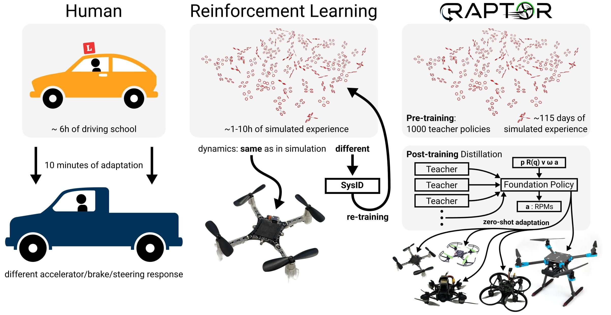
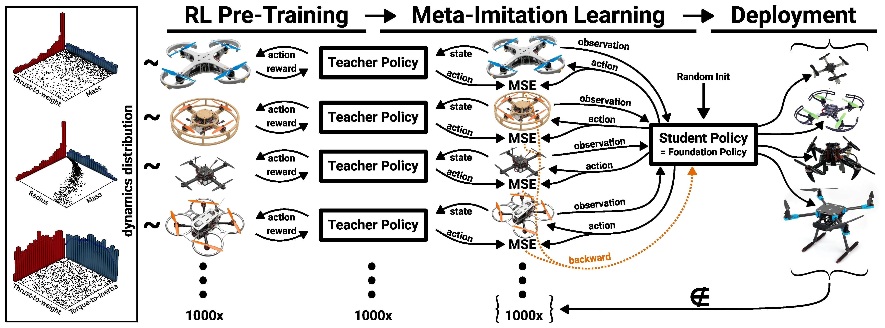
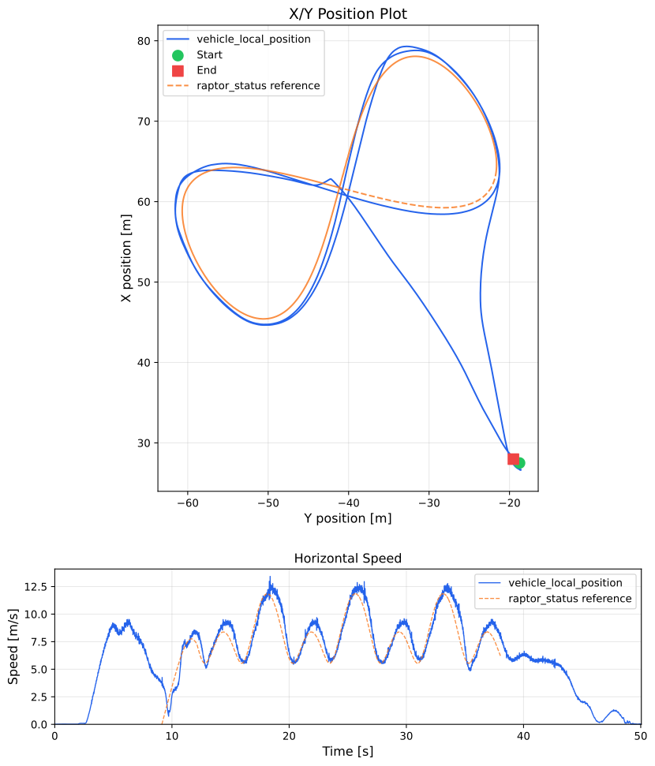
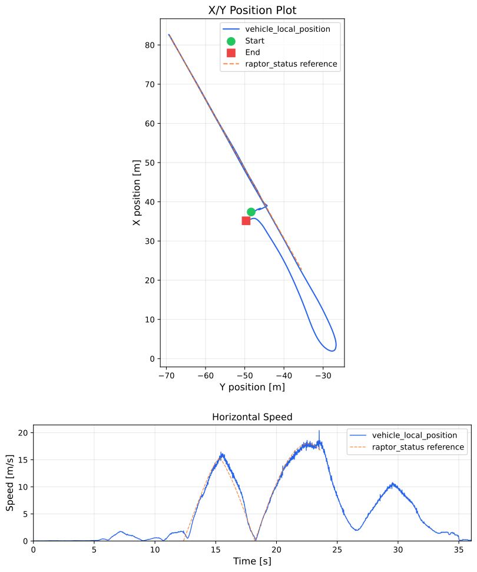

# RAPTOR: A Neural Network Module for Adaptive Quadrotor Control

<Badge type="tip" text="main (planned for PX4 v1.18)" /> <Badge type="info" text="Multicopter" /> <Badge type="warning" text="Experimental" />

:::warning
This is an experimental module.
Use at your own risk.
:::

RAPTOR is a tiny reinforcement-learning based neural network module for quadrotor control that can be used to control a wide variety of quadrotors without retuning.

This topic provides an overview of the fundamental concepts, and explains how you can use the module in simulation and real hardware.

## 综述



RAPTOR is an adaptive policy for end-to-end quadrotor control.
It is motivated by the human ability to adapt learned behaviours to similar situations.
For example, while humans may initially require many hours of driving experience to be able to smoothly control the car and blend into traffic, when faced with a new vehicle they do not need to re-learn how to drive — they only need to experience a few rough braking/acceleration/steering responses to adjust their previously learned behavior.

Reinforcement Learning (RL) is a machine learning technique that uses trial and error to learn decision making/control behaviors, which is similar to the way that humans learn to drive.
RL is interesting for controlling robots (and particularly UAVs) because it overcomes some fundamental limitations of classic, modular control architectures (information loss at module boundaries, requirement for expert tuning, etc).
RL has been very successful in [high-performance quadrotor flight](https://doi.org/10.1038/s41586-023-06419-4), but previous designs have not been particularly adaptable to new frames and vehicle types.

RAPTOR fills this gap and demonstrates a single, tiny neural-network control policy that can control a wide variety of quadrotors (tested on real quadrotors from 32 g to 2.4 kg).

For more details please refer to this video:

<lite-youtube videoid="hVzdWRFTX3k" title="RAPTOR: A Foundation Policy for Quadrotor Control"/>

The method we developed for training the RAPTOR policy is called Meta-Imitation Learning:



You can torture test the RAPTOR policy in your browser at [https://raptor.rl.tools](https://raptor.rl.tools) or in the embedded app here:

<iframe src="https://rl-tools.github.io/raptor.rl.tools?raptor=false" width="100%" height="1000" style="border: none;"></iframe>

For more information please refer to the paper at [https://arxiv.org/abs/2509.11481](https://arxiv.org/abs/2509.11481).

## Structure

The RAPTOR control policy is an end-to-end policy that takes position, orientation, linear velocity and angular velocity as inputs and outputs motor commands (`actuator_motors`).
To integrate it into PX4 we use the external mode registration facilities in PX4 (which also works well for internal modes as demonstrated in `mc_nn_control`).
Because of this architecture the `mc_raptor` module is completely decoupled from all other PX4 logic.

By default, the RAPTOR module expects setpoints via `trajectory_setpoint` messages.
If no `trajectory_setpoint` messages are received or if no `trajectory_setpoint` is received within 200 ms, the current position and orientation (with zero velocity) is used as the setpoint.
Since feeding setpoints reliably via telemetry is still a challenge, we also implement a simple option to generate internal reference trajectories (controlled through the `MC_RAPTOR_INTREF` parameter) for demonstration and benchmarking purposes.

## 特性

- Tiny neural network (just 2084 parameters) => minimal CPU usage
- Easily maintainable
  - Simple CMake setup
  - Self-contained (no interference with other modules)
  - Single, simple and well-maintained dependency (RLtools)
- Loading neural network parameters from SD card
  - Minimal flash usage (for possible inclusion into default build configurations)
  - Easy development: Train new neural network and just upload it via MAVLink FTP without requiring to re-flash the firmware
- Tested on 10+ different real platforms (including flexible frames, brushed motors)
- Actively developed and maintained

## 用法

### SITL

Build PX4 SITL with Raptor, disable QGC requirement, and adjust the `IMU_GYRO_RATEMAX` to match the simulation IMU rate

```sh
make px4_sitl_raptor gz_x500
param set NAV_DLL_ACT 0
param set COM_DISARM_LAND -1 # When taking off in offboard the landing detector can cause mid-air disarms
param set IMU_GYRO_RATEMAX 250 # Just for SITL. Tested with IMU_GYRO_RATEMAX=400 on real FCUs
param set MC_RAPTOR_ENABLE 1 # Enable the mc_raptor module
param save
```

Upload the RAPTOR checkpoint to the "SD card": Separate terminal

```bash
mavproxy.py --master udp:127.0.0.1:14540
ftp mkdir /raptor # for the real FMU use: /fs/microsd/raptor
ftp put src/modules/mc_raptor/blob/policy.tar /raptor/policy.tar
```

Restart (<kbd>Ctrl+C</kbd>)

```sh
make px4_sitl_raptor gz_x500
commander takeoff
commander status
```

Note the external mode ID of `RAPTOR` in the status report

```sh
commander mode ext{RAPTOR_MODE_ID}
```

#### Internal Reference Trajectory Generation

In our experience, feeding the `trajectory_setpoint` via MAVLink (even via WiFi telemetry) is unreliable.
But we do not want to constrain this module to only platforms that have a companion board.

For this reason we have integrated a simple internal reference trajectory generator for testing and benchmarking purposes.
It supports position (constant position and yaw setpoint) as well as configurable [Lissajous trajectories](https://en.wikipedia.org/wiki/Lissajous_curve).

The Lissajous generator can, for example, generate smooth figure-eight trajectories that contain interesting accelerations for benchmarking and testing purposes.
Please refer to the embedded configurator later in this section to explore the Lissajous parameters and view the resulting trajectories.

To use the internal reference generator, select the mode: `0`: Off/activation position tracking, `1`: Lissajous

```sh
param set MC_RAPTOR_INTREF 1
```

Restart (ctrl+c)

```sh
commander takeoff
commander mode ext{RAPTOR_MODE_ID}
mc_raptor intref lissajous 0.5 1 0 2 1 1 10 3
```

The trajectory is relative to the position and yaw of the vehicle at the point where the RAPTOR mode is activated (or the position and yaw where the parameters are changed if it is already activated).

You can adjust the parameters of the trajectory with the following tool.
Make sure to copy the generated CLI string at the end:

<iframe src="https://rl-tools.github.io/mc-raptor-trajectory-tool" width="100%" height="1700" style="border: none;"></iframe>

### Real-World

#### 设置

The `mc_raptor` module has been mostly tested with the Holybro X500 V2 but it should also work out-of-the-box with other platforms (see the [Other Platforms](#other-platforms) section).

```sh
make px4_fmu-v6c_raptor upload
```

We recommend initially testing the RAPTOR mode using a dead man's switch.
For this we configure the mode selection to be connected to a push button or a switch with a spring that automatically switches back.
In the default position we configure e.g. `Stabilized Mode` and in the pressed configuration we select `External Mode 1` (since the name of the external mode is only transmitted at runtime).
This allows to take off manually and then just trigger the RAPTOR mode for a split-second to see how it behaves.
In our experiments it has been exceptionally stable (zero crashes) but we still think progressively activating it for longer is the safest way to build confidence.

:::warning
Make sure that your platform uses the standard PX4 quadrotor motor layout:

1: front-right, 2: back-left, 3: front-left, 4: back-right
:::

##### Other Platforms

To enable the `mc_raptor` module in other platforms, just add `CONFIG_MODULES_MC_RAPTOR=y` and `CONFIG_LIB_RL_TOOLS=y`

```diff
+++ b/boards/px4/fmu-v6c/raptor.px4board
@@ -35,2 +35,3 @@
 CONFIG_DRIVERS_UAVCAN=y
+CONFIG_LIB_RL_TOOLS=y
 CONFIG_MODULES_AIRSPEED_SELECTOR=y
@@ -64,2 +65,3 @@
 CONFIG_MODULES_MC_POS_CONTROL=y
+CONFIG_MODULES_MC_RAPTOR=y
 CONFIG_MODULES_MC_RATE_CONTROL=y
```

#### Results

Even though there were moderate winds (~ 5 m/s) during the test, we found good figure-eight tracking performance at velocities up to 12 m/s:



We also tested the linear velocity in a straight line and found that the RAPTOR policy can reliably fly at > 17 m/s (the wind direction was orthogonal to the line):



### 故障处理

#### 日志

Use this logging configuration to log all relevant topics at maximum rate:

```sh
cat > logger_topics.txt << EOF
raptor_status 0
raptor_input 0
trajectory_setpoint 0
vehicle_local_position 0
vehicle_angular_velocity 0
vehicle_attitude 0
vehicle_status 0
actuator_motors 0
EOF
```

Use mavproxy FTP to upload it:

```sh
mavproxy.py
```

##### Real

```sh
ftp mkdir /fs/microsd/etc
ftp mkdir /fs/microsd/etc/logging
ftp put logger_topics.txt /fs/microsd/etc/logging/logger_topics.txt
```

##### SITL

```sh
ftp mkdir etc
ftp mkdir logging
ftp put logger_topics.txt etc/logging/logger_topics.txt
```
