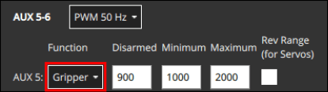
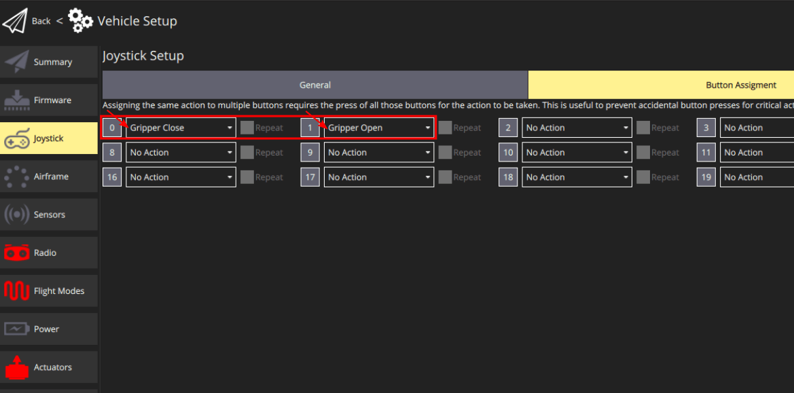

# Grippers

Grippers are mechanical devices that can be integrated with an unmanned vehicle to grip (hold) and release payloads.

PX4 allows grippers to be triggered automatically in [Payload Delivery Missions](../flying/package_delivery_mission.md) or manually [using a Joystick](#qgc-joystick-configuration).


:::info
A gripper can instead be configured as a [generic RC or MAVLink actuator](../payloads/generic_actuator_control.md#generic-actuator-control-with-rc).
A generic actuator cannot be used with a joystick or in payload missions, but it can be used with an RC Controller.
:::

## Supported Grippers

There are many different gripper mechanisms ("jaws", "fingers", "electromagnets") and interfaces (PWM, CAN, MAVLink, and so on).

PX4 supports grippers that have simple triggers to hold and release, and that use the following interfaces (see linked documents for details):

- [PWM Servo Gripper](gripper_servo.md) - Grippers connected to autopilot PWM outputs
- **MAVLink Gripper** (Untested) - Grippers that support the [MAV_CMD_DO_GRIPPER](https://mavlink.io/en/messages/common.html#MAV_CMD_DO_GRIPPER) MAVLink command.

## Using a Gripper

For information on using a gripper in missions see [Payload Delivery Missions](../flying/package_delivery_mission.md).

You can manually trigger a gripper manually from a Joystick button if you've mapped `gripper open` and `gripper close` buttons in the [QGC Joystick Configuration](#qgc-joystick-configuration).
Note that if you press the **Grab** button while the gripper is opening, it will automatically abort releasing behavior and go to the closed position, effectively cancelling the release command.
If you do this in a mission while the release is actually happening, then the [delivery will be cancelled](../flying/package_delivery_mission.md#manual-control-of-gripper-in-missions).

Manually triggering a gripper from an [RC Control](../getting_started/rc_transmitter_receiver.md) switch is not supported.

MAVLink applications, such as ground stations, can also control the gripper using the [MAV_CMD_DO_GRIPPER](https://mavlink.io/en/messages/common.html#MAV_CMD_DO_GRIPPER) MAVLink command.

## PX4 配置

### Package Delivery Configuration

PX4 gripper support is tied to the package delivery feature, which must be enabled and configured in order to be able to use a gripper.

1. Set [PD_GRIPPER_EN](../advanced_config/parameter_reference.md#PD_GRIPPER_EN) parameter to 1 (reboot required after change).
2. Set [PD_GRIPPER_TYPE](../advanced_config/parameter_reference.md#PD_GRIPPER_TYPE) to match your gripper.
   For example, set to `Servo` for a [Servo Gripper](gripper_servo.md).

### Gripper Actuator Mapping

Grippers that are connected directly to a flight controller, such as PWM servo grippers, must be mapped to specific outputs during [Actuator Configuration](../config/actuators.md#actuator-outputs).

This is done by assigning the `Gripper` function to the to the output port where the gripper is connected.
For example, the image below assigns `Gripper` to the PWM AUX5 output.



Additional information about actuator mapping is provided in the gripper-specific documentation.
For example, see [Gripper Servo > Actuator Mapping](../peripherals/gripper_servo.md#actuator-mapping).

### Enable Pre-ARM Mode

Typically you will want to enable the [pre-arming mode](../advanced_config/prearm_arm_disarm.md).
This mode keeps the motors disabled but allows the gripper to be opened and closed for attaching the payload (avoiding potential danger from spinning propellers).

1. Set [COM_PREARM_MODE](../advanced_config/parameter_reference.md#COM_PREARM_MODE) to `Always`.

### Gripper Actuation Timeout

It is important for package delivery that the gripper has time to release before progressing to subsequent waypoints.
For grippers that do not provide sensor-based feedback of their state, which is most of them, a configurable timeout is used to signal when the gripper _should_ have opened or closed.

To set the actuation timeout:

1. Measure the time taken for the gripper to open and time to close, and note the longer of these two times.

   There are two easy ways to open and close the gripper.
   While the drone is on a bench and the propellers are removed:

   - Run the `payload_deliverer` test in the QGC [MAVLink Shell](../debug/mavlink_shell.md):

      ```sh
      > payload_deliverer gripper_test
      ```

      ::: info
      If you get an error message like "[payload_deliverer] not running", repeat the setup procedures above.
      You might also run the `payload_deliverer start` command in the Nuttx shell.

:::

   - Use the [Joystick](#qgc-joystick-configuration) to trigger gripper open and close actions.

2. Set [PD_GRIPPER_TO](../advanced_config/parameter_reference.md#PD_GRIPPER_TO) to whichever of the gripper open and close time is larger.

### Mission Command Timeout

When running a [Payload Delivery Mission](../flying/package_delivery_mission.md) it is important that the mission is not halted in the case where the gripper does not report that it has opened (or closed).
This might happen if a gripper does not have a feedback sensor, if the feedback sensor was damaged, or if UORB dropped the gripper actuator timeout message.

:::info
Gripper state feedback from a sensor is not actually supported yet, but it may be in future.
:::

The mission command timeout provides an additional safeguard, continuing the mission if the gripper's successful actuation acknowledgement is not received.
This timeout is also used to provide a sufficient delay for other commands to complete in the case where sensor feedback is not provided or received, such as for winch deployment/retraction, and gimbal movement to a mission-commanded orientation.

To set the timeout:

1. Set [MIS_COMMAND_TOUT](../advanced_config/parameter_reference.md#MIS_COMMAND_TOUT) to a value greater than the [gripper actuation timeout](#gripper-actuation-timeout).

## QGC Joystick Configuration

QGroundControl [Joystick](../config/joystick.md) configuration allows you to map gripper actions to Joystick buttons, after which you will be open and close the gripper manually.

To map joystick buttons in QGroundControl:

1. Open the menu: **QGC Logo (upper-left) > Vehicle Setup > Joystick > Button Assignment** tab.

   

2. Select `Gripper Open` and `Gripper Close` actions for your desired joystick buttons, as shown above.

You can test the actions by clicking on the mapped buttons and checking for gripper movement.
If the gripper doesn't move as expected check the package delivery configuration and actuator mapping are set up properly.
